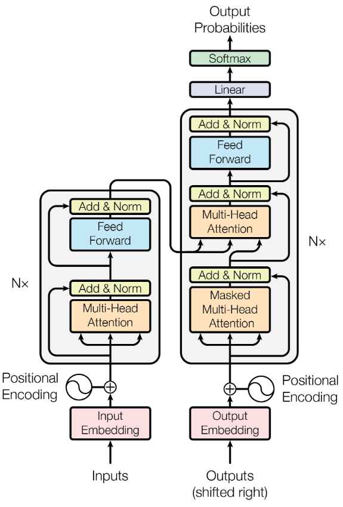

# Encoder-Decoder模型

Encoder-Decoder 模型包含 Encoder 编码器和 Decoder 解码器 两个部分。是一种主要用于解决 `seq2seq` 问题的模型

## Encoder 编码器

将输入数据进行编码的部分就是编码器

编码器的执行步骤:

1. 向量嵌入: 输入数据需要先通过**嵌入层**转换成**向量表示**
2. 位置编码: 将向量数据添加位置信息，让序列中的每条成员数据记忆自身的位置信息
3. 计算注意力: 计算输入或输出序列中的成员，相对于其他输入或输出序列成员的重要程度
   1. 在 Encoder 中，主要计算**自注意力**
4. 线性变换: 一个用于学习的线性变换，输出编码器的结果，称为 `memory`
5. 残差连接: 注意力计算和前馈神经网络（也就是线性变换层）后进行残差连接

## Decoder 解码器

将 Encoder 输出作为输入，用于解码成另一个序列的模块

解码器的执行步骤:

1. 向量嵌入: 将输出序列通过**嵌入层**转换成**向量表示**，这个嵌入层和 Encoder 的嵌入层共享权重
2. 位置编码: 和 Encoder 相同
3. 计算注意力: Decoder 中计算两种注意力
   1. 计算 Decoder 内自注意力
   2. 计算 Encoder-Decoder 之间的注意力，用 Decoder 的内容查询 Encoder 中的内容
4. 线性变换: 用于输出一个 pre-softmax 的结果，最后使用 softmax 求出 Decoder 解码的结果
5. 残差连接: 同 Encoder

## Transformer架构图

一个简单的编解码器不需要这么复杂，我们保留其中的前馈神经网络和残差连接部分就可以了

后续学习完图中的其余部分，再学习完整的 Transformer 架构
