# RNN-Encoder-Decoder-机器翻译论文

[Learning Phrase Representations using RNN Encoder-Decoder for Statistical Machine Translation](https://arxiv.org/abs/1406.1078)

## 模型结构

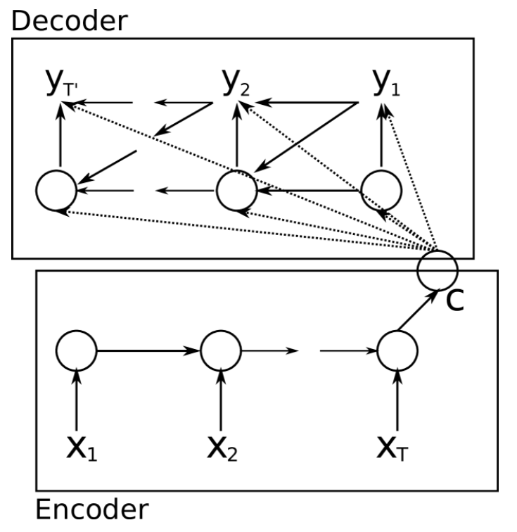

Encoder 部分:

Encoder 是一个接收序列输入的 RNN，目的只在将序列输入转换成上下文信息 C，也就是 RNN 的隐藏状态

Decoder 部分也是一个 RNN，但是第一次接收输入时，接收的是由 Encoder 编码后的上下文信息 C，第二次及其之后接收输入时，接收的是 C 和 上一次输出的结果 $y_{t-1}$

## 门控循环单元 GRU

论文中使用了一种比较新颖的循环神经网络，也就是 GRU 来充当循环神经网络

通过重置门和更新门来控制更新上下文状态，也就是隐藏状态

## Encoder-Decoder 模型原理解析

这里的参考资料使用的是 LSTM 来充当的 RNN 单元

视频: <https://www.youtube.com/watch?v=L8HKweZIOmg>

### Encoder

在语言输入的场景中，输入长度不固定，既可以是 `Let's go` 也可以是 `my name is Amy` 等。同样的问题西班牙语也一样。所以我们需要 **Encoder-Decoder** model 能够处理不同长度的输入输出

这里使用 词嵌入层 加上 LSTM 来解决这个问题

首先使用词嵌入的目的是将文本转换成数字，如图:

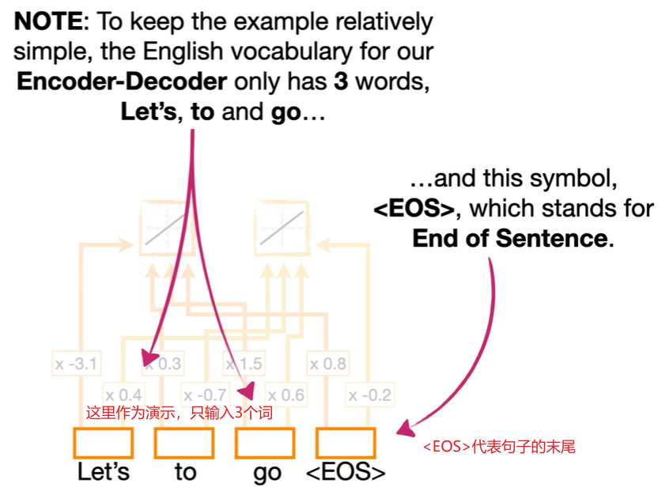

这里，输入的是3个词 `Let's` `to` `go`，实际上可能它们可能是单词或符号的组合，我们称这样的一个组合为 **Token**

上图为了演示，给每个 `Token` 创建了两个嵌入值(即每个Token拥有两个权重，但真实情况可能会有成百上千个)

然后我们将 `Let's go` 作为 LSTM 的输入，如图:

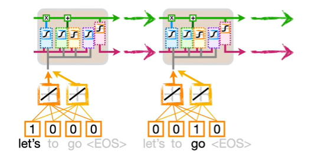

这里要注意的是，我们在 Embedding Layer 和 LSTM 中，使用了相同的权重去应对 `Let's` 和 `go` 这两个输入

到目前为止，我们对 `Let's go` 完成了编码

但是，实际上由于 LSTM 权重过少，实践中通常需要保留更多特征，所以通常会添加更多的 LSTM 来接受输入，如图:

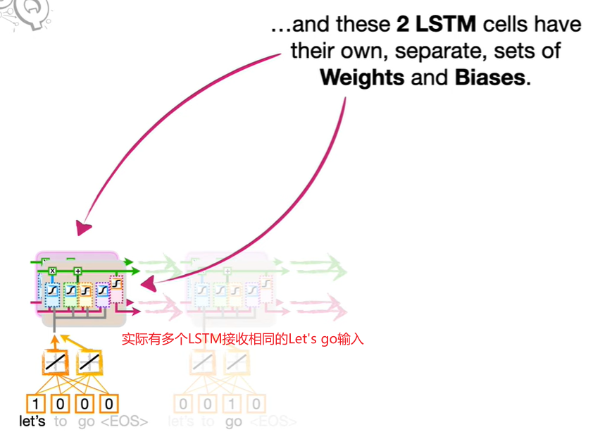

上图为了演示，使用了 2 个 LSTM 接受输入 `Let's go`，不同的 LSTM 将会有各自的权重和偏置

然而这样依然不够，我们需要更多层，来提取特征，所以我们复制这两个 LSTM 单元作为第一层，生成第二层，如图:

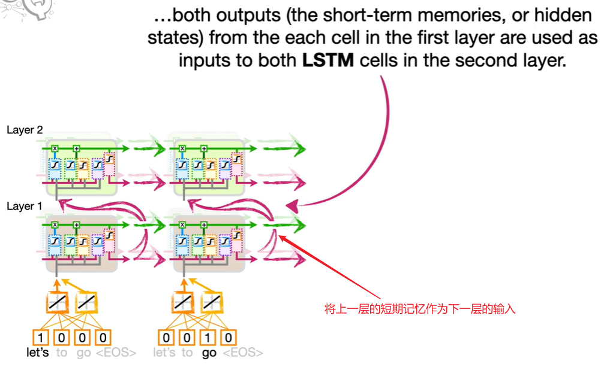

如上图，第一层的短期记忆将作为第二层的输入，第二层也包含 2 个 LSTM 单元 (实践中，会有更多层，每层也有更多的 LSTM 单元)

所有层加在一起就形成了 Encoder 编码器，如图:

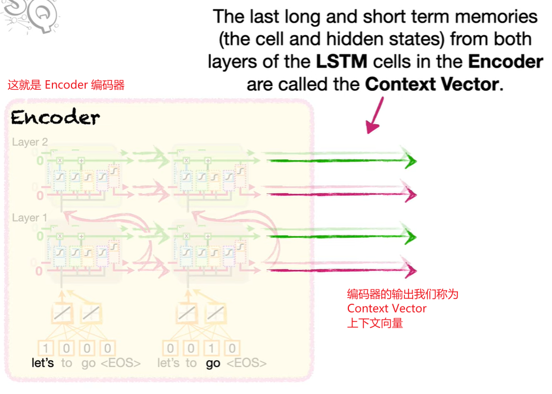

编码器的输出，我们称为 **Context Vector** (上下文向量)

### Decoder

Encoder 输出的 Context Vector 将作为 Decoder 的输入，如图:

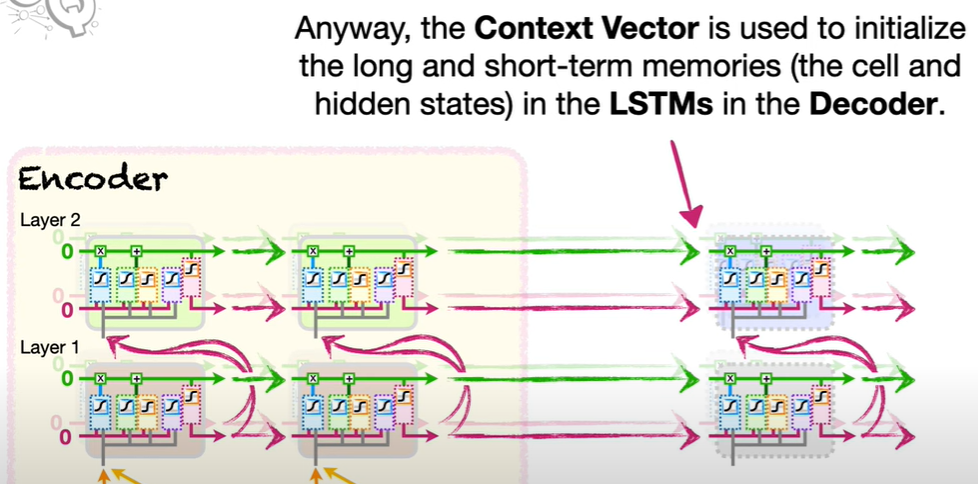

如上图，接受输入的依然是对应层数，每层对应单元数的 LSTM

然后和 Encoder 类似，有一个 Embedding Layer 作为第一层 LSTM 的输入，并且我们人为规定起始输入为 `<EOS>`，如图:

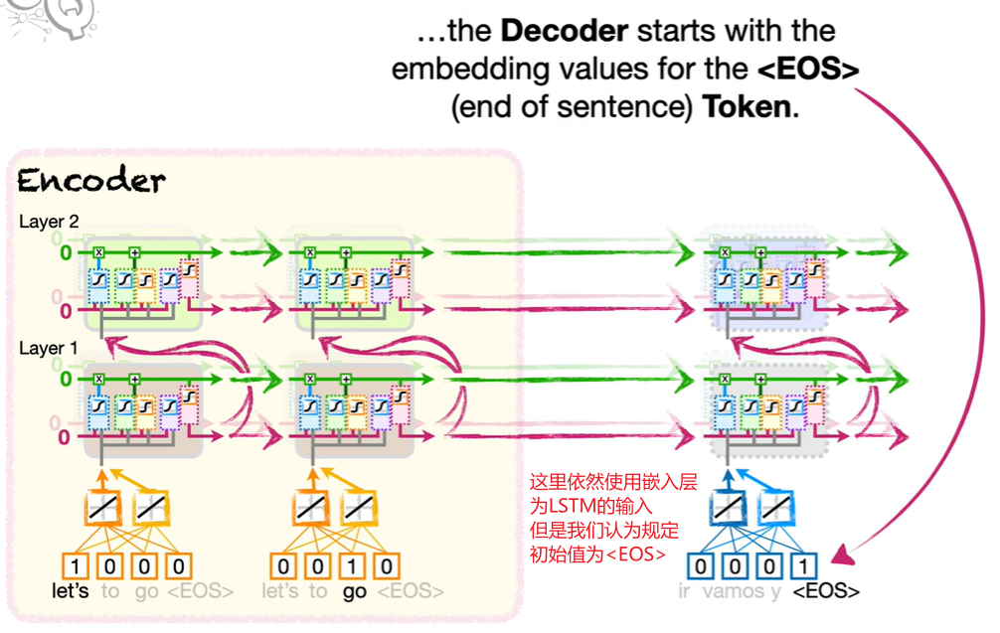

最后，将顶层的短期记忆作为输出，顶层有多少个 LSTM 单元，就有多少个短期记忆输出，该输出还会经历全连接和 `softmax`，如图:

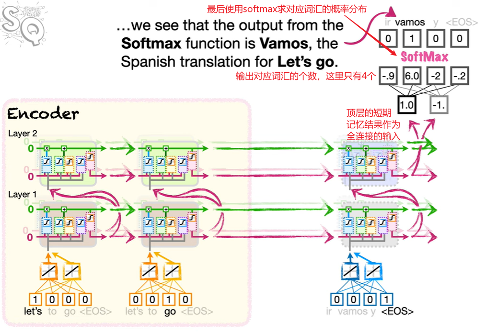

由于输出长度不固定，所以此处还没有解码结束，继续推断结果，如图:

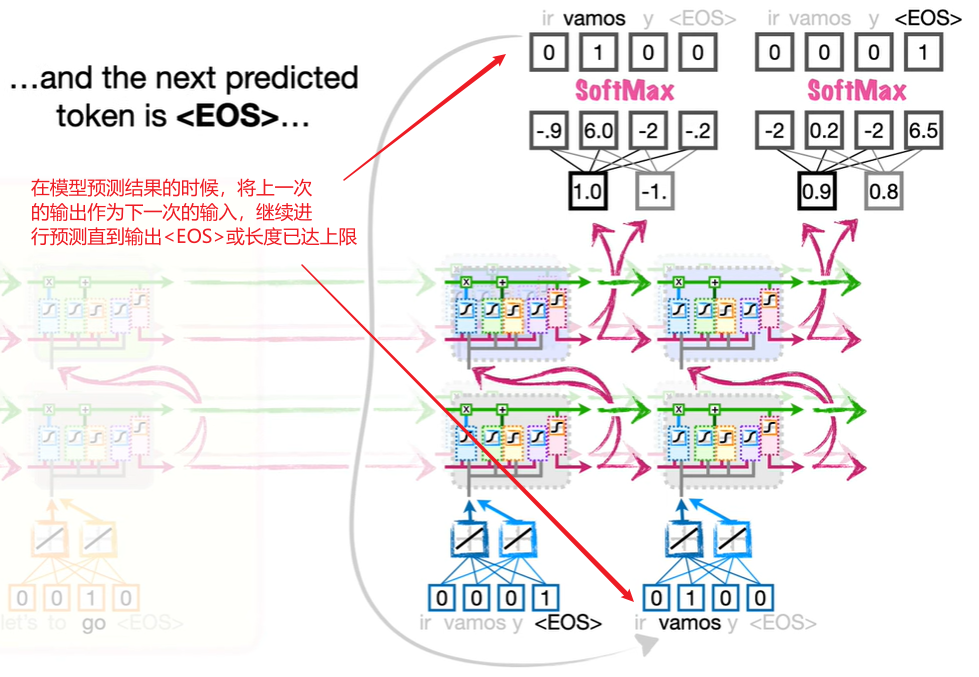

然而在训练的时候，上一次输出的结果也许是错的，此处需要输入正确的结果，如图:

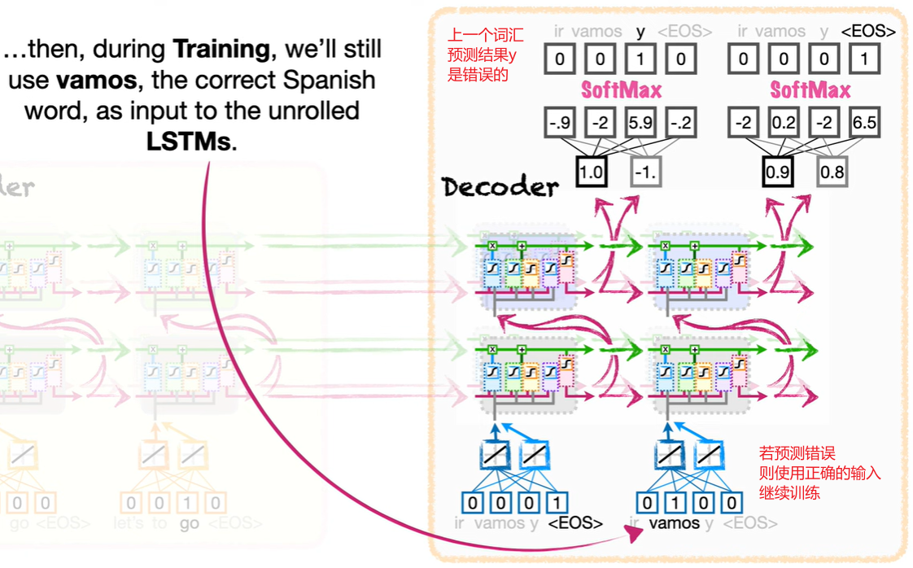

若最后一个结果本因是 `<EOS>`，结果也预测错误的话，则强制停止预测

这个过程称为 **Teacher Forcing** (强制教育)