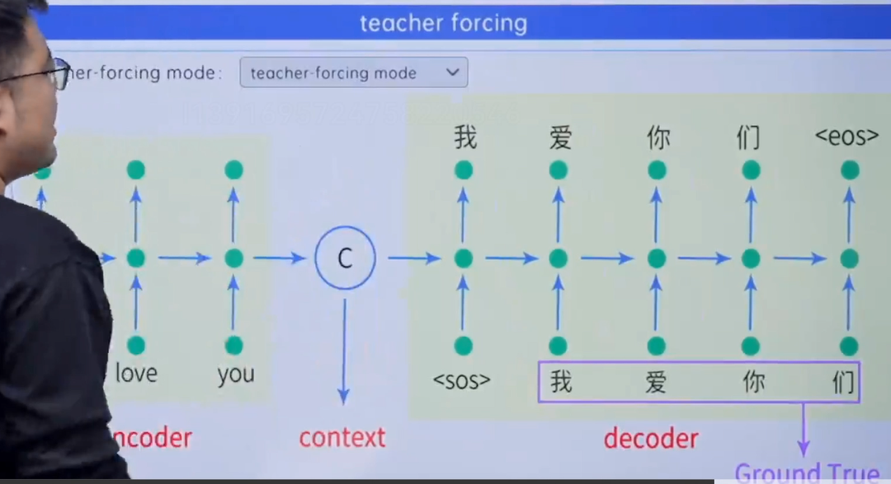

# encoder-decoder

NLP 任务分类

- N对1
  
- 1对N
  
- N对M
  

输入和输出数量不同，且输出数量应该更多却没有得到正确数量输出时，称为**失步**

encoder-decoder 结构如下

训练方法有几种

上图描述的是 free-running mode，自由运行模式，其思想是拿预测的结果作为下一次的输入预测下一个字，这种方法模型很难训练或学到正确的内容

上图的训练方式叫 teacher-forcing mode，也就是教师强迫训练，我们用真实值 Ground True 作为输入训练模型

free-running mode 和 teacher-forcing mode 通常会一块儿使用，先用 teacher-forcing mode 强制教会模型基本信息，再用 free-running mode 让模型更具泛化性

**序列生成模型的训练技术: Scheduled Sampling**:

- **定义:** Scheduled Sampling是一种在训练序列生成模型（如循环神经网络）时使用的技术。在标准的序列生成模型训练中，模型在每一步都使用真实的目标序列数据进行训练。但在Scheduled Sampling中，模型在训练的早期阶段会被引导使用自己生成的序列数据，而不是总是使用真实的目标序列数据。
- **目的:** 这有助于模型逐渐从完全依赖真实数据过渡到能够生成自己的数据，提高其泛化能力。
- **过程:** 在训练开始时，模型主要使用真实数据，但随着训练的进行，模型逐渐增加使用自己生成的数据的比例。这个比例会根据预定的计划（schedule）进行调整。

**代码参考:**

通过一定的比例 `teacher_forcing_ratio` 来控制是否强制压迫学习，通过一定的计划，修改 `teacher_forcing_ratio` 就能达到控制训练的目的

通过判断 `teacher_forcing_ratio` 决定解码器的下一步输入用预测值还是真实标签