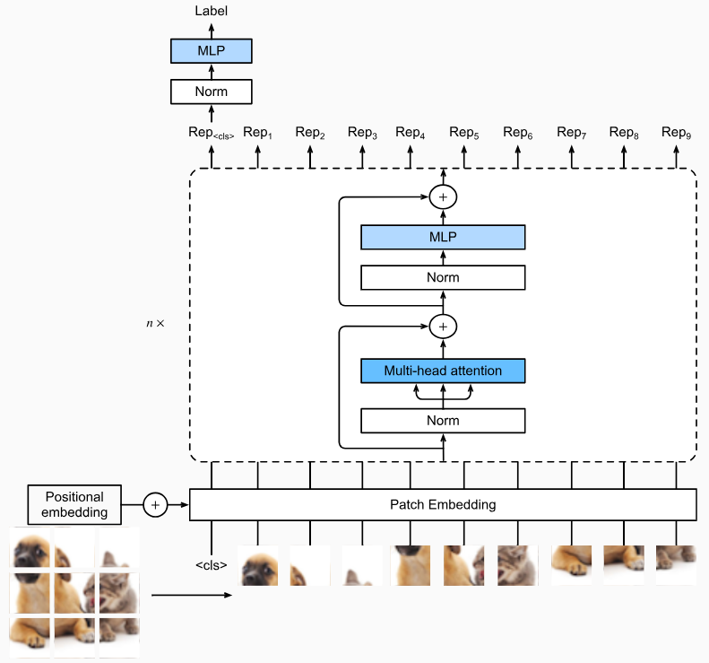
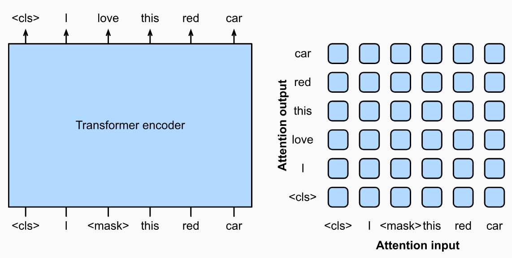
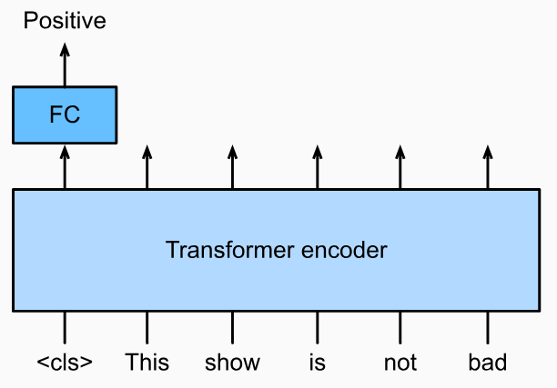
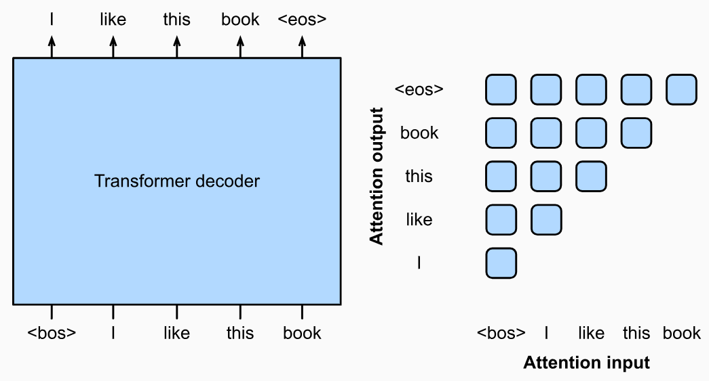
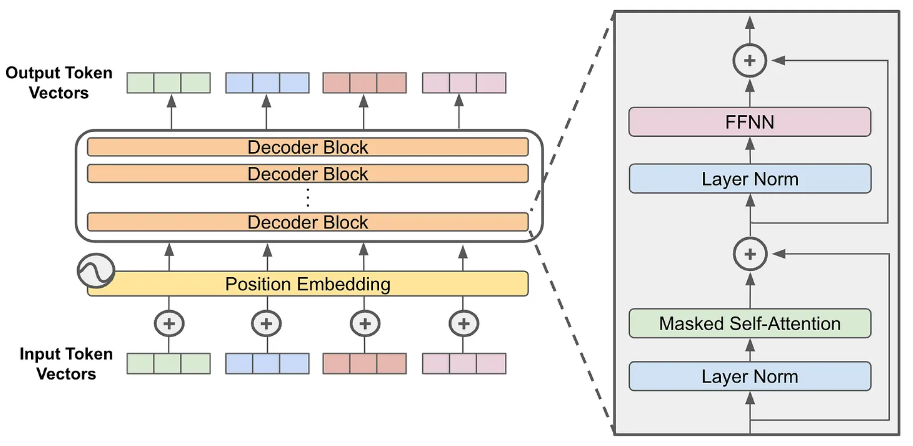
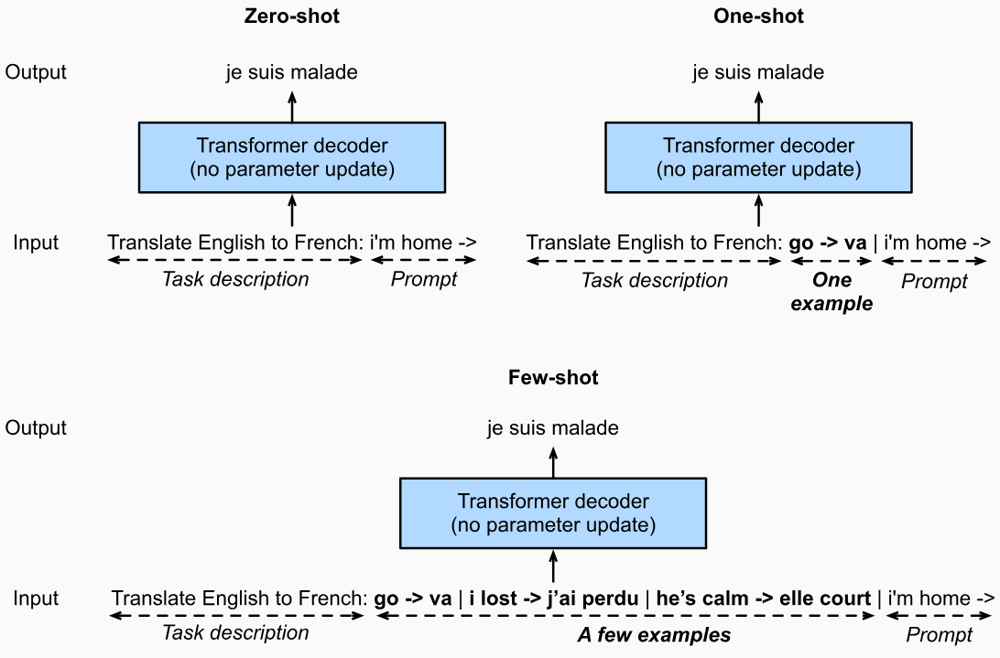
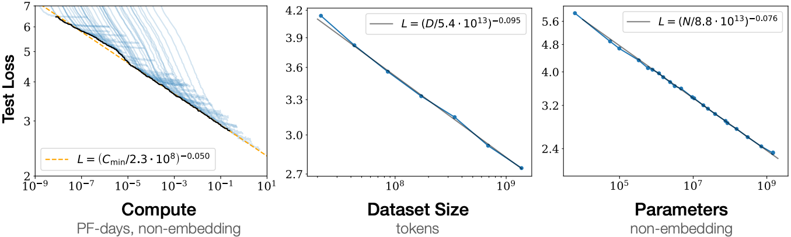
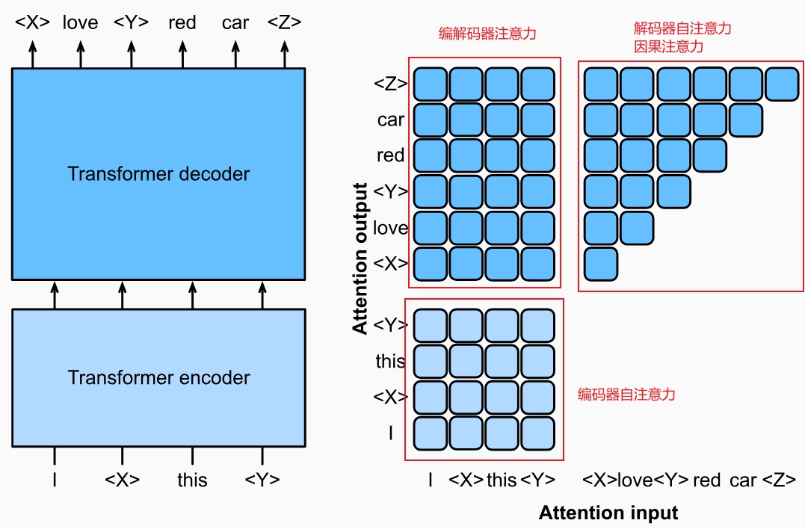
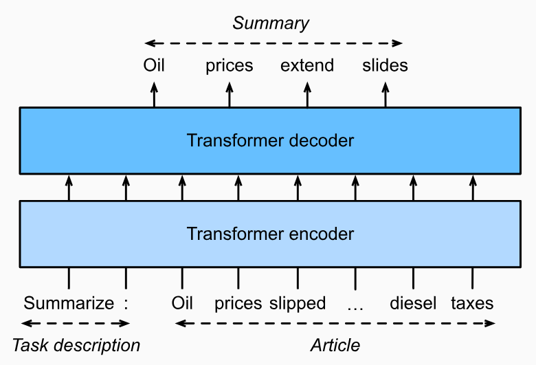

# 使用 Transformer 进行大规模预训练

参考 [使用 Transformer 进行大规模预训练](https://d2l.ai/chapter_attention-mechanisms-and-transformers/large-pretraining-transformers.html)

文章中包含了 GPT 和 GPT-2 还有 Decoder Only Transformer 架构的相关解释

## Encoder-Only 仅编码器模型

### Vision Transformer

Vision Transformer（视觉Transformer） 简称 ViT 是一种只有编码器的模型，如图:

- 基础结构就是 Transformer 的 Encoder 部分
- 将前馈神经网络 FFN 改成了多层感知机 MLP
- 输入的起始 token \<cls> 代表图片的起始位置 也充当分类信息
- 其他输入是图像的一个区块
- 所有输入按照区块大小进行编码，例如区块为 16x16，原图为 64x64，则最后输入token个数为 $m = h*w / p^2 = 64*64/16^2 = 16$
- 模型输出的第一个值，被用来计算模型分类

### BERT

BERT 通过随机屏蔽输入序列中的数据，并预测其屏蔽内容的方式来预训练模型，如图:

- \<cls> 代表文本的开头
- \<mask> 代表随机被掩码遮挡的位置
- 输出序列就是通过编码器自注意力推测出来的结果
- 右侧描述的是输出序列将对每个输入都进行注意力关注

#### 微调（Fine-Tuning） BERT

类似之前的 ViT，通过注意力机制，我们可以让第一个 token 作为整个图片或句子的代表，因为它关注了每个单词。

然后用第一个 token 进行全连接分类，得到语句的情绪预测结果，如图:

- 第一个 token 关注了整个输入语句
- 第一个 token 进行 FC 全连接变换
- 输出情绪预测的分类结果，图中表示为积极情绪

## Decoder-Only 仅解码器模型

仅解码器模型删除了编码器，也删除了编解码注意力子层。Decoder-Only Transformer 已在大语言模型上取得成功

### GPT 生成式预训练

#### GPT-1、GPT-2

GPT 基本架构如下图

- 输入一个序列，\<bos> 语句开头，\<eos> 代表语句结尾
- 输入一个序列后，解码器将试图输出位移一位后的语句
- 右侧注意力图示可以看到，输出序列仅关注直到当前 token 前的所有内容，不会关注未来的内容

完整架构图如下，参考[这篇文章](https://cameronrwolfe.substack.com/p/decoder-only-transformers-the-workhorse):

GPT-2 采用了预归一化和改进的初始化和权重缩放，在更大的数据集和更大的模型参数下进行的预训练

#### GPT-3

GPT-3 对比 GPT-2 增加了任务描述，示例样本，提示词，这 3 个部分作为输入，如图所示

- 上图中，输入部分的头部是任务描述信息，例子中是一个英语转法语的翻译任务
- 左上图代表输入 0 示例样本，右上图代表输入 1 个示例样本，下方图代表输入多个示例样本。示例样本就是提供模型参考的翻译示例
- 输入的最后部分是给出的提示词，也就是要翻译的内容
- 输出则是翻译的结果

#### GPT-3 的可扩展性

上图表示了模型扩展的三个方向

1. 增大计算量
2. 增大数据集
3. 增加模型参数

扩展的效果如图，GPT-3 呈现稳定的优化表现

## Encoder-Decoder 模型

### T5

为了在人类标记的机器翻译数据之外预训练编码器-解码器 Transformer，BART（Lewis 等人，2019）和 T5（Raffel 等人，2020）是两个同时提出的在大规模文本语料库上预训练的编码器-解码器 Transformer。两者都试图在预训练目标中**重建原始文本**(类似完形填空)，前者强调噪声输入（例如掩蔽、删除、排列和旋转），后者则强调通过综合消融研究进行多任务统一。(给模型增加任务描述，让模型处理文本)

总的来说 T5 依然是一个专门处理文本的模型

### 预训练 T5

T5（文本到文本传输转换器）**将许多任务统一为相同的文本到文本问题**：对于任何任务，编码器的输入都是任务描述（例如， “Summarize”、“:”），然后是任务输入（例如，文章中的标记序列），解码器预测任务输出（例如，总结输入文章的标记序列）。

以下是未假如任务描述的基础预训练示意图，在基础的 T5 模型中，模型要做的事情就是通过给出的部分被遮挡的语句，预测遮挡部分的内容，被遮挡的内容可以是一个连续跨度多个的词汇，如图:

- 左侧输入 `I <X> this <Y>`，也就是需要模型预测 `<X>` `<Y>` 处的内容，其中 `<X>` `<Y>` 是特殊占位符
- 输出 `<X> love <Y> red car <Z>`，`<Z>` 代表结束标志；`<X> <Y>` 作为输入文本的占位符，`love` 代表输入 `<X>` 的预测结果，`red car` 代表输入 `<Y>` 的预测结果

输入 `<Y>` 预测得到 `red car`，T5 是一个可以预测连续跨度多个单词的模型

### 微调 (Fine-Tuning) T5

在基础 T5 模型的基础上，通常会增加一个输入项——**任务描述**，通过引入**任务描述**，让 T5 能够处理多种语言任务，如图:

- 输入的左侧 Task description 就是任务描述，这里举例使用的是 Summarize 任务，也就是总结概述任务
- 输入的右侧内容 `Oil prices splipped ... diesel taxes` 为输入文本
- 经过模型编解码，输出内容则是预测的输入内容的总结

微调后的模型，可以将多任务融合在一个模型中，这里举例使用的是概括任务，当然也可以有翻译任务，完形填空任务，续写任务等