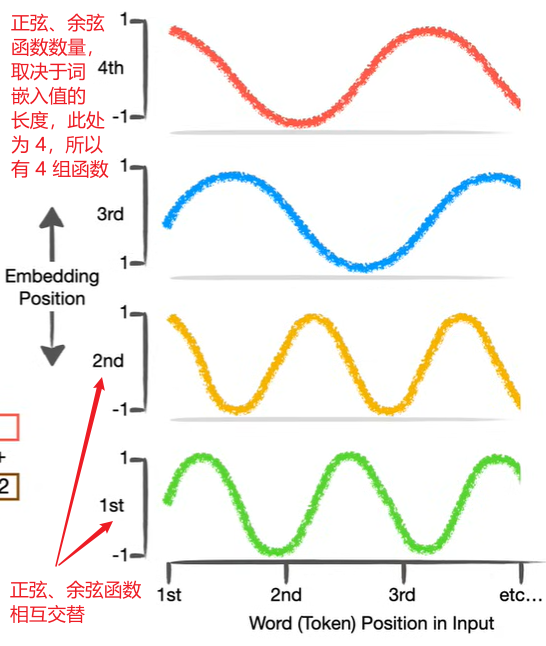
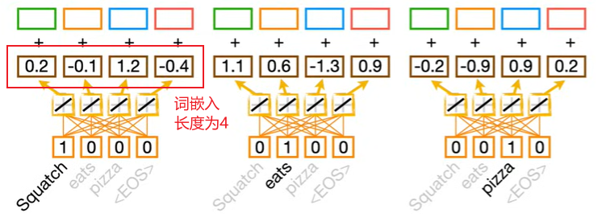
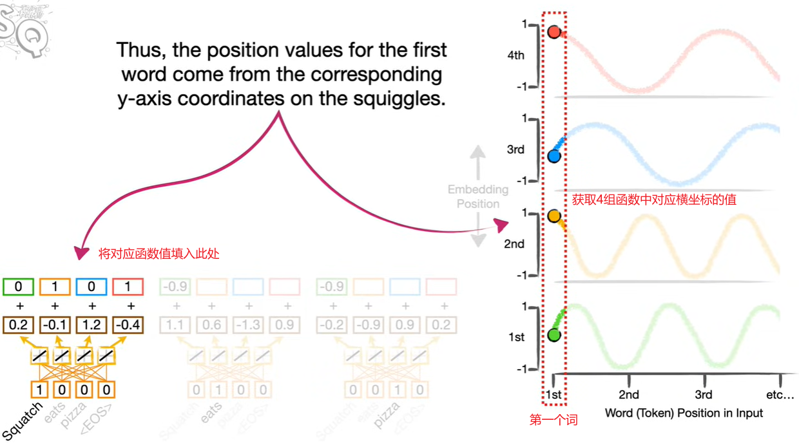
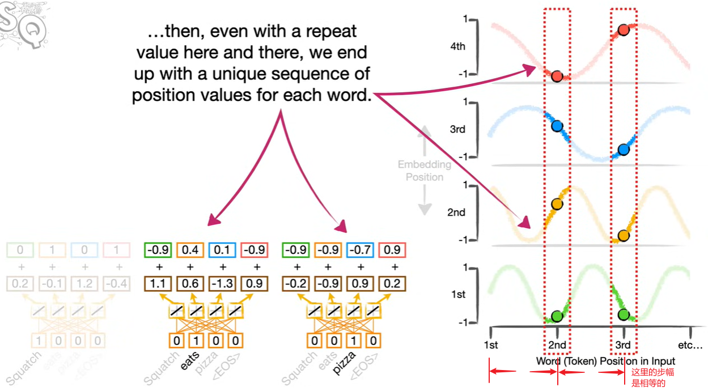
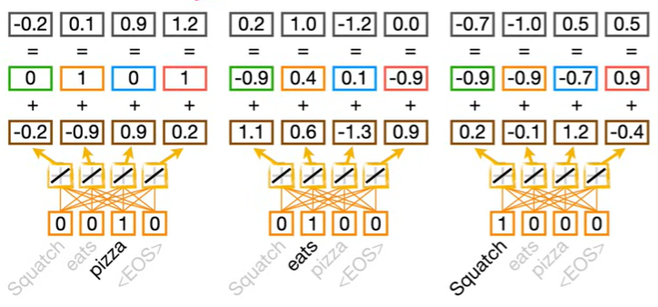

### 位置编码 Position Encoding

序列中，元素的位置通常很重要，例如以下两句话:

- 今天**我**吃了个**包子**
- 今天**包子**吃了个**我**

当简单的调换两个词语的位置，句子的意思就产生了很大的变化。

为了让 Transformers 能很好的追踪句子的顺序，这里引入了**位置编码 (Position Encoding)**

假设有如下一句话要进行位置编码: 

```
Squatch eats pizza
```

则我们创建一组正弦、余弦相互交替的多组函数，如图:



上图中函数有 4 组，且为正弦、余弦相互交替，周期不停变化，为什么是 4 组？这对应词嵌入值的长度，如图:



然后我们对应三个词 (Squatch eats pizza) 的三个位置，在 4 组函数中，以相同的步幅取值并填入位置编码，例如，第一个词 (Squatch) 的位置编码如图:



然后以相同的方式，取相等的步幅，查询另外两个词的位置值，如图:



最后我们把词嵌入值与位置值相加，如图:



这个过程就是**位置编码**

### 位置编码的数学定义

位置编码公式

$$
\text{PE}_{(pos, 2i)} = \sin\left(\frac{pos}{10000^{2i/d_{\text{model}}}}\right)
\\
\text{PE}_{(pos, 2i+1)} = \cos\left(\frac{pos}{10000^{2i/d_{\text{model}}}}\right)
$$

- pos 表示输入序列中的位置，例如有个序列长度为 10，则 pos 为 0~9
- i 是位置编码维度中的索引，例如词嵌入维度为 100，i 为 0~99
- $d_{model}$: 词嵌入维度
- 奇数维度使用正弦函数，偶数维度使用余弦函数；这里指的 i 为 0、2、4 是奇数维度，意思是第1、3、5个维度