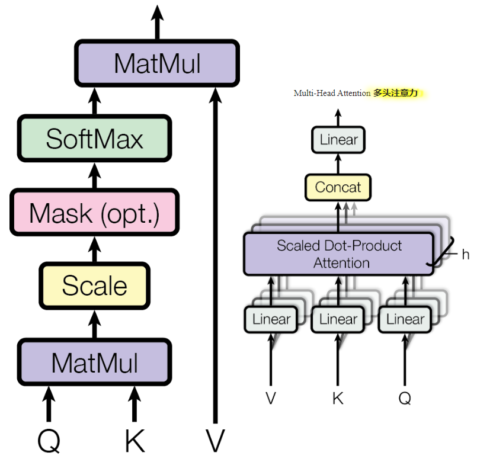
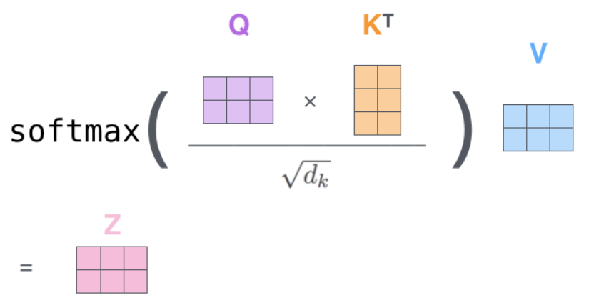
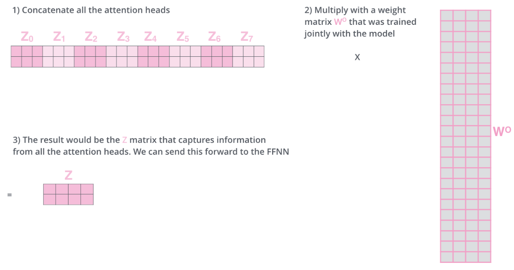

# 多头注意力

图像可以参考这篇文章: https://jalammar.github.io/illustrated-transformer/

## 注意力头

我们通过一组 Q、K、V 计算出一个注意力池结果 Z，这叫做一个注意力头

## 什么是多头注意力

通过多组权重矩阵，计算出多组 Q、K、V，再用多组 Q、K、V 计算注意力池，这就是多头注意力

### 示意图

上图是 Transformer 架构中的多头注意力，此处作为参考

左图是一个注意力头的计算示意图，其中 Scale 部分在论文中代表除以 $d_k$，$d_k$ 代表的是 K 的维度，之所以除以它，是为了优化效果

右图是多头注意力的计算示意图，其中 Scaled Dot-Product Attention 部分，指代的就是左侧的过程

其中 Q K 计算相似度得分的方法，图中使用的其实是类似余弦相似度的算法

矩阵运算示意图如下:

- $Q$: 查询矩阵，每一行代表一个词
- $K^T$: K矩阵的转置
- $\sqrt{d_k}$: 和论文不同，这里缩放了 $d_k$ 的平方根
- $Z$: 注意力池矩阵，每行代表一个词

### 计算过程

#### 分头

将输入 X 沿着嵌入层维度进行分头，例如: 词嵌入形状为 `(L, 100)`，那么分两头，则每个头的输入形状为 `(L, 100 / 2)`

#### 计算每个头的输出

假设共有 i 个头，输入为 $X_i$，那么每组 Q、K、V 可以表示为：

$$
Q^i = X^i \cdot W_Q^i \\
K^i = X^i \cdot W_K^i \\
V^i = X^i \cdot W_V^i
$$

然后我们可以根据不同的头，计算出对应的注意力池，我们命名为 $Z^i$

#### 合并多头输出

$$
Z = Concat(Z^1, Z^2, \cdots Z^i)
$$

#### 线性变换并输出结果

$$
Output = Z \cdot W_O
$$

#### 示意图

这里有很多个注意力头输出的注意力池 $Z_0 \sim Z_7$

$Z_0 \sim Z_7$ 每个头是由对应的 QKV 计算而来

**nn.Transformer 中 QK 的长度默认等于词嵌入的长度**