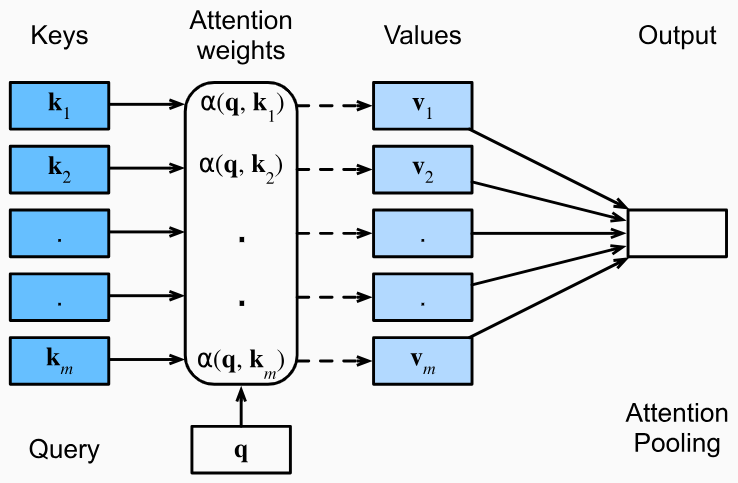

# 注意力

参考文章: 

- [《DIVE INTO DEEP LEARNING》11.1](https://d2l.ai/chapter_attention-mechanisms-and-transformers/queries-keys-values.html)

## Queries, Keys, and Values

假设一些键值对相关的数据集，例如: `{(“Zhang”, “Aston”), (“Lipton”, “Zachary”), (“Li”, “Mu”), (“Smola”, “Alex”), (“Hu”, “Rachel”), (“Werness”, “Brent”)}`

该数据集我们称为 $\mathcal{D}$，则 $\mathcal{D}$ 可以用以下数学式子来描述:

$$
\mathcal{D} \stackrel{def}{=} \{ (\textbf{k}_1, \textbf{v}_1), \dotso (\textbf{k}_m, \textbf{v}_m) \}
$$

接下来我们定义一个 $\textbf{q}$，代表查询一次对数据集的查询。那么在数据集上关于 $\textbf{q}$ 查询的注意力定义为:

$$
\text{Attenstion}(\textbf{q},\mathcal{D}) \stackrel{\text{def}}{=} \sum^m_{i=1} \alpha (\textbf{q}, \textbf{k}_i)\textbf{v}_i
$$

- 等号左侧代表通过 $\textbf{q}$ 查询的注意力值
- 等号右侧 $\alpha (\textbf{q}, \textbf{k}_i)$ 代表 $\textbf{k}_i$ 对于注意力 $\text{Attenstion}(\textbf{q},\mathcal{D})$ 的权重，该权重描述了当前值 $\textbf{v}_i$ 对于注意力的重要程度
- $\alpha (\textbf{q}, \textbf{k}_i)$ 这个值是使用 $\alpha$ 函数并传入参数 $\textbf{q}$ 和 $\mathcal{D}$ 求得的，那么 $\alpha$ 函数是一种相似度算法函数，有多种计算方法

对应每个 $\textbf{v}_i$ 的权重 $\alpha (\textbf{q}, \textbf{k}_i)$，需要进行 softmax 计算，这样以来所有的权重和就为 1，公式如下:

$$
\alpha(\textbf{q},\textbf{k}_i)=\frac{\exp(\alpha(\textbf{q},\textbf{k}_i))}{\sum_j\exp(\alpha(\textbf{q},\textbf{k}_j))}
$$

### 注意力池 Attention Pooling

在注意力机制中，模型通过计算权重来决定在给定任务中输入序列中每个位置的重要性。这些权重可以视为一个“注意力分布”，它决定了模型在执行任务时应该关注哪些部分的输入。而“注意力池”则是在这个注意力分布基础上，计算出对应的加权平均值，以便在模型的下一层或者后续处理中使用。

所以上文提到的 $\text{Attenstion}(\textbf{q},\mathcal{D})$ 就是注意力池

图示图下:

- $\textbf{q}$ 和每个 $\textbf{k}$ 计算出一个权重 $\alpha(\textbf{q}, \textbf{k}_i)$
- 图中的 Attention weights 会进行 softmax 运算
- 用权重值 Attention weights 乘以 Values，然后再求和，就得到了 Attention Pooling

==**所以注意力池，实际上就是一种权重为$\alpha(\textbf{q}, \textbf{k}_i)$的加权和**==

### Q、K、V 从何而来？

假设我们做语言模型，我们已经将词汇进行了词嵌入操作变成了数字。那么 Q、K、V 就是从每个词嵌入上通过权重矩阵进行线性变换得到。如下:

$$
Embedding = 词嵌入 \\
Q = W_q * Embedding \\
K = W_k * Embedding \\
V = W_v * Embedding
$$