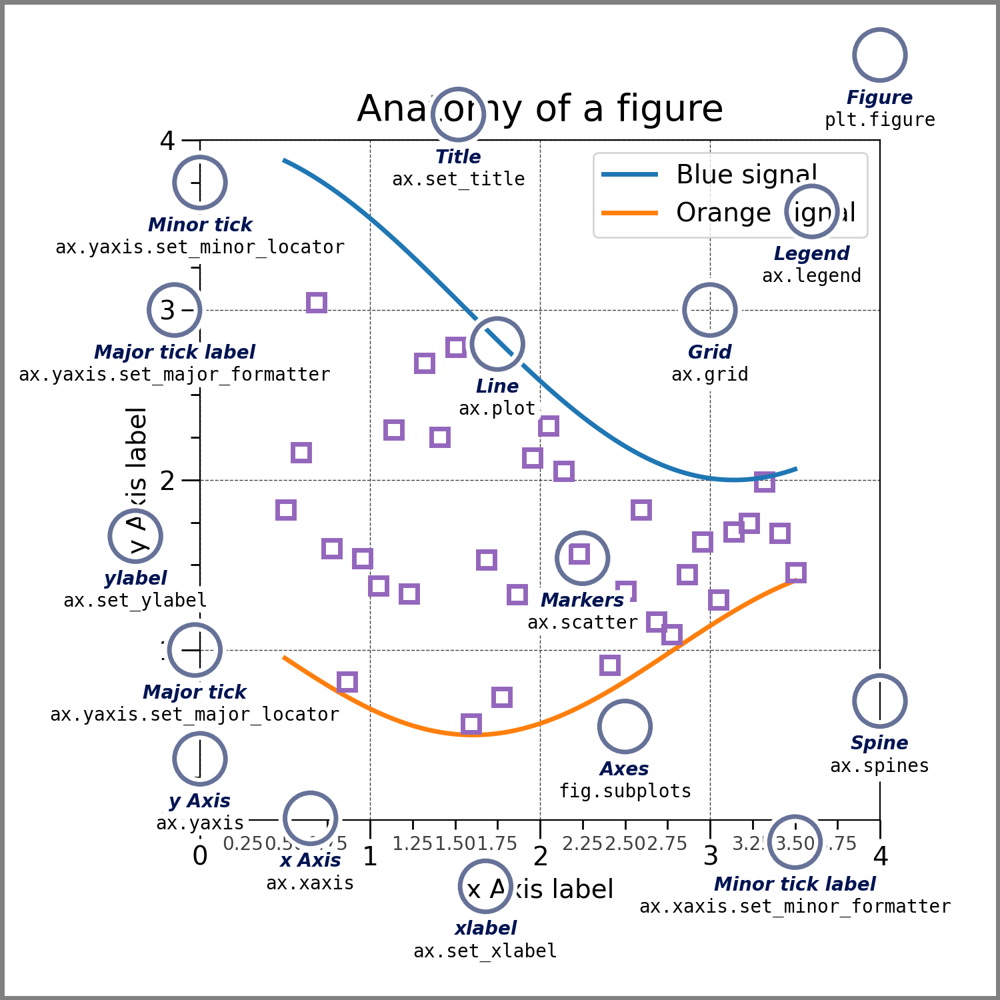

# matplotlib简介与安装

[参考](https://mofanpy.com/tutorials/data-manipulation/plt/)

[官网](https://matplotlib.org/stable/)

[官方demo](https://matplotlib.org/stable/gallery/index)

## 什么是 matplotlib

Matplotlib 是一个用于创建静态、动画和交互式可视化的综合库。

- 静态: 静态图表
- 动画: 动画图表
- 交互式: 可以互动，鼠标查看，点积拖动等操作
- 可视化: 将数据变成图形显示

例如: 


## 安装

```shell
# 安装前置依赖 numpy
pip3 install numpy
```

```shell
# 安装 matplotlib
pip3 install matplotlib
```

## 图像中的各组件



- Figure: 代表整个图像
- Legend: 图例
- Title: 标题
- x Axis: 横轴
- y Axis: 纵轴
- xlabel: 横轴名称
- ylabel: 纵轴名称
- Major tick: 主刻度
- Minor tick: 次刻度
- Major tick label: 主刻度标签
- Minor tick label: 次刻度标签
- Spine: 坐标轴上的边界线
- Axes: 轴
- Markers: 标记
- Line: 线
- Grid: 网格

其中和代码结构相关的对象有以下几个:

- **Figure**: 代表整个图像的对象，它包含 Axes 轴对象，和一组 Artists 对象（例如: 标题、图形图例、颜色条等），也包含嵌套的图像
- **Axes**: 轴，它是附加在 Figure 对象中的一个 Artist 对象，其中包含用于绘制数据的区域，通常包括两个（在 3D 情况下为三个） Axis 对象Figure 中每包含一个 Axes 对象，则显示一幅图像，例如: 图中图，以下 Figure 包含两个 Axes
  
- **Axis**: 轴，具体的轴对象，包含刻度相关数据
- **Artist**: 艺术家，基本上，图中可见的所有内容都是 Artist（甚至 Figure 、 Axes 和 Axis 对象）。这包括 Text 对象、 Line2D 对象、 collections 对象、 Patch 对象等。渲染图形时，所有 Artist 都被依附到 Figure 上。