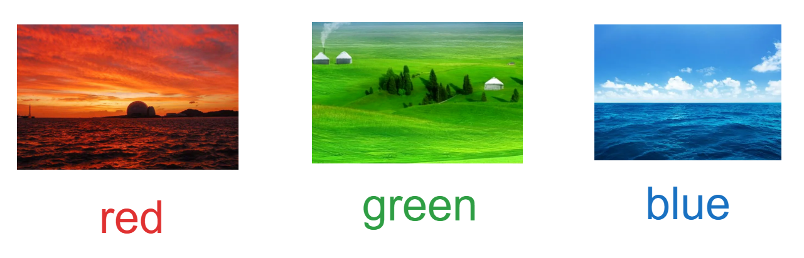

# 计算机图像与像素操作

> 华清远见科技发展有限公司


[TOC]

## 计算机眼中的图像

### 像素的概念


像素是衡量图像大小的`基本单位`

### 图像的颜色

日常生活中我们通常会用描述以下物品的颜色



事实上每一幅图像都是由三原色所构成


为了合成更丰富的颜色，每种颜色定义了从`0-255`的范围值，为`0`说明无色（即为黑色），`255`时说明对应颜色最为鲜艳。例如
$$
Red(255) + Green(0) + Blue(0) = 大红色
$$


上述颜色的定义遵照`BGR`颜色标准

> 思考：如果每种颜色取值为`255`，请问颜色是什么


如何证明图像种有三原色的存在，需要使用`opencv`或者`pillow(PIL)`

### opencv是什么


`OpenCV`是一个基于`Apache2.0`许可（开源）发行的`跨平台计算机视觉和机器学习`软件库，可以运行在Linux、Windows、Android和Mac OS操作系统上。


opencv应用在各个领域中：

---

汽车全景视角


---

美颜滤镜


---

卫星地图拼接


---

人脸关键点检测


除以上内容外，还有CT图辅助诊断、辅助驾驶等等


本次实验中，我们需要安装`opencv-python`以及其扩展库`opencv-contrib-python`

```shell
pip install opencv-python opencv-contrib-python
```


> `opencv-python`:**一个用于解决计算机视觉问题的Python库**,为计算机视觉任务提供高效的解决方案，‌包括图像处理和分析、‌物体识别、‌人脸识别、‌动作识别等多个领域的应用
>
> `opencv-contrib-python`:包含了`OpenCV`官方核心库之外的一些**实验性功能和算法**，‌如图像检测、‌特征提取、‌目标跟踪、‌人脸识别等


### cv2展示一张图像

你可以加载`opencv`库`cv2`

```python
import cv2

img = cv2.imread("../assets/example.png")

cv2.imshow("img", img)
cv2.waitKey(0)
cv2.destroyAllWindows()
```

如何学习并使用`cv2`中这些常见的函数：

1. 我们需要访问opencv官方网站，且找到所使用的对应版本的opencv的文档
2. 通过文档中右侧的搜索栏，对你想要查找的信息进行检索
3. 英文文档需要你通过浏览器进行对应翻译（建议使用Edge或者Chrome自带翻译软件的浏览器，后期学习神经网络时，我们也需要看一些关键的文字）

---

以下演示我们如何查询`cv2.imread`用法

访问https://opencv.org/releases/ 网站，并找到你目前使用的`opencv`版本，此处演示我们使用了`opencv4.10`，并找到`Docs`打开


打开右上角进行搜索`imread`,并找到选项（此处标识为C++语法，实际使用时与python的函数名称，方法形参、功能均是一致的）


英文描述太多，直接切换为中文模式

---


在最底部位置，有对该函数的两个形参的描述：


filename是需要被加载的文件名称

flags是定义了该以何种方式去加载文件。（此处根据flags后面的链接可找到对应的说明）


---


`cv2.imread(filename,flags)`函数说明

+ filename,是支持的对应图片文件的相对或者绝对路径
+ flags是读取该图片文件的方式，常见的有如下几种


`cv2.imshow(winname,mat)`函数说明

+  winname：显示窗口的名称
+ mat：图像矩阵（显示图像不要求通道数，但要求元素大小限制在(0-255)）


`cv2.waitKey(delay)`函数说明

+ delay：当<=0,时，该程序处于无限等待按键状态，当 > 0 时，为等待的时间的毫秒数，也可以在此处点击按键离开，要获取该按键的值，则将waitKey的值返回即可


`cv2.destroyAllWindows()`函数说明

+ 该函数会摧毁所有的HighGUI窗口文件


### 使用cv2加载图像

我们可以查看img变量的信息（事实上它是一个numpy对象，可以通过`isinstance(img,np.ndarray)`结果可知这一点）

```python
import cv2

img = cv2.imread("./assets/example.png")
print(img.shape)
```

结果为:

```
(300,300,3)
```

`300,300`代表图像的高与宽，而`3`代表图像的三原色对应的图层（专业术语：通道（channel））

从结果来看，图像被读取后的结果是一个三维矩阵信息，我们可以查看信息的一部分内容。

```python
print(img[:3, :3, 0])
```


由结果可知，在每个层级的每个`1 x 1`区域中的数值为该区域的颜色值大小，该值介于`0~255`                                                                                                                                                                          

我们可以利用程序将每一层的信息提取出来

```python
import cv2
import numpy as np

img = cv2.imread("./assets/example.png")
h, w, channel = img.shape

blue_channel = img[:, :, 0].reshape(h, w, 1)
green_channel = img[:, :, 1].reshape(h, w, 1)
red_channel = img[:, :, 2].reshape(h, w, 1)
_black = np.zeros(shape=(h, w, 1), dtype=img.dtype)

blue_img = np.concatenate((blue_channel, _black, _black), axis=2)
green_img = np.concatenate((_black, green_channel, _black), axis=2)
red_img = np.concatenate((_black, _black, red_channel), axis=2)

cv2.imshow("blue", blue_img)
cv2.imshow("green", green_img)
cv2.imshow("red", red_img)

cv2.waitKey(0)
cv2.destroyAllWindows()
```


我们将不同channel的图像合并起来，又会最终得到原图:

```python
cv2.imshow("src1", blue_img + green_img + red_img)
```


### 使用matplotlib加载图像


```python
import cv2
import matplotlib.pyplot as plt
import numpy as np

fig = plt.figure(figsize=(10, 3))

img = cv2.imread("../assets/example.png")
blue_img = np.zeros(img.shape, dtype=img.dtype)
blue_img[:, :, 0] = img[:, :, 0]
blue_img = cv2.cvtColor(blue_img, cv2.COLOR_BGR2RGB)
ax1 = fig.add_subplot(131)
ax1.imshow(blue_img)
green_img = np.zeros(img.shape, dtype=img.dtype)
green_img[:, :, 1] = img[:, :, 1]
green_img = cv2.cvtColor(green_img, cv2.COLOR_BGR2RGB)
ax2 = fig.add_subplot(132)
ax2.imshow(green_img)
red_img = np.zeros(img.shape, dtype=img.dtype)
red_img[:, :, 2] = img[:, :, 2]
red_img = cv2.cvtColor(red_img, cv2.COLOR_BGR2RGB)
ax1 = fig.add_subplot(133)
ax1.imshow(red_img)

plt.show()
```


关于`cv2.cvtColor(mat,mode)`函数说明


> 练习：图像添加LOGO


> 练习：反转颜色


## 灰度实验


### 为什么图像要进行灰度化

+ 简化处理
+ 降低数据量
+ 突出图像结构
+ 适应部分应用场景

### 简化处理、降低数据量

彩色图像中的每个像素颜色由R、‌G、‌B三个分量决定，‌每个分量的取值范围都在0-255之间，‌这意味着彩色图像的一个像素点可以有16,777,216种颜色的变化范围。‌相比之下，‌灰度图像只有一个颜色通道，‌即亮度值，‌每个像素只需一个字节来表示灰度值，‌从而简化了矩阵并提高了运算速度。‌此外，‌灰度图像所需的数据量更小，‌可以节省存储空间和传输带宽


### 突出图像结构

在某些情况下，‌我们可能更关心图像中的纹理、‌形状和结构，‌而不是颜色信息。‌转换为灰度图像可以突出这些结构，‌使得一些图像处理任务（‌如边缘检测、‌特征提取等）‌更加有效


### 适应部分场景

在一些特定的应用场景中，‌彩色信息并不是必需的，‌灰度图像可以满足需求。‌例如，‌在某些计算机视觉和图像处理任务中，‌灰度图像的处理和分析比彩色图像更简单，‌因为它们减少了计算的复杂性


### 图像二值化的方式

+ 加权平均法

```python
for i in range(h):
    for j in range(w):
        grayimg[i, j] = 0.3 * image[i, j][0] + 0.59 * image[i, j][1] + 0.11 * image[i, j][2]
```


+ 最大值法

```python
for i in range(h):
    for j in range(w):
        grayimg[i,j] = max(image[i,j][0],image[i,j][1],image[i,j][2])
```


+ 平均值法

```python
for i in range(h):
    for j in range(w):
        grayimg[i,j] = (image[i,j][0] + image[i,j][1] + image[i,j][2]) / 3
```


### opencv的灰度化

在cv2中主要用户灰度化的方式有以下方式：

```python
gray = cv2.cvtColor(image, cv2.COLOR_BGR2GRAY)
```

对于`cvtColor`方法，它可以将满足其要求的图像转化为各种需要指定的图像

此处参考：[OpenCV: Color Space Conversions](https://docs.opencv.org/4.x/d8/d01/group__imgproc__color__conversions.html#ga397ae87e1288a81d2363b61574eb8cab)


#### 关于其他的颜色标准模式

+ BGRA : BGR 基础上多了一个关于透明度的通道，

+ HSV：色调（H，取值范围为0°～360°），饱和度（S，取值范围为0.0~1.0），亮度（V，取值范围为0.0（黑）~1.0（白）） 但在opencv中（H：0~180，S：0~255，V：0~255）

  

+ HLS：色相（‌Hue）‌、‌亮度（‌Luminance）‌和饱和度（‌Saturation）‌，与HSV类似，只是对应颜色有不同。


参考：[颜色空间 - Win32 apps | Microsoft Learn](https://learn.microsoft.com/zh-cn/windows/win32/wcs/color-spaces)


## 图像二值化

使用Opencv进行图像分割

1、固定阈值分割 

2、自适应阈值分割


### 固定阈值分割

#### 固定阈值分割原理

+ 将图像灰度化
+ 设置一个阈值，将灰度图像上的每个像素点，大于该阈值时赋值为`255`,小于该值时赋值为`0`


上述设置的固定阈值分割办法为`二进制阈值法（BINARY）`

除此以外还有：

+ 反二进制阈值法（BINARY_INV）

+ 截断阈值法 (TRUNC)

+ 超阈值为0法 （TOZERO）

+ 反超阈值为0法（TOZERO_INV）

  

接下来，我们介绍他们各自的原理


opencv 自带阈值分割方法`cv2.threshold` 函数


```python
import cv2
import matplotlib.pyplot as plt

img = cv2.imread("./assets/example.png")
gray = cv2.cvtColor(img,cv2.COLOR_BGR2GRAY)
ret,thresh1 = cv2.threshold(gray,127,255,cv2.THRESH_BINARY)
ret,thresh2 = cv2.threshold(gray,127,255,cv2.THRESH_BINARY_INV)
ret,thresh3 = cv2.threshold(gray,127,255,cv2.THRESH_TRUNC)
ret,thresh4 = cv2.threshold(gray,127,255,cv2.THRESH_TOZERO)
ret,thresh5 = cv2.threshold(gray,127,255,cv2.THRESH_TOZERO_INV)

titles = ['img','THRESH_BINARY','THRESH_BINARY_INV','THRESH_TRUNC','THRESH_TOZERO','THRESH_TOZERO_INV']
images = [img,thresh1,thresh2,thresh3,thresh4,thresh5]
for i in range(6):
    plt.subplot(2, 3,i+1)
    plt.imshow(images[i],'gray')
    plt.title(titles[i])
    plt.xticks([])
    plt.yticks([])
plt.show()
cv2.waitKey(0)
```


### 自适应二值化

固定阈值二值化的问题在于我们需要找到一个非常合适的阈值，才能够得到轮廓清晰的图像


实际上我们可以通过图像的信息，去求取一个合适的阈值，也即`自适应二值化`

自适应二值化常见方式有两种：

1. `OTSU` 全局阈值计算(`OSTU`是一个日译英文，原算法作者叫`Nobuyuki Otsu`)
2. 局部阈值（均值法、高斯法）


#### OSTU全局阈值计算

##### ostu算法的基本原理

1. 将`0~255`之间的所有值都假设为其阈值threshold

2. 将大于等于threshold与小于threshold的像素值列表、长度、占全局像素的比例、各自平均值分别获取

   > $$
   > n_0 大于阈值的前景像素数量 \\
   > n_1 小于阈值的背景像素数量 \\
   > w_0 前景像素占全局像素的比例 \\
   > w_1 背景像素占全局像素的比例 \\
   > u_0 前景像素的平均值 \\
   > u_1 背景像素的平均值 \\
   > u 全局像素的平均值
   > $$

3. 最后计算的公式为：
   $$
   g = w_0 \times (u_0 - u)^2 + w_1 * (u_1 - u)^2
   $$

4. 从所有的`g`值中获取最大值的阈值threshold，即为OSTU全局阈值


##### cv2中的OSTU

在cv2中我们可以直接在二值化参数中加入`ostu`参数

```python
_, thresh1 = cv2.threshold(gray, 127, 255, cv2.THRESH_BINARY + cv2.THRESH_OTSU)
```


#### 局部均值自适应二值化原理

+ 均值下的局部二值化
+ 权值下的局部二值化


```python
import cv2

srcImage = cv2.imread("./assets/example.png")
srcGray = cv2.cvtColor(srcImage,cv2.COLOR_BGR2GRAY)
# 初始化相关变量
# 初始化自适应阈值参数
maxVal = 255
blockSize = 3
constValue = 10
# 自适应阈值算法
# 0 ADAPTIVE_THRESH_MEAN_C
# 1 ADAPTIVE_THRESH_GAUSSIAN_C
adaptiveMethod = 0

# 阈值类型
# 0:THRESH_BINARY
# 1:THRESH_BINARY_INV
thresholdType = 1
# 图像自适应阈值操作
distImage = cv2.adaptiveThreshold(srcGray,maxVal,adaptiveMethod,thresholdType,blockSize,constValue)
cv2.imshow("srcImage",srcImage)
cv2.imshow("grayImage",srcGray)
cv2.imshow("Adaptive threshold",distImage)
cv2.waitKey(0)

```


自适应二值化原理：我们可以通过对应算法计算灰度图中所有像素的阈值


## 形态学变换


opencv中的形态学操作

```
cv2.MORPH_ERODE：腐蚀操作。
cv2.MORPH_DILATE：膨胀操作。
cv2.MORPH_OPEN：开运算。
cv2.MORPH_CLOSE：闭运算。
cv2.MORPH_GRADIENT：形态学梯度。
cv2.MORPH_TOPHAT：原图像减去膨胀的图像。
cv2.MORPH_HITMISS：结构元素对应的点集比较。
```


### 腐蚀操作

腐蚀操作的主要目的是消除图像中的噪声、细化对象、断开连接的对象等。

腐蚀操作通过逐渐消除边界上的像素点，使图像向中心收缩，从而达到消除噪声、断开连接对象的效果。


### 膨胀操作

图像中每个像素与一个结构元素进行`卷积`来完成。膨胀操作可以使前景区域扩张，填充空洞和连接断裂的区域


### 开运算

先进行腐蚀运算，再进行膨胀运算。开运算的效果是能够除去孤立的小点、毛刺和小角，而总的位置和形状不变。开运算是一个基于几何运算的滤波器，结构元素大小（kernel）的不同将导致滤波效果的不同。


### 闭运算

先进行膨胀运算，再进行腐蚀运算。闭运算的效果是能够填平小湖（即小孔），弥合小裂缝，而总的位置和形状不变。闭运算是通过填充图像的凹角来过滤图像的，结构大小的不同将导致滤波效果的不同。


案例：

```python
import cv2
import numpy as np

"""
形态学操作：
cv2.MORPH_ERODE：腐蚀操作。
cv2.MORPH_DILATE：膨胀操作。
cv2.MORPH_OPEN：开运算。
cv2.MORPH_CLOSE：闭运算。
cv2.MORPH_GRADIENT：形态学梯度。
cv2.MORPH_TOPHAT：原图像减去膨胀的图像。
cv2.MORPH_HITMISS：结构元素对应的点集比较。
"""

img = cv2.imread("./assets/morphologyEx3.png", 0)

kernel = np.ones((5, 5), np.uint8)
# 腐蚀操作
# eroded = cv2.morphologyEx(img, cv2.MORPH_ERODE, kernel)
# 膨胀操作
# dilate = cv2.morphologyEx(img, cv2.MORPH_DILATE, kernel)
# 开运算
# open = cv2.morphologyEx(img, cv2.MORPH_OPEN, kernel)
# 闭运算
close = cv2.morphologyEx(img, cv2.MORPH_CLOSE, kernel)

cv2.imshow("src",img)
cv2.imshow("erode",close)
cv2.waitKey(0)
cv2.destroyAllWindows()

```


## 图片颜色识别

### HSV颜色相较于RGB的特点

1. HSV更加符合人类对颜色的感知方式，人类对颜色的感知是基于色调、饱和度和亮度三个维度的，而HSV颜色空间恰好就是描述这三个特点
2. 颜色调整直观，不同于RGB的三通道数值范围，Hue色调可以不论各种因素的情况下锁定颜色值的范围区间。


### HSV的颜色范围


如何识别对应的颜色区域


步骤：

+ 通过三通道掩膜找出每种颜色的区域
+ 对颜色区域进行亮色处理
+ 通过轮廓检测器检测所有存在轮廓
+ 对应轮廓并对颜色区域进行判断


## 图片颜色替换


修改照片背景步骤：

+ 通过三通道找出特定颜色的区域
+ 对特定颜色的区域实现替换
