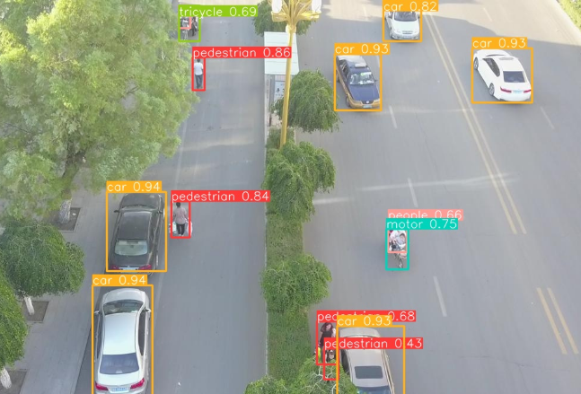
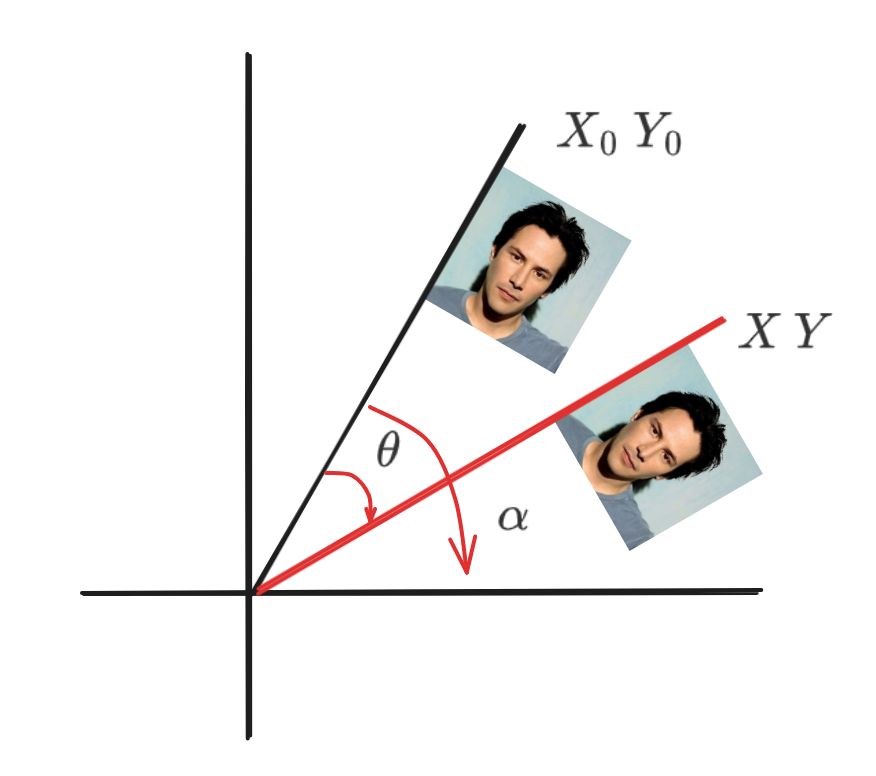
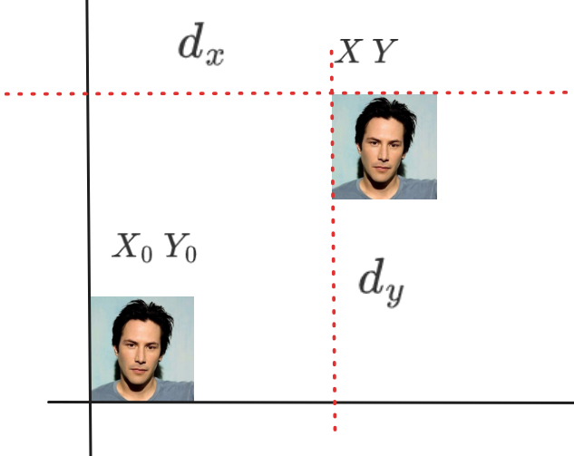
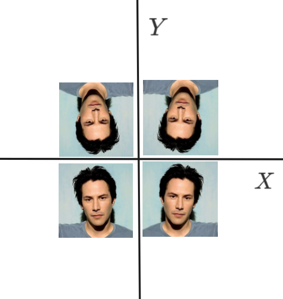
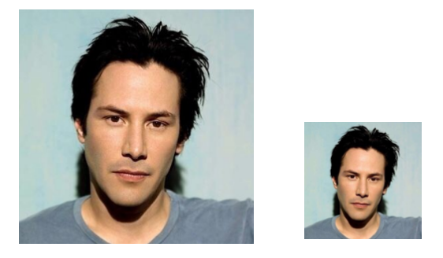
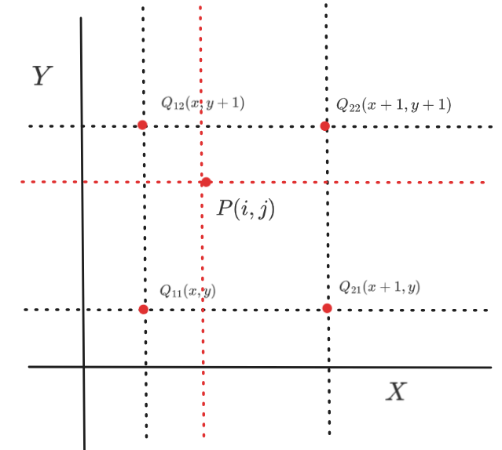
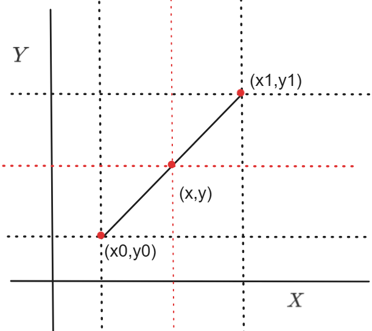
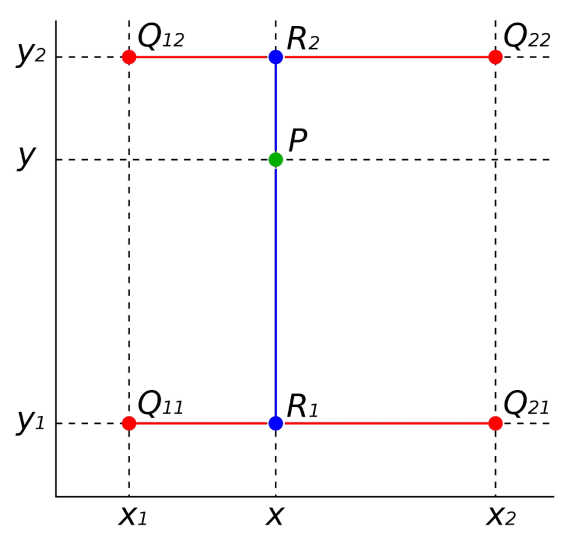

# 图像旋转与基本操作

> 华清远见科技发展有限公司


[TOC]


## ROI 切割

### ROI 区域是什么

在OpenCV（cv2）中，`ROI`（Region of Interest，`感兴趣区域`）是指图像中你特别关心的部分。通过指定ROI，你可以对图像的特定区域进行处理、分析或显示。

在OpenCV中，ROI的选取通常是通过指定图像上的矩形区域来完成的。这个矩形区域由左上角和右下角的坐标来定义。一旦定义了ROI，你就可以对该区域进行各种操作，如裁剪、分析特征、应用滤波器等


```python
import cv2
import numpy as np

# 读取图像
image = cv2.imread('./assets/example.jpg')
# 显示原始图像
cv2.imshow('Original Image', image)
# 等待用户选择ROI
roi = cv2.selectROI('ROI Selector', image, False)
# roi是一个包含左上角坐标，以及宽高的元组
x, y, w, h = roi
# 裁剪ROI
roi_image = image[y:y+h, x:x+w]
cv2.imshow('ROI', roi_image)
cv2.waitKey(0)
cv2.destroyAllWindows()

```


学习ROI的意义

+ 目标检测

  


## 图像旋转


$$
\left[
\begin{matrix}
   X & Y
\end{matrix}
\right]
=
\left[
\begin{matrix}
   \cos\theta & \sin\theta \\
   -\sin\theta & \cos\theta
\end{matrix}
\right]
\cdot
\left[
\begin{matrix}
   X_0 & Y_0
\end{matrix}
\right]
$$


$$
X = R\cdot cos(\alpha - \theta) \\
Y = R\cdot sin(\alpha - \theta) \\
becouse：\\
R = \sqrt{X_0^{2} + Y_0^{2}} \\
sin\alpha = \frac{Y_0}{\sqrt{X_0^{2} + Y_0^{2}}} \\
cos\alpha = \frac{X_0}{\sqrt{X_0^{2} + Y_0^{2}}} \\
\\
X = R \cdot (cos\alpha\cdot cos\theta + sin\alpha\cdot sin\theta) \\
Y = R \cdot (sin\alpha\cdot cos\theta - cos\alpha\cdot sin\theta) \\
X = X_0 \cdot cos\theta + Y_0 \cdot sin\theta \\
Y =  - X_0 \cdot sin\theta + Y_0 \cdot cos\theta \\
$$

```python
import numpy as np
import cv2 as cv

# ------------------旋转-----------------------------------

img = cv.imread("./assets/example.png", 0)
rows, cols = img.shape[0:2]
# 第一个参数是旋转中心，第二个参数是旋转角度，第三个参数是旋转后的缩放因子
M = cv.getRotationMatrix2D((cols / 2, rows / 2), 60, 1.2)
# 第三个参数是输出图像的尺寸中心，图像的宽和高
result = cv.warpAffine(img, M, (cols, rows))

cv.imshow('Result', result)

cv.waitKey(0)
cv.destroyAllWindows()
```


## 图像平移





$$
X = X_0 + d_x \\
Y = Y_0 + d_y \\
\\
X = X_0 \times 1+ Y_0 \times 0 + 1 \times d_x \\
Y = X_0 \times 0+ Y_0 \times 1 + 1 \times d_y \\
\\
\left[
\begin{matrix}
   X \\
   Y \\
   1
\end{matrix}
\right]
=
\left[
\begin{matrix}
   1 & 0 & d_x \\
   0 & 1 & d_y
\end{matrix}
\right]
\cdot
\left[
\begin{matrix}
   X_0 \\
   Y_0 \\
   1
\end{matrix}
\right]
$$


```python
import numpy as np
import cv2 as cv

# ----------------平移-----------------------------------

img = cv.imread("./assets/example.png", 1)
rows, cols, channels = img.shape
M = np.float32([[1, 0, 100], [0, 1, 5]])
res = cv.warpAffine(img, M, (cols, rows))
cv.imshow('img', res)
cv.waitKey(0)
cv.destroyAllWindows()
```


## 图像镜像




某些特殊图像旋转会浪费计算资源

```python
import cv2 as cv

# ----------------镜像-----------------------------------

img = cv.imread("./assets/example.png", 1)
rows, cols, channels = img.shape
# 设置镜像类型，0: 沿x轴镜像，>0: 沿y轴镜像，<0: 沿x轴和y轴都镜像
flip_type = 0
img = cv.flip(img, flip_type)
cv.imshow('img', img)

cv.waitKey(0)
cv.destroyAllWindows()
```


## 图像缩放

问题：如何使用简单方式将图像缩小到原来大小的1/2



原理：我们需要将xy方向上的像素各缩小一半

```python
import cv2 as cv

# ----------------图像简单缩小-----------------------------------
img = cv.imread("../assets/example.png")

img_zoom_in = img[::2, ::2, :]
cv.imshow('img', img_zoom_in)

cv.waitKey(0)
cv.destroyAllWindows()
```


上述实验有一个很严重的问题：`如果缩小到200x200这样的指定大小呢？`整个缩小方式就无效了


### 插值法

对于缩放使用的插值法有，近邻插值、双线性插值、三次样条插值、拉格朗日插值、多项式、区域插值等

| interpolation 选项 | 所用插值方法               |
| ------------------ | -------------------------- |
| INTER_NEAREST      | 近邻插值                   |
| INTER_LINEAR       | 双线性插值（默认值）       |
| INTER_AREA         | 使用像素区域关系进行重采样 |
| INTER_CUBIC        | 4x4 像素领域的双三次插值   |
| INTER_LANCZOS4     | 8x8 像素领域的Lanczos插值  |


#### 近邻插值

$$
P(i,j)
$$



上述内容中`Q`是缩放前图像中的相邻像素，`P`是缩放后对应点的像素。

原理是，P点通过等比例缩放位置后，四舍五入取整的位置是原来像素中的哪个点，就取该像素点的值。


如下：

```python
import cv2 as cv
import numpy as np

img = cv.imread("../assets/example.png")
# ----------------插值法下的图像缩小-----------------------------------
h, w, c = img.shape
size = 500
new_img = np.zeros((size, size, 3), dtype=np.uint8)
sx = size / w
sy = size / h
for i in range(size):
    for j in range(size):
        new_i = round(i / sx)
        new_j = round(j / sx)
        new_img[j, i] = img[new_j, new_i]
cv.imshow("new_img", new_img)
cv.waitKey(0)
cv.destroyAllWindows()

```


优点：简单、计算量小

缺点：效果不好，图像放大后失真现象严重。


#### 线性插值



假设我们已知坐标 (，) 与 (，)，要得到 [，] 区间内某一位置 x 在直线上的值。由上图可得：


由于 x 已知，则 y：


所以，这是在 x 方向上进行了一次线性插值。

**双线性插值**是对 x 方向和 y 方向分别进行插值，它根据原始图像中四个相邻像素的值来估计新位置处像素的值。它是一维线性插值的扩展。



在上图中，假设已知、、、四个点，我们要估计由这四个点组成的矩形内的任意点(x,y)处像素值 f(x,y) 。

- 对沿 y 轴的两对点 、在 x 方向进行线性插值：

%3D%20%5Cfrac%7Bx_2-x%7D%7Bx_2-x_1%7Df(Q_%7B11%7D)%20%2B%20%5Cfrac%7Bx-x_1%7D%7Bx_2-x_1%7Df(Q_%7B21%7D))

- 对沿 y 轴的两对点 、在 x 方向进行线性插值：

%3D%20%5Cfrac%7Bx_2-x%7D%7Bx_2-x_1%7Df(Q_%7B12%7D)%20%2B%20%5Cfrac%7Bx-x_1%7D%7Bx_2-x_1%7Df(Q_%7B22%7D))

- 对沿 x 轴的两对点 、在 y 方向进行线性插值：

%3D%20%5Cfrac%7By_2-y%7D%7By_2-y_1%7Df(R_1)%20%2B%20%5Cfrac%7By-y_1%7D%7By_2-y_1%7Df(R_2))

此时，一共执行了**三次线性插值**，双线性插值只是对 x、y 方向进行插值，而不是进行两次插值。


## 图像矫正


### 图像矫正原理

无论是旋转变换、平移变换，都会根据系数矩阵进行转换。对于图像矫正来说也是如此


$$
\left[
\begin{matrix}
   X \\
   Y \\
   Z
\end{matrix}
\right]
=
\left[
\begin{matrix}
   a_{11}&a_{12}&a_{13} \\
   a_{21}&a_{22}&a_{23} \\
   a_{31}&a_{32}&a_{33}
\end{matrix}
\right]
\cdot
\left[
\begin{matrix}
   X_0 \\
   Y_0 \\
   1
\end{matrix}
\right]
$$
上述公式可转化为八元一次方程。


修正原本图像中的不规整的形态

```python
# 仿射变换
import cv2
import numpy as np

img = cv2.imread("assets/perspective.png")

# 此处省略梯形坐标值的计算
pts1 = np.float32([
  [60, 150],
  [240, 150],
  [0, 300],
  [300, 300]
])

pst2 = np.float32([
  [0, 0],
  [300, 0],
  [0, 300],
  [300, 300]
])

# 仿射变化的核心
M = cv2.getPerspectiveTransform(pts1, pst2)

# 将梯形拉伸成了矩形
dic_img = cv2.warpPerspective(img, M, img.shape[:2])

cv2.imshow("dic", dic_img)
cv2.waitKey(0)
```


## 图像平移

补充内容

```python

```

