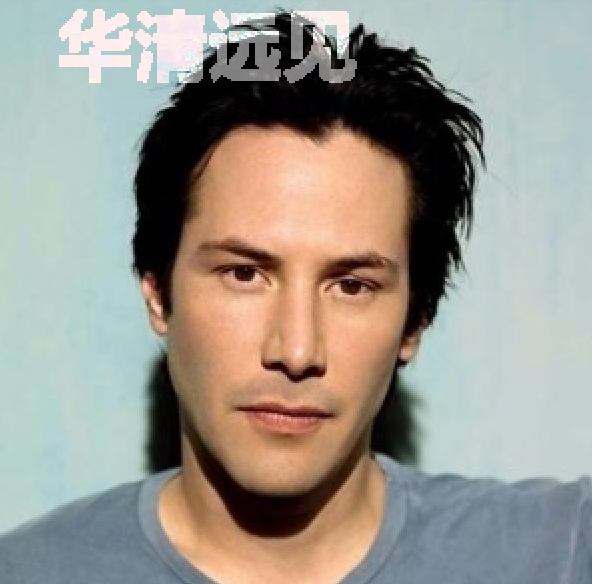

# 图像梯度

> 北京华清远见科技发展有限公司

[TOC]

## 图像添加水印

在日常的生活中，一般为了图像的版权意识，会为图像加上对应的水印信息

图像加入水印的一般步骤：

1. 将水印图像灰度化，并二值化，得到对应的掩码图

2. 针对图像掩码位置信息，加入水印图像信息

### 纯色水印

完成纯色水印，我们需要学习cv2中关于图像融合的API

+ `cv2.bitwise_and`
+ `cv2.bitwise_or`
+ `cv2.add`
+ `cv2.addweighted`

为了更加方便认识`bitwise_and`以及`bitwise_or`我们接下来用以下实例：

利用该特点完成`纯色水印`

### 半透明水印

对于半透明水印，该如何设置呢？

## 图像噪点消除

在现实生活中我们有如下的一些图像噪声问题：

### 椒盐噪声

椒盐噪声是由图像本身存在的瑕疵造成的，常见与摄影作品中

### 高斯噪声

高斯噪声是因为图像在波段频率中的异常导致的问题，常见于视频中

除了上述噪声外，还有泊松噪声、斑点噪声等等

如何处理上述噪声，需要有对应的滤波器对其进行处理

### 均值滤波

+ 像素值在区域内取平均值

### 方框滤波

+ 正则模式开启时与均值滤波一致，未开启时图像为高亮模式

### 中值滤波

中值滤波器的原理如图：

**中值滤波的特性：**

- 对于图像中的每个像素，选取其周围一定区域内的所有像素值，并对其进行排序。
- 将排序后的像素值的中位数赋予该像素。

**中值滤波的优点:**

- 能够有效去除椒盐噪声和脉冲噪声，对图像中的孤立噪声点具有较强的抑制能力。
- 能够较好地保留图像的边缘和细节信息，不会造成图像模糊。

**中值滤波的缺点:**

- 对高斯噪声的去除效果不佳。
- 计算量相对较大，特别是对于大尺寸图像而言。

### 高斯滤波

高斯滤波是一种**线性**平滑滤波器，它利用高斯函数对图像进行加权平均，可以有效地去除高斯噪声，同时平滑图像。

**高斯滤波的优点:**

- 高斯滤波具有良好的平滑效果，能够有效地抑制图像中的噪声。
- 高斯滤波是一种线性滤波器，具有可分离性，可以提高计算效率。
- 高斯滤波在频域上具有低通滤波器的特性，能够去除图像中的高频噪声。

**高斯滤波的缺点:**

- 高斯滤波会造成图像细节丢失，降低图像锐度。
- 高斯滤波对椒盐噪声等非平滑噪声的去除效果不佳。

高斯函数的一维实现方式：

$$
G(x) = \frac{1}{ \sqrt{2\pi}\delta}e^{-\frac{(x-\mu)^2}{2\delta^2}}
$$

二维的高斯函数：
$$
G(x,y) = \frac{1}{2\pi\delta^2}e^{-\frac{x^2+y^2}{2\delta^2}}
$$

如何高斯核的大小为3x3，sigma为0.8

则高斯核的大小

| 0.057118 | 0.12476 | 0.057118 |
| -------- | ------- | -------- |
| 0.12476  | 0.2725  | 0.12476  |
| 0.057118 | 0.12476 | 0.057118 |

高斯滤波模板中最重要的参数就是高斯分布的标准差σ。它代表着数据的离散程度，如果σ较小，那么生成的模板中心系数越大，而周围的系数越小，这样对图像的平滑效果就不是很明显；相反，σ较大时，则生成的模板的各个系数相差就不是很大，比较类似于均值模板，对图像的平滑效果就比较明显。

### 双边滤波

均值滤波、高斯滤波与中值滤波。这三种滤波都能够在一定程度上消除噪声，但是其作用范围有限，只能针对特定种类的噪声。

## 图像梯度处理

## 图像边缘检测

### Canny 边缘算法原理

Canny算子是John Canny在1986年发表的论文中首次提出的边缘检测算子，该算子检测性能比较好，应用广泛。Canny 算法被推崇为当今最优的边缘检测的算法。

Canny检测的步骤如下:

1. 高斯滤波
2. 计算梯度
3. 非极大值抑制
4. 双阈值处理