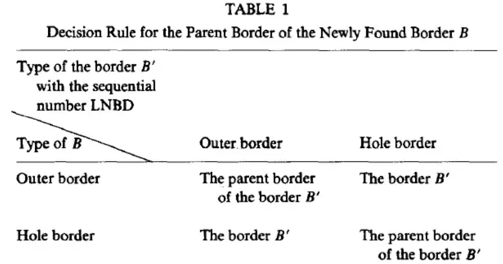

# Opencv findCountiours函数原理

> 本文出自 archerswet@163.com

[TOC]

## 基本概念和符号说明

**frame（框架）**：一张图片的最上行，最下行，最左列，最右列组成了这张图片的**frame（框架）。**例如一张图片宽为640，高为480，则这张图片的frame为第0行像素，第479行像素，第0列像素，第639列像素组成了这张图片的frame。

灰度值为0和1的像素分别称为**0-pixel（0像素）**和**1-pixel（1像素）**。论文假设**frame是由0像素填充**的。

(𝑖,𝑗) 表示图片中第i行，第j列的像素点。

𝑓𝑖𝑗 表示像素点(𝑖,𝑗)的灰度值。则一张图片可以表示为 𝐹={𝑓𝑖𝑗} 。

由1像素组成的连通域称为**1-component（1连通域）**，由0像素组成的连通域称为**0-component（0连通域）。**如果**0连通域S**包含了**frame，那么S称为background（背景），**否则称为**孔洞。**

**4（8）连通场景：**1像素是4（8）连通，0像素是8（4）连通。

4连通：两个像素p和q，如果q在p的4邻域中，称这两个像素是4连通

8连通：两个像素p和q，如果q在p的8邻域中，称这两个像素是8连通

**border point(边界点)：**在4（8）连通场景中，如果一个1像素(𝑖,𝑗)在它的8（4）连通域中有0像素(𝑝,𝑞)存在，那么这个1像素(𝑖,𝑗)就是一个**border point。边界由许多个边界点构成。**

**surroundness among connected components（环绕连通域）：**在一幅二值图像中有两个连通域S1和S2，如果S1中任何一个像素点从任何一个方向（4个方向）到达frame的路径上都存在S2的像素点，我们称S2**环绕**S1。如果S2环绕S1且S2和S1之间存在**border point，**那么我们称S2**直接环绕**S1。

**outer border and hole border（外边界和孔边界）：**假设现有1连通域S1,0连通域S2。如果S2**直接环绕**S1，则S2和S1之间的**边界**称为**外边界；**如果S1**直接环绕**S2，则S2和S1之间的边缘称为**孔边界。注意不管是外边界还是孔边界都是由1像素组成。**

**parent border（父边界）：**假设现有1连通域S1和S3,0连通域S2，S2直接环绕S1，S3直接环绕S2，S1与S2之间的边界为B1，S2与S3之间的边界为B2，则B2为B1的父边界。如果S2是**background**，那么B1的父边界是**frame。**

**surroundness among borders（环绕边界）：给定两个边界** 𝐵0 **和**𝐵𝑛，如果存在一个边界序列𝐵0,𝐵1,...,𝐵𝑛，其中𝐵𝑘是𝐵𝑘−1的父边界，那么我们称𝐵𝑛**环绕**𝐵0。

**光栅扫描(RasterScan)**：是指从左往右，由上往下，先扫描完一行，再移至下一行起始位置继续扫描。

**边界开始点（starting point）**：边界开始点分为**外边界开始点**（Fig.2a）和**孔边界开始点**（Fig.2b）。如果点(𝑖,𝑗)既满足(a)又满足(b)，则把(𝑖,𝑗)视为**外边界开始点**。

**NBD：**从边界开始点(𝑖,𝑗)以边界跟踪算法可以得到一条边界，为每条新找到的边界**B**赋予一个新的唯一的编号，**NBD**表示当前跟踪的边界的编号**。**

**LNBD：**在光栅扫描的过程中，我们也保存最近遇到（上一个）的边界**B'**的编号，记为**LNBD。**

## 轮廓提取算法

假设输入图像为 𝐹={𝑓𝑖𝑗} ，将初始NBD设为1（把F的**frame**看成第一个边界）。使用光栅扫描法扫描图像F，当扫描到某个像素点(𝑖,𝑗)的灰度值 𝑓𝑖𝑗≠0 时执行下面的步骤。每次当我们扫描到图片的新行的起始位置时，将**LNBD**重置为1。

（1）从下列情况选一种：

（a）如果𝑓𝑖𝑗=1并且 𝑓𝑖,𝑗−1=0 ，即Fig.2a所描述情况，则(𝑖,𝑗)是**外边界开始点，NBD+=1，**(𝑖2,𝑗2)←(𝑖,𝑗−1)。

（b）如果𝑓𝑖𝑗≥1并且 𝑓𝑖,𝑗+1=0 ，即Fig.2b所描述情况，则(𝑖,𝑗)是**孔边界开始点，NBD+=1，**(𝑖2,𝑗2)←(𝑖,𝑗+1)。如果𝑓𝑖𝑗>1，则 𝐿𝑁𝐵𝐷←𝑓𝑖𝑗 。

（c）其他情况，到第（4）步

（2）根据上一个边界**B'**和当前新遇到边界**B**的类型，我们可以从表1得到当前边界**B**的父边界。

（3）从**边界开始点** (𝑖,𝑗) 开始按(3.1)到(3.5)进行边界跟踪。

（3.1）以(𝑖,𝑗)为中心， (𝑖2,𝑗2) 为起始点，按顺时针方向查找(𝑖,𝑗)的4（8）邻域是否存在非0像素点。若找到非0像素点，则令(𝑖1,𝑗1)是顺时针方向的第一个非0像素点；否则令 𝑓𝑖𝑗=−𝑁𝐵𝐷 ，转到（4）。

（3.2）(𝑖2,𝑗2)←(𝑖1,𝑗1)， (𝑖3,𝑗3)←(𝑖,𝑗)

（3.3）以 (𝑖3,𝑗3) 为中心，按逆时针方向，(𝑖2,𝑗2)的下一个点为起始点查找(𝑖3,𝑗3)的4（8）邻域是否存在非0像素点，令(𝑖4,𝑗4)是逆时针方向的第一个非0像素点。

（3.4）

（a）如果(𝑖3,𝑗3+1)是(3.3)中**已经检查过的像素点**且是**0像素点**，则 𝑓𝑖3,𝑗3←−𝑁𝐵𝐷 。

（b）如果(𝑖3,𝑗3+1)不是(3.3)中**已经检查过的0像素点，并且** 𝑓𝑖3,𝑗3=1 ，则 𝑓𝑖3,𝑗3←𝑁𝐵𝐷 。

（c）其他情况，不改变 𝑓𝑖3,𝑗3 。

（3.5）如果(𝑖4,𝑗4)=(𝑖,𝑗)且 (𝑖3,𝑗3)=(𝑖1,𝑗1) （回到了边界开始点），则转到(4)；否则令(𝑖2,𝑗2)←(𝑖3,𝑗3)，(𝑖3,𝑗3)←(𝑖4,𝑗4)，转到(3.3)

（4）如果𝑓𝑖𝑗≠1，则 𝐿𝑁𝐵𝐷←|𝑓𝑖𝑗| ,从点 (𝑖,𝑗+1) 继续光栅扫描。当扫描到图片的右下角顶点时结束。