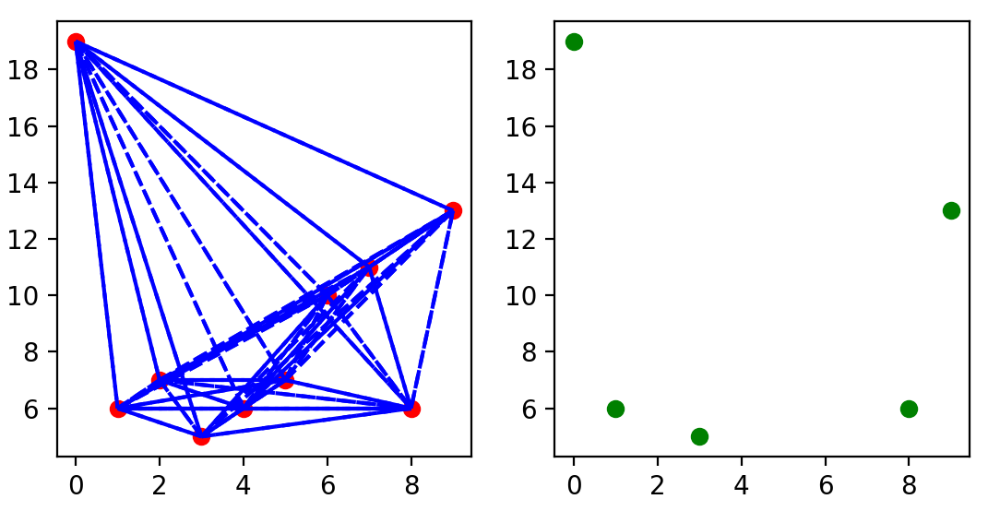
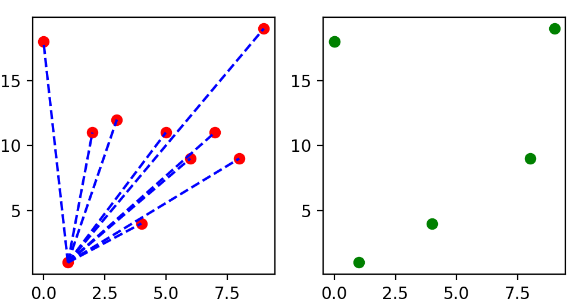
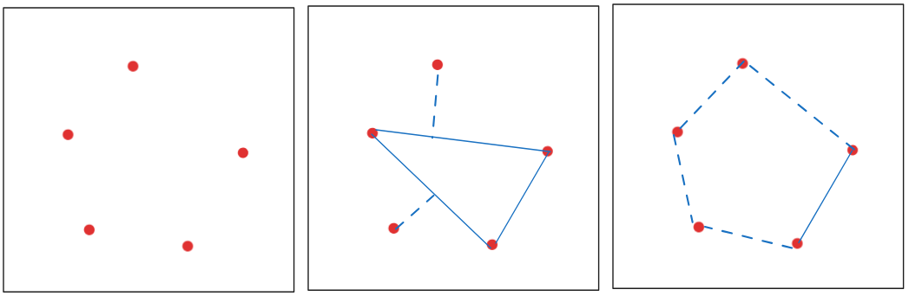

# 凸包检测原理

[TOC]

## 穷举法下的凸包检测

凸包检测的穷举法（也被称为蛮力法）是一种直观但效率较低的算法，它基于凸包的基本性质来寻找构成凸包的所有点。

### 穷举法的原理

+ 将图像中的点两两构成连线
+ 判断是否存在有一连线，可以使其他所有点均存在一侧

此为实验结果：

穷举法可以得到最终的结果，但损耗了太多的计算资源，不推荐使用。

## Graham扫描

Graham扫描，需要先找到凸包上的一个点，然后从那个点开始逆时针方向逐个找凸包上的点。

### Graham扫描原理

1. 找到整个外轮廓点中的y值最小点
2. 将除最小点以外的其他点与最小点建立连线，并求出与x轴正方向的夹角
3. 通过夹角大小排序
4. 第一条连线与最后一条连线是凸包外轮廓
5. 逆时针顺序依次判断下一个点是否在线的内侧，在则入栈，不在则让上一个点出栈
6. 当判断到最后一个点时，停止判断。

## QuickHull扫描

### Quick扫描原理

1. 构建三个点的闭合图形（三点的彼此连线）
2. 判断其余点是否位于一侧连线的外部，是，则将该连线的两点与对应点形成连线，否则就不更新（一次更新一个点，下一个点需要在上一个点更新之后进行）
3. 直到外侧再无点。
