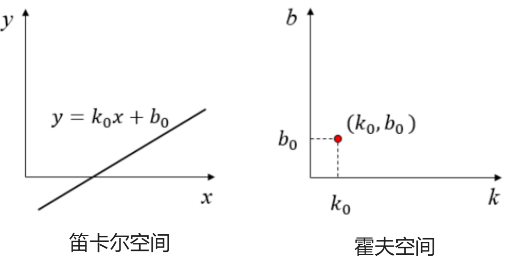
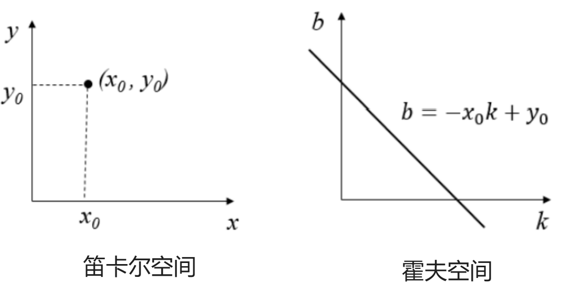
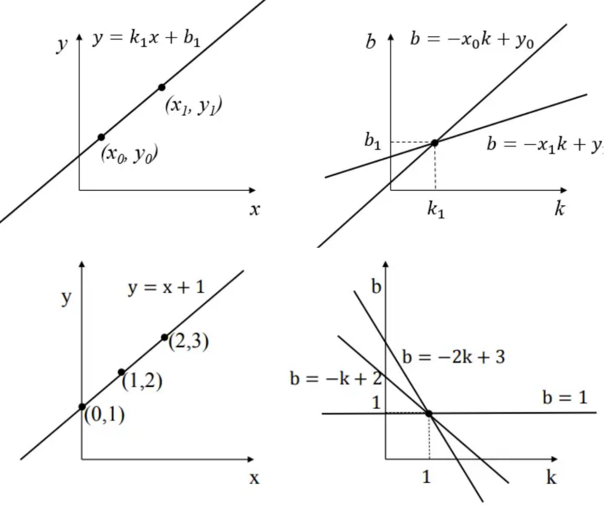
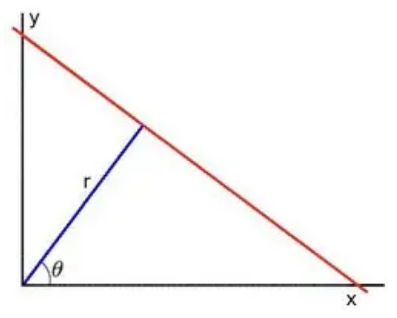

# 图像特征处理

[TOC]

## 直方图均衡化

直方图均衡化（Histogram Edualizaition）是一种图像处理技术，通过重新分配图像灰度级别来增强图像的对比度和视觉效果。它基于整个图像的灰度直方图来调整像素的灰度值分布。通过增加较暗区域的亮度和减少较亮区域的亮度，直方图均衡化可以使图像的灰度级别分布更均匀，从而增强图像的细节和对比度。

### 获取普通的直方图步骤

+ 得到灰度图
+ 直方图统计
+ 绘制直方图
+ 直方图均衡化

### 自适应直方图均衡化（AHE）

自适应直方图均衡化（Adaptive Histogram Equalization）是直方图均衡化的一种变体，它考虑到图像中不同区域的局部差异。与直方图均衡化不同，自适应直方图均衡化将图像分成多个小块，并在每个小块内独立地应用直方图均衡化。通过这种方式，自适应直方图均衡化可以更好地保留图像的细节，并避免过度增强噪声。自适应直方图均衡化可以根据图像的局部特征自动调整每个小块的灰度级别，以实现更精细的图像增强。

### 限制对比度自适应直方图均衡化（CRHE）

CRHE是在AHE的基础上增加了对比度限制。它通过在AHE之后对像素值进行限制，以避免过度增加对比度而导致噪声的出现。该算法的核心思想是先使用AHE增强图像的对比度，然后使用限制对比度的方法对像素值进行截断，从而控制对比度的增加。

## 模板匹配

模板匹配的主要目标是在一副很大的图像中定位一个或者多个与模板图像相匹配的区域。

整个过程就像是一个`放大镜`在图像上移动，不断比较模板图像与大图像中相应位置的相似度。

通过经计算模板图像和大图像中各个位置的像素差异，可以找到与模板图像最为相似的区域。

### 比较方法

1. **平方差(Squared Difference)**: 这种方法计算模板图像和大图像中相应区域的像素值差的平方和。平方差越小，表示匹配度越高。
2. **相关性(Correlation)**: 这种方法通过计算模板图像和大图像中相应区域的像素值的乘积和来评估相似度。当乘积和最大时，表示两个图像在该位置的匹配度最高。
3. **差异(Difference)**: 与相关性相反，差异方法通过计算模板图像和大图像中相应区域的像素值差的绝对值或平方值来评估相似度。在这种方法中，差异值最小的地方表示匹配度最高。
4. **相关系数(Correlation Coefficient)**: 这是一种基于统计学的方法，它通过计算模板图像和大图像之间的相关系数来评估它们的相似度。相关系数的值介于-1和1之间，值越接近1，表示匹配度越高。
5. **归一化交叉相关(Normalized Cross-Correlation)**: 这是一种更为健壮的比较方法，它通过将模板图像和大图像的像素值与各自的平均值进行比较来计算相似度。这种方法对于光照变化和图像对比度的变化具有更好的适应性。

### 利用平方差简单实现模板匹配

## 霍夫变换

**霍夫变换**是一种[特征提取](https://link.zhihu.com/?target=https%3A//zh.wikipedia.org/wiki/%E7%89%B9%E5%BE%B5%E6%8F%90%E5%8F%96)，被广泛应用在[图像分析](https://link.zhihu.com/?target=https%3A//zh.wikipedia.org/wiki/%E5%9B%BE%E5%83%8F%E5%88%86%E6%9E%90)、[电脑视觉](https://link.zhihu.com/?target=https%3A//zh.wikipedia.org/wiki/%E9%9B%BB%E8%85%A6%E8%A6%96%E8%A6%BA)以及[数位影像处理](https://link.zhihu.com/?target=https%3A//zh.wikipedia.org/w/index.php%3Ftitle%3D%E6%95%B8%E4%BD%8D%E5%BD%B1%E5%83%8F%E8%99%95%E7%90%86%26action%3Dedit%26redlink%3D1)[[1\]](https://link.zhihu.com/?target=https%3A//zh.wikipedia.org/wiki/%E9%9C%8D%E5%A4%AB%E5%8F%98%E6%8D%A2%23cite_note-1)。 霍夫变换是用来辨别找出物件中的特征，例如：线条。他的[算法](https://link.zhihu.com/?target=https%3A//zh.wikipedia.org/wiki/%E6%BC%94%E7%AE%97%E6%B3%95)流程大致如下，给定一个物件、要辨别的形状的种类，算法会在[参数空间](https://link.zhihu.com/?target=https%3A//zh.wikipedia.org/w/index.php%3Ftitle%3D%E5%8F%83%E6%95%B8%E7%A9%BA%E9%96%93%26action%3Dedit%26redlink%3D1)中执行投票来决定物体的形状，而这是由累加空间（accumulator space）里的[局部最大值](https://link.zhihu.com/?target=https%3A//zh.wikipedia.org/wiki/%E6%9E%81%E5%80%BC)来决定。--维基百科

### 霍夫变换基本原理

在数学的定义中，笛卡尔坐标系（空间坐标系）与霍夫坐标系的关系

对笛卡尔空间中的一条直线公式：
$$
y = k_0 x + b_0
$$
由于在笛卡尔空间系中已知`k`、`b`值，因此在霍夫空间坐标系中（关于kb的坐标系）为一个点。

反之，在笛卡尔空间坐标系中存在一点,则霍夫空间坐标系中为一条直线

而上述情况可以延申以下规律：

当笛卡尔空间坐标系中，有至少两个点在一条直线上时，则在霍夫空间坐标系中，则有多条关于`kb`的直线相交于一点。

而为了更加方便统计霍夫空间焦点计算，将笛卡尔空间中点，映射到霍夫空间中的直线方程转化为`极坐标系`，由γ 与θ来表示

直线方程可写成：
$$
y = (-\frac{\cos \theta}{\sin \theta})x + (\frac{\gamma}{\sin \theta})
$$
可转化为：
$$
\gamma = x \cos \theta + y \sin \theta
$$

