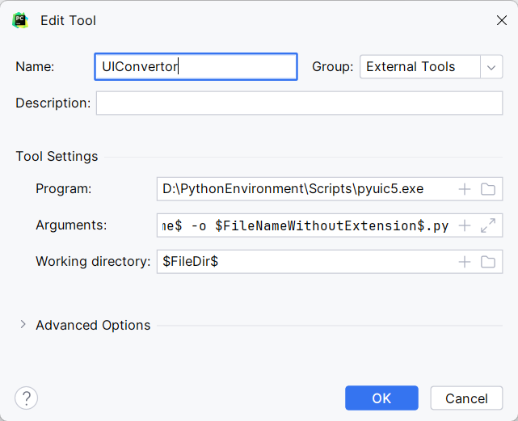

之前所有的程序，都是通过控制台命令进行交互。

程序的用户交互界面，称为`User Interface`，简称UI

复杂的应用程序，需要一个图形化界面`Graph UI`，简称GUI

# 1. PyQt5

Qt全称` Qt Toolkit`，是一个使用c++开发的跨平台GUI开发框架。

PyQt是通过Python语言，提供了对Qt的所有功能的访问，使得Python开发者利用Qt进行图形界面设计。

**所以PyQt是Python中用于创建图形化界面的库。**

 **安装PyQt5**

```bash
pip install pyqt5
```

# 2. 第一个桌面窗口

```python
from PyQt5.QtWidgets import QApplication, QMainWindow, QLabel
import sys

# 创建应用程序
app = QApplication(sys.argv)
# 在运行时，可以传递一些参数
# 如通过控制台命令python xxx.py 参数1 参数2... 运行时即可看到传递的参数
# print(sys.argv)
# 创建主窗口
window = QMainWindow()
# 设置窗口标题
window.setWindowTitle("主窗口")
# 调整窗口尺寸
window.resize(400, 400)
# 创建用于显示文字的标签
# label=QLabel(window)
# label.setText("hello pyqt!")
# 如果创建label时同时设置文本
QLabel("hello pyqt!", window)

# 显示主窗口
window.show()
# 应用程序启动
app.exec()

```

# 3. 核心机制

信号signal和槽slot，是PyQt的核心机制

类似于JavaScript中的触发事件和对应触发的函数。触发事件就是信号，触发后执行的内容就是槽函数。

如何使用

```python
发送者.信号.connect(接收者.槽函数)
```

* 信号
  * 可以理解为某个组件的触发时刻
  * 通常是组件内置的信号
* 槽函数
  * 组件信号触发时执行的函数
  * 通常为组件内置槽函数，或者自定义的槽函数

```python
# 创建一个窗口，添加一个按钮
from PyQt5.QtWidgets import QApplication, QMainWindow, QPushButton
import sys

app = QApplication(sys.argv)
window = QMainWindow()
window.resize(400, 400)
# 创建按钮，添加到窗口中
button = QPushButton(window)
button.setText("按钮")
# # 调整尺寸resize(w,h)
# button.resize(100, 50)
# # 调整位置move(posx,posy)
# button.move(20, 200)

# 同时调整尺寸和位置setGeometry(posx,posy,w,h)
button.setGeometry(20, 150, 100, 50)

# 点击按钮时执行
button.clicked.connect(lambda: print("按钮被点击"))

window.show()
app.exec()
```

上段代码中的

```python
button.clicked.connect(lambda: print("按钮被点击"))
```

* button是一个组件：按钮。
* clicked是一个信号：被点击。
* connect是固定函数，将信号和槽函数连接起来。
  * 这里没有定义函数，使用了lambda表达式定义了一个匿名函数。
  * 如果要调用函数，只需要写函数名。如`button.clicked.connect(self.fun)`
* 每当button被clicked，就会执行槽函数


# 4. 使用面向对象方式编写

## 简易日历

```python
from PyQt5.QtWidgets import QApplication, QMainWindow, QCalendarWidget, QPushButton, QLabel
from PyQt5.QtCore import QTimer, QDateTime, QDate
import sys


# 创建一个类，继承QMainWindow
class MyWindow(QMainWindow):
    # 构造函数
    def __init__(self):
        super().__init__()
        # 通常在构造函数中进行界面初始化
        self.ui_init()
        # 调用业务代码
        self.connect_slot()

    # 如果界面中的组件比较多，最好创建一个函数定义
    def ui_init(self):
        # 此时的self就是当前窗口
        self.setWindowTitle('简易日历')
        self.resize(400, 400)
        # 添加一个计时器到窗口中
        self.timer = QTimer(self)
        # 设置计时器的时间间隔,这里1000表示毫秒
        # 表示每隔1秒触发一次计时器
        self.timer.start(1000)
        # 添加状态栏。任何窗口都有状态栏组件，所以无需额外创建添加
        self.status_bar = self.statusBar()
        # 创建日历组件
        self.calendar = QCalendarWidget(self)
        # 调整尺寸
        self.calendar.resize(self.width(), 300)
        # 添加按钮
        self.today_btn = QPushButton('回到今天', self)
        self.today_btn.move(self.width() - self.today_btn.width(),
                            self.height() - self.today_btn.height() - self.status_bar.height())
        # 添加显示日期标签
        self.date_lab = QLabel(self)
        self.date_lab.setGeometry(10,self.calendar.height()+30,self.width(),40)
        self.date_lab.lower()

    # 选择日历中的日期后，计算距今相隔的天数
    def choose_date_slot(self):
        # 获取选中的日期
        selected_date = self.calendar.selectedDate()
        days = QDate.currentDate().daysTo(selected_date)
        str = f"{selected_date.toString('yyyy/MM/dd')}距今相隔{abs(days)}天"
        self.date_lab.setText(str)

    # "回到今天"按钮的槽函数
    def today_btn_slot(self):
        self.calendar.setSelectedDate(QDate.currentDate())

    # 如果某个信号触发时执行的内容比较多，最好创建一个函数
    def timer_slot(self):
        # 获取当前时间，打印在窗口中
        now = QDateTime.currentDateTime()
        fmt_time = now.toString("当前时间：yyyy/MM/dd HH:mm:ss")
        self.status_bar.showMessage(fmt_time)

    # 通常定义一个函数，表示某个组件触发某个信号后执行指定的槽函数
    def connect_slot(self):
        # 信号触发时调用指定的槽函数，注意只需写函数名
        self.timer.timeout.connect(self.timer_slot)
        self.today_btn.clicked.connect(self.today_btn_slot)
        # 当日期改变时
        self.calendar.selectionChanged.connect(self.choose_date_slot)

if __name__ == '__main__':
    # 创建应用程序
    app = QApplication(sys.argv)
    # 创建自定义窗口
    window = MyWindow()
    window.show()
    app.exec()
```

## **注册界面**

```python
from PyQt5.QtWidgets import QApplication, QMainWindow, QPushButton, QLabel, QLineEdit, QMessageBox
from PyQt5.QtCore import QRegExp
from PyQt5.QtGui import QRegExpValidator
import sys


class MyWindow(QMainWindow):
    def __init__(self):
        super().__init__()
        self.ui_init()
        self.connect_signals()

    # 信号连接槽函数
    def connect_signals(self):
        self.reg_btn.clicked.connect(self.reg_btn_slot)
        self.clear_btn.clicked.connect(self.clear_btn_slot)

    # 界面
    def ui_init(self):
        self.setWindowTitle('用户注册')
        self.resize(400, 300)
        # 标签
        self.phone_lab = QLabel("手机号", self)
        self.phone_lab.move(50, 50)
        self.pwd_lab = QLabel("密码", self)
        self.pwd_lab.move(50, 100)
        # 单行文本框
        self.phone_edit = QLineEdit(self)
        self.phone_edit.setGeometry(150, 50, 200, 30)
        self.phone_edit.setPlaceholderText("请输入正确的手机号")
        # 定义正则表达式
        phone_regexp = QRegExp("1[^012]\d{9}")
        # 创建正则表达式验证器
        validator = QRegExpValidator(phone_regexp)
        # 给输入框添加验证器，进行实时验证
        self.phone_edit.setValidator(validator)
        self.pwd_edit = QLineEdit(self)
        self.pwd_edit.setGeometry(150, 100, 200, 30)
        self.pwd_edit.setPlaceholderText("请输入6位数字密码")
        # 密码框密文显示
        self.pwd_edit.setEchoMode(QLineEdit.Password)
        # 按钮
        self.reg_btn = QPushButton("注册", self)
        self.reg_btn.move(50, 200)
        self.clear_btn = QPushButton("清空", self)
        self.clear_btn.move(250, 200)

    # 注册按钮槽函数
    def reg_btn_slot(self):
        # 获取单行文本框信息
        phone = self.phone_edit.text()
        pwd = self.pwd_edit.text()
        # 输入格式验证
        # 1 3~9 9个数字 1[^012]\d{9}
        # qq号码 [^0]\d{4,9}
        phone_regexp = QRegExp("1[^012]\d{9}")
        pwd_regexp = QRegExp("\d{6}")
        if phone_regexp.exactMatch(phone):
            if pwd_regexp.exactMatch(pwd):
                QMessageBox.warning(self, "提示", "注册成功")
                # 保存信息到文件中
                with open("userinfo.txt", "a", encoding="utf-8") as file:
                    info = f"手机:{phone}\t密码:{pwd}\n"
                    file.write(info)
            else:
                QMessageBox.warning(self, "提示", "密码格式有误")
        else:
            QMessageBox.warning(self, "提示", "手机号格式有误")

    # 清空按钮槽函数
    def clear_btn_slot(self):
        self.phone_edit.clear()
        self.pwd_edit.clear()


if __name__ == '__main__':
    app = QApplication(sys.argv)
    window = MyWindow()
    window.show()
    app.exec()
```

# 5.QtDesigner

如果全部用代码编写组件相对繁琐，可以使用QT界面生成器`Qt Desinger`，通过拖拽的方式创建大体界面。

## 5.1 安装PyQt5-tools

```python
pip install pyqt5-tools
```

## 5.2 在PyCharm中添加工具

由于安装的工具路径复杂，可以将其添加到PyCharm中方便使用

**1.进入设置**：`File -> Settings`

**2.进入工具**：`Tools -> External Tools`

**3.添加工具**：点击加号`+`

**4.填写工具信息**：

* **Name**：工具的名称
* Group：将工具分组
* Description：工具描述
* **Program**：工具路径
* **Arguments**：工具运行时的参数，这里设置为文件路径
* **Working Directory**：工作目录，这里设置为项目根目录

### 5.2.1添加QtDesigner

```bash
Program:			qtdesigner.exe文件路径
Arguments:			$FilePath$
Working directory:	$ProjectFileDir$
```


创建成功后，通过PyCharm菜单栏中`Tools -> External Tools -> 选择工具`打开


通过拖拽的方式设计界面


设计完成后保存，会生成一个xxx.ui文件。该文件通过标签的形式定义界面。之后可以在这个文件上右键打开继续进入设计界面。


此时的.ui文件，无法在python程序中直接使用，需要将其转换为.py文件。

### 5.2.2添加PyUIC

用于将QtDesigner设计出的.ui文件转换为.py文件。

```bash
Program:			python解释器根目录/Scripts/pyuic.exe
Arguments:			$FileName$ -o $FileNameWithoutExtension$.py
Working directory:	$FileDir$
```



在.ui文件上右键`External Tools`选择该工具，会自动生成同名.py文件。

这个文件是一个窗口模块文件，需要在其他类中导入使用。

## 5.3 使用通过QtDesigner设计的UI文件转换后的py文件

```python
from PyQt5.QtWidgets import QMainWindow, QApplication
from MyForm import Ui_MainWindow
import sys


# 1.导入通过QtDesinger设计的ui文件转换后的py文件
# 2.创建类，继承QMainWindow和自定义的窗体类
# 3.在构造函数中调用自定义窗体类中的初始化界面函数setupUi()

class MyWindow(QMainWindow, Ui_MainWindow):
    def __init__(self):
        super().__init__()
        # 调用自定义模块中的初始化界面函数
        self.setupUi(self)

if __name__ == '__main__':
    app = QApplication(sys.argv)
    window = MyWindow()
    window.show()
    app.exec()
```

# 6.QSS

QSS称为QT样式表，和CSS用法一致。

[CSS 教程 | 菜鸟教程 (runoob.com)](https://www.runoob.com/css/css-tutorial.html)

常用样式

| 作用     | 样式名           | 值                       | 举例                                            |
| -------- | ---------------- | ------------------------ | ----------------------------------------------- |
| 文本颜色 | color            | 颜色单词/RGB/十六进制RGB | color:{red}/color:{rgb(0,22,0)}/color:{#FF0000} |
| 边框     | border           | 尺寸 颜色 线型           | border:1px solid red；border:none表示去掉边框   |
| 边框圆角 | border-radius    | 像素                     | border-radius:10px                              |
| 背景色   | background-color | 颜色单词/RGB/十六进制RGB | background-color:red                            |
| 背景图   | background-image | url(图片路径)            | background-image:url(xxx.jpg)                   |
| 字体大小 | font-size        | 像素                     | font-size:18px                                  |
| 字型     | font-family      | 字型名                   | font-family:微软雅黑                            |
| 字体粗细 | font-weight      | 100~700                  | 100最细，700最粗                                |
|          |                  |                          |                                                 |

格式

```python
组件{
    样式名:值;
    样式名:值;
    ....
}
```


使用

```python
组件.setStyleSheet("样式")

self.pushButton.setStyleSheet("color:red;font-size:20px")
```

