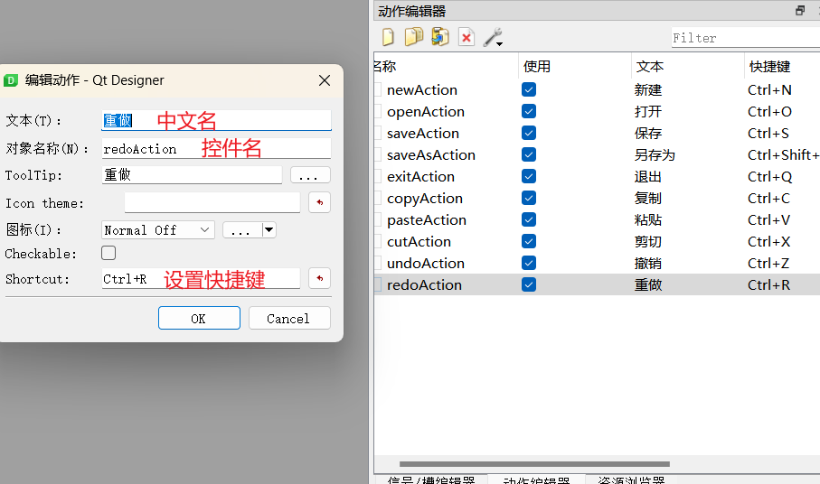

# 作业

模仿QQ界面


实现代码

```python
import sys

from PyQt5.QtCore import QRegExp, Qt
from PyQt5.QtWidgets import QMainWindow, QApplication, QMessageBox, QPushButton
from PyQt5.QtGui import QRegExpValidator, QPixmap, QPalette, QBrush

from QQForm import Ui_MainWindow


class MainWindow(QMainWindow, Ui_MainWindow):
    def __init__(self):
        super(MainWindow, self).__init__()
        self.setupUi(self)
        # 修改输入框样式
        edit_qss = """
            border-radius:10px;
            font-size:20px;
        """
        self.qqEdit.setStyleSheet(edit_qss)
        self.pwdEdit.setStyleSheet(edit_qss)
        logBtn_qss = """
            border-radius:10px;
            background-color:#9ed6ff;
            color:#fff;
            font-size:18px;
        """
        self.logBtn.setStyleSheet(logBtn_qss)
        # 实现图片圆形显示
        self.headWidget.setStyleSheet("border-image:url(head.png);border-radius:50px;")
        # 定义正则表达式
        qq_regexp = QRegExp("[1-9]\d{4,9}")
        # 创建正则表达式验证器
        validator = QRegExpValidator(qq_regexp)
        # 给输入框添加验证器，进行实时验证
        self.qqEdit.setValidator(validator)

        back_img = QPixmap("background.jpg")
        # 创建调色板
        palette = QPalette()
        # 设置调色板背景为指定图片
        palette.setBrush(QPalette.Background, QBrush(back_img.scaled(self.size())))
        # 设置窗口的调色板
        self.setPalette(palette)
        # 去除默认标题栏
        self.setWindowFlags(Qt.CustomizeWindowHint)
        # 固定大小
        self.setFixedSize(self.size())
        # 退出按钮
        self.exitBtn = QPushButton("x", self)
        self.exitBtn.setGeometry(self.width() - 30, 10, 20, 20)
        self.exitBtn.setStyleSheet("border:none")
        self.exitBtn.clicked.connect(lambda: app.exit())

    def logBtn_slot(self):
        qq = self.qqEdit.text()
        pwd = self.pwdEdit.text()
        if qq == "123456" and pwd == "123qwe":
            pass
            QMessageBox.information(self, "提示", "登录成功")
        else:
            QMessageBox.warning(self, "提示", "密码错误")

    def connect_signals(self):
        self.logBtn.clicked.connect(self.logBtn_slot)


if __name__ == '__main__':
    app = QApplication(sys.argv)
    window = MainWindow()
    window.show()
    app.exec()

```

## 新知识点

### 1. QtDesigner中常用属性


### 2. 定义组件样式

```python
# 修改输入框样式
edit_qss = """
            border-radius:10px;
            font-size:20px;
        """
self.qqEdit.setStyleSheet(edit_qss)
self.pwdEdit.setStyleSheet(edit_qss)
```

### 3. 圆角图片

添加widget组件，设置尺寸。这里为100*100，圆角半径设置为50即可变为圆形。

```python
self.headWidget.setStyleSheet("border-image:url(head.png);border-radius:50px;")
```

### 4. 窗口背景图

```python
back_img = QPixmap("background.jpg")
# 创建调色板
palette = QPalette()
# 设置调色板背景为指定图片
palette.setBrush(QPalette.Background, QBrush(back_img.scaled(self.size())))
# 设置窗口的调色板
self.setPalette(palette)
```

### 5. 其他

* 去掉标题栏

  ```python
  self.setWindowFlags(Qt.CustomizeWindowHint)
  ```

* 固定窗口尺寸

  ```python
  self.setFixedSize(self.size())
  ```

  

# 文件读取

```python
import sys

from PyQt5.QtGui import QPixmap
from PyQt5.QtWidgets import QApplication, QMainWindow, QFileDialog, QMessageBox
from MyForm import Ui_MainWindow
from torchvision.transforms import Resize, Compose, ToTensor
from PIL import Image
from FruitNN import MyNet
import torch


class MyWindow(QMainWindow, Ui_MainWindow):
    def __init__(self):
        super(MyWindow, self).__init__()
        self.setupUi(self)
        self.connect_signal()

    def chooseImgBtn_slot(self):
        # 打开文件对话框
        file_dialog = QFileDialog()
        # 限制打开的文件类型
        # 返回值为一个元组，包含了文件完整路径和限定格式
        res = file_dialog.getOpenFileName(filter="*.jpg *.png *.jpeg")
        # 这里只取路径部分
        file_path = res[0]
        if len(res) > 0:
            # 使用图片组件
            img = QPixmap(file_path)
            # 显示图片
            self.imgLab.setPixmap(img.scaled(self.imgLab.size()))
            # 使用Image打开图片
            image = Image.open(file_path)
            self.predict_slot(image)
        else:
            QMessageBox.warning(self, "提示", "请选择图片")

    def predict_slot(self, image):
        # 由于模型需要3通道图片，这里将图片转换为RGB模式
        image = image.convert("RGB")
        # 定义转换器，将图片转换为[1,3,100,100]形状的张量用于模型验证识别
        transformer = Compose(
            [
                Resize((100, 100)),
                ToTensor()
            ]
        )
        # 添加批次维度
        img_tensor = transformer(image).unsqueeze(0)
        # 创建模型对象
        model = MyNet()
        # 加载模型参数
        model.load_state_dict(torch.load("model_param.pt"))
        # 调用模型预测
        outputs = model.forward(img_tensor)
        y = torch.argmax(outputs)
        fruit_map = {
            0: "香蕉",
            1: "桑葚",
            2: "火龙果"
        }
        res = fruit_map[int(y)]
        # 拼接预测的结果
        self.resLab.setText(self.resLab.text() + res)

    def connect_signal(self):
        self.chooseImgBtn.clicked.connect(self.chooseImgBtn_slot)


if __name__ == '__main__':
    app = QApplication(sys.argv)
    window = MyWindow()
    window.show()
    app.exec()

```


# 综合练习：记事本

## 1.界面设计

### 1.1 菜单栏

点击菜单栏区域，输入一级菜单名。

点击一级菜单名，可以继续输入二级菜单名。这里二级菜单名无法直接设置中文。


每添加一个选项时，都会在动作这里创建一个控件，称为action动作控件。

双击某个动作控件，可以修改中文名，控件名和快捷键。



### 1.2 工具栏

先在窗口中添加工具栏


将设计菜单栏时创建的动作拖入工具栏即可

## 2. 添加资源

### 2.1 新建.qrc文件


### 2.2 配置资源


### 2.3 使用资源


### 2.4 添加qrc转换py工具

创建外部工具，程序目录为`Python解释器根目录/Scripts/pyrcc5.exe`

```bash
Program:			python解释器根目录/Scripts/pyrcc5.exe
Arguments:			$FileName$ -o $FileNameWithoutExtension$.py
Working directory:	$FileDir$
```


### 2.5 将.qrc文件转换为.py文件

将QtDesinger设计的.ui文件和.qrc文件都转换为.py文件后即可使用

```python
import sys

from MyForm import Ui_MainWindow
from PyQt5.QtWidgets import QMainWindow, QApplication


class MyWindow(QMainWindow, Ui_MainWindow):
    def __init__(self):
        super(MyWindow, self).__init__()
        self.setupUi(self)
        # 设置文本输入框填满整个窗口
        self.setCentralWidget(self.textEdit)


if __name__ == '__main__':
    app = QApplication(sys.argv)
    window = MyWindow()
    window.show()
    app.exec()
```

## 3. 核心功能

### 3.1 编辑菜单

```python
import sys

from MyForm import Ui_MainWindow
from PyQt5.QtWidgets import QMainWindow, QApplication


class MyWindow(QMainWindow, Ui_MainWindow):
    def __init__(self):
        super(MyWindow, self).__init__()
        self.setupUi(self)
        # 设置文本输入框填满整个窗口
        self.setCentralWidget(self.textEdit)
        #
        self.connect_signals()

    def connect_signals(self):
        # 给剪切按钮设置trigger信号，表示被点击时执行，执行textEdit组件自带的cut函数
        self.cutAction.triggered.connect(self.textEdit.cut)
        self.copyAction.triggered.connect(self.textEdit.copy)
        self.pasteAction.triggered.connect(self.textEdit.paste)
        self.redoAction.triggered.connect(self.textEdit.redo)
        self.undoAction.triggered.connect(self.textEdit.undo)


if __name__ == '__main__':
    app = QApplication(sys.argv)
    window = MyWindow()
    window.show()
    app.exec()
```

### 3.2 文本样式

新建两个动作组件，添加到工具栏中


```python
def colorAction_slot(self):
    # 创建一个颜色选择器
    color = QColorDialog.getColor(QColor(), self)
    self.textEdit.setTextColor(color)

# 自定义字体选择器
def fontAction_slot(self):
    font = QFontDialog.getFont(self)[0]
    self.textEdit.setCurrentFont(font)

def connect_signals(self):
    self.colorAction.triggered.connect(self.colorAction_slot)
    self.fontAction.triggered.connect(self.fontAction_slot)
```

### 3.3 修改文件标题

默认窗口标题就是文件标题，是"无标题-记事本"，

当检测到内容发生变化时(当前内容和打开时的内容不同)，修改文件标题为"*无标题-记事本"

```python
 def __init__(self):
        super(MyWindow, self).__init__()
        self.setupUi(self)
        # 设置文本输入框填满整个窗口
        self.setCentralWidget(self.textEdit)
        # 【定义默认的标题名】
        self.file_name = "无标题-记事本"
        self.setWindowTitle(self.file_name)
        # 【记录当前文本】
        self.current_text = self.textEdit.toPlainText()

        self.connect_signals()

# 修改文件标题
def update_title_slot(self):
    # 检测到当前内容和一开始打开的内容不同时
    if self.current_text != self.textEdit.toPlainText():
        # 修改标题
        self.setWindowTitle("*" + self.file_name)
        else:
            self.setWindowTitle(self.file_name)
 
def connect_signals(self):
    # 检测到文本有变化
    self.textEdit.textChanged.connect(self.update_title_slot)
```

### 3.4 另存为

新文件第一次保存时，都是另存为，需要定义文件名和保存路径

```python
 def __init__(self):
        super(MyWindow, self).__init__()
        self.setupUi(self)
        # 设置文本输入框填满整个窗口
        self.setCentralWidget(self.textEdit)
        # 定义默认的标题名
        self.file_name = "无标题-记事本"
        self.setWindowTitle(self.file_name)
        # 记录当前文本
        self.current_text = self.textEdit.toPlainText()
        # 【记录文件路径】
        self.file_path = ""

        self.connect_signals()

# 另存为
def saveAsAction_slot(self):
    # 打开保存对话框
    self.file_path = QFileDialog.getSaveFileName(self, "另存为", "./", "*.txt")[0]
    # 检测到点击了保存按钮
    if len(self.file_path) > 0:
        # 打开对应文件
        file = QFile(self.file_path)
        # 以写文件的方式打开
        file.open(QFile.WriteOnly)
        if file.isOpen():
            # 获取当前文本框中的内容
            current_text = self.textEdit.toPlainText()
            # 写入到文件中
            file.write(current_text.encode("utf-8"))
            # 修改窗口标题为文件保存的标题
            self.file_name=QFileInfo(self.file_path).fileName()
            self.setWindowTitle(self.file_name)
            file.close()

            
def connect_signals(self):
    # 点击了另存为
    self.saveAsAction.triggered.connect(self.saveAsAction_slot)
```

### 3.5 保存

当第一次保存时调用另存为，之后保存时覆盖当前文件

```python
# 提取保存和另存为中的公共代码:将当前文本保存到文件中
def saveFile(self,file_path):
    file = QFile(file_path)
    file.open(QFile.WriteOnly)
    if file.isOpen():
        # 获取当前文本框中的内容
        self.current_text = self.textEdit.toPlainText()
        # 写入到文件
        file.write(self.current_text.encode("utf-8"))
        # 修改窗口标题
        self.file_name = QFileInfo(self.file_path).fileName()
        self.setWindowTitle(self.file_name)
        # 关闭
        file.close()
# 另存为
def saveAsAction_slot(self):
    # 打开保存对话框
    self.file_path = QFileDialog.getSaveFileName(self, "另存为", "./", "*.txt")[0]
    # 检测到点击了保存按钮
    if len(self.file_path) > 0:
        self.saveFile(self.file_path)
# 保存
def saveAction_slot(self):
    # 第一次保存时，调用另存为
    if self.file_name == "无标题-记事本":
        self.saveAsAction_slot()
        else:  # 之后保存时，覆盖当前文件
            self.saveFile(self.file_path)

def connect_signals(self):
    # 点击了另存为
    self.saveAsAction.triggered.connect(self.saveAsAction_slot)
    # 点击了保存
    self.saveAction.triggered.connect(self.saveAction_slot)
```

### 3.6 打开

```python
# 打开文件
def openAction_slot(self):
    # 弹出读取文件对话框，选择文件，得到文件路径
    self.file_path = QFileDialog.getOpenFileName(self, "打开", "./", "*.txt")[0]
    # 打开文件
    file = QFile(self.file_path)
    file.open(QFile.ReadOnly)
    if file.isOpen():
        # 读取文件内容
        data = file.readAll()
        # 以保存时的编码格式转换
        text = bytearray(data).decode("utf-8")
        # 填充到文本框中
        self.textEdit.setText(text)
        # 修改窗口标题
        self.file_name = QFileInfo(self.file_path).fileName()
        self.setWindowTitle(self.file_name)
        # 更新当前内容
        self.current_text = self.textEdit.toPlainText()
        # 关闭文件
        file.close()
        
        
def connect_signals(self):
    # 打开
    self.openAction.triggered.connect(self.openAction_slot)
```

### 3.7 新建

```python

# 清空内容
def clearEdit(self):
    self.textEdit.clear()
    self.file_name = "无标题-记事本"
    self.current_text = self.textEdit.toPlainText()
    self.setWindowTitle(self.file_name)

# 新建文件
def newAction_slot(self):
    # 新建时判断当前内容是否有改动，
    if self.current_text != self.textEdit.toPlainText():
        # 如果有改动，提示是否要保存
        # 自定义消息框
        msg_box = QMessageBox()
        msg_box.setWindowTitle("请确认")
        msg_box.setText("要保存当前内容吗")
        msg_box.setIcon(QMessageBox.Information)
        yes_btn = msg_box.addButton("是", QMessageBox.YesRole)
        no_btn = msg_box.addButton("否", QMessageBox.NoRole)
        msg_box.exec()
        if msg_box.clickedButton() == yes_btn:
            # 调用保存
            self.saveAction_slot()
            # 清空内容
            self.clearEdit()
         elif msg_box.clickedButton() == no_btn:
            self.clearEdit()
         # res = QMessageBox.question(self, "请确认", "要保存当前内容吗",
                #                            QMessageBox.Yes | QMessageBox.No | QMessageBox.Cancel)
                # if res == QMessageBox.Yes:  # 保存
                #     # 调用保存
                #     self.saveAction_slot()
                #     # 清空内容
                #     self.clearEdit()
                # elif res == QMessageBox.No:  # 不保存
                #     # 清空内容
                #     self.clearEdit()       
     else:
         self.clearEdit()

                    
 def connect_signals(self):
    # 新建
    self.newAction.triggered.connect(self.newAction_slot)
```

## 完整代码

```python
import sys

from PyQt5.QtCore import QFile, QFileInfo
from PyQt5.QtGui import QColor

from MyForm import Ui_MainWindow
from PyQt5.QtWidgets import QMainWindow, QApplication, QColorDialog, QFontDialog, QFileDialog, QMessageBox


class MyWindow(QMainWindow, Ui_MainWindow):
    def __init__(self):
        super(MyWindow, self).__init__()
        self.setupUi(self)
        # 设置文本输入框填满整个窗口
        self.setCentralWidget(self.textEdit)
        # 定义默认的标题名
        self.file_name = "无标题-记事本"
        self.setWindowTitle(self.file_name)
        # 记录当前文本
        self.current_text = self.textEdit.toPlainText()
        # 记录文件路径
        self.file_path = ""

        self.connect_signals()

    # 重写QMainWindow的关闭事件
    def closeEvent(self, a0):
        self.newAction_slot()

    # 自定义颜色选择器
    def colorAction_slot(self):
        # 创建一个颜色选择器
        color = QColorDialog.getColor(QColor(), self)
        self.textEdit.setTextColor(color)

    # 自定义字体选择器
    def fontAction_slot(self):
        font = QFontDialog.getFont(self)[0]
        self.textEdit.setCurrentFont(font)

    # 修改文件标题
    def update_title_slot(self):
        # 检测到当前内容和一开始打开的内容不同时
        if self.current_text != self.textEdit.toPlainText():
            # 修改标题
            self.setWindowTitle("*" + self.file_name)
        else:
            self.setWindowTitle(self.file_name)

    # 另存为
    def saveAsAction_slot(self):
        # 打开保存对话框
        self.file_path = QFileDialog.getSaveFileName(self, "另存为", "./", "*.txt")[0]
        # 检测到点击了保存按钮
        if len(self.file_path) > 0:
            self.saveFile(self.file_path)

    # 保存
    def saveAction_slot(self):
        # 第一次保存时，调用另存为
        if self.file_name == "无标题-记事本":
            self.saveAsAction_slot()
        else:  # 之后保存时，覆盖当前文件
            self.saveFile(self.file_path)

    # 提取保存和另存为中的公共代码
    def saveFile(self, file_path):
        file = QFile(file_path)
        file.open(QFile.WriteOnly)
        if file.isOpen():
            # 获取当前文本框中的内容
            self.current_text = self.textEdit.toPlainText()
            # 写入到文件
            file.write(self.current_text.encode("utf-8"))
            # 修改窗口标题
            self.file_name = QFileInfo(self.file_path).fileName()
            self.setWindowTitle(self.file_name)
            # 关闭
            file.close()

    # 打开文件
    def openAction_slot(self):
        # 弹出读取文件对话框，选择文件，得到文件路径
        self.file_path = QFileDialog.getOpenFileName(self, "打开", "./", "*.txt")[0]
        # 打开文件
        file = QFile(self.file_path)
        file.open(QFile.ReadOnly)
        if file.isOpen():
            # 读取文件内容
            data = file.readAll()
            # 以保存时的编码格式转换
            text = bytearray(data).decode("utf-8")
            # 填充到文本框中
            self.textEdit.setText(text)
            # 修改窗口标题
            self.file_name = QFileInfo(self.file_path).fileName()
            self.setWindowTitle(self.file_name)
            # 更新当前内容
            self.current_text = self.textEdit.toPlainText()
            # 关闭文件
            file.close()

    # 清空内容
    def clearEdit(self):
        self.textEdit.clear()
        self.file_name = "无标题-记事本"
        self.current_text = self.textEdit.toPlainText()
        self.setWindowTitle(self.file_name)

    # 新建文件
    def newAction_slot(self):
        # 新建时判断当前内容是否有改动，
        if self.current_text != self.textEdit.toPlainText():
            # 如果有改动，提示是否要保存
            # 自定义消息框
            msg_box = QMessageBox()
            msg_box.setWindowTitle("请确认")
            msg_box.setText("要保存当前内容吗")
            msg_box.setIcon(QMessageBox.Information)
            yes_btn = msg_box.addButton("是", QMessageBox.YesRole)
            no_btn = msg_box.addButton("否", QMessageBox.NoRole)
            msg_box.exec()
            if msg_box.clickedButton() == yes_btn:
                # 调用保存
                self.saveAction_slot()
                # 清空内容
                self.clearEdit()
            elif msg_box.clickedButton() == no_btn:
                self.clearEdit()
            # res = QMessageBox.question(self, "请确认", "要保存当前内容吗",
            #                            QMessageBox.Yes | QMessageBox.No | QMessageBox.Cancel)
            # if res == QMessageBox.Yes:  # 保存
            #     # 调用保存
            #     self.saveAction_slot()
            #     # 清空内容
            #     self.clearEdit()
            # elif res == QMessageBox.No:  # 不保存
            #     # 清空内容
            #     self.clearEdit()
        else:
            self.clearEdit()

    def connect_signals(self):
        # 给剪切按钮设置trigger信号，表示被点击时执行，执行textEdit组件自带的cut函数
        self.cutAction.triggered.connect(self.textEdit.cut)
        self.copyAction.triggered.connect(self.textEdit.copy)
        self.pasteAction.triggered.connect(self.textEdit.paste)
        self.redoAction.triggered.connect(self.textEdit.redo)
        self.undoAction.triggered.connect(self.textEdit.undo)
        self.colorAction.triggered.connect(self.colorAction_slot)
        self.fontAction.triggered.connect(self.fontAction_slot)
        # 检测到文本有变化
        self.textEdit.textChanged.connect(self.update_title_slot)
        # 点击了另存为
        self.saveAsAction.triggered.connect(self.saveAsAction_slot)
        # 点击了保存
        self.saveAction.triggered.connect(self.saveAction_slot)
        # 打开
        self.openAction.triggered.connect(self.openAction_slot)
        # 新建
        self.newAction.triggered.connect(self.newAction_slot)


if __name__ == '__main__':
    app = QApplication(sys.argv)
    window = MyWindow()
    window.show()
    app.exec()
```

