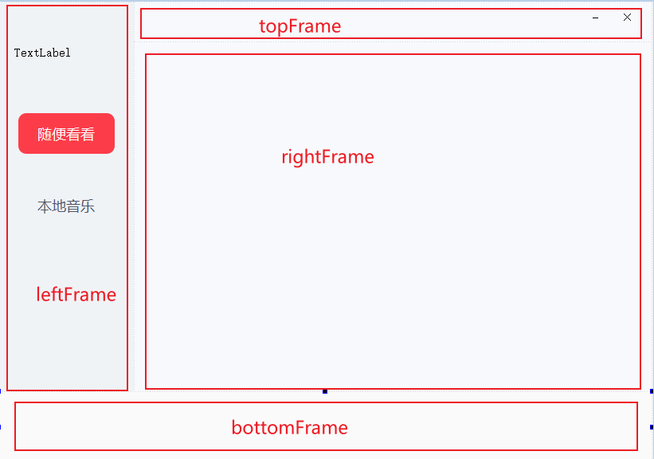
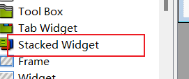
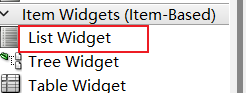

# 音乐播放器

## 1. 界面设计

整体使用Frame划分四个区域



* 左侧区域样式

  ```css
  QFrame{
  	background-color:#f0f3f6;
  }
  QPushButton{
  	border:none;
  	border-radius:10px;
  	font-size:18px;
  	font-family:微软雅黑;
  	color:#4e5669
  }
  QPushButton:hover{
  	background-color:#e4e8ec;
  	border-radius:10px;
  }
  ```

* 左侧按钮被选中样式

  ```css
  background-color:#fc3d49;
  color:#fff;
  ```

* 顶部区域样式

  ```css
  QFrame{
  	background-color:#f7f9fc
  }
  QPushButton{
  	border:none;
  }
  QPushButton:hover{
  	font-weight:700
  }
  ```

## 2. 子界面

使用Stacked Widget控件实现子界面切换，默认有两个界面，可以通过右键添加或删除子界面



播放列表使用ListWidget组件



## 3. 界面初始化

* 去掉标题栏
* 最小化和关闭按钮
* 显示第一页图片

```python
import sys

from PyQt5.QtCore import Qt
from PyQt5.QtGui import QPixmap
from PyQt5.QtWidgets import QApplication, QMainWindow, QMessageBox
from MyForm import Ui_MainWindow


class MyWindow(QMainWindow, Ui_MainWindow):
    def __init__(self):
        super(MyWindow, self).__init__()
        self.setupUi(self)
        # 去掉标题栏
        self.setWindowFlags(Qt.CustomizeWindowHint)
        # 固定大小
        self.setFixedSize(self.size())
        # 加载图片
        self.img_init()
        # 默认加载第一页
        self.stackedWidget.setCurrentIndex(0)
        # 核心业务
        self.connect_signal()

    def minBtn_slot(self):
        self.showMinimized()

    def exitBtn_slot(self):
        res = QMessageBox.warning(self, "提示", "确认要退出吗", QMessageBox.Yes | QMessageBox.No)
        if res == QMessageBox.Yes:
            self.close()

    def img_init(self):
        self.logLab.setPixmap(QPixmap('imgs/logo.png').scaled(self.logLab.size()))
        self.lab1.setPixmap(QPixmap('imgs/rnb.jpg').scaled(self.lab1.size()))
        self.lab2.setPixmap(QPixmap('imgs/hiphop.jpg').scaled(self.lab2.size()))
        self.lab3.setPixmap(QPixmap('imgs/rock.jpg').scaled(self.lab3.size()))
        self.lab4.setPixmap(QPixmap('imgs/pop1.jpg').scaled(self.lab4.size()))

    def connect_signal(self):
        self.minBtn.clicked.connect(self.minBtn_slot)
        self.exitBtn.clicked.connect(self.exitBtn_slot)


if __name__ == '__main__':
    app = QApplication(sys.argv)
    window = MyWindow()
    window.show()
    app.exec()
```

## 4. 切换子界面

```python
# 切换页面
def myMusicBtn_slot(self):
    # 修改样式
    self.myMusicBtn.setStyleSheet("background-color:#fc3d49;color:#fff;")
    self.casualBtn.setStyleSheet("")
    # 修改stackedWidget组件的索引
    self.stackedWidget.setCurrentIndex(1)

def casualBtn_slot(self):
    # 修改样式
    self.casualBtn.setStyleSheet("background-color:#fc3d49;color:#fff;")
    self.myMusicBtn.setStyleSheet("")
    # 修改stackedWidget组件的索引
    self.stackedWidget.setCurrentIndex(0)
```

## 5. 加载歌曲列表

```python
def chooseDirLink_slot(self):
    # 选择目录进行遍历
    dir_path = QFileDialog.getExistingDirectory(self, "选择目录")
    if dir_path:
        index = 0
        # 遍历目录  获取.mp3文件
        for root, dirs, files in os.walk(dir_path):
            # 遍历每个子文件
            for file in files:
                # 只获取.mp3文件
                if file.endswith(".mp3"):
                    # 构建完整路径
                    file_path = os.path.join(root, file)
                    # 以文件的形式打开
                    music_file = QFileInfo(file_path)
                    # 保存到集合中
                    self.musicFileList.append(music_file)
                    # 获取歌曲的信息
                    audio = MP3(file_path, ID3=EasyID3)
                    title = audio.get("title", music_file.baseName())
                    artist = audio.get("artist", "[未知歌手]")
                    album = audio.get("album", '[未知专辑]')
                    length = ceil(audio.info.length)
                    duration = f"{length // 60:02}:{length % 60:02}"
                    index += 1
                    song_info = f"   {index}\t🎵  {title}\n\t{artist}\t{album}\t\t{duration}"
                    # 将信息添加到ListWidget组件中
                    self.listWidget.addItem(song_info)
```

## 6. 双击播放歌曲

播放歌曲需要使用QMediaPlayer组件。

```python
def __init__(self):
    super(MyWindow, self).__init__()
    self.setupUi(self)
    # 歌曲列表
    self.musicFileList = []
    # 定义播放器组件
    self.player = QMediaPlayer(self)
    # 核心业务
    self.connect_signal()
```

```python
def connect_signal(self):
    # ListWidget中的每一项双击
    self.listWidget.itemDoubleClicked.connect(self.chooseMusic_slot)
```

```python
def chooseMusic_slot(self):
    # 获取被选中项的索引
    index = self.listWidget.currentRow()
    # 得到对应的音乐文件
    file = self.musicFileList[index]
    # 播放器加载媒体文件
    self.player.setMedia(QMediaContent(QUrl(file.absoluteFilePath())))
    # 播放
    self.player.play()
```

## 7. 播放暂停按钮

定义一个用于表示当前歌曲是否在播放的变量

```python
def __init__(self):
    super(MyWindow, self).__init__()
    self.setupUi(self)
    # 当前歌曲播放状态
    self.isPlay = False
    # 核心业务
    self.connect_signal()
```

播放音乐时显示底部区域

```python
# 双击选择歌曲
def chooseMusic_slot(self):
    # 获取被选中项的索引
    index = self.listWidget.currentRow()
    # 得到对应的音乐文件
    file = self.musicFileList[index]
    # 通过播放器播放
    self.player.setMedia(QMediaContent(QUrl(file.absoluteFilePath())))
    # 播放
    self.player.play()
    # 读取播放的歌曲信息
    audio = MP3(file.absoluteFilePath(), ID3=EasyID3)
    title = audio.get("title", file.baseName())
    artist = audio.get("artist", "[未知歌手]")
    # 显示歌曲信息
    self.songInfoLab.setText(f"{title}--{artist}")
    # 修改歌曲播放状态
    self.isPlay = True
    # 显示控制器
    self.bottomFrame.show()
```

按钮功能

```python
def playBtn_slot(self):
        if self.isPlay:
            self.player.pause()
            self.isPlay = False
            self.playBtn.setIcon(QIcon(":/res/imgs/icon/bofang.png"))
        else:
            self.player.play()
            self.isPlay = True
            self.playBtn.setIcon(QIcon(":/res/imgs/icon/zanting.png"))    
```

```python
def connect_signal(self):
    # 播放暂停
    self.playBtn.clicked.connect(self.playBtn_slot)
```

## 8. 进度和音量

选择音乐时显示音乐时长

```python
# 双击选择歌曲
    def chooseMusic_slot(self):
        # 获取被选中项的索引
        index = self.listWidget.currentRow()
        # 得到对应的音乐文件
        file = self.musicFileList[index]
        # 通过播放器播放
        self.player.setMedia(QMediaContent(QUrl(file.absoluteFilePath())))
        # 播放
        self.player.play()
        # 读取播放的歌曲信息
        audio = MP3(file.absoluteFilePath(), ID3=EasyID3)
        title = audio.get("title", file.baseName())
        artist = audio.get("artist", "[未知歌手]")
        length = ceil(audio.info.length)
        duration = f"{length // 60:02}:{length % 60:02}"
        # 显示歌曲信息
        self.songInfoLab.setText(f"{title}--{artist}")
        # 显示时长
        self.durationLab.setText(duration)
        # 启动计时器
        self.timer.start(1000)
        # 修改歌曲播放状态
        self.isPlay = True
        # 修改进度条的最大值
        self.playerSlider.setRange(0, length * 1000)
        # 显示控制器
        self.bottomFrame.show()
```

定义计时器动态修改当前进度

```python
 def timer_slot(self):
        # 获取当前播放器的进度,单位为毫秒
        pos = self.player.position()
        # 从00:00开始添加当前进度，将最新进度显示在label上
        pos_str = QTime(0, 0, 0, 0).addMSecs(pos).toString("mm:ss")
        self.timeLab.setText(pos_str)
```

定义调节进度和音量的函数

```python
 	# 设置进度条的值
    def playerSlider_slot(self, pos):
        self.playerSlider.setValue(pos)

    # 设置当前播放器播放进度
    def player_set_position_slot(self, pos):
        self.player.setPosition(pos)

    # 设置音量
    def set_volume_slot(self, value):
        self.player.setVolume(value)
        if value==0:
            self.volumeBtn.setIcon(QIcon(":/res/imgs/icon/jingyin.png"))
        elif value<=50:
            self.volumeBtn.setIcon(QIcon(":/res/imgs/icon/yinliangjian.png"))
        else:
            self.volumeBtn.setIcon(QIcon(":/res/imgs/icon/yinliangjia.png"))
```

```python
    def connect_signal(self):
        # 计时器
        self.timer.timeout.connect(self.timer_slot)
        # 当播放器当前歌曲进度发生变化时
        self.player.positionChanged.connect(self.playerSlider_slot)
        # 当手动调整进度条时
        self.playerSlider.sliderMoved.connect(self.player_set_position_slot)
        self.volumeSlider.sliderMoved.connect(self.set_volume_slot)
```

