# MarkDown语法

## 目录或标题

用# 空格开头，后面的文字自动转为目录， 一个#是一级目录，二个#就是二级目录，以此类推


## 列表

用+或-再加空格开头， 后面的文字自动转顺序列表

+ C++
+ Java
+ Python


- 加号和减号都可以用作列表的标签


用Tab缩进的列表自动转为子列表

+ 人工智能
  + Python
  + OpenCV
  + 机器学习
  + 深度学习
    + 也可以三级列表


## 图片

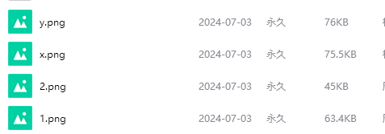


## 代码块

```python
print('Hello')
```


# Python环境安装

## 安装Python

+ 下载： https://www.python.org/downloads/windows/

本例用： 3.11.x

+ 下载好后就一步一步安装，在下面这个步骤要勾选“Add  python.exe to PATH”

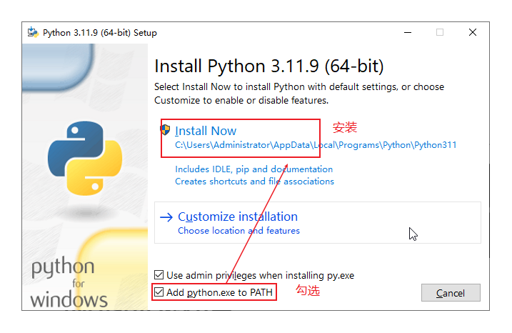


+ 确认是否安装成功

打开命令行窗口，执行python,   如果看到版本号信息，说明成功安装。 如果提示python不是一个命令，有可能没有安装，或者没有设置path的环境变量

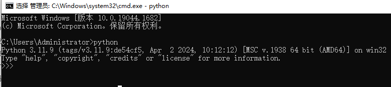


## IDE（PyCharm）安装

+ 下载地址： https://www.jetbrains.com/pycharm/download/other.html

  注： 下载社区版即可， 本例用： 2024.1.1


# 认识Python

## Python诞生

Python的作者Guido von Rossum(吉多·范·罗苏姆)，中国网友叫他龟叔，他是荷兰人

1982年毕业于阿姆斯特丹大学数学和计算机硕士

1989年圣诞节为了打发时间，龟叔开始写python的编译器

1991年第一个Python的编译器正式发布


## Python发行版本

+ CPython     使用最多的，用c语言实现
+ Jython     运行在Java平台
+ IronPython    运行在.net和Mono平台

Python目前有2.x   和  3.x


## Python优点

+ 应用广泛

  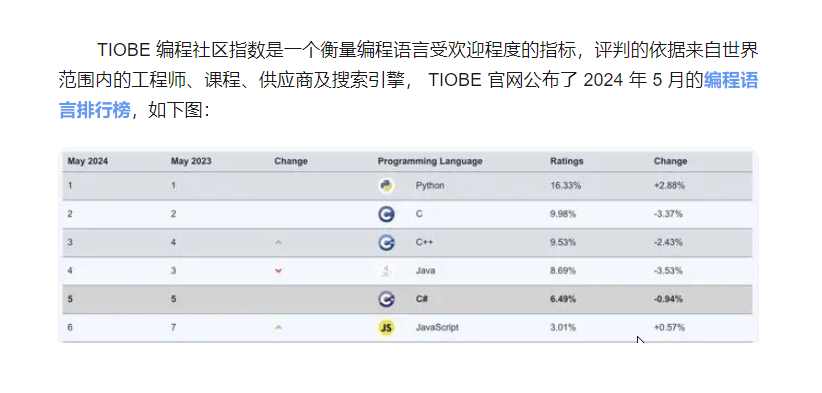

+ 简单易学
+ 免费、开源

+ 面向对象
+ 丰富的库
+ 扩展性强

## Python的缺点

因为它是解释型语言，执行效率不高


## Python的应用场景

+ 人工智能

主流的人工智能框架Tensorflow,   Pytorch都是用Python语言

+ web应用

+ 网络爬虫

+ 科学计算

+ 桌面软件

  PyQT


# 第一个Python程序


+ 初次运行pycharm， 会出现如下界面，点击New Project创建新项目


+ 在项目信息界面输入项目名称，选择项目存放目录

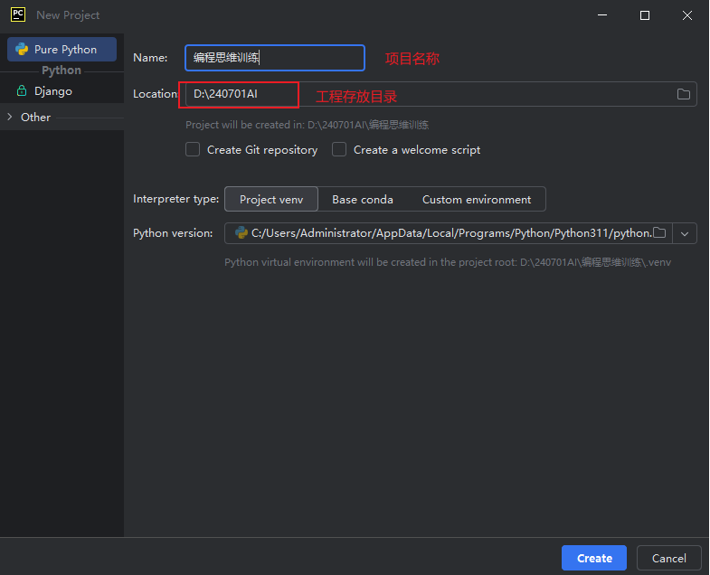

+ 创建Python文件

在项目名称点击右键 -- 》  New  --》 Python File

输入文件名： hello,    不需要输入扩展名，Pytho文件自动使用.py做为扩展名

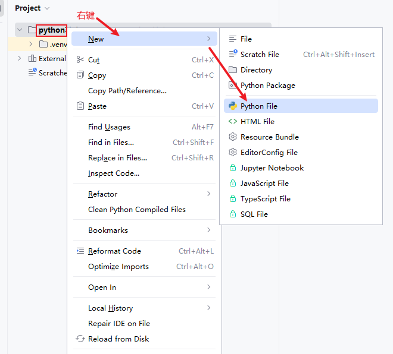


+ 在编辑窗口书写代码

```python
print("Hello Python")
```

+ 运行程序
  1. 在pycharm右上工具栏点击run（三角形播放按钮）按钮
  2. 在编辑窗口右键 --》 运行


# Python的注释

## 注释作用：

+ 提高程序的可读性
+ 屏蔽调试代码

## 注释的写法

+ 单行注释

  以#空格开头，本行的内容都属于是注释

```python
# python用# 字符作为单行注释
print("Hello Python")
```


+ 多行注释

用三个单引号或双引号包裹，里面可以放多行的注释内容

```python
"""
    作者：Fisher
    日期：2024-07-10
"""
```

# 课堂练习

1. 创建一个Python文件，输出名片： 包含姓名， 电话， 地址

```python
print("姓名：汪俊"
      "电话：19185936324"
      "地址：贵州省黔西南州兴义市")

print("-" * 25)
print("|姓名：汪俊              |")
print("|电话：19185936324      |")
print("|地址：贵州省黔西南州兴义市 |")
print("-----------------------")
```


# Python数据类型


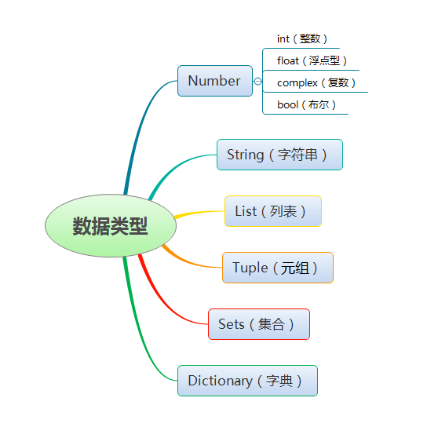

## Number

+ int

  包含正整数，负整数，任意长度，python中整数的写法跟数学上的写法一样

```python
# 整数int
i = 0
print(i)
j = 100
print(j)
k = 123456789123456789000000000000000011
print(k)
m = -88
print(m)
```

+ float

  ```python
  # 小数 float
  f1 = 3.1415
  print(f1)
  f2 = -0.009
  print(f2)
  f3 = 5.987654321654987
  print(f3)
  print(0.123456 + 0.000612)
  ```

  

+ complex  

​      复数由实数和虚数组成

定义方式一： 实部 + 虚部j
```
c1 = 20 + 10j
c2 = 20 + 10J
print(c1, c1.real, c1.imag)
print(c2, c2.real, c2.imag)
```


方式二： 用函数complex(实部, 虚部)
```
c3 = complex(5, 10)
print(c3, c3.real, c3.imag)
```


虚部参数可省略，默认就是0
```
c4 = complex(10)
print(c4, c4.real, c4.imag)
```


# 作业

1. 请问python有哪些优点？

   语法简单明了，高级语言，易于学习，解释型语言可读性强，广泛应用，强大的库和框架，跨平台，丰富的文档和社区支持，可扩展性强

2. 请使用print打印一首诗：春江花月夜。 显示效果按古诗排版

   ```python
   print(' ' * 8, '春江花月夜')
   print(' ' * 7, '张若虚〔唐代〕')
   print('春江潮水连海平，海上明月共潮生。\n'
         '滟滟随波千万里，何处春江无月明。\n'
         '江流宛转绕芳甸，月照花林皆似霰。\n'
         '空里流霜不觉飞，汀上白沙看不见。\n'
         '江天一色无纤尘，皎皎空中孤月轮。\n'
         '江畔何人初见月？江月何年初照人？\n'
         '人生代代无穷已，江月年年望相似。\n'
         '不知江月待何人，但见长江送流水。\n'
         '白云一片去悠悠，青枫浦上不胜愁。\n'
         '谁家今夜扁舟子？何处相思明月楼？\n'
         '可怜楼上月裴回，应照离人妆镜台。\n'
         '玉户帘中卷不去，捣衣砧上拂还来。\n'
         '此时相望不相闻，愿逐月华流照君。\n'
         '鸿雁长飞光不度，鱼龙潜跃水成文。\n'
         '昨夜闲潭梦落花，可怜春半不还家。\n'
         '江水流春去欲尽，江潭落月复西斜。\n'
         '斜月沉沉藏海雾，碣石潇湘无限路。\n'
         '不知乘月几人归，落月摇情满江树。')
   ```

   

3. python里面的Int和float有没有大小限制，如果有范围是多少？浮点数计算有没有精度损失问题？

   int没有范围限制。

   float有范围限制。

   ```python
   import sys
   # 2.2250738585072014e-308 1.7976931348623157e+308
   print(sys.float_info.min, sys.float_info.max)
   
   # 科学计数法，e的后面是正数，小数点右移多少位；e的后面是负数，小数点左移多少位
   print(1e-2) # 0.01
   print(1e2) # 100
   
   # 浮点数运算会有精度损失，如果要做准确的浮点数运算，用库decimal
   a = 0.1
   b = 0.2
   sum = a + b
   print(sum)  # 0.30000000000000004
   
   f1 = 5325342532.6553752917493217
   # :.8f  表示保留8位小数（四舍五入）
   print(f'{f1:.8f}')
   # round(数字， 小数位数)
   print(round(f1, 4))
   ```

   

+ bool

  bool类型是特殊的整数，取值只有两种是True和False。 注意：首字母是大写

​       

## 字符串

用单引号或双引号括起来的一段字符的集合。

```python
s1 = '字符串'
s2 = "this is string"
print(s1, s2)
s3 = '=*' * 10 # 重复字符串多少次
print(s3)
```

## 列表

定义： 直接在方括号里面写列表的元素， 每个元素之间用逗号分隔

```python
'''
    注意：
    多个元素用逗号隔开
    可用下标来读写列表的元素
    两个list可以用+做拼接
    list里的元素的类型可以不一致
'''
l1 = [1, 3, 5]
l2 = [2, 4, 6]
print(l1,  l1[0])
print(l1 + l2)
l3 = [1, 3.14, True, 'abc',[4, 6, 8]]
print(l3)
```


## 元组

元组写在小括号，元素之间用逗号分隔

注意： 定义一个元素的元组，必须要加个逗号

```python
# tuple的元素是不能改变，list的元素可以改变
t1 = (1, 3, 5, 'abc', 3.14)
print(t1)
print(t1[3])
# t1[3] = 'xyz' # 不能对元组的元素赋值，会报异常
# 定义一个元素的元组，必须要在元素后面加个逗号，否则它会把小括号当成四则运算的括号
t2 = (8,)
print(t2)
print(t2[0])
# 定义没有元素的元组
t3 = () 
print(t3)
```

## 字典

存放key-value键值对的数据结构

字典用大括号来定义，key和value之间用冒号，键值对之间用逗号


```python
# dictionary
dict1 = {}
print(dict1)

dict2 = {"李明": 95, "张山": 90}
print(dict2)
print(dict2["李明"])
# 字典的key要用能唯一确定的数据类型，比如数字，字符串，元组。 但是list不行
# dict3 = {[1, 3, 5]: 20, [2, 4, 6]: 10}
# print(dict3)
```


## 集合

集合是无序的，不重复的数据列表， 使用大括号来定义，多个元素之间用逗号分隔

注意： 空的集合用set()来定义

```python
# set
# 无序， 不重复
set1 = {1, 3, 5}
print(set1)
# 空的集合不能用{}， 因为{}用来定义空的字典的
set2 = set()
```


## type()方法查看变量的类型

```python
print(type(i))  # int
print(type(f1)) # float
print(type(s1)) # str
print(type(True)) # bool
print(type(l1)) # list
print(type(t1)) # tuple
print(type(dict1)) # dict
print(type(set1)) # set
```


# 标识符

由程序员自己定义的符号，比如： 变量名， 函数名

## 规则

1. 只能包含字母，数字和下划线。并且不能以数字开头     
2. 不能用python的关键字作为变量名

   ```python
   import keyword
   print(keyword.iskeyword("is"))
   print(keyword.kwlist)
   ```

# python 中的关键字列表
['False', 'None', 'True', 'and', 'as', 'assert', 'async', 'await', 'break', 'class', 'continue', 'def', 'del', 'elif', 'else', 'except', 'finally', 'for', 'from', 'global', 'if', 'import', 'in', 'is', 'lambda', 'nonlocal', 'not', 'or', 'pass', 'raise', 'return', 'try', 'while', 'with', 'yield']

   ```


3. 建议使用驼峰命名方式，如： userName.     每个单词的首字母大写， 变量名第一个字母小写，类名的第一个字母大写


# python的运算符号

## 算术运算符

注意：

	1. 混合运算时，运算符的优先顺序：  **   高于  *   /    //   %   高于  +    -  ，  通过()来改变运算优先级
 	2. 只要参与运算数有浮点数， 其它整数也会转成浮点数，最后结果也是浮点数

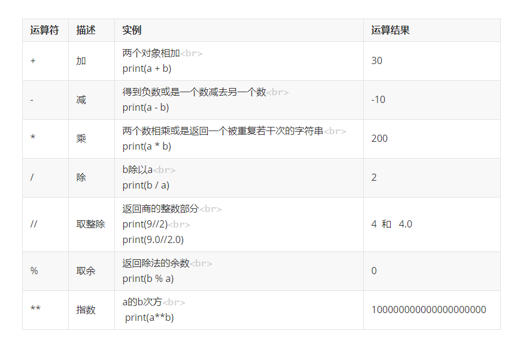

​```python
# 算术运算符
a = 10
b = 20
print(a + b)
print(a - b)
print(a * b)
# 除法返回结果是小数，即便可以整除也是小数
print(b / a)
print(type(b / a))
# 整数整除的结果是正数
print(9 // 2)
# 小数整除得到的结果是小数
print(9.0 // 2.0)
print(b % a)
print(a ** b)
   ```

## 赋值运算符

注意： 可以同时对多个变量赋值

```python
# 同时给多个变量赋值
i, j, k, s = 10, 20, 30, '王五'
print(s)
l = [1, 3, 5]
l[0], l[2] = l[2], l[0]  # 一个语句完成列表元素的交换
print(l)
```


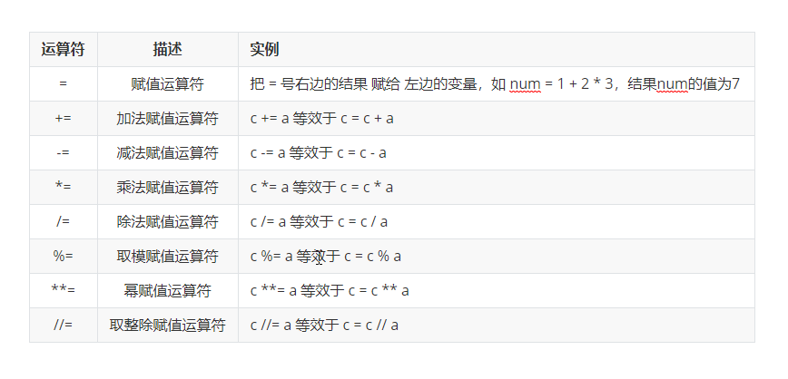


```python
# 赋值运算符
a += b  
print(a)
a -= b
print(a)
a *= b
print(a)
a /= b
print(a)
a %= b
print(a)
a **= b
print(a)
a //= b
print(a)
```

## 比较运算符

比较运算符包括： ==     !=      >        <         <=         >=

比较运算符的结果是布尔型，通常用于if判断或循环的条件

```python
# 比较运算符
a = 10
b = 20
print(a == b)
print(10 == 10)
print(a == 10)
print(a == (2 + 8))
s1 = str("abc")
s2 = 'ab' + 'c'
print(s1 == s2)

print(a != b)

print(a > b)

print(a < b)

print(a >= 10)  #  a > 10   或者   a == 10
print(a <= 10)
```

## 逻辑运算符

包括： and           or             not

```python
# 逻辑运算符
print(a > 10 or a == 10)
print(a > 10 and a == 10)
print(not a > 10)
```


## 位运算

​				a =60 (0011 1100)    ,   b=13 (0000 1101)

​     

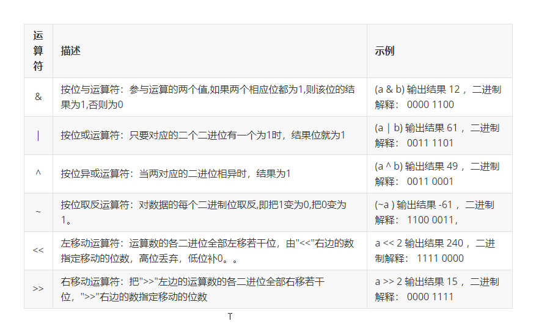


# 输入和输出

## print输出

```python
# 直接打印字符串或字符串表达式
print("Hello Python")
s = "Python"
print("Hello: " + s)

# 打印多个参数
a = 3
b = 2
print('a + b =', a + b)

# 用%格式化输出:   %s  字符串； %d   整数；   %f   小数
print("%d + %d = %d" % (a, b, a + b))

# f格式化输出
print(f'{a} + {b} = {a + b}')

# end参数: 默认是\n,所以print每打印一次会换行。 这个end参数可以设置为想要的任意值
print("end参数", end=" ")
```


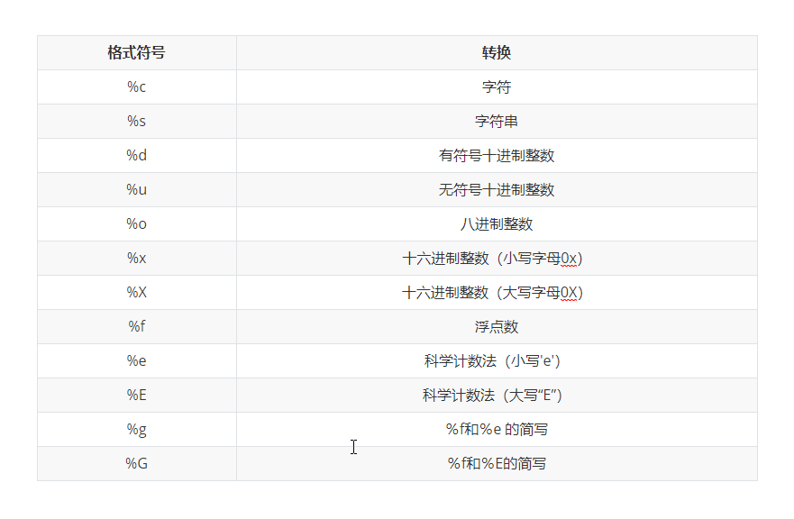

## input输入

通过input()接收键盘输入，赋给变量，它输入的内容是字符串类型

```python
n = input("请输入一个数字：")
print(type(n))
n = int(n) # 强制类型转换为整型
print(type(n))
```


## 强制类型转换

常用的类型转换： int(),   float(),  str(),  tuple(),  list(), set()

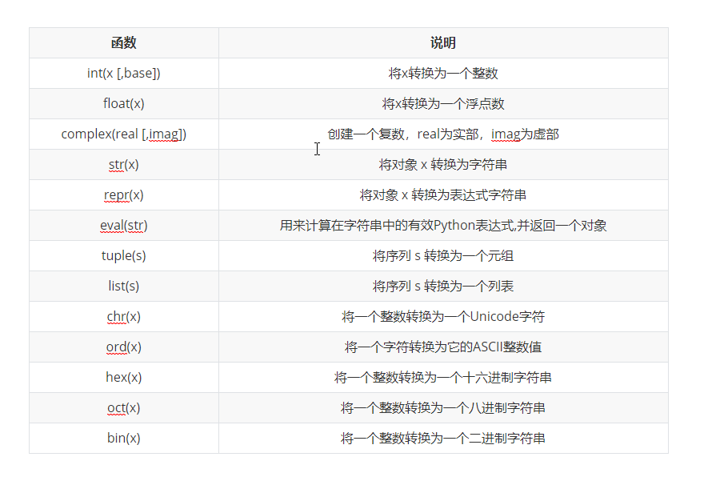

```python
# int()
a = "100"
# 第二个参数是指定要转换的这个数字原来是什么进制，默认是十进制。 其它的进制还有2, 8, 16
b = int(a, 10)
print(b)

# str()
i = 88
print("数字转字符串：" + str(i))

# float()
pi = "3.14"
r = 5
print(float(pi) * r ** 2)

# list()  <=>  set()
# list转set, 再转回list， 实现去重的效果
l = [1, 3, 5, 3, 7]
set1 = set(l)
l1 = list(set1)
print(l1)

# eval()
s1 = "3 + 2"  # eval()计算表达式
a = eval(s1)
print(a,  type(a))
s2 = "print(\"abc\")"  #  eval()执行print()方法
eval(s2)
s3 = "[1, 3, 5]"  # eval() 执行list定义语句，返回list对象
l = eval(s3)
print(l, type(l))

# hex() 把十进制转为十六进制， 十六进制数以0x开头；  八进制0o开头； 二进制0b开头
print(hex(256))
print(oct(64))
print(bin(15))

# 把字母转ascii码值
print(ord('A'))
```

# 条件判断

## if

条件判断语句用来控制程序执行的顺序，程序默认是从上到下逐行执行，但是加入条件语句之后，条件语句的代码块就有可能执行，也有可能会跳过

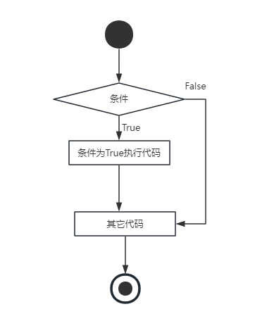

语法：

```python
if  条件表达式:
    条件为True执行的代码
```


练习：

1. 猜数, 电脑生成一个随机数，让人猜这个数（键盘输入），猜错了就提示：哈哈，你猜错了

```python
# 电脑生成一个随机数，让人猜这个数（键盘输入），猜错了就提示：哈哈，你猜错了

# 导入产生随机数的库
import random

# 产生随机整数， 范围1到10
r = random.randint(1, 10)
# 输入你猜的数字
guess = int(input("请输入你猜的数字："))
# 用if语句判断是否猜中
if r != guess:
    print("哈哈，你猜错了, 实际是：",  r)

```


2. 从键盘输入年龄，如果大于等于18，就打印：你已经成年了，可以去网吧啦

```python
m = int(input("请输入你的年龄："))
if m >= 18:
    print("你已经成年了，可以去网吧啦")
```


## if else

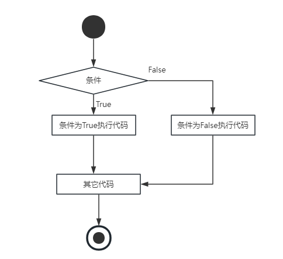


语法：

```python
if 条件:
    条件为真执行的代码
else:
    条件为假执行的代码

```

练习： 

1. 如果还有火车票，就可以坐火车；如果票已经卖完，只能选择其它交通工具

   输入数字1代表有票， 输入0表示没有票了


```python
c = input("请输入是否还有火车票（1：有；其它数字：售罄）：")
c = int(c)

if c == 1:
    print("坐火车出行")
else:
    print("选择其它交通工具")
```


2. 从键盘输入身高（单位cm）, 如果身高没有超过150cm， 那么不用购票；否则就要购买门票

```python
h = int(input('请输入你的身高（cm）：'))
if h <= 150:
    print('你可以免费进入')
else:
    print('请购票后进入')
```


## if elif else

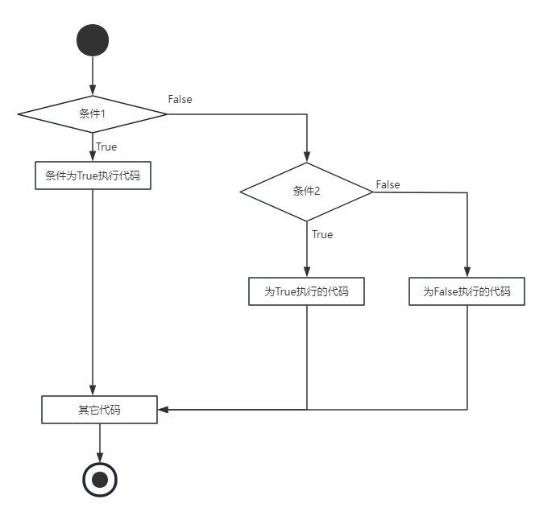


语法：

```python
if  条件1:
    条件1为True的代码
elif 条件2:
    条件2为True的代码
else:
    条件1和2都不为True的代码
```

练习：

根据考试分数评定等级，90及以上为优； 60及以上为；60以下不及格

```python
score = int(input("请输入您的得分："))

if score >= 90:
    print("优秀")
elif score >= 60:
    print("良好")
else:
    print("不及格")
```


# 作业

1. 模拟一个加法计算器。 键盘上分别输入两个加数， 计算它们的和，打印结果

```python
num1 = int(input('请输入第一个整数：'))
num2 = int(input('请输入第二个整数：'))
print(f'两个数字的和为：{num2+num1}')
```


2. 如果有超过100元的资金，购买一等座，小于100只能购买二等座。

```python
m = int(input('请输入你的资金'))
if m >= 100:
    print('可以购买一等座')
elif 0 < m < 100:
    print('可以买二等座')
else:
    print('请输入大于0的金额')
```


3. 从键盘上输入三个数，比较找出最大的数并打印

```python
a = int(input("请输入一个数："))
b = int(input("请输入一个数："))
c = int(input("请输入一个数："))
# if a >= b and a >= c:
#     print(a)
# elif b >= a and b >= c:
#     print(b)
# else:
#     print(c)

# max = a
# if a > b:
#     if a > c:
#         max = a
#     elif a < c:
#         max = c
#     else:
#         max = a
# elif a < b:
#     if b > c:
#         max = b
#     elif b < c:
#         max = c
#     else:
#         max = b
# else:  # a == b
#     if c > b:
#         max = c
#     elif c < b:
#         max = b
#     else:
#         max = c
# print(max)


temp = a
if b > temp:
    temp = b
if c > temp:
    temp = c
print(temp)


```


4. 扩展题：实现一个可以计算加减乘除的计算器（先输入第一个数，再输入运算符(+,   -,  * ,  /)， 再输入另一个数， 计算并打印结果）

```python
# a = int(input("请输入第一个数："))
# c = input("请输入运算符:")
# b = int(input("请输入第二个数："))
# if c == '+':
#     print(a + b)
# if c == '-':
#     print(a - b)
# if c == '*':
#     print(a * b)
# if c == '/':
#     print(a / b)


a = input("请输入第一个数：")
c = input("请输入运算符:")
b = input("请输入第二个数(除数不能0)：")
a = eval(a + c + b)
print(a)
```


# 循环语句

一段代码需要重复多次执行，就可以使用循环语句，能简化代码

while循环一般用于不定次数的循环， for循环一般用于确定次数的循环


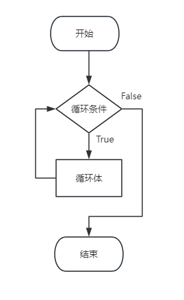

## while循环

语法：

```python
while 条件:
    代码块

```

练习：

1. 数数，从1数到5

```python
# 循环外面定义循环变量
i = 1
while i < 6:
    print(i)
    # 循环里面修改循环变量
    i += 1
```

2. 从1累加到100，打印和

```python
# 求1加到100的和
i = 0
sums = 0
while i < 100:
    i += 1
    # print(i, end=' ')
    sums = sums + i
print(sums)
```


while循环嵌套

内层循环执行的次数是两个循环次数的乘积

```python
while 条件:
    while 条件:
        执行代码
```

练习：

1.  观察内层循环执行次数

```python
# 循环嵌套
i = 0
while i < 3:
    j = 0
    while j < 2:
        print(f'{i}, {j}')
        j += 1
    i += 1
```

2. 用循环实现如下图形的打印

   ```python
   *
   **
   ***
   ****
   *****
   ```

   ```python
   i = 1
   while i < 6:
       j = 0
       while j < i:
           print("*", end="")
           j += 1
       print("")
       i += 1
       
     
   # 这种方式利用 "*" * 数字重复打印的 机制替代了内层循环，代码更简单
   # j = 0
   # while j < 6:
   #     j += 1
   #     print("*" * j)
   ```

   


## for循环

语法：

```python
for 临时变量 in 可迭代对象:
    循环代码
```


练习：

1. 有一个学生列表，循环打印所有学生的姓名。  ['刘勇',  '罗永欢', '杨豪']

```python
stus = ['刘勇', '罗永欢', '杨豪']

# 通过for循环把列表里的每个元素依次取出来赋给变量stu
for stu in stus:
    print(stu)
```


### range()函数

返回一个整数列表， 经常用于循环的迭代对象，用来控制for循环的次数

range（）的语法

```python
# 起始值，默认从0开始
# 结束值，必须设置。循环条件是小stop(不包含top, 开区间)
# 步长，默认值是1。 每循环一次增加多少数，也可以是负数，负数就是依次减少
range(start, stop, step)

range(5)  # 从0到4， [0, 1, 2, 3, 4]
range(1, 5) # 从1到4， [1, 2, 3, 4]
range(2, 11, 2) # [2, 4, 6, 8, 10]
range(9, 0, -2) # [9, 7, 5, 3, 1]
```

```python
# 1累加到100的和
sum = 0
for i in range(1, 101):
    sum += i
print(sum)
```


练习：

2. 元组用于循环迭代

```python
# tuple也可用于for循环迭代
t1 = ('C++', 'Java', 'SQL', 'Python')
for lan in t1:
    print(lan)
```

3. 字典用于循环迭代

```python
dics = {'张三': 98, 'lisa': 60, (2, 3): 6}
for dic in dics:
    print(dic) # 字典循环只能取出key
    print(dics[dic])  # 如果要取value，要通过key做为下标取取
```


4. 按如下格式打印每位同学的爱好

张三： 唱跳   打篮球
小杨： 历史   心理   篮球

```python
hobby = {'张三': ['唱跳','打篮球'], '小杨': ['历史', '心理', '篮球']}
for ho in hobby: # 外层循环，循环每一位同学
    print(ho, end=': ') # 不换行，每个学生后面打冒号
    values = hobby[ho] # 当前这位同学的爱好列表
    for v in values: # 内层循环，循环每一位同学的所有的爱好
        print(v, end="  ") # 不换行，每个爱好后面打印空格
    print('') # 打印换行
```


5. 循环读取集合内容

```python
# 循环读取集合的元素
set1 = {'人工智能', '嵌入式', '机器人'}
for course in set1:
    print(course)
```


## 循环控制关键字

用于循环中结束或跳过当次循环的一些特殊的符号

| 循环控制关键字 | 描述                                                         |
| -------------- | ------------------------------------------------------------ |
| break          | 在循环过程中，如果需要终止循环，就可以break。剩余的循环次数不会执行，当前这次循环break之后的语句也不执行 |
| continue       | 在循环中出现continue， 当次循环continue后面的语句不再执行，直接跳入到下一次循环 |
| pass           | pass是一个不执行任何操作的语句，仅仅是为了保持语法的合法性. 比如if, for, 函数定义用pass占位 |

练习： 

1, break演示

```python
# 打印0~99， 循环变量为11时，终止循环，后面的循环不再执行，
# 11这一次循环break之后的print也不执行。所以只能打印到10
for i in range(100):
    if i == 11:
        break
    print(i)
```

2. 从键盘输入数字， 从列表中查找这个数字，找到了就打印序号并停止查找；如果找不到就打印没找到

   lis = [21, 45, 98, 55, 88, 102]

  ```python
flag = False # 找到的标志
i = 0  # 循环计数器
n = input("输入数字：")
lis = [21, 45, 55, 88, 102]
for num in lis:
    i += 1
    if int(n) == num:
        flag = True  # 找到了设置循环标志
        break # 找到后就终止循环
# 循环结束后再来打印结果
if flag:
    print(f"恭喜找到！！！, 是第{i}个数字")
else:
    print("输入不存在")

  ```

3. 打印1~100之间的偶数

```python
# 打印1~100之间的偶数
for i in range(1, 100):
    if i % 2 != 0: # 奇数，用continue跳过当次循环，继续下一次循环
        continue
    print(i)
```


4. pass的使用

```python
i = 10
if i >= 10:
    print("********")
else:
    pass
```


# 数据类型及常用方法

## 字符串

用单引号或双引号引起来的任意字符的集合，字符串里面可以包含字母，数字，空格，特殊符号

```python
s1 = 'abc165465$#@!%# jgkjgAAA'
s2 = "Hello HQYJ!"
```

### 字符串访问

+ 用下标访问

字符串实际是由字符组成的列表，访问字符串中的字符，可以用下标的方式访问

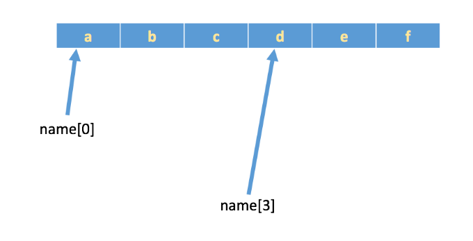


+ 切片

切片是指截取字符串中的某一部分。切片也可以用于列表， 元组等

语法：

```python
标识符[起始值: 结束值: 步长]
```

切片练习：

```python
name = 'abcdef'

# 截取下标从0开始，到2的字符串（左闭右开的区间）
print(name[0: 3])  # abc

# 步长是表示从起始值开始，按步长逐步增加下表的值，被选中的下标的字符会被截取出来（不是挨个顺序取，隔几个（步长值）取）
print(name[0: 3: 2])  # ac

# 起始值可以省略(默认是0)，但是冒号不能省
print(name[: 4])  # abcd

# 结束值可以省略（默认是最后一个元素的下标）， 截取起始值开始的所有内容
print(name[1: ])  # bcdef

# 起始值和结束值都省略，相当于是返回完整的字符串
print(name[:])  #abcdef

# 起始值和结束值都省略的情况下也可以设置步长
print(name[:: 2])  # ace

# 特殊切片操作， 逆序字符串
print(name[:: -1])  # fedcba

# 步长为负数， 起始值和结束值用正数的话，起始值一定要大于结束值
print(name[4: 1: -1])  # edc

# 起始值和结束值可以用负数， 负数表示从右到左顺序
print(name[-1: -5: -1])  # fedc

```


# 作业

1. 打印1到10的阶乘之和

   ```python
   sums = 0  # 累加每一个数的和
   for i in range(1, 11):
       count = 1  # 每一个数阶乘的结果
       for j in range(1, i + 1):
           count *= j
       sums += count
   print("1到10的阶乘之和:", sums)
   ```

   

2. 打印1到100的偶数之和

```python
# 方法一：循环,判断偶数
j = 0
for i in range(101):
    if (i % 2) != 0:
        continue
    j += i
print('1到100（包含100）的偶数之和为：', j)

# 方法二： for循环步长为2
sums = 0
for i in range(0, 101, 2):
    sums += i
print(sums)
```


3. 键盘输入一个正整数，逆序输出这个数字

```python
num = input('请输入你的数字：')
print(num[::-1])
```


4. 键盘输入一个正整数字，求这个数的二进制中有多少个1

```python
# 方法一：转二进制，逐位统计为1的数量
number1 = int(input("请输入一个正整数："))
bin = bin(number1)
x = 0
for o in bin:  # 二进制的数可以直接用for循环迭代获取每一位数字
    if o == '1':
        x += 1
print(bin, x)


# 方法二： 用1与操作来统计1的数量， 比较后通过右移排除掉这位
n = int(input("请输入一个整数："))
count = 0
while n: # 数字为0时循环结束
    count += n & 1 # 末尾如果是1，累加1
    n >>= 1  # 最右边的这位数字已经统计过，右移抛弃掉
print(count)
```


5. 有5个人坐在一起，问第5个人的年龄？他说比第4个大2岁；问第4个人的年龄，他说比第3个大2岁；问第3个人的年龄，他说比第2个人大2岁；问第二个年龄，他说比第一个大2岁。 问第一个人的年龄，他说10岁。请问第5个人多少岁？

```python
# 第一个人的年龄是10岁，后面的那个人比前面的大两岁
age = 10   # 第一个人的岁数
for i in range(4):
    age += 2
    print(f'第{i+1}个人的年龄为:{age}')
```


6. 百钱百鸡。公鸡5元一只，母鸡3元一只，小鸡1元三只，用100元钱买100只鸡，问公鸡、母鸡、小鸡各多少只？

```python
# g 为公鸡5元一只   m 为母鸡3元一只  x 为小鸡1元三只
for g in range(100 // 5):
    for m in range(100 // 3):
        for x in range(100):
            if g + m + x * 3 == 100 and g * 5 + m * 3 + x == 100:
                print(f'公鸡{g}只，母鸡{m}只，小鸡{x * 3}只')
```


### 字符串函数

+ 查找

  | 函数名 | 说明                                                         |
  | ------ | ------------------------------------------------------------ |
  | find   | 查找字符串中是否包含指定的字符串，如果有返回开始位置的索引，没有返回-1 |
  | index  | 查找字符串中是否包含指定的字符串，如果有返回开始位置的索引,没有找到有错误提示 |
  | rfind  | 从右到左，查找字符串中是否包含指定的字符串，如果有返回开始位置的索引，没有返回-1 |
  | rindex | 从右到左，查找字符串中是否包含指定的字符串，如果有返回开始位置的索引,没有找到有错误提示 |

  

```python
str1 = 'hello hqyj'

# 从0开始找
i = str1.find('h')
# start参数， 从指定位置开始查找，一直找到字符串结束
i = str1.find('h', 3)
# end 结束位置， 从下标3到8区间查找， 左闭右开（不包含最后位置的字符）
i = str1.find('h', 3, 6)
print(i)

# 如果查找不到，会抛异常
# i = str1.index('hx')
# print(i)

i = str1.rfind('h')
print(i)

i = str1.rindex('h')
print(i)
```

+ 大小写转换

| 函数名 | 说明                               |
| ------ | ---------------------------------- |
| lower  | 将字符串全部转为小写字母           |
| upper  | 将字符串全部转为大写字母           |
| title  | 将字符串中每个单词的首字母转为大写 |

```python
# 字符串转小写字母
print(str1.lower())
# 字符串转大写
print(str1.upper())
# 对每个单词的首字母转大写
print(str1.title())
```


+ 判断函数

| 函数名     | 说明                                                |
| ---------- | --------------------------------------------------- |
| startswith | 判断是否以指定字符串开头, 是返回True,否返回False    |
| endswith   | 判断是否以指定的字符串结束,是返回True,否返回False   |
| isspace    | 判断字符串是不是空格，是返回True,否返回False        |
| isdigit    | 判断字符串是否是数字，是返回True，否返回False       |
| isalpha    | 判断字符串是否是字母，是返回True，否返回False       |
| isalnum    | 判断字符串是否是字母或数字，是返回True，否返回False |


```python
# 以指定字符串开头
print(str1.startswith('hello'))
# 以指定字符串结束
print(str1.endswith('aaaaa'))
# 所有字符是否是空格
print(' '.isspace())
# 所有字符是否是数字
print('8848'.isdigit())
# 所有字符是否是字母，不区分大小写
print('abcCDE'.isalpha())
# 所有的字符是否是字母或数字
print('66abc123cc'.isalnum())
```

练习：

键盘输入一个字符串， 判断字符串里面有多少个空格，多少个字母，多少个数字，多少个标点符号

```python
# 键盘输入一个字符串， 判断字符串里面有多少个空格，多少个字母，多少个数字，多少个标点符号
str1 = input('输入字符串：')
space = 0 # 空格的数量
alpha = 0 # 字母的数量
num = 0  # 数字的数量
x = 0  # 其它符号的数量
for i in str1:
    if i.isspace():
        space += 1
    elif i.isalpha():
        alpha += 1
    elif i.isdigit():
        num += 1
    else:
        x += 1
# x = len(str1) - alpha - num - space
print(f'空格：{space}，字母：{alpha}，数字：{num}，标点：{x}')
```

+ 分割函数

| 函数名     | 说明                                                         |
| ---------- | ------------------------------------------------------------ |
| partition  | 将字符串以指定的字符串分割成三个部分， 以元组方式返回。 没有找到用空字符串补位 |
| rpartition | 从右到左， 将字符串以指定的字符串分割成三个部分，以元组方式返回。 没有找到用空字符串补位 |
| split      | 按指定的字符串将原字符串拆分为多个部分，以列表方式返回。 没有找到，返回原字符串，还是以列表返回 |
| splitlines | 按照行分割，以列表方式返回                                   |

```python
str2 = 'hello world hello china'
# 以指定的字符串把原字符串分割前，自己后后面部分共三个字符串，以元组的方式返回。
# 如果没有找到指定字符串，返回的元组里面的第一个字符串就是原字符串，后面两个是空字符串
pt = str2.partition('hello')
print(pt)
print(type(pt))

# 功能类似partition, 查找顺序是从右到左。 返回的三个字符串的顺序还是按原字符串中的顺序
rpt = str2.rpartition('hello')
print(rpt)

# 把原字符串按指定字符串分割成多个字符串，以列表对象返回
# 分割字符串必须有内容（不能以空字符串作为分隔符）； 分割字符串不会出现在结果中
sp = str2.split(' ')
print(sp)
print(type(sp))


str3 = '把原字符串\n按指定字符串\n分割成多个字符串'
# 按照行读取字符串，返回字符串列表
spl = str3.splitlines()
print(spl)
```

练习： 

有一个字符串： http://hqyj.com?userId=13546985
从url分别获取参数名和参数值

```python
i = 'http://hqyj.com?userId=13546985'
j = i.index('?')
para = i[j+1:]
l = para.split('=')
print(f'参数名： {l[0]}, 参数值： {l[1]}')
```


+ 其它函数

| 函数名     | 说明                                                         |
| ---------- | ------------------------------------------------------------ |
| count      | 返回指定字符串出现的次数,  有start和end两个参数，用来限制count的范围 |
| join       | 用一个指定的字符串，对列表（可迭代的多个字符串）进行连接，返回一个字符串，如： abc_def_xyz |
| replace    | 替换字符串，默认替换所有找到的字符串。 count参数， 设置替换的次数 |
| capitalize | 将字符串（句子）首字母大写                                   |

```python
str2 = 'hello world hello china'
print(str2.count('o'))
print(str2.count('o', 4, 15))

# 替换指定的字符串, 默认替换所有找到的字符串
print(str2.replace('hello', 'HELLO'))
# count参数设置替换的次数
print(str2.replace('hello', 'HELLO', 1))

# 句子（整个字符串）的首字母大写
print(str2.capitalize())

l2 = ['abc', 'def', 'xyz']
joinStr = '_'
# 用一个指定的字符串，对列表（可迭代的多个字符串）进行连接，返回一个字符串，如： abc_def_xyz
print(joinStr.join(l2))
```

## 列表

### 定义和访问列表

```python
l1 = [23, 'abc', 2.17, True]

# 用正数作为下标，从左到右依次是：0， 1， 2.。。
print(l1[0])
# 用负数作为下标，从右到左依次是：-1， -2， -3 。。。
print(l1[-1], l1[-3])

# 遍历
for temp in l1:
    print(temp)


# 切片方式访问
print(l1[::])  # 不设任何参数，返回原列表
print(l1[::-1])  # -1步长逆序
print(l1[:2])
print(l1[1:])
print(l1[1:3])
```

### 增加列表的元素

+ append()    在列表的末尾（右边）添加元素

+ extend()    把参数的列表中的元素一个一个的添加到原列表
+ insert(下标， 元素)    在指定的下标位置插入新元素，下标可以用正数或负数


```python
# 在列表的末尾添加元素
l1.append('小红')
print(l1)

l2 = [6, 8]
# l1.append(l2)
print(l1)

# 把参数列表里的元素依次添加到原列表
l1.extend(l2)
print(l1)

# 在指定下标位置（第一个参数）插入元素（第二个参数）
# l1.insert(1, '二哥')
# insert的下标也可以用负数
l1.insert(-6, '二当家')
print(l1)
```

### 删除列表的元素

+  pop()     移除列表中的一个元素（默认移除最后）， 可以指定下标移除，下标可以用负数

+ del 列表[index]   只能用列表加下标的方式删除
+ remove()   可以用下标或值去删除


```python
print(l1)  # [23, '二当家', 'abc', 2.17, True, '小红', 6, 8]
# 移除最后一个元素并返回
print(l1.pop())  #  8
print(l1)  # [23, '二当家', 'abc', 2.17, True, '小红', 6]
# l1.pop(4)
# 下标可以用负数
l1.pop(-3)
print(l1)

# 用del语句删除列表指定元素
del l1[5]
print(l1)

# 删除列表的元素，参数用下标或具体的值都可以
l1.remove(2.17)
print(l1)
```


### 修改列表的元素

用下标方式重新赋值

```python
l1[1] = '大当家'
print(l1)
# 通过修改遍历出来的变量，是不会改变原来列表的
for tmp in l1:
    tmp = 'xxx'
print(l1)
```

### 查找列表中的元素

查找指定的值是否存在于列表中

```python
if 'abc' in l1:
    print('存在')
else:
    print('不存在')

if 25 not in l1:
    print('不存在')
else:
    print('存在')
```


练习： 两个列表：  l1 = [1, 5, 7, 9, 12]    l2 = [5, 9, 12, 23, 55], 找出l1中存在，但是l2中不存在的元素并打印

```python
#  练习：
#  两个列表：  l1 = [1, 5, 7, 9, 12]    l2 = [5, 9, 12, 23, 55]
#  找出l1中存在，但是l2中不存在的元素并打印
l1 = [1, 5, 7, 9, 12]
l2 = [5, 9, 12, 23, 55]
# for lis2 in l2:
#     if lis2 in l1:
#         l1.remove(lis2)
# print(l1)

for i in l1:
    if i not in l2:
        print(i)
```

### 其它方法

```python
print(l1.index('abc'))  # 返回指定元素的下标，也可以设start和end参数
# l1.clear()  # 清空列表
l2 = l1.copy()  # 复制新的列表
l1.reverse()  # 颠倒元素的顺序
print(l1)

l1 = [5, 6, 8, 2, 54, 1, 98]
l1.sort()  # 排序，默认升序
print(l1)
l1.sort(reverse=True)  #  降序排列
print(l1)
```


# 作业

1， 有一个字符串的列表，存储了10本书名，打印出这些书名，只取前面八个字符， 如果超过8个字符的加上...

​        例如： '围城'   --》 围城

​                    '21天人工智能从入门到精通'  -- 》  21天人工智能从...

```python
bookList = ['Java程序设计', '西游记', '鲁滨孙漂流记', '我的独孤是一座花园', '植物的记忆与藏书乐', '围城',
            '爱丽丝漫游奇境', '年轻不老，老得年轻', '文化遗产的保护与传播', '三国演义']
priList = []
for i in bookList:
    if len(i) > 8:
        priList.append(i[:8]+'...')
        # print(i[:8]+'...')
    else:
        priList.append(i)
# print(priList)
print(','.join(priList))
```

2, 去掉字符串列表中所有字符串的空格， ['Ra in',  'C ats',  'and',  'Do g' ]

```python

s = ['123 45  67   9   ', '123', '  ab  c ']
# 方式二
# for i in range(len(s)):
#     if ' ' in s[i]:
#         s[i] = s[i].replace(' ', '')
# print(s)

# 方式二
# s1 = []
# for i in s:
#         s1.append(i.replace(' ', ''))
# print(s1)

# 方式三
l2 = ['Ra  in', 'C ats', 'and', 'Do g']
l2_1 = []
for i in l2:
    temp = i.split(' ')
    l2_1.append(''.join(temp))
print(l2_1)

# 方式四
s = ','.join(l2)
s = s.replace(' ', '')
print(s.split(','))
```


3, 有一个学生姓名的列表，找出所有王姓的同学并打印

```python
a = ['王涵', '李云', '张三', '王五', '赵四', '王旺']
for i in a:
    if i.startswith('王'):
    # if i[0] == '王':
        print(i)
```


4，有一个数字列表a = [23, 45, 66, 82, 97, 120, 135]， 把奇数放入新的列表b, 偶数放入新的列表c

```python
l2 = [23, 45, 66, 82, 97, 120, 135, 140]
A = []
B = []
for i in l2:
    if i % 2 == 0:
        B.append(i)
    else:
        A.append(i)
print(A, B)
```


5， 有两个整数列表，合并两个列表，并按降序排序

```python
lis1 = [1, 3, 5, 7, 9]
lis2 = [8, 6, 4, 2, 10]
lis1.extend(lis2)
# lis1 += lis2
lis1.sort()
lis1.reverse()
# lis1.sort(reverse=True)
print(lis1)
```

## 元组

### 定义和访问

元组用小括号定义

定义一个元素的元组需要加逗号， 否则就当四则运算：tup2 = (888, )

元组可以通过下标和切片方式访问

```python
tup1 = ('Google', 'HQYJ', 666, 3.14)
# 元组只有一个元素，后面需要一个逗号（避免当成四则运算）
tup2 = (888, )
tup3 = ()

print(tup1[1])
print(tup2[0])
print(type(tup3))
# 也可以切片访问
print(tup1[::-1])
```

### 修改元组

元组跟列表最大的区别就是元组不能修改(不能增加元素，不能删除元素，不能对元素重新赋值)

对元素对象（如：list）里面的内容修改是可以的

元组变量也是重新赋值

```python
tup4 = (11, 22, 33)
tup5 = ('abc', 'xyz')
# 重新给元组的变量赋值是可以
tup4 += tup5
print(tup4)
# 不能对元素重新赋值
# tup4[0] = 99

tup6 = (1, 'abc', [1, 2, 3])
# 元素对象里面的内容是可以改
tup6[2][0] = 999
print(tup6[2])
```

### 删除元组

不能删元组里面的元素

可以用del语句删除元组变量，但它也不是清空元组的元素，它是直接把变量删除了

```python
del tup6 # 删除变量
print(tup6)
```

### 元组使用运算符

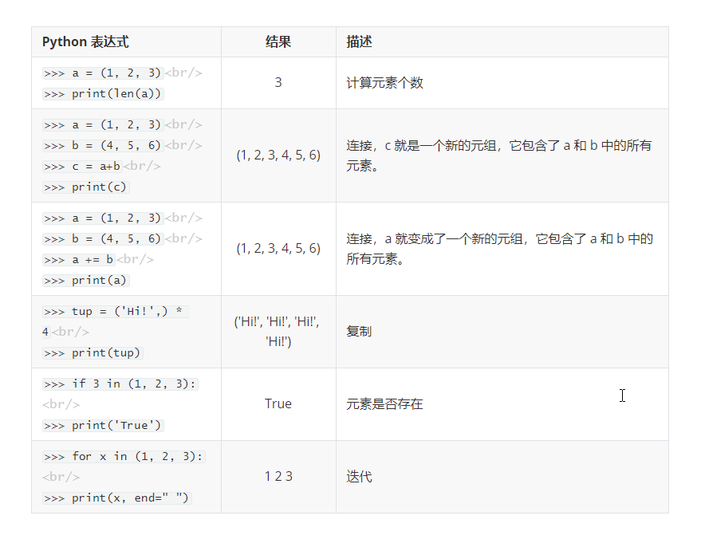

```python
a = (1, 2, 3)
b = (4, 5, 6)

print(len(a))
c = a + b
print(c)
a += b
print(a)
tup = ('Hi!', 'Hello') * 4
print(tup)

if 3 in (1, 2, 3):
    print('True')

for x in (1, 2, 3):
    print(x, end='')
```


## 字典

字典主要存键值对

语法：

```python
{key1: value1, key2: value2, key3: value3}
```

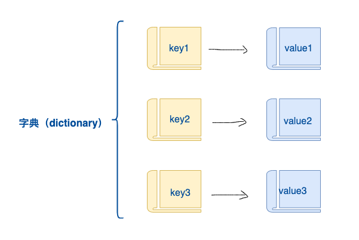

### 字典的定义和访问

直接用卡括号定义，定义时可以有键值对或空字典都可以

也可以用创建对象的方式定义字典:  dict()

key可以用数字，字符，元组等不可变的数据类型， 不能用List； value可以用任意类型

字典里面不能有同名的key， 如果设置同名key， 前面的会被后面的覆盖

用[key]访问字典，如果key不存在会报异常

```python
# 数字(整数和小数)作为key
dict1 = {1: '求知星', 2: '卓越星', 3: '未来星'}

dict2 = {'name': '张三', 'age': 22, 'city': 'guiyang', 'name': '小明'}
# 字典的访问用key作为下标，不能用序号做下标
print(dict2['age'])
# 如果字典里有相同的key， 会用后面的key覆盖前面的key
print(dict2['name'])

# 用元组作为key（因为元组是不可改变的，可以作为key）
dict3 = {(1, 2): 'value1', ('a', 'b'): 'value2'}
print(dict3[(1, 2)])

dict4 = {}
print(len(dict4))

dict5 = dict()
print(type(dict5))

# list1 = list()
# print(type(list1))
#
# tup1 = tuple()
# print(type(tup1))

# 访问不存在的key会报异常
# print(dict1[4])
```

### 修改字典

对已经存在的key重新赋值，就是修改

对不存在的key赋值，就是新增

用del语句删除指定key的键值对

```python
# 对指定的key重新赋值，就是修改
dict1[1] = ['求知星5G', '求知星2.4G']
print(dict1[1])
# 对一个不存在的key进行赋值，相当于是新增
dict1[4] = '远航星'
print(len(dict1))

# del 删除指定的key， 键值对一起被删掉
del dict1[2]
print(dict1)
# 如果直接删字典变量名，删除的是变量
# del dict1
```

### 字典对象的方法

```python
# ========dict方法=============
print(dict1)
# for循环遍历得到的是key
for d in dict1:
    print(d)

# 返回字典的key的列表
keys = dict1.keys()
print(type(keys))
print(keys)
for k in keys:
    print(k)

# 返回字典里面的value的列表
values = dict1.values()
print(type(values))
print(values)

# 返回键值对的列表，键值对以元组形式表示的：[(1, ['求知星5G', '求知星2.4G']), (3, '未来星'), (4, '远航星')]
items = dict1.items()
print(type(items))
print(items)

# 通过key读取value. 如果key不存在，返回None
print(dict1.get(4))
print(dict1.get(5))

# 复制一个新的字典
dictNew = dict1.copy()
print(dictNew)

# 合并两个字典
dict1.update(dict2)
print(dict1)

# 根据列表的内容生成字典的key, value默认为None， 可以通过第二个参数指定value
dictNew = dict.fromkeys(['a', 'b', 'c'])
print(dictNew)

# 为key设置默认值， 在get时如果取不到key则返回它对应的默认值
dict1.setdefault(5, '888')
print(dict1.get(5))

# 返回指定key对应的value， 同时会删除字典里这个key所对应的键值对
print(dict1.pop('city'))
print(dict1)

# 删除并返回字典最后一个键值对，以元组的形式返回
print(dict1.popitem())
print(dict1)

# 清空字典
dict1.clear()
print(dict1)
```

## 集合

集合（set）是一个无序的不重复的元素的序列

集合还可以做交集，并集，差集的方法

集合用大括号定义，元素之间用逗号分隔。 也可以用set()创建

### 集合的定义和遍历

```python
set1 = {1, 2, 3, 4, 5}
set2 = set(['a', 'b', 'c'])

# set不能用下标方式访问
# print(set1[2])

for i in set1:
    print(i)
```

### 集合的方法

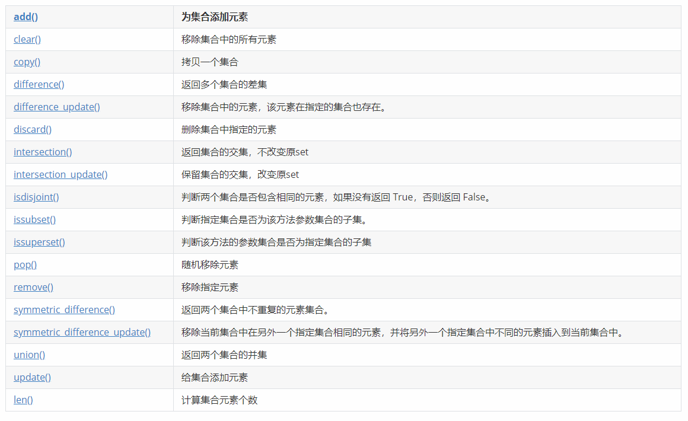


+ add()    添加元素
+ remove()   删除指定元素，如果不存在抛异常
+ discard()   删除元素，如果不存在不抛异常
+ pop()   删除并返回左边的第一个元素（排序是不固定）
+ update() 合并两个集合
+ difference()    返回参数集合中不存在的元素
+ difference_update（）  保留除交集外的元素
+ intersection（） 返回交集
+ intersection_update（） 保留交集
+ union（） 返回并集
+ symmetric_difference（） 返回两个集合中没有交集的所有元素
+ symmetric_difference_update（） 保留两个集合没有交集的所有元素
+ isdisjoint（） 判断两个集合是否没有交集，没有返回True，有交集返回False
+ issubset()  判断是否是子集
+ issuperset() 判断是否是超集


```python
# 新增元素。 集合的元素可以是任意类型
set1.add('xyz')
print(set1)

# 删除指定的元素， 如果不存在报异常
set1.remove('xyz')
print(set1)
# set1.remove('abc')

# 删除指定的元素，如果不存在不会抛异常
set1.discard(5)
print(set1)
set1.discard(8)

# 删除集合最左边的一个元素并返回， 但是集合排序是不确定的，所以无法确定会删哪一个元素
print(set1)
print(set1.pop())
print(set1)

# 合并集合
set1.update(set2)
print(set1)

set3 = {1, 2, 3, 4, 5, 6, 7}
set4 = {1, 9, 3, 8, 5, 10, 11}

# 返回set3中存在， set4不存在的元素
setDiff = set3.difference(set4)
print(setDiff)  # {2, 4, 6, 7}

# 删除set3中两个集合的交集
set3.difference_update(set4)
print(set3)

# 返回交集（两个集合都有的元素）
setInter = set3.intersection(set4)
print(setInter)
# 删除set3的非交集元素（只保留交集）
set3.intersection_update(set4)
print(set3)

# 返回并集（两个集合合并到一起，相同的元素只出现一次）
setUni = set3.union(set4)
print(setUni)

# 返回两个集合中没有交集的所有元素
setSd = set3.symmetric_difference(set4)
print(setSd)
# set3更新为两个集合没有交集的所有元素，交集元素会去掉
set3.symmetric_difference_update(set4)
print(set3)

set5 = {1, 2, 3, 4, 5, 6}
set6 = {2, 3, 5}
# set6是不是set5的子集
print(set6.issubset(set5))
# set5是否是set6的超集
print(set5.issuperset(set6))
# 判断两个集合是否没有交集，没有返回True，有交集返回False
print(set5.isdisjoint(set6))
```


## 数学运算方法

```python
import math

# 取绝对值
print(abs(-5))
# 以浮点数格式返回绝对值
print(math.fabs(-5))

# 返回最大值
print(max(2, 3, 8))
print(max([1, 3, 5, 7]))

# 返回最小值
print(min(1, 9))

# 四舍五入。第二个参数指定小数位数， 没有参数返回整数
print(round(3.1415))
print(round(3.1465, 2))

# 向上取整
print(math.ceil(5.12))

# 向下取整
print(math.floor(5.9999))

print(2 ** 3)
# 指数运算
print(pow(2, 3))

# 自然对数， e的多少次方
print(math.exp(1))

# 返回对数
print(math.log(100, 10))
print(math.log10(100))


```


# 函数

一段实现某个功能的代码的集合，给它一个名称（函数名），其它地方可以通过这个函数名来执行这段代码。函数可以一次编写，多次调用。减少重复的代码，提高开发的效率

Python的函数分为两大类别：

+ 内置函数

  在任何代码位置都可以使用，且不需要引入其它库。 比如： print(),   input(),  len(), int(), str(), list(), set()

+ 自定义函数

  第三方库里面的函数， 自己写的代码中的函数


## 函数定义


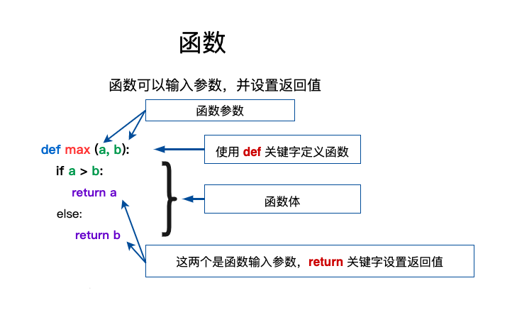

定义函数的规则：

+ 首先要以def（定义函数）开头(顶格开始写，前面不能有空格)，后面紧跟函数名（标识符命名规则） ， 后面紧跟一对小括号， 后面紧跟一个冒号
+ 小括号里面的是参数，函数可以没有参数，也可以有多个参数，多个参数以逗号分隔
+ 函数的代码在函数定义行之后换行接着写， 与函数定义要缩进一个Tab
+ 最后以return语句返回;  如果函数没有返回不用写return, 相当于返回None
+ 函数定义之后空两行再写其它代码

```python
# 计算两数之和并返回
def add(a, b):
    total = a + b
    return total


print(add(3, 2))


def mul(a, b):
    total = a * b
    return total


print(mul(52, 10))


# 阶乘。 递归调用
def fact(n):
    if n == 1:
        return n
    else:
        return n * fact(n - 1)


print(fact(3))


```


# 作业

1. 定义一个学号：姓名的一个字典，数据自己造， 如： {2020138502: '张珊',  2020138502: '小红'}

   定义两个方法：① 根据学号返回姓名

   ​                           ②打印所有学生的名字

   写测试代码调用函数

```python
stu = {20241101 : '张三', 20241102 : '李四', 20241103 : '王五'}


def stuid(id):
    print(stu.get(id))


def allstu():
    for i in stu:
        print(i, stu[i])


stuid(20241102)
allstu()
```


2. 定义一个列表，随机产生10个10以内的整数，添加到这个列表中， 把列表中重复的数字去掉

```python
# 定义一个列表，随机产生10个10以内的整数，添加到这个列表中， 把列表中重复的数字去掉
import random

# set1 = set(random.randint(1, 10) for i in range(10))
# list1 = list(set1)
# print(list1)


list1 = []
for i in range(10):
    num = random.randint(1, 10)
    list1.append(num)
# print(list1)
set1 = set(list1)  # list 转 set , 目的是去重
list1 = list(set1)  #  set 转 list
print(list1)
```


3. 定义两个集合，分别是两个同学选修课的集合。找出两位同学公共选修的课程

```python
stu1 = {'c#', 'python', 'java', 'c++', 'unity'}
stu2 = {'javascript', 'python', 'java', 'mysql', 'php'}
courses = stu1.intersection(stu2)
print(f'公共课课程：{courses}')
```


4. 有5个人坐在一起，问第5个人的年龄？他说比第4个大2岁；问第4个人的年龄，他说比第3个大2岁；问第3个人的年龄，他说比第2个人大2岁；问第二个年龄，他说比第一个大2岁。 问第一个人的年龄，他说10岁。请问第5个人多少岁？用递归实现

```python

# m是人的序号（第几个人）
def getAge(m):
    if m == 1:
        return 10
    else:
        return getAge(m - 1) + 2


n = int(input("你想知道第几个人的年龄："))
print(f"第{n}个人的年龄是：{getAge(n)}")
```


## 函数的参数

在调用函数时，如果需要给它一些数据，这些数据就是函数调用的参数。 函数可以有一个或多个参数， 也可以没有参数

+ 位置参数

在调用函数时必须按正确参数的数量和顺序来传递，这样的参数就叫做位置参数

```python
def showStu(name, age, sex):
    print(f'姓名： {name}, 年龄： {age}, 性别： {sex}')


showStu('珊珊', 21, '女')
# 参数数量不对，报异常
# showStu('小明')
#  参数顺序不低，导致逻辑错误
showStu('男', '小张', 22)
```


+ 默认参数

函数定义时，给参数设置默认值，这样的参数在函数调用时可以不传参数

```python
def showStu2(name, age=20, sex='男'):
    print(f'姓名： {name}, 年龄： {age}, 性别： {sex}')


showStu2('小明')
```


+ 关键字参数

在调用函数时，给参数设置名称 (函数的形参名) 和value， 如:   name='张三'

```python
def showStu(name, age, sex):
    print(f'姓名： {name}, 年龄： {age}, 性别： {sex}')
    
# 调用函数时指定参数名， 这样就可以不用按形参顺序传递参数
showStu(sex ='男', name ='小张', age=22)
```


课堂练习：定义一个函数，计算bmi = 体重（kg）/ 身高（m） ** 2

```python
# 课堂练习：定义一个函数，计算bmi = 体重（kg）/ 身高（m） ** 2
def bmi(height, weight):
    bmi = weight / (height ** 2)
    if bmi < 18.5:
        return "偏瘦"
    elif bmi < 25:
        return "正常"
    else:
        return "偏胖"


print(f'你的Bmi指标为：{bmi(height=1.8, weight=90)}')
```


## 函数的返回值

+ 如果函数的运算结果在调用它的代码中需要使用，这个函数就需要有返回值
+ 函数用return语句返回，return会终止函数的执行
+ return语句可以出现在函数的任何地方。函数的所有执行分支都应该以return语句结束
+ 函数的返回值可以是多个，多个值会以元组类型返回

返回list类型：

```python
# 函数返回值
# 返回100~999之间的水仙花数(每一位数字的立方和等于数字本身)
def daff():
    result = []  # 存水仙花数的列表
    for i in range(100, 1000):
        # a = i // 100
        # b = (i % 100) // 10
        # c = i % 10
        s = str(i)
        a = int(s[0])
        b = int(s[1])
        c = int(s[2])
        if (a ** 3 + b ** 3 + c ** 3) == i:
            result.append(i)
    return result  # 返回list类型


l = daff()
print(l)
print(type(l))
```

返回多个值：

```python
# 用一个函数计算1~100的总和，奇数和， 偶数和
def tjo():
    # 定义三个和的变量
    total = 0
    totalJi = 0
    totalOu = 0
    # 循环 1~100
    for i in range(1, 101):
         #累加
        total += i
         #if 奇数
        if i % 2 != 0:
              #奇数和累加
            totalJi += i
         #else  偶数
        else:
             # 偶数和累加
            totalOu += i
    return total, totalJi, totalOu


# 函数返回多个值， 用对应数量的变量接收它的返回
x, y, z  = tjo()
print(f'总和： {x}, 奇数和： {y}, 偶数和： {z}')
tup1 = tjo()
print(tup1, type(tup1))
print(tup1[0])
```


## 变量的作用域

+ 局部变量

在函数内定义的变量以及参数都属于这个函数的局部变量，它们仅在函数执行过程中有效，一旦离开函数这些变量不能再访问

+ 全局变量

定义在文件中（不在函数里）的变量，它们在整个文件的任何位置都可以访问

函数里面可以访问， 但不能修改全局变量， 如果要修改全局变量在变量前面加global关键字重新声明


```python

x = 5050
result = 0
# 减法函数
def dec(a, b):
    global result  #  函数内部要修改全局变量，需要用关键字global来声明
    result = a - b
    print(result)
    x = 500 #  函数内无法修改全局变量的
    print(x)


dec(8, 5)
print(x)
print(result)
```


## 匿名函数lambda

没有名称的函数，不会在其它地方被调用，一般只有一行代码且只有一个返回值，这种类型的函数可以简化一个匿名函数或叫lambda表达式

语法：

```python
lambda 参数列表: 表达式
```

+ 以lambda关键字开头
+ 参数列表不需要小括号
+ 如果只有一个语句，默认返回语句的结果，不需要return

```python
# def add(a, b):
#     return a + b


# lambda表达式赋给一个变量，这个变量相当于是一个函数
add = lambda a, b: a + b

print(type(add))
print(add(10, 20))
# (lambda a, b: a + b) 是一个匿名函数
# (20, 30)  调用函数的参数列表
print((lambda a, b: a + b)(20, 30))


# 练习：下面的遍历代码改写为匿名函数方式
list1 = [10, 20, 30, 40, 50]
for i in range(len(list1)):
    print(list1[i])

# 匿名函数根据下标返回元素
getItem = lambda i: list1[i]
for i in range(len(list1)):
    print(getItem(i))


# 字典排序
stus = [
            {'name':'张三', 'score': 90},
            {'name':'李四', 'score': 80},
            {'name':'小红', 'score': 85},
            {'name':'小军', 'score': 70}
        ]
# key参数给了匿名函数， 根据每个字典返回分数，排序就按分数来排
stus.sort(key=lambda d: d.get('score'), reverse=True)
print(stus)
```


#  Python的模块

包含了一些功能的python文件就叫做模块，模块里面有变量， 方法， 类。 当要使用这个文件里的代码时， 就通过import导入这个模块就可以直接使用

模块设计的优点：

+ 把功能复杂的软件分为若干个文件，便于协同开发和维护
+ 模块不需要特别的关键字去定义，任何一个Python文件都是模块
+ 通过模块方式共用代码， python开发经常用到一些内置模块和第三方的模块
+ 避免变量，方法，类等出现重名的情况


## 使用模块

一般来说import语句放在文件的最前面

### import   xxx    / import xxx as x   

+ 创建模块

创建一个python文件hello.py，里面添加一些方法

```python
def sayHello():
    print('Hello HQYJ')

def sayGoodBye():
    print('Bye-Bye')
    
num = 100
```

+ 使用模块

用import导入模块，直接用模块名调用方法

```python
# import hello
# 如果模块名字太长，可以用as关键字给它一个别名，代码中可以使用别名调用方法
import hello as h


# hello.sayHello()
# hello.sayGoodBye()

h.sayHello()
h.sayGoodBye()
# 也可访问模块的变量
print(h.num)


```


### from ... import  ...

直接导入模块中具体的类或者方法

```python
from hello import sayHello
from hello import sayGoodBye
from hello import num

sayHello()
sayGoodBye()
print(num)
```


## Python的包

如果一个项目中模块（文件）很多，都放在一起不方便查找，模块名字也容易重复。就需要按包来存放文件，同一或相近功能的模块放在相同包里

### 什么是包

其实在项目中，包就是一个目录，每个目录下有一个\_\_init\_\_.py。 包是可以嵌套，包下面可以再创建子包。包名一般按公司域名反过来创建包目录，比如hqyj.com,   包名第一层是com, 第二次是hqyj, 然后下面再创建其它子包。 用域名创建包是为了避免不同公司的包出现重名的情况

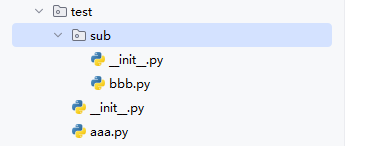


### 包的引用

按上面例子的包结构，在aaa.py和bbb.py文件中分别写一个info方法

+ aaa.py

```python
def info():
    print('test.aaa.py')
```

+ bbb.py

```python
def info():
    print('test.sub.bbb.py')
```


引用上述两个模块

```python
# import test.aaa as aaa
from test import aaa
from test.sub import bbb

aaa.info()
bbb.info()
```

## python开发常用的库

库是模块的集合，把类似功能的模块压缩成一个文件，它就称为库。

库便于发布安装

python内置的库称为标准库， 其它公司提供的库称为第三方库，使用第三方库之前都要安装。

| 库名称     | 描述                                                         |
| ---------- | ------------------------------------------------------------ |
| os         | os库提供文件系统操作的模块和方法，比如读取目录，创建文件，删除文件，访问系统环境变量 |
| sys        | 提供python解释器和系统相关的功能，如：解释器版本，路径，stdin， stdout和stderr等相关信息 |
| time       | 提供时间处理相关方法，获取系统时间，格式化时间，计时器       |
| datetime   | 提供日期时间处理的相关方法，比如时区，计算时间差             |
| math       | 数学计算相关的功能， 三角函数，对数，指数等计算              |
| json       | JSON格式的编码和解码， json字符串与json对象互相转换          |
| numpy      | 多维数组处理                                                 |
| opencv     | 计算机视觉处理                                               |
| matplotlib | 绘制可视化图形库                                             |
| pytorch    | 深度学习框架                                                 |
| tensorflow | 深度学习框架                                                 |
| PyQT       | 窗口程序开发                                                 |


# 面向对象

面向对象是一种设计思想，在编码体现为类，代码以类的形式来组织的，每个类完成特定的功能（方法），也会记录程序运行的状态信息（属性），软件由若干的类构成。

## 类

### 创建类

语法：

```python
class xxxx:
    类的代码
```

+ 创建员工类

```python
class Employee:
    # 类的构造方法，创建对象时要执行的方法
    # 初始化信息放在构造方法的参数传进来
    def __init__(self, name, age):
        self.name = name
        self.age = age
    
    def work(self):
        print('正在努力工作...')
        
        
    def rest(self):
        print('正在午休...')
```

### 创建员工对象（实例）

```python

from Employee import Employee

emp1 = Employee('张三', 28)
emp1.work()

emp2 = Employee('李四', 30)
emp2.work()
```


# 作业

1. 用递归方式实现斐波那契数列

```python
def Fibonacci(n):
    if n < 3:
        return 1
    else:
        return  Fibonacci(n - 1) + Fibonacci(n - 2)

print(Fibonacci(int(input('请输入佩波那契数列的项数：'))))

```


2. 创建包:    com.hqyj.stu,    包下面创建一个类Student， Student有name, age, sex, phone属性， Student有study,  play,  call这些方法

测试代码：创建两个不同的学生对象，分别执行三个方法

```python

class Student:
    def __init__(self, name, age, sex, phone):
        self.name = name
        self.age = age
        self.sex = sex
        self.phone = phone

    def study(self):
        print(f'{self.name}正在学习搬砖...')

    def play(self):
        print(f'{self.name}玩缝纫机...')

    def call(self):
        print(f'{self.name}号码是{self.phone}...')

    def age(self):
        print(f'{self.name}年龄{self.age}')

    def sex(self):
        print(f'{self.name}性别是{self.sex}')


# from com.hqyj.stu.Student import Student
stu1 = Student('吴某凡', 30, '男', 123456)
stu2 = Student('张张', 20, '男', 456789)
stu1.study()
stu1.play()
stu1.call()
print(f"{stu1.name} sex is {stu1.sex}")
print(f"{stu1.name} age is {stu1.age}")
stu2.study()
stu2.play()
stu2.call()
print(f"{stu2.name} sex is {stu2.sex}")

```


### 类的属性

#### 对象的属性

+ 属性可以通过对象.属性名的方式访问， 也可以通过xxattr的这些内置方法来访问

+ 可以随意给对象添加或删除属性

```python

print(emp1.age)
print(emp1.name)
emp1.age = 29 # 修改属性
print(emp1.age)

# 通过对象添加删除属性, 只能对当前对象有效
# emp1.score = 100
# print(emp1.score)
# print(emp2.score)
# del emp1.score #  删除对象的属性
# print(emp1.score)

# 属性操作的方法
# 是否有指定的属性
print(hasattr(emp1, 'score'))
# 返回对象的属性
print(getattr(emp1, 'age'))
# 修改属性的值
setattr(emp1, 'age', 35)
# 删除属性， 如果属性不存在，会报异常
delattr(emp1, 'score')


```

#### 类的属性

类的属性定义在类的代码块中

```python
class Employee:

    # 类的属性
    emp_count = 0

```


类的属性可以通过对象访问，但不能修改

```python
print(emp1.emp_count)
print(emp2.emp_count)
```

类的属性可以通过类名.属性的方式访问和修改

```python
Employee.emp_count += 1

print(Employee.emp_count)
```


#### 类的内置属性

```python
# =======类的内置属性=========
print('类的文档注释:', Employee.__doc__)
print('类名：', Employee.__name__)
print('类定义所在的模块：', Employee.__module__)
print('类的所有父类：', Employee.__bases__)
print('类的所有信息：', Employee.__dict__)
```


### 类的继承

类的继承是面向对象编程的一个特点，类可以继承父类的方法，从而实现代码重用的目的。

A类继承了B类， A就是子类或派生类； B就是父类、基类或超类

语法：

```python
class 子类类名(父类类名):
    pass
```

+ 父类和子类的定义

```python
# 父类
class Animal:

    def run(self):
        print('动物正在跑...')

    def sleep(self):
        print('动物正在睡觉...')

    def eat(self):
        print('动物正在吃东西...')


# 子类， 继承Animal
class Cat(Animal):

    def catch_mouse(self):
        print('猫抓老鼠...')
```

+ 创建子类对象，调用它的方法和继承自父类的方法

```python
# import animal
from animal import Cat


# cat = animal.Cat()
cat = Cat()
cat.catch_mouse() # 子类自己的方法
cat.run()  # 父类的方法
cat.sleep() # 父类的方法
cat.eat() # 父类的方法
```

#### 构造方法的继承特性

+ 子类没有写构造方法， 子类创建对象时，会调用父类的构造方法
+ 子类实现了构造方法，子类创建对象时，父类的构造方法不会被调用
+ 子类的构造方法中调用父类的构造方法，有如下两种写法：

```python
# 调用父类的构造方法
        # super(Cat, self).__init__()
        Animal.__init__(self)
```


#### 子类的方法中调用父类的方法

```python
# 父类
class Animal:

    def __init__(self):
        print('Animal的init')

    def run(self):
        print('动物正在跑...')

    def sleep(self):
        print('动物正在睡觉...')

    def eat(self):
        print('动物正在吃东西...')


# 子类， 继承Animal
class Cat(Animal):

    def __init__(self):
        print('Cat的init')
        # 调用父类的构造方法
        # super(Cat, self).__init__()
        Animal.__init__(self)

    def catch_mouse(self):
        # 子类的方法中调用父类的方法。 类名.方法名(self)
        Animal.run(self)
        print('猫抓老鼠...')
```


#### 多继承

其它的面向对象语言一般不允许多继承， 但是在python子类是可以继承多个父类

语法：

```python
class 子类(父类1， 父类2， 父类3):
    pass
```

示例：

创建两个父类和一个子类

```python
class Parent1:
    
    def method1(self):
        print('父类1的方法')
        
               
class Parent2:
    def method2(self):
        print('父类2的方法')
        
        
class Child(Parent1, Parent2):
    pass
```

测试：

创建子类对象，调用所有父类的方法

```python
from animal import Child

# 创建多继承子类的对象
child = Child()
child.method1()
child.method2()
```


#### 对象相关的方

+ id(对象名)   返回对象的唯一识别号(id), 如果两个对象的id相同，用==来判断也是返回True
+ issubclass(子类名， 父类名)    回一个类是不是另一个类的子类（或子孙类）
+ isinstance(对象名， 类名)    回对象是否是类的实例


```python
# id() 方法可以查看对象的id， 不同的对象id完全不一样
print(id(child))
child2 = Child()
print(id(child2))
child3 = child2
print(id(child3))
print(child3 == child2)  #  True

# 返回一个类是不是另一个类的子类（或子孙类）
print(issubclass(Child, Parent2))

# 返回对象是否是类的实例
print(isinstance(cat, Animal))
```

### 方法的重写

+ 自定义方法的重新

子类中重写父类的方法，子类对象调用该方法时，执行的是子类的方法

```python
# 父类
class Animal:

    def __init__(self):
        print('Animal的init')

    def run(self):
        print('动物正在跑...')

    def sleep(self):
        print('动物正在睡觉...')

    def eat(self):
        print('动物正在吃东西...')


# 子类， 继承Animal
class Cat(Animal):

    def __init__(self):
        print('Cat的init')
        # 调用父类的构造方法
        # super(Cat, self).__init__()
        Animal.__init__(self)

    def catch_mouse(self):
        # 子类的方法中调用父类的方法。 类名.方法名(self)
        Animal.run(self)
        print('猫抓老鼠...')

    def sleep(self):
        print('猫在睡觉...')
        
        
     
    
cat = Cat()
cat.sleep() # 执行的是子类中重写过的方法


```

+ 内置方法的重写     

object类有内置方法\_\_str\_\_，这个方法在print打印对象时会调用这个方法的返回结果来打印。默认的str方法返回对象的地址，在Cat类重写该方法

在printCat类的对象时候，输出的就是str方法返回的内容

```python
# 子类， 继承Animal
class Cat(Animal):

    def __init__(self):
        print('Cat的init')
        # 调用父类的构造方法
        # super(Cat, self).__init__()
        Animal.__init__(self)

    # 重写默认的内置方法
    def __str__(self):
        return '这是一只猫'

    def catch_mouse(self):
        # 子类的方法中调用父类的方法。 类名.方法名(self)
        Animal.run(self)
        print('猫抓老鼠...')

    def sleep(self):
        print('猫在睡觉...')
        
        
        
    cat = Cat()
    print(cat)  # 这是一只猫
```


+ 重写+运算符

定义Vecotr类，重写str和add方法

```python
class Vector:
    def __init__(self, x, y):
        self.x = x
        self.y = y
        
    # 重写str方法    
    def __str__(self):
        return f'Vector: {self.x}, {self.y}'
    
    # 重写+运算符的内置方法
    def __add__(self, other):
        return Vector(self.x + other.x, self.y + other.y)
```

测试代码

```python
#  +运算符重写
v1 = Vector(5, 8)
v2 = Vector(2, -3)
print(v1 + v2)   #  Vector: 7, 5
```


### 类的属性和方法的访问控制

+ 类的私有属性

两个下划线开头的类的属性，就是私有的属性，私有属性不能在类的外部访问，只能在类内部通过self.属性名 方式访问

创建类Counter，定义私有属性__count

> 注意： 私有属性可以有一种特殊方式能通过对象访问（对象名._类名属性名）： counter.\_Counter__count

```python
class Counter:
    # 类的私有属性. 只能在类的内部用类名.属性名或self.属性名方式访问
    __count = 0

    def count(self):
        self.__count += 1
        # print(f'计数器的结果： {Counter.__count}')
        print(f'计数器的结果： {self.__count}')
        
        

        
counter = Counter()
counter.count()
counter.count()
# 类的私有属性不能在类外面访问
# print(Counter.__count)

# 类的私有属性可以通过对象._类名私有属性名这样的方式访问
print(counter._Counter__count)
```

+ 类的私有方法

两个下划线开头的方法，就叫做私有方法。私有方法不能被对象直接调用，只能在类内部用self.方法名调用

```python
class Counter:
    # 类的私有属性. 只能在类的内部用类名.属性名或self.属性名方式访问
    __count = 0

    def count(self):
        self.__plus()
        # print(f'计数器的结果： {Counter.__count}')
        print(f'计数器的结果： {self.__count}')

    def __plus(self):
        self.__count += 1
```


### 单下划线，双下划线，头尾双下划线区别

+ 单下划线定义的属性和方法是受保护的（protected）属性方法,  只能在本类以及子类中访问
+ 双下划线定义的是私有的属性或方法，只能在类的内部能够方法（类的私有属性可以用一种特殊方式在外部访问（对象名._类名属性名））

+ 头尾双下划线定义的方法是python的内置方法， 比如： init,   str


## 异常

程序在运行的时候遇到特殊情况，不能自行解决，就会终止程序执行，并且抛出异常信息。

### 处理异常

使用 try  ....    except...  语句

+ except后面跟的是异常类。 有异常会进入except分支，没有异常不会进该分支。 except处理的异常一定是抛出的异常类型或是它的祖先类

  except可以有多个分支（对不同类型的exception进行捕捉），类似if elif只会执行其中一个分支

+ else 正常执行时进入分支。 异常不会进

+ finally不管有没有异常都会执行的分支

+ else可以不需要。 但是except和finally至少需要一个

```python
try:
    # print(counter._Counter__count)
    print(Counter.__count)
except AttributeError:  # 出现异常进入对应异常类型的分支，只会进入一个分支
    print('该属性不存在')
except ValueError:
    print('')
except BaseException:
    print('')
# else:   # 正常执行进入该分支
#     print('正常执行进入该分支')
# finally:
#     print('始终会执行的分支')
```

### 常见的异常类

+ BaseException   所有异常的基类
+ Exception            常规错误的基类
+ ArithmeticError   所有数值运算错误的基类
+ OverflowError      数值运算超出最大限制
+ ZeroDiisionError  除0异常
+ IOError                   输入输出操作异常
+ ImportError           导入模块异常
+ IndexError              序列中没有这个索引
+ Warning                   警告的基类

### 程序抛出异常

用raise关键字 ， 后面跟一个异常对象：  raise BaseException('数列的序号必须从1开始')

```python
def Fibonacci(n):
    if n <= 0:
        raise BaseException('数列的序号必须从1开始')
    if n < 3:
        return 1
    else:
        return Fibonacci(n - 1) + Fibonacci(n - 2)


print(Fibonacci(int(input('请输入佩波那契数列的项数：'))))
```


## 列表推导式

一个列表循环，通过表达式计算返回一个新的列表，这种代码可以写到一行，用方括号括起来，这种写法叫列表推导式

语法： [* for i in  可迭代的列表]，   前面这个*是一个表达式或lambda函数

```python
# 列表推导式
list1 = []
for i in range(10):
    list1.append(i * 2)
print(list1)


list2 = [i * 2 for i in range(10)]
print(list2)

list3 = [(lambda x: x * 2)(i)  for i in range(10)]
print(list3)

# 两个for循环， 第一个相当于外层循环，第二个循环相当于内层循环
list4 = [str(i) + '_' + s for i in range(5) for s in ['a', 'b', 'c', 'd', 'e']]
print(list4)
```

## 条件赋值

```python
animal = ''
flag = 0
# if flag == 1:
#     animal = '猫'
# else:
#     animal = '狗'

animal = '猫' if flag == 1 else '狗'
print(animal)


```

## map方法

```python
# map方法能遍历第二个参数，用第一个参数表达式处理每一个元素， 最终返回一个map对象， 用list方法把map转为列表
# res = list(map(lambda x: 2 * x, range(5)))
res = list(map(fn, range(5)))
print(res)

# map方法如果有多个列， 不会做多层循环，只遍历一次，每个列表都取对应下标的元素作为运算
res = list(map(lambda x, y: str(x) + '_' + y  , range(5), ['a','b','c', 'd', 'e']))
print(res)
```

## filter方法

过滤列表数据，如果第一个参数返回True，保留； 返回False，就丢弃（过滤）

```python
# 返回1~100的偶数
# 第一个参数的函数返回True， 当前元素保留； 如果返回False，当前元素被过滤
def fn1(x):
    if x % 2 == 0:
        return True
    else:
        return False

# res = list(filter(fn1, range(1, 101)))
res = list(filter(lambda x: not x % 2, range(1, 101)))
print(res)
```

# 作业

1, 类的属性与对象的属性有什么区别？分别是怎么样定义以及访问？

公有的属性特征如下：

类的属性是公有的，每个对象读取到的值都一样；对象的属性是对象独有的，每个对象之间的属性互不干扰

类的属性可以通过对象访问，但不能修改
类的属性可以通过类名.属性的方式访问和修改
对象的属性可以通过对象.属性名的方式访问， 也可以通过xxattr的这些内置方法来访问
对象的属性可以随意给对象添加或删除属性

类的私有属性特征：

两个下划线开头

一般在类的内部用self.属性或类名.属性的方式访问；在外部可以通过对象._类名属性名这个特殊的方式访问

类的受保护的属性：

只能在当前类和子类进行访问


2，A类继承B类， 创建A的对象时，是否会调用父类的构造方法？子类的构造方法中怎么调用父类的构造方法？

（1）A类没有写构造方法， 创建A类对象时，会调用B类的构造方法
   A类实现了构造方法，创建A类对象时，不会调用B类的构造方法

（2）使用super方法： super(A类，self).\_\_init\_\_()
   使用父类：B类名.\_\_init\_\_(self)


3，python的类中怎么样创建公有方法?私有方法？受保护的方法？

​    创建公有方法(没有下划线)：def 方法名 ( self )：

​    创建私有方法（双下划线）：def __方法名 ( self )：

​    受保护的方法（单下划线）： def _方法名（self）:

4，定义一个列表，从键盘上输入一个下标，根据下标下标返回列表的元素。如果找不到该元素，提示出友好的信息？

```python
def fun(index, lst):
    # try:
        # if lst[index] in lst:
    print(f'找到了!结果为{lst[index]}')
    # except IndexError:
    #     print('抱歉,没有找到！')


import random
lst1 = [random.randint(1, 50) for item in range(20)]
print(lst1)
while True:
    try:
        data = int(input('请输入列表下标:'))
        fun(data, lst1)
        break
    except ValueError:
        print('请你输入整数!')
    except IndexError:
        print('请输入-20 ~ 19之间的整数')
    except BaseException:
        print('发生其它错误，请重试')
```


5，用列表推导式方式实现乘法口诀表

```python
def multiplication(a, b):
    print(f'{b}*{a}={a * b}', end='\t')
    if a == b:
        print()

# 方式一： lambda
list1 = [(lambda a, b: print(f'{b}*{a}={a * b}'))(i, x) for i in range(1, 10) for x in range(1, i + 1)]

# 方式二：函數
print('函数')
list2 = [multiplication(i, x) for i in range(1, 10) for x in range(1, i + 1)]
```


## 迭代器

迭代是访问集合/列表元素的一种方式，它能记住你访问的位置，每一次访问返回下一个数据(位置指针只能往前走， 不能倒回去)，直到结尾会返回一个结束的标志。

迭代器是能按迭代方式访问（遍历）它里面每一个元素的对象

跟迭代器相关的两个基本方法： 

+ iter()
+ next()

实例：

```python
# 迭代器
list1 = [1, 2, 3, 4, 5]
it = iter(list1)
# print(next(it))
# print(next(it))
# print(next(it))
# print(next(it))
# print(next(it))
# print(next(it))
for i in it:
    print(i)
```


### 自定义迭代器类

任意创建一个类，只需要实现两个方法： \_\_iter\_\_   ;    \_\_next\_\_

\_\_iter\_\_    返回对象自身

\_\_next\_\_  返回下一个数据

```python
# 创建一个迭代器类， 返回一组数字，[10, 20, 30, 40, 50]
class MyIter:
    def __init__(self):
        self.num = 0  # 初始化一个属性

    def __iter__(self):
        return self

    def __next__(self):
        self.num += 10
        return self.num

my_iter = MyIter()
print(next(my_iter))
print(next(my_iter))
print(next(my_iter))
```

### StopIteration

StopIteration异常用于标志迭代器结束，防止死循环。

在next方法中，如果数据已经迭代完成，就抛出StopIteration异常

```python
# 创建一个迭代器类， 返回一组数字，[10, 20, 30, 40, 50]
class MyIter:
    def __init__(self):
        self.num = 0  # 初始化一个属性

    def __iter__(self):
        return self

    def __next__(self):
        self.num += 10
        if self.num < 60:
            return self.num
        else:
            raise StopIteration #  迭代完成，抛出终止异常

my_iter = MyIter()
print(next(my_iter))
print(next(my_iter))
print(next(my_iter))
print(next(my_iter))
print(next(my_iter))
# print(next(my_iter))

my_iter2 = MyIter()
for i in my_iter2:
    print(i)

```


## yield（生成器）

yield关键字用于函数里，能返回一个叫做生成器（迭代器）的对象，这个对象可以用于迭代访问

```python
# 传入参数n, 返回从n到0的一个数列

# 函数中用到yield关键字，这个返回的就是生成器（迭代器）对象
def desc_num(n):
    while n >= 0:
        # 返回一个值，返回之后就会停下来（能记住执行位置），直到下一次调用（作用类似迭代器）
        yield n
        n -= 1


iter = desc_num(5)

print(next(iter))
print(next(iter))
print(next(iter))
print(next(iter))
print(next(iter))
print(next(iter))
# print(next(iter))

iter2 = desc_num(6)
for i in iter2:
    print(i)

```


练习： 用迭代器打印出斐波那契数列的n以前的所有数字。如： n=5,  打印  1, 1 2 3, 5

```python
#   用迭代器打印出斐波那契数列的n以前的所有数字。如： n=5,  打印  1, 1 2 3, 5
# n=1: a=0 , b=1
# n=2: a=1,  b=1
# n=3: a=1,  b=2  (a = b = 1, b = a + b = 1 + 1 = 2)
# n=4: a=2,  b=3  (a = b =2,  b = a + b = 1 + 2 = 3)

def fib(n):
    a, b = 0, 1
    for _ in range(n):
        yield b
        a, b = b, a + b

iter = fib(12)
for i in iter:
    print(i, end=' ')
```


## enumerate和zip

通过enumerate方法封装过后的可迭代对象在循环时， 会返回循环的序号（从0开始）和每一个元素组成的元组，比如： (0, 'a'),    (1, 'b') 。。。

在循环中可以用两个变量分别接收序号和内容：for index, value in enumerate(list1)

用于既要方便的循环列表的元素，又需要循环的序号的情况

```python
# 做for in循环同时需要循环变量
list1 = ['a', 'b', 'c', 'd', 'e']

# for i in list1:
#     print(i)
# for i in range(len(list1)):
#     print(list1[i])

# enumerate封装之后，返回第一个值是从0开始的序号， 第二个值迭代出来的内容
for index, value in enumerate(list1):
    print(index, value)

for obj in enumerate(list1):
    print(obj) # 其实enumerate返回的是序号和元素组成的元组
```

zip能多个列表按对应下标生成元组返回， 多个列表的长度如果不一样，以长度短的列表为准

```python
list1 = ['a', 'b', 'c']
list2 = [1, 2, 3, 4]
list3 = [3.12, 2.15, 8.6, 7.9]

# 拆分列的每一元素， 分别创建元组， 返回一个可迭代对象
z1 = zip(list1)
for s in z1:
    print(s)

# 多个列表压缩， 按长度最短的列表为准，把每一个列表对应下标的元素取出来生成元组
z2 = zip(list1, list2, list3)
for s in z2:
    print(s)

# 练习： 姓名列表：['张三', '李四', '王五'],    成绩列表：      [90, 92, 88]
# 显示如下：
# 张三：90
# 李四：92
# 王五：88
l1 = ['吴龙', '顾玉', '吴*鸿', '潘某卫']
l3 = [80, 90, 85, 80]

z3 = zip(l1, l3)
for name, score in z3:
    print(f'{name}: {score}')

# zip压缩的变量前面加星号可以解压
z4 = zip(l1, l3)
print(*z4)

# 用zip实现enumerate的功能
list1 = ['a', 'b', 'c']
for t in zip(range(len(list1)), list1):
    print(t)
```


## \*args和\*\*kwargs

定义方法的参数的时候， 如果不确定参数的个数， 用*args或**kwargs这两个参数

+ *args       

  args是一个习惯用法，就是arguments的缩写， 也可以用其它名称，但是前面的星号是固定， 比如：*xyz,     *abc 都可以

  加星号的参数代表任意个数的参数

+ **kwargs

  kwargs是keyword arguments的缩写，也是习惯写法，也可以不按这个名字命名，前面两个星号是固定的

  两个星号的参数代表任意个数的关键字参数（命名参数）， 调用的参数是关键字参数，如： fn(name='张三', age=22 )


​		如果一个方法两个参数都有， 一般*args在前面， **kwargs在后面

```python
def fn(*args, **kwargs):
    for arg in args:
        print(arg)
    for kwarg in kwargs.items():
        print(kwarg)


fn('a', 2, 3.14, 'xy', name='Jack', age=20)
```


# 正则表达式

正则表达式是一种特殊字符组合（模式）， 它可以用来匹配字符串里面的内容是否符合模式的要求。 比如：字符串只允许数字；  前三位是字母，后两位是数字

## re.match方法

校验整个字符串是否符合模式

语法：

```python
# pattern  正则表达式
# string    要判断的字符串
# flags    匹配方式， 比如： 是否区分大小写， 是否多行匹配
re.match(pattern, string, flags=0)


# re是正则表达式模块
import re

# 查找字符串是否存在‘www’， 从第一个字符开始匹配
res = re.match('www', 'www.hqyj.com')
print(res)
print(res.span()) # 返回元组，被查找字符串的起始和节数下标
print(res.start()) # 开始下标
print(res.end())  # 结束下标

res = re.match('com', 'python.org')
print(res) # 找不到返回None


# 用正则表达式模式去查找
line = 'Cats are smarter than dogs'
# .* 任意字符（不包含换行）任意个数
# re.M 多行匹配模式（默认是单行）
# re.I 忽略大小写（默认区分大小写）
res = re.match(r'.* are .*', line, re.M | re.I)
print(res)
print(res.group()) # 返回匹配到的字符
```

## re.search方法

扫描整个字符串，返回第一个成功匹配的字符串

```python
res = re.search('hqyj', 'www.hqyj.com')
print(res)
print(res.group())

s = '321fjdkafl8098fjdslajfl^*^*^*'
res = re.search(r'\d+', s)
print(res.group())
```


## re.findall方法

返回字符串所有匹配的字符，以列表形式返回

```python
s = '321fjdkafl8098fjdslajfl^*^*^*'
res = re.findall(r'\d+', s)
print(res)  # ['321', '8098']
```


## 正则表达式的标志（修饰符）

| 修饰符 | 说明                                                         |
| ------ | ------------------------------------------------------------ |
| re.M   | 多行匹配                                                     |
| re.I   | 忽略大小写                                                   |
| re.L   | 本地化识别匹配                                               |
| re.S   | .匹配所有字符加换行符                                        |
| re.U   | 根据unicode字符集匹配                                        |
| re.X   | 该标志通过给予你更灵活的格式以便你将正则表达式写的更容易理解 |


## 正则表达式模式


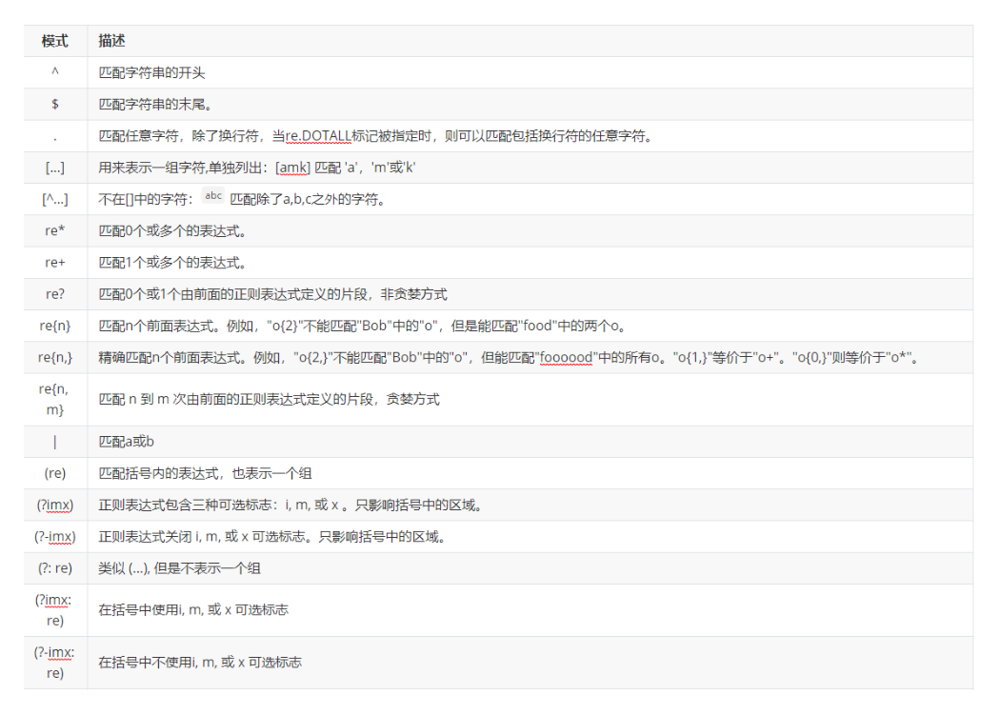

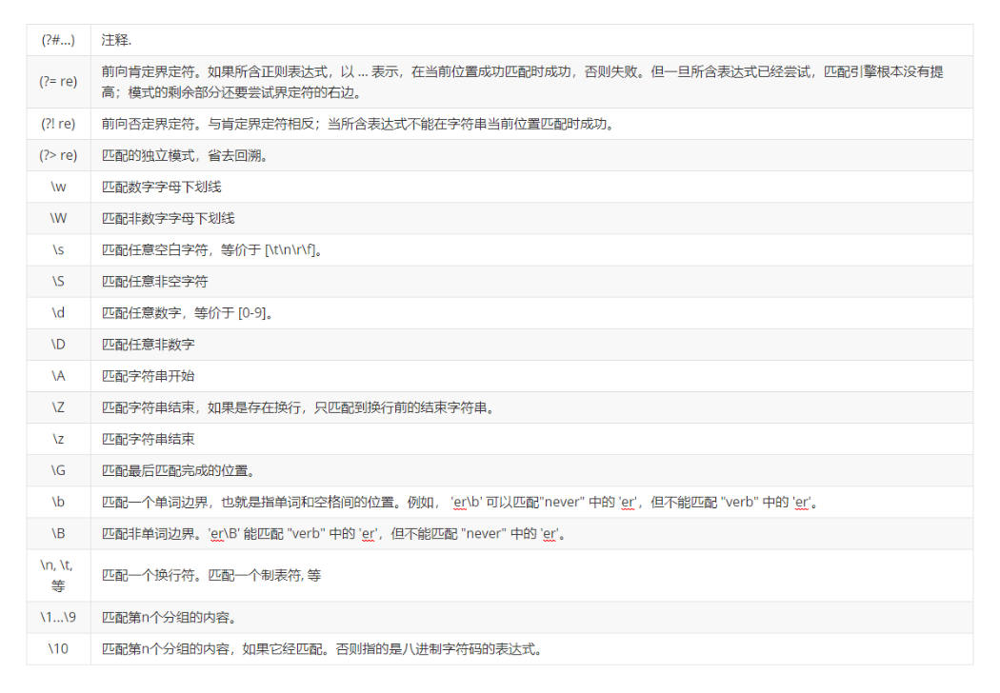


# 文件操作

## open方法

open用于打开文件， 文件格式没有限制，比如txt, csv, jpg...

语法：

```python
# file   要打开的文件的路径
# mode   打开文件的读写模式，比如：只读，写入，追加。。。
# encoding   文件内容的编码， 省略按操作系统的编码读取
open('file', 'mode', 'encoding')
```

mode的模式， 如果以二进制方式读写，在模式后面加b， 比如：rb, wb...：

+ r:   只读模式
+ w:  覆盖写模式
+ a:  追加模式
+ w+: 读写


```python
# 打开文件
f1 = open('data.txt', 'r', encoding='utf-8')
txt = f1.read() # 读取内容
print(txt)
f1.close()  # 关闭文件
```

## close方法

文件读写涉及IO操作， 打开文件用完后要及时关闭，close方法就可以关闭文件


## with关键字打开文件

```python
# 用with关键字打开文件，语句块结束后文件会自动关闭
with open('data.txt', 'r', encoding='utf-8') as f2:
    txt = f2.read()
    print(txt)
```

## 读取文件的内容

+ read（size）    读取文件，参数设置读取的大小。参数省略读所有内容
+ readline()          读取一行内容，包括换行符'\n'
+ readlines()        读取所有所有行

```python
# 用with关键字打开文件，语句块结束后文件会自动关闭
# with open('data.txt', 'r', encoding='utf-8') as f2:
#     txt = f2.read()
#     print(txt)
#

# readline每次读一行，按迭代器方式读取
with open('data.txt', 'r', encoding='utf-8') as f3:
    line = f3.readline()
    print(line)
    line = f3.readline()
    print(line)
    line = f3.readline()
    print(line)
    line = f3.readline()
    print(line)
    
    
# 一次读取所有行的内容，按行转换为list返回（每个元素是一行）
with open('data.txt', 'r', encoding='utf-8') as f4:
    lines = f4.readlines()
    print(lines)
```

## write方法

往文件写内容

注意： 如果以w方式打开文件，即便不做写操作，文件内容在打开时就已经被清空

​            写操作之后迭代器指针已经到了文件尾，所以读不了内容。需要用seek方法移动指针之后才能读取

```python
with open('data.txt', 'a+', encoding='utf-8') as f5:
    f5.write('写入新的内容\n 第二行的内容\n')
    # seek方法移动文件读取的指针。 因为写操作结束后文件访问指针已经到了文件末尾，所读不了内容
    # 只有把指针移到开头，才能再次读取
    f5.seek(0)  
    print(f5.read())
```


# 作业

1. 用文件操作功能往一个文本文件里面写入一段内容；

   读取文件内容， 查找文件中所有的指定（正则表达式）的字符串， 以迭代器的方式返回


​        wirite_txt('')

​         txt = get_txt()

​         it = MyIter(txt)

​         for s in it:

​             print(s)


```python
import re
# 写文件
f1 = open('data.txt', 'w', encoding='utf-8')
f1.write('帝高阳之苗裔兮，朕皇考曰伯庸。\n'
         '摄提贞于孟陬兮，惟庚寅吾以降。\n'
         '皇览揆余初度兮，肇锡余以嘉名。\n'
         '名余曰正则兮，字余曰灵均。\n'
         '纷吾既有此内美兮，又重之以修能。\n'
         '扈江离与辟芷兮，纫秋兰以为佩。\n'
         '汩余若将不及兮，恐年岁之不吾与。\n'
         '朝搴阰之木兰兮，夕揽洲之宿莽。\n'
         '帝高阳之苗裔兮，朕皇考曰伯庸。\n'
         '帝高阳之苗裔兮，朕皇考曰伯庸。\n'
         '帝高阳之苗裔兮，朕皇考曰伯庸。\n'
         '帝高阳之苗裔兮，朕皇考曰伯庸。\n'
         '高阳之苗裔兮，朕皇考曰伯帝ad234;庸。\n'
         '日月忽其不淹兮，春与秋其代序。')
# f1.seek(0)
f1.close()

# 读文件
with open("data.txt", 'r', encoding='utf-8') as f2:
    # 读取所有行
    lines = f2.readlines()
    # print(lines)
    # 把返回的字符串列表拼接为一个字符串
    s1 = ','.join(lines)
    # print(s1)

# 用正则表达式查找'帝高阳之苗裔兮，朕皇考曰伯庸。\n'
l1 = re.findall(r'帝.*庸', s1, re.M)
# print(l1)


# class FindStr:
#     def __init__(self, find_str):
#         self.find_str = find_str
#         self.i = -1
#
#     def __iter__(self):
#         return self
#
#     def __next__(self):
#         self.i += 1
#         if self.i < len(self.find_str):
#             return self.find_str[self.i]
#         else:
#             raise StopIteration

def getstr():
    for s in l1:
        yield s


print('找出所有指定字符串的索引为：')
# for values in FindStr(l1):
#     print(values)

for values in getstr():
    print(values)
```


# JSON

JSON（javascript object notation）是一种通用轻量级的数据交换的格式，读写非常容易，占用存储空间小，是纯文本的格式。

常用的编程语言都支持JSON, 大多数的数据库在导入导出数据时也支持JSON

JSON支持下面的几种数据类型：

+ 对象（object）： 用{}表示对象，大括号里面是键值对（之间用冒号）表示属性，多个属性用逗号分隔

+ 数组（Array）:  用[]表示数组， 数组元素之间用逗号分隔
+ 字符串（String）：用""来表示字符串，JSON中只能用双引号，不能用单引号。 属性也必须用双引号
+ 数字（Number）： 整数或小数都可以，直接写数字，不需要任何符号
+ 布尔值（Boolean）：直接写，不需要符号，但是必须用小写：true,    false
+ 空值（null）：用null

```json
{
  "name": "小明",
  "age": 22,
  "hobby": ["唱跳", "爬山", "游泳"],
  "isstudent": true,
  "money": null,
  "adrr": {
    "city": "cq",
    "postcode": 510030
  }
}
```

任何类的对象都可以转换为JSON格式的数据，JSON一般的使用场景：

+ 保存对象的状态。  用于休眠， 分布式系统开发时远程调用传递对象
+ 配置文件使用JSON格式
+ 信息系统开发用前后端数据交互


## Python对象与JSON字符串互转

使用Json要引入模块:

```python
import json
```

+ json字符串转python对象（dict）, 用loads()方法

数据类型的对象关系：

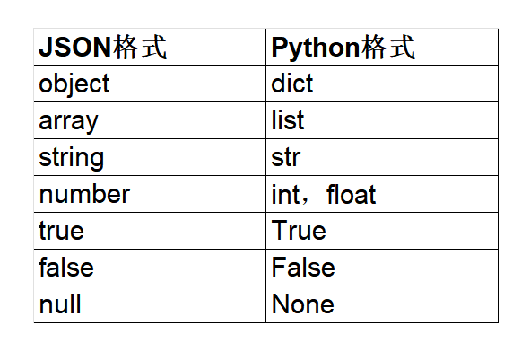


```python
import json

json_str = '''
    {
      "name": "小明",
      "age": 22,
      "hobby": ["唱跳", "爬山", "游泳"],
      "isstudent": true,
      "money": null,
      "adrr": {
        "city": "cq",
        "postcode": 510030
      }
    }
'''

py_obj = json.loads(json_str)
print(py_obj)
print(type(py_obj))
print(py_obj.get('name'))
print(py_obj.get('name'))
print(type(py_obj.get("hobby")))
```

+ python对象转json字符串， 用dumps()方法


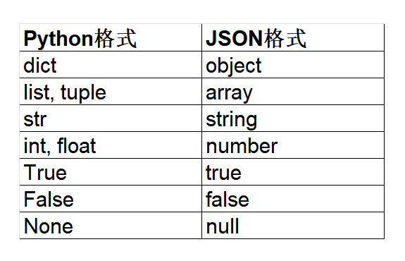

```python
import json

dict1 = {}
dict1['name'] = '小王'
dict1['age'] = 21
dict1['hobby'] = {'唱歌', '跳舞', '打篮球'}
dict1['isstudent'] = False
dict1['money'] = None
dict1['addr'] = {'city': 'gz', 'postcode': 400000}

json_str = json.dumps(dict1)
print(json_str)
```

## 读写json文件

主要用dump(),  load()两个方法

+ python对象转json并写入文件：dump()

```python
dict1 = {}
dict1['name'] = '小王'
dict1['age'] = 21
dict1['hobby'] = ('唱歌', '跳舞', '打篮球')
dict1['isstudent'] = False
dict1['money'] = None
dict1['addr'] = {'city': 'gz', 'postcode': 400000}

with open('student.json', 'w') as f1:
    # 把python对象转换为字符串，并且写入到文件
    json.dump(dict1, f1)
```

+ 读json文件，并转python对象： load()

```python
with open('student.json', 'r') as f2:
    py_obj = json.load(f2)
    print(py_obj)
```


练习： 把下列对象转json, 存储到json文件； 然后再从JSON文件读取出来，转为python对象

```python
# {name:'人工智能中的数学', author:'汤姆森', price:85.5}

import json

# Python对象
data = {
    'name': '人工智能数学',
    'author': '汤普森',
    'price': '85'
}

# 将Python对象转换为JSON格式的字符串
json_string = json.dumps(data)

# 将JSON字符串写入文件
with open('data.json', 'w', encoding='utf-8') as f1:
    json.dump(data, f1)

# 从文件中读取JSON字符串
with open('data.json', 'r', encoding='utf-8') as f2:
    json_data = json.load(f2)
    print(json_data)
```


# NumPy

NumPy（Numerical Python）是python的一个针对数字多维数组的处理的第三方库，提供很多创建和运算方法，使用广泛

安装numpy

```python
pip install numpy
```


## 标量、向量、矩阵、张量

+ 标量（Scalar）

  单独的一个数字，包含实数，复数。 一般用小写字母表示，如：a,    x

  ```python
  5
  3.14
  ```

  

+ 向量（Vector）

  一组数字（一维数组）按一定顺序排列就称为向量。 一般小写字母v表示

  ```python
  [1, 3, 5, 7]
  [1.5, 2.6, 3.9]
  ```

  

+ 矩阵（Matrix）

  二维数组，由行和列组成。一般用大写字母如A来表示

  ```python
  [
      [1, 2]
      [3, 4]
  ]
  ```

  

+ 张量（Tensor）

  多维数组，包含标量，向量，矩阵作为它的元素。一般用大写字母T表示

  ```python
  [
      [
          [1, 2, 3], 
          [4, 5, 6]
      ],
      [
          [7, 8, 9], 
          [10, 11, 12]
      ]
  ]
  
  
  
  [[[[[[[[[[1]]]]]]]]]
  
  ```

  

张量是一个通用的概念，0维的张量就是标量；1维张量就是向量；2维的张量就是矩阵

## 矩阵运算

+ 加减运算

  加法和减法是一样的规则：对应位置的数字相加/减， 得到是结果矩阵的响应位置的数字

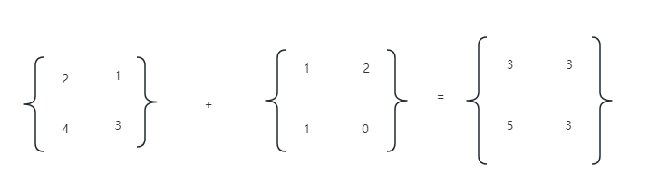

+ 矩阵的数乘

用一个数字乘以一个矩阵：用数乘以矩阵的每一个元素，得到结果矩阵对应位置的数字

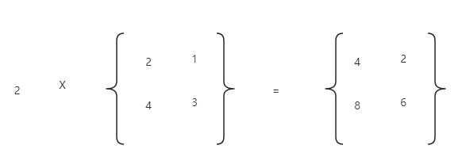

+ 矩阵乘法

  第一个矩阵的列数要等于第二个矩阵的行数， 这样的两个矩阵才可以相乘

  乘积的矩阵的形状是第一个矩阵的行 ，第二个矩阵的列数

  A(m, n) X B(n, k)=C(m, k)

  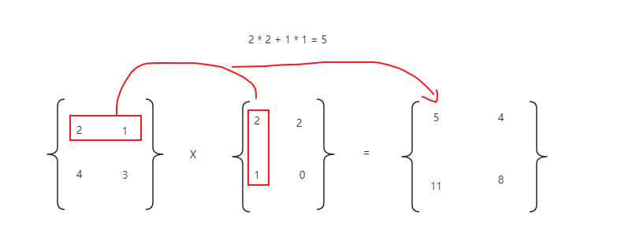

  

+ 矩阵的转置

  矩阵的行列对调，得到一个新的矩阵，这就叫转置

  原矩阵的列变结果矩阵的行

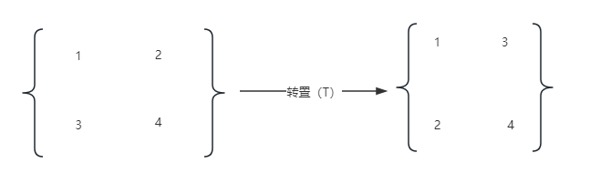

## 创建数组

```python
# 安裝numpy库： pip install numpy
import numpy as np

# 参数是一维的List
arr1 = np.array([1, 2, 3])
print(arr1)
arr1 = np.array(range(5))
print(arr1)


# 参数是二维list, 创建出二维数组
arr2 = np.array([[1, 2, 3, 4], [5, 6, 7, 8]])
print(arr2)

# 用数据类型方法创建指定数据类型的数组
a = np.float32([[1, 3],[2, 4]])
print(a)

# ndmin 指定生成的数组的维度， 第一个参数只作为多维数组的一个元素
arr3 = np.array([1, 2, 3, 4, 5], ndmin=2)
print(arr3)  #  [[1 2 3 4 5]]


# 创建3行2列的空数组， 它dtype设置的类型随机生成数据
# dtype的设置： np.int32; np.int64; np.float32;  np.float64; 'i4'(4字节整数); 'f4'（4字节小数）;  'S1'(1位字符串);  'S2'
arr4 = np.empty((3, 2), dtype=np.int32)
# 用astype方法转换数据类型
# arr4 = np.empty((3, 2)).astype(np.float32)
print(arr4)


# 生成全0的数组， 如果生成一维数组，shape参数不需要元组，直接传数组。
# 0也是有整数和小数的表示方式，所以zeros方法也可以数据类型
# arr5 = np.zeros(5, dtype='i4')
arr5 = np.zeros((5,), dtype='i4')
print(arr5)
arr6 = np.zeros((3, 3, 3), dtype='f4')
print(arr6)

# 创建全为1的一维数组， 默认数据类型是浮点数
arr6 = np.ones(5)
print(arr6)
arr7 = np.ones((2, 3), dtype=np.int32)
print(arr7)

# 创建一个象某个数组一样（形状，数据类型）的全零的数组
arr7 = np.zeros_like(arr2)
print(arr7)
arr8 = np.ones_like(arr2)
print(arr8)

# 创建跟某个数组一样的数组，形状和数据都一样
arr9 = np.asarray(arr6)
print(arr9)

# 通过迭代器生成数组， 必须指定数据类型dtype， 否则要报异常
it = iter([1, 2, 3, 4, 5])
arr10 = np.fromiter(it, dtype=np.float32)
print(arr10)

# 生成等差数列
# 从start 到 stop参数的区间，平均分为num份， 返回每一个点的坐标
arr11 = np.linspace(-1, 1, 10)
print(arr11)

# 等比数列
# 生成以base为底，  start到stop之间取num个数作为指数
# 本例的结果： 10^1   10^1.25    10^1.5   10^1.75  10^2
arr12 = np.logspace(start=1, stop=2, num=5, base=10)
print(arr12)

# 返回正态分布数据
arr13 = np.random.randn(3, 2)
print(arr13)

# 产生0~1之间的随机数数组
arr14 = np.random.rand(3, 2)
print(arr14)
```


# 作业

1. 把如下的字符串转为python对象，打印 prd_price属性的值

   '{"prd_no": 20240710001, "prd_name": "I7 CUP"，"prd_type": "I7", "prd_price": 1000, "prd_provider":"intel" }'

   ```python
   import json
   json_string = '{"prd_no": 20240710001, "prd_name": "I7 CUP", "prd_type": "I7", "prd_price": 1000, "prd_provider":"intel"}'
   data_dict = json.loads(json_string)
   print(data_dict['prd_price'])
   ```

   

2. 什么是标量、向量、矩阵、张量？它们之间有什么联系？

   标量是数字，相当于0维张量

   向量是一组数据，相当于是一维张量
   矩阵是二维数组，相当于二维张量
   张量是多维数组

3. 计算下面两个矩阵的乘积

```python
[
    [3, 5, 7],                  
    [4, 6, 9]
]
* 
[
    [2, 3],
    [3, 4],
    [1, 2]
]
= 
[
   [28, 43]
   [35, 54]
]
```

## 数组的属性

numpy用ndarray的对象来保存和执行数组的操作， 它有一些属性

| 属性     | 描述                                                         |
| -------- | ------------------------------------------------------------ |
| shape    | 数组的形状（各个维度数量），对于矩阵，指的是m行, n列， 返回元组类型 |
| ndim     | 数组的维度，一维数组返回1， 二维数组返回2                    |
| size     | 数组里面元素的数量                                           |
| dtype    | 数组元素的数据类型， 如int64,  float64                       |
| itemsize | 每个数组元素的所占的存储空间的字节数， 如：8                 |

```python
a = np.arange(15)
print(a)
# 数组的形状， 各个维度的数量
print(a.shape)
print(a.ndim)
print(a.size)
print(a.dtype)
print(a.itemsize)

# 改变形状
b = a.reshape(3, 5)
print(b.shape)
print(b)
print(b.ndim)
print(b.size)
print(b.dtype)
print(b.itemsize)
```

## numpy数组的数据类型

+ 整型：   int8,   int16, int32, int64;    'i8'
+ 无符号整型： uint8, uint16, uint32, uint64
+ 浮点数： float16,   float32, float64;     'f8'
+ 复数： complex64,   complex128
+ 布尔型： bool,  只有True和False两个值
+ 字符串： str,   'S1'

```python
a = np.arange(5, dtype=np.int64)
a = np.arange(5, dtype='i8')
print(a.dtype)
a = np.arange(5, dtype=np.float64)
a = np.arange(5, dtype='f8')
print(a.dtype)
a = np.array(['a', 'b', 'c'], dtype='S1')
print(a.dtype)
a = np.array([True, False], dtype=np.bool)
print(a.dtype)
```

## 数组的运算

numpy数组支持一些数学运算

加减乘除都是每一位的对应数字做相应的运算，一维或多维数组都一样

sum(), max(), min(), mean()这个几个汇总函数默认对所有元素汇总。 如果设置了参数axis， 为0表示纵向（按列）汇总；1表示横向（按行）汇总

```python
import numpy as np

a = np.array([1, 2, 3])
b = np.array([4, 5, 6])

# 加法运算是对应元素相加
print(a + b)
print(a - b)

# 乘法运算对应位乘法
print(a * b)
print(a / b)

# 平方根
print(np.sqrt(a))
# e的多少次方
print(np.exp(a))

# a = np.arange(12).reshape(3, 4)
a = np.arange(1, 7).reshape(2, -1)
b = a
print(a)
print(b)
print('a+b', a + b)
print('a-b', a - b)
print('a*b', a * b)
print('a/b', a / b)
print(np.sqrt(a))
print(np.exp(a))

print(a)
# 求和， 所有元素相加
print(a.sum())
# axis=0  纵向（列）汇总
print('axis=0', a.sum(axis=0))
# axis = 1 横向（行）汇总
print('axis=1', a.sum(axis=1))
print(a.max())
print(a.min())
print(a.mean())

# 按指定轴向找出最大值的下标：
arr = np.array([[20, 2, 12],
                [4, 15, 6],
                [7, 10, 9]])

max_index_axis0 = np.argmax(arr, axis=0)
max_index_axis1 = np.argmax(arr, axis=1)

print("沿着轴0的最大值索引：", max_index_axis0)
print("沿着轴1的最大值索引：", max_index_axis1)
```

## 数组转置

把列变为行，相当于旋转90度

用于连个一维数组做矩阵乘法，就先把其中一个转置

```python
import numpy as np

a = np.arange(12).reshape(3, 4)
print(a)
# 把原数组的列依次变为新数组的行，这个操作称为转置
print(a.transpose())
# .T也是做转置运算
print(a.T)


# 装置的应用： 两个数组， 求每一位乘积的和
a = np.array([1, 2, 3])
b = np.array([2, 3, 4])
# 把其中一个转置， 利用矩阵的点积运算dot()
print(np.dot(a.T, b))

```


## 切片访问

多维数组切片类似列表切片，每个维度上都当成一维数组来处理

省略号（...）等效于全部选择，相当于:或::的效果

```python
import numpy as np

a = np.arange(10)
print(a)
print(a[2: 7: 2])
# 切片的下标也可以用slice函数创建
# b = slice(2, 7, 2)
# print(a[b])

print(a[::])
print(a[:])
print(a[1::])
print(a[:-5:-1])
print(a[::-1])


a = np.arange(16).reshape(4, 4)
print(a)
print(a[::])
print(a[:])
# 多维数组切片就要多个切片参数，参数之间用逗号分开
# 0~2行， 0~2列
print(a[0:2, 0:2])
# 0~2行，所有列
print(a[0:2, :])

# 1~3行， 1~3列
print(a[1:3, 1:3])
# 0~3行， 从0列开始，步长为2
print(a[0:3, 0::2])

# 省略号(...)的用法: 所有行（或列）， 等价于:(或::)
# 截取第二列
print(a[..., 1])
print(a[1, ...])
print(a[..., 1:])


a = np.arange(64).reshape(4, 4, 4)
print(a)
# print(a[1, 1, 1])
print(a[..., 1:3 , 1:3])
```


## 数组的遍历（迭代）

遍历多维数组的所有元素，用flat属性

```python
import numpy as np

l = [0, 1, 2, 3, 4]
print(l)

a = np.arange(5)
print(a)
# 一维数组遍历出来就是元素
for i in a:
    print(i)


b = np.arange(20).reshape(4, -1)
print(b)
# 多维数组的遍历， 取出第一个维度的所有元素，返回数组（原来的维度-1）
for x in b:
    print(x)

# b.flat 把多维数组展开为一维数组。
for item in b.flat:
    print(item)

# 展开三维数组
c = np.arange(48).reshape(4,3,-1)
print(c)
for y in c.flat:
    print(y)
```


## 改变数组的形状

reshape()不改变原数组的形状，返回一个新的数组

resize()直接改变原数组的形状

```python
import numpy as np

a = np.arange(12)
print(a)
b = a.reshape(3, 4)
print(b)
b = a.reshape(6, 2)
print(b)
b = a.reshape(2, -1)
print(b)
# resize()直接改变原数组的形状，功能跟reshape()一样
a.resize(3, 4)
print(a)
```


## 数组的合并


```python
import numpy as np

a = np.floor(10 * np.random.random((2, 2)))
print(a)

b = np.floor(10 * np.random.random((2, 2)))
print(b)

# d = np.floor(10 * np.random.random((3, 2)))
# print(d)

# 垂直方向堆叠， 把两个(多个)数组的行拼接成一个新的数组
# 要求堆叠方向上的形状要一致
c = np.vstack((a, b))
print(c)
print(c.shape)

# 水平堆叠， 把后面数组的行依次拼接到第一个数组每行的后面
# 要求多个数组的行的形状要一致
c = np.hstack((a, b))
print(c)

# 三个单通道图片合并为彩色图
r = np.zeros((3, 4, 1), dtype=np.uint8)
r[...] = 100
g = np.zeros((3, 4, 1), dtype=np.uint8)
g[...] = 100
b = np.zeros((3, 4, 1), dtype=np.uint8)
b[...] = 255
# print(b)
img = np.concatenate((r, g, b), axis=2)
print(img)
plt.imshow(img)
plt.show()


```

## 数组拆分

```python
#   水平拆分
a = np.floor(10 * np.random.random((4, 6)))
print(a)
# 水平拆分，把原数组拆分为n个数组， 平均分配列。 原数组的列数必须要能整除拆分的数组的个数
b = np.hsplit(a, 2)
# print(b)
# 第二个参数如果是元组， 就以元组设定列的序号作为一个数组，另外的前后两部分各为一个数组，共返回三个数组
b = np.hsplit(a, (2, 5))
print(b)


# 垂直拆分
a = np.floor(10 * np.random.random((6, 3)))
print(a)
b = np.vsplit(a, 3)
# print(b)
b = np.vsplit(a, (2, 5))
print(b)
```

## 数组扩充

在数组外围扩充数据，有固定值填充；边缘值填充；线性递减填充

```python
import numpy as np

# 创建一个原始数组
original_array = np.array([[1, 2, 3], [4, 5, 6]])

# 应用常数填充，宽度为1，填充值为0
padded_array = np.pad(original_array, pad_width=1, mode='constant', constant_values=0)

print(padded_array)
# 应用边缘值重复填充，宽度为2
padded_array = np.pad(original_array, pad_width=2, mode='edge')

print(padded_array)
# 应用线性递减填充，宽度为(1, 2)，即行列前面填充1个，行列后面填充2个
# 边缘值0往前一次递增，小数取整， 如： 0, 3, 6;     0, 2.5(取整为2), 5
padded_array = np.pad(original_array, pad_width=(1, 2), mode='linear_ramp', end_values=0)

print(padded_array)

```


## 拷贝和视图

view()和切片操作是浅拷贝;   copy()是深度拷贝

浅拷贝形状互不干扰，但是数据共用，修改任意一个副本的数据，所有相关的数组都受影响

深度拷贝是完全独立的两个数组，相互之间没有任何影响

```python
import numpy as np

# 没有复制数组（使用同一个数组）
a = np.arange(12)
b = a
print(b is a)
# 对形状属性赋值可以直接多个数字 3, 4  或元组都可以(3, 4)
b.shape = (3, 4)  # 3, 4
print(b)
print(a.shape)


# 浅拷贝.  形状相互不影响，但是数据会影响
a = np.arange(12)
c = a.view()
print(c is a)
print(c.base is a)
c.shape = (2, 6)
print(c)
print(a.shape)
c[0][0] = 99
print(a)
# 切片的数组也是浅拷贝
s = a[3:5]
print(s)
# 切片方式对数组赋值
s[:] = 88
print(a)

#深度拷贝
d = a.copy()
print(d is a)
print(d.base is a)
del a
d[4:6] = 100
print(d)
```


## 数组作为下标（索引）

访问数组时，下标可以用固定值； 可以用切片；还可以用数组

```python
import numpy as np

# 生成0到11的数组，每个元素进行平方运算
a = np.arange(36) ** 2
print(a)
i = np.array([1, 5, 8, 9])
# 数组作为下标访问
print(a[i])


j = np.array([
        [3, 4],
        [9, 7]
    ])
# 二维数组作为下标，返回的数组跟它是一样的形状。用每一个元素作为下标从a数组取值，放在当前位置
print(a[j])


a = a.reshape(6, 6)
print(a)
i = np.array([
        [0, 1],
        [1, 2]
    ])
j = np.array([
        [2, 1],
        [3, 3]
    ])
# 返回的形状跟下标的数组形状最大的一致。用i的元素作为行，用j的元素作为列去查找数据
# 两个下标数组的形状完全一致或可以通过广播扩展到一致
# print(a[i, j])
# 返回一个与i形状相同的数组，用i的每个元素作为行坐标，用2作为列坐标
# print(a[i, 2])
# 用i的每一个元素作为行坐标，与每一个列查找数据。 i的每一行返回一个数组
print(a[i, ...])
# 遍历第一个维度的每一行，每一行都会返回一个与j形状相同的数组。 行坐标就用遍历行号，列坐标用j的每一个元素
# print(a[:, j])
```


## 广播机制

多维数组在做算术运算时， 如果两个数组的形状不同，通过广播机制（自动执行）扩充数组，最后使两个数组形状完全一样，从而能够实现算术运算

```python
import numpy as np

a = np.array([[0, 0, 0],
              [10, 10, 10],
              [20, 20, 20],
              [30, 30, 30]
            ])
b = np.array([0, 1, 2])
# tile() 扩展数组， 4：把行重复4遍， 1保持列不变
# b = np.tile(b, (4, 1))
print(b)

print(a + b)
```

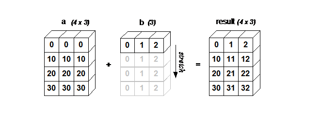

**广播的规则：**

1.  维度相同

+ 如果两个数组的维度数相同， 可以将维度为1的部分广播（复制）
+ 除了为1的维度之外，其它维度数量要相同

2. 维度不同

   在前面（左侧）添加维度， 也是可以广播


参考资料： https://zhuanlan.zhihu.com/p/667046754


# 作业

1. 简述Numpy数组对象(ndarray)有哪些属性，分别是什么意思？

   arr.shape  数组的形状
   arr.ndim  数组的维度
   arr.size  数组的元素数量
   arr.dtype  数组元素的数据类型
   arr.itemsize  每个数组元素的所占字节数

2. 分别求下图数组中每行每列的和， 平均值，最大值，最小值

   ```python
   import numpy as np
   
   a = (np.arange(36) ** 2).reshape(6, 6)
   print(a)
   print(a.sum())
   print(a.mean())
   print(a.max())
   print(a.min())
   # 按列统计
   print(a.sum(axis=0))
   print(a.mean(axis=0))
   print(a.max(axis=0))
   print(a.min(axis=0))
   # 按行统计
   print(a.sum(axis=1))
   print(a.mean(axis=1))
   print(a.max(axis=1))
   print(a.min(axis=1))
   ```

   

3. 从下图数组切片取出如下的子数组：

   ```python
   import numpy as np
   
   a = (np.arange(36) ** 2).reshape(6, 6)
   print(a)
   
   print(a[2:5, 1:5])
   ```

   

   

   

   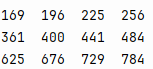

4. 把下图数组拆分为三个子数组：

```python
import numpy as np

a = (np.arange(36) ** 2).reshape(6, 6)
print(a)

b = np.hsplit(a, (2, 3))
print(b)
```


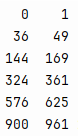


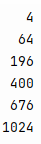

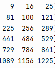

5. 判断如下的数组进行运算时能否广播

​     A(4, 1, 2)    B(1, 3, 1)

​				维度相同， A广播为(4, 3, 2),  B广播(4, 3, 1), B再广播（4， 3， 2）

A(4, 3, 2) B(3,2)

​		B的左侧增加一个维度（1, 3, 2）, B广播（4, 3, 2）

A(4, 3, 2) B(2,)

​		B左侧增加两个维度（1， 1， 2）， 再广播（4， 3， 2）

A(4, 3, 2) B(4, 3)

​		B不能在右侧增加维度， 如果在左侧增加维度的话，A(4, 3, 2)与B(1，4，3)， 后面两个维度形状不一样，并且没有1，所以不能广播

A(4, 3, 2) B(2, 3, 2)

​		B的第一个维度不是1， 不能广播

​	   


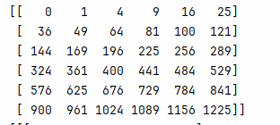

## rollaxis()滚动轴

np.rollaxis(a, axis, start)

a   数组

axis  要滚动的轴的序号

start  滚动到的位置

滚动之后，新位置的轴以及它后面的轴都要往右（后）移动，产生新的轴的顺序。

滚动轴后，数组里的所有的元素的坐标都按这个规律移动。 在数组中按新坐标排它的位置

```python
import numpy as np

# np.rollaxis(a, axis, start)
#  a   数组
#  axis  要滚动的轴的序号
#  start  滚动到的位置
a = np.arange(24).reshape(2, 3, 4)
# print(a)
# where()返回元素的坐标， 参数条件表达式
# print(np.where(a == 6)) # [1, 1, 0]
# print(np.where(a == 2)) # [0, 1, 0]

b = np.rollaxis(a, 2, 0) # start参数省略，默认为0， 滚动到最前面
# print(np.where(b == 6)) # [0, 1, 1]
# print(np.where(b == 2)) # [0, 0, 1]
# print(b)
print(b.shape)

c = np.rollaxis(a, 2, 1)
print(c.shape)

d = np.rollaxis(a, 1, 2)
print(d.shape)

print(np.rollaxis(a, 1, 0).shape)

print(np.rollaxis(a, 0, 1).shape)

print(np.rollaxis(a, 0, 2).shape)
print(np.rollaxis(a, 0, 3).shape)


```


下图是原数组以及每个元素的坐标


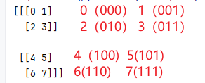


下图是原数组做了滚动np.rollaxis(a, 2, 0)之后的每个元素的新坐标以及数组中元素的顺序

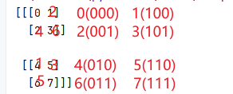


## swapaxes()交换轴

np.swapaxes(a, 0, 2),   把第二和第三个参数指定的轴交换位置， 所有元素的坐标也用相应的方式交换位置产生新坐标

如： 原来的shape(2， 3， 4)    np.swapaxes(a, 0, 2) 之后 （4， 3， 2）

​        原来的shape(2， 3， 4)    np.swapaxes(a, 0, 1) 之后 （3， 2， 4）

```python
a = np.arange(8).reshape(2, 2, 2)
# a = np.arange(24).reshape(2, 3, 4)
print(a)
print(a.shape)
print(np.where(a==0))
print(np.where(a==1))
print(np.where(a==2))
print(np.where(a==3))
b = np.swapaxes(a, 0, 2)
print(b)
print(b.shape)
print(np.where(b==0))
print(np.where(b==1))
print(np.where(b==2))
print(np.where(b==3))
```


# Pandas

Pandas主要处理类似关系型数据库的表， 或者excel这样的表格数据的库，能处理异构数据

Pandas主要包含两个对象：

+ Series,  一维的数组， 它的数据是同构的。用来处理表格的一个列或者一个行。
+ DataFrame, 处理异构的二维（行列表格）的数据，用来处理excel的一个sheet 


导入模块：

```python
# pip install pandas
import pandas as pd
```


## 创建对象

一般创建Series和DataFrame

pd.Series(列表或数组)

创建DataFrame有如下方式：

+ pd.DataFrame(data,  index, columns)

  data         是数据，二维数组

  index       第一列索引，可以不设置，自动用从0开始序号代替

  columns  每一列的标题。省略的话自动用0开始的数字代替

+ pd.DataFrame({})

  ​	参数字典里面Key就是标题， value就是列的数据


```python
import pandas as pd
import numpy as np

s = pd.Series([1, 3, 5, 8]) # int64类型
# s = pd.Series([1, 3, 5, 8, np.nan]) # int64类型
# s = pd.Series([1, 3, 5, np.nan, 8, 3.14])  # float64
# s = pd.Series([1, 3, 5, np.nan, 8, 3.14, 'a'])  #object
print(s)

# 创建一个日期的序列，返回DatetimeIndex
dates = pd.date_range('20240701', periods=7)
print(dates)

# index和columns参数可以省略，如果省略不写，自动生成数字序列作为index或标题
# 如果设置了index和columns， index的长度跟数据的行数一致； columns的数量也要跟数据列数相同
df1 = pd.DataFrame(np.random.randn(7, 5), index=dates, columns=list('ABCDE'))
print(df1)

# 用字典作为参数生成dataframe， key就是标题， value是这一列的内容.
# 每一列长度相同或者可以广播为相同
df2 = pd.DataFrame({
    'A': [1, 2, 3, 4, 5],
    'B': ['a','b','c','d','e'],
    'C': 1,
    'D': pd.Timestamp('20240724'),
    'E': pd.Series(np.arange(5)),
    'F': np.arange(1, 6),
    'G': 'aaa',
    'H': pd.Categorical(['男','女','女','男','女'])
})
print(df2)
```

## 查看数据

```python
# 查看数据
print(df1.head(3)) # 返回前面3行数据
print(df1.tail(3))  # 返回最后三行数据
print(df1.index)  # 返回所有索引
print(df1.columns)  # 返回所有标题
print(df1.describe())  # 返回每一列的数量，平均值，最大最小，标准差等信息

print(df1)
# axis=0, 按行排序； axis=1，按列排序
print(df1.sort_index(axis=1, ascending=False))

# 按照指定列的值进行排序
print(df1.sort_values(by='A'))

# DateFrame对象转Numpy数组。 只会转数据部分，索引不会转
a = df1.to_numpy()
print(a)
```

## 按索引获取数据

```python
# 获取数据
#  返回指定列的数据, 参数是列名（标题名）
print(df1['A'])
print(df1.A)  #  返回列数据简化写法

# 切片方式返回行
print(df1[0: 3])  #  用序号切片
print(df1['20240702': '20240704'])  # 用索引切片， 包含结束位置

# 用行的索引返回一列数据，返回的类型为Series
print(df1.loc['20240701'])
# 返回指定行列的单元格的数据
print(df1.loc['20240701', 'A'])
# 切片访问，不能用序号，用索引
print(df1.loc['20240701': '20240703', 'A': 'C'])
print(df1.loc['20240701': '20240703', ['A', 'C']])
```


## 按位置获取数据

```python
# 按位置获取数据
print(df1.iloc[3])  #  返回行号为3的这一行的数据
print(df1.iloc[0: 2, 1: 3])  # 返回从0到2行， 从1到3列这个区间内的数据（区间左闭右开）
print(df1.iloc[..., 2: 4])
print(df1.iloc[0:3, :])
print(df1.iloc[1, 1])
df1.iloc[1, 1] = 888
print(df1)
#  增加一行数据
df1.loc[pd.Timestamp('20240708')] = [0, 0, 0, 0, 0]
#  新增一列数据
df1['F'] = 1
print(df1)

```


## 按条件选择数据

```python
# 按条件选择
print(df1[df1.A > 0])  #  返回A列大于0的所有行（整行）
print(df1[df1 > 0])  # 返回表格完整的形状，大于0原样返回数据，小于0用NaN填充
```


## 赋值

```python
# 整列赋值. 赋值一个Series对象， Series要指定index
df1['A'] = pd.Series(np.arange(8), index=df1.index)
print(df1)
# 单元格赋值
df1.loc['20240702', 'B'] = 999
df1.iloc[1, 1] = 666
# 给切片出来的矩阵赋值， 赋值的形状要跟切片形状相同
df1.iloc[2: 3, 2: 4] = np.array([555, 777]).reshape(1, 2)
# 根据条件赋值
df1[df1 < 0] = np.abs(df1)
# 删除列
# del df1['F']
# 删除列。 返回删除后的DataFrame
print(df1.drop('F', axis=1))
# 删除行。 返回删除后的DataFrame
print(df1.drop('20240703', axis=0))

#  增加一行数据
df1.loc[pd.Timestamp('20240708')] = [0, 0, 0, 0, 0]
#  新增一列数据
df1['F'] = 1
print(df1)


```

## 输入输出到文件

```python
# 把DataFrame保存为excel文件
# 如果环境没有安装 openpyxl的库，需要安装： pip install openpyxl
df1.to_excel('demo.xlsx', sheet_name='测试页')


# 读取excel文件，返回DataFrame。 index_col用于指定索引列的序号，如果不设参数，自动生成0开始的数字序号的索引列
df3 = pd.read_excel('demo.xlsx', '测试页', index_col=0)
print(df3)
```


# 作业

1. 有如下三维数组(2, 2, 2),  执行轴滚动rollaxis(a, 2, 1),  写出滚动后的数组的内容，然后用代码验证是否正确

   ```python
   [
       [
           ['a', 'b'],
       	['c', 'd']
       ],
       [
           ['e', 'f'],
       	['g', 'h']
       ]
   ]
   
   ```

   ```python
   # 分析过程：
   # 转换之后的坐标
   [
       [
           ['a'(000), 'b'(010)],
       	['c'(001), 'd'(011)]
       ],
       [
           ['e'(100), 'f'(110)],
       	['g'(101), 'h'(111)]
       ]
   ]
   # 输出结果
   [
       [
           ['a', 'c'],
       	['b', 'd']
       ],
       [
           ['e', 'g'],
       	['f', 'h']
       ]
   ]
   
   #
   # 验证代码
   import numpy as np
   a = np.array([
       [
           ['a', 'b'],
       	['c', 'd']
       ],
       [
           ['e', 'f'],
       	['g', 'h']
       ]
   ])
   b = np.rollaxis(a, 2, 1)
   print(b)
   ```

   

   

2. 创建一个学生的DataFrame,   以学号为索引， 包含列：姓名，性别，年龄

      创建好再往DataFrame添加两个学生

      保存为excel文件


```python
import pandas as pd

df1 = pd.DataFrame([['张三', '男', 20], ['李四', '男', 18], ['王芳', '女', 22]], columns=['姓名', '性别', '年龄'])
df1.index.name = '学号'
df1.loc[3] = ['王瑶', '男', 22]
df1.loc[4] = ['林洛瑶', '女', 18]
df1.to_excel('students.xlsx', sheet_name='1班')
```


1. 读取excel, 查找到姓名最后一个字为‘瑶’的同学，打印他的年龄


```python
df2 = pd.read_excel('students.xlsx', '1班', index_col='学号')
# 先用条件筛选出符合条件的DataFram, 遍历显示
p = df2[df2['姓名'].str.endswith('瑶')]
for i in p.index:
    print(p.loc[i, '姓名'], p.loc[i, '年龄'])
    
    
## 直接遍历所有行，判断姓名是否符合要求
# for i in df2.index:
#     if df2.loc[i, '姓名'].endswith('瑶'):
#         print(df2.iloc[i, 0], df2.iloc[i, 2])
```


# Matplotlib

Matplotlib是Python的绘图库，用于数据的可视化，可以生成多种样式图形：线型图， 散点图，等高线图，柱状图，3D图形，动画图形。。。

官网：https://matplotlib.org/


## 安装导入库

主要使用matplotlib下面的一个子库pyplot, 直接导入pyplot模块

```python
# pip install matplotlib
import matplotlib.pyplot as plt
```

## plot（）绘制直线

语法：

```python
plot(x, y, [fmt], **kwargs)
```

[fmt] 参数设置线条的颜色，粗细样式。字符串，可以用下面颜色和线型组合使用： 如 'r-'  红色实线；  'g--'  绿色虚线

1. 颜色设置

   + 'b'    蓝色
   + 'g'    绿色
   + 'r'    红色
   + 'w'    白色
   + 'k'     黑色
2. 线型

   + '-'   实线
   + '--'   虚线
   + ':'   点线
   + '-.'   点划线

**kwags参数

	+  linewidth      线宽度
	+  color             颜色：   color='red' 或  color='#FF0000'
	+  linestyle        线型， linestyle='--'


```python
# pip install matplotlib
import matplotlib.pyplot as plt
import numpy as np

# x坐标数组
xp = np.array([1, 10])
# y坐标数组
yp = np.array([2, 6])
# 设置图形的数据
plt.plot(xp, yp)  # 默认样式， 蓝色实线
# plt.plot(xp, yp, 'r--')  #  红色虚线
# plt.plot(xp, yp, color='red', linewidth=5, linestyle='--')  # 红色虚线，线宽5
# 显示图形
plt.show()
```


## 绘制折线

+ 如果给出点不在一条直线， 画出来的就是折线
+ x可以省略， 省略就用从0开始的整数序列代替

```python
import matplotlib.pyplot as plt
import numpy as np

# 给出的坐标点如果不在一条直线上，那么绘制的就是折线
x = np.array([0, 1, 2, 3, 4])
y = np.array([10, 6, 7, 3, 5])
plt.plot(x, y)
# x可以省略， 如果不设置x, 那么自动使用从0开始的整数序列做为x的点
# plt.plot(x)
plt.show()
```


## 绘制曲线

坐标点要足够多，才能绘制光滑的曲线

同一个坐标系可以画多个图形，多次调用plot（）方法

```python
import matplotlib.pyplot as plt
import numpy as np

x = np.arange(0, 10, 0.1)
# print(x)
y = np.sin(x)
y2 = np.cos(x)
# print(y)
plt.plot(x, y)
# 一个坐标系可以设置多组数据，会画出多个图形
plt.plot(x, y2)
plt.show()
```

## 坐标的标签和图形的标题

+ xlabel()     x坐标的标签
+ ylabel()    y坐标的标签
+ title()       图形的标题


#### 坐标轴标签和标题中文乱码的问题

方式一：自己下载的字体

原因是Matplotlib不支持中文，要解决它就自己下载相应的字库。

下载一个叫思源黑体的开源的字库，下载地址：https://source.typekit.com/source-han-serif/cn/

+ 下载界面有很多字体选择：

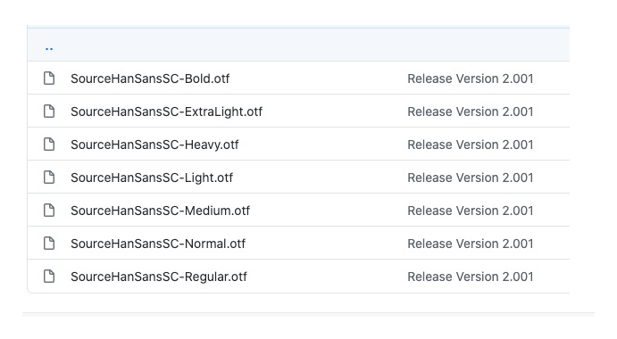

随便下载一种，比如：SourceHanSansSC-Normal.otf

+ 下载后放到项目当前目录：

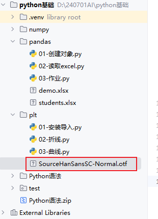


+ 在代码中加载字库： zk = matplotlib.font_manager.FontProperties(fname='SourceHanSansSC-Normal.otf')

  设置标签和标题时使用字库： plt.xlabel('0~0的等距的点', fontproperties=zk)

```python
import matplotlib
import matplotlib.pyplot as plt
import numpy as np

plt.rcParams['font.sans-serif'] = ['SimHei']
# 加载字库文件
zk = matplotlib.font_manager.FontProperties(fname='SourceHanSansSC-Normal.otf')

x = np.arange(0, 10, 0.1)
# print(x)
y = np.sin(x)
y2 = np.cos(x)
# print(y)
plt.plot(x, y)
# 一个坐标系可以设置多组数据，会画出多个图形
plt.plot(x, y2)

# 设置fontproperties的值为加载的字库名
plt.xlabel('0~0的等距的点', fontproperties=zk)
plt.ylabel('三角函数', fontproperties=zk)
plt.title('正弦余弦曲线多图显示', fontproperties=zk)

plt.show()
```

方式二： 操作系统字体

```python
import matplotlib
import matplotlib.pyplot as plt
import numpy as np

# 使用字体
plt.rcParams['font.sans-serif'] = ['FangSong']
# 解决符号显示乱码
plt.rcParams['axes.unicode_minus'] = False

x = np.arange(0, 10, 0.1)
# print(x)
y = np.sin(x)
y2 = np.cos(x)
# print(y)
plt.plot(x, y)
# 一个坐标系可以设置多组数据，会画出多个图形
plt.plot(x, y2)

plt.xlabel('0~0的等距的点')
plt.ylabel('三角函数')
plt.title('正弦余弦曲线多图显示')

plt.show()
```


## 网格线

参数说明：

第一个参数是布尔型，如果不设置或设为True显示网格线：设为False不显示

which:   可选参数。 值有'major'、'minor'和'both'

axis:  可选参数。 值有'x',  'y', 'both'

```python
plt.grid(True ,which='both', axis='both')
```


## 绘制多个坐标系

用subplot（）和subplots（）这些方法来绘制多个子图

### subplot（）

语法：

nrows     子坐标系的行数

ncols        子坐标的列数

index       第几个坐标系，从1开始

```python
subplot(nrows, ncols, index, **kwargs)
```

```python
import matplotlib.pyplot as plt
import numpy as np

# 抛物线
x1 = np.linspace(-10, 10, 30)
# print(x1)
y1 = x1 ** 2
# 生成子坐标系， 行列和序号的参数。
# 同一张图里面的坐标系用序号来区分，序号从1开始
ax1 = plt.subplot(2, 2, 1)
# 创建子坐标系之后，紧跟的用plt对象画图的操作就是当前坐标系
# plt.plot(x1, y1)
# 创建子坐标系时返回坐标系对象，然后用这个对象画图，只针对这个坐标系
ax1.plot(x1, y1)

# 直线
x2 = np.linspace(1, 10, 20)
y2 = 2 * x2
plt.subplot(2, 2, 2)
plt.plot(x2, y2)

# 正弦曲线
x3 = np.linspace(0, 10, 100)
y3 = np.sin(x3)
plt.subplot(2, 2, 3)
plt.plot(x3, y3)

# 余弦曲线
x4 = np.linspace(0, 10, 100)
y4 = np.cos(x4)
plt.subplot(2, 2, 4)
plt.plot(x4, y4)


plt.show()
```

### subplots()

一次创建多个坐标系，并返回。 ax包含所有坐标系

```python
# 一次创建多个坐标系，并返回。 ax包含所有坐标系
fig, ax = plt.subplots(2, 2)

x1 = np.linspace(-10, 10, 30)
y1 = x1 ** 2
ax[0, 0].plot(x1, y1)
x2 = np.linspace(1, 10, 20)
y2 = 2 * x2
ax[0, 1].plot(x2, y2)
x3 = np.linspace(0, 10, 100)
y3 = np.sin(x3)
ax[1, 0].plot(x3, y3)
x4 = np.linspace(0, 10, 100)
y4 = np.cos(x4)
ax[1, 1].plot(x4, y4)
plt.show()
```

## 绘制散点图

语法：

```python
scatter(x, y, s=None, c=None, marker=None)
```

参数说明：

s    点的大小， 如： s=20

c    点的颜色， 如： c='r'  或 c='red'  或 c='#FF0000'

marker          点的形状， 如:  'o', 'x', '*',  更多的形状如下图

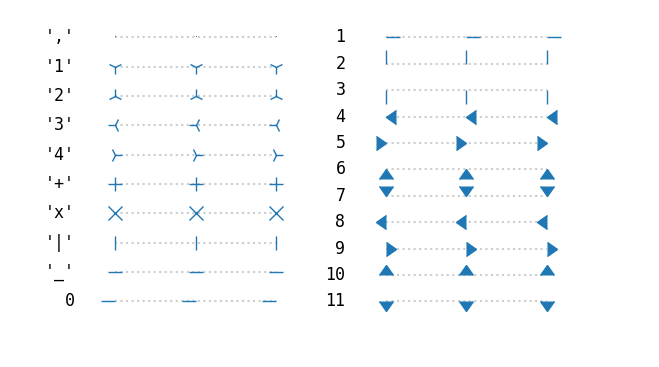

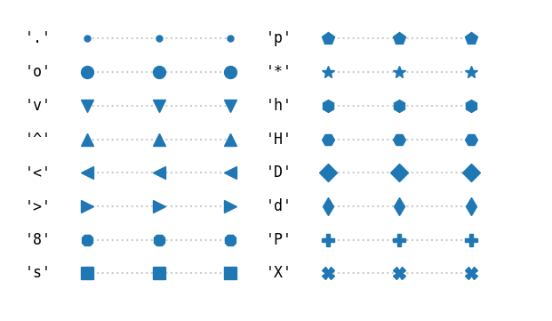

```python
import matplotlib.pyplot as plt
import numpy as np

x = np.random.random(20)
y = np.random.random(20)

# s   点的大小
# c   颜色。  如： 'r',  'red',   '#FF0000'
plt.scatter(x, y, s=40, c='r', marker='1')
plt.show()
```


## 绘制柱状图

语法：

```python
# 竖向的柱状图
plt.bar(x, y, width=0.5, color='r') 
# 横向的柱状图
plt.barh(x, y, height=0.5, color=['red', 'yellow', 'blue', 'green']) 
```

参数说明：

color      柱子的颜色， 可以统一设置一个颜色，也可以用数组分别设置每根柱子的颜色

width/height        柱子的宽度。 竖向的柱子用width设置，  横向的柱子用height设置。 参数值0~1的小数


```python
import matplotlib.pyplot as plt
import numpy as np

x = np.array(['zhangsan', 'lisi', 'wangwu', 'Jack'])
y = np.array([88, 66, 99, 100])

# width/height 柱子的宽度，0~1的小数
# color 柱子的颜色， 可以统一设置颜色，也可以用数组分别设置颜色
# plt.bar(x, y, width=0.5, color=['red', 'yellow', 'blue', 'green'])  # 竖向的柱状图
plt.barh(x, y, height=0.5, color=['red', 'yellow', 'blue', 'green'])  # 横向柱状图
plt.show()
```


## 绘制饼图

语法：

```python
pie(value, labels=label, autopct='%.2f%%')
```

参数说明：

value     每个类别（扇区）的数值

labels    类别的名称

autopct    在每个扇区显示百分比，可以设置小数位数


```python
import matplotlib.pyplot as plt
import numpy as np

value = np.array([80, 70, 60, 40, 90])
label = np.array(['Python', 'c', 'Java', 'C++', 'JavaScript'])

# autopct 显示百分比，.xf保留几位小数
plt.pie(value, labels=label, autopct='%.2f%%')

plt.show()
```


## 直方图

直方图可视化显示数据分布情况，例如观察数据中心趋势，偏态和异常分布

语法：

```python
plt.hist(x, bins=40, alpha=0.5)
```

x   正太分布的一些散点

bins    柱子的数量

alpha     透明度，取值范围0~1， 1不透明， 0 完全透明


```python
import matplotlib.pyplot as plt
import numpy as np

# 产生1000个正太分布的点
x = np.random.randn(1000)

# bins   设置柱子的数量； alpha透明度，取值范围0~1
plt.hist(x, bins=40, alpha=0.5)

plt.show()
```

## imshow() 显示图片

用于显示图像，彩色或者灰度图像都可以，图像来源可以是多维图像数据或本地图片

+ imshow()显示的是多维的数据
+ 本地图片显示过程：用PIL库读取图片文件； numpy把图片转为矩阵数据； imshow（）方法显示数据

```python
import matplotlib.pyplot as plt
import numpy as np
import PIL.Image as im

# 显示一个灰度矩阵图象
# img = np.random.rand(100, 100)
# plt.imshow(img, cmap='gray')
# # 颜色深度参考
# plt.colorbar()
# plt.show()

# 显示本地图片
img = im.open('下载.png')
data = np.array(img)
plt.imshow(data)
# 不显示坐标轴
plt.axis('off')
plt.show()
```


## imsave()保存图像

```python
import matplotlib.pyplot as plt
import numpy as np

img = np.random.rand(500, 500, 3)
plt.imshow(img)


plt.imsave('test.png', img)

plt.show()
```


##  imread()读取图像

```python
# 读出来就是多维数据
data = plt.imread('下载.png')
# print(data)
plt.imshow(data)
plt.axis('off')
plt.show()
```


