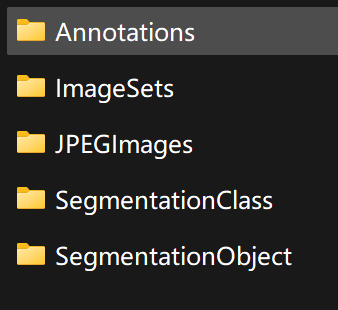

# voc 数据集




+ Annotations 标注的目标区域位置（.xml 标注对象的坐标区域）

  (其中object对象中的xmin,ymin,xmax,ymax是我们关注的中重点)

+ ImageSets 包含各项训练文件的列表

  （Layout 目标区域的标注的训练文件名册、验证文件名册）

  （Main 分类（或每个类别）的标注的训练文件名册、验证文件名册）

  （Segmentation 图像分割的标注的训练文件名册、验证文件名册）

+ JPEGImages 所有图像数据（jpg）
+ SegmentationClass 图像类别区域的划分（以类别方式的图像分割）
+ SegmentationObject 实例分割

```
ImageSets/Main + JPEGImages : 卷积神经网络的分类
Annotations + ImageSets/Main + JPEGImages : 目标区域的检测网络
SegmentationClass/SegmentationObject + ImageSets/Segmentation + JPEGImages: 图像分割或图像分割
```


## VOC 数据集设置为分类网络

主题：判断目标图片是否为汽车

