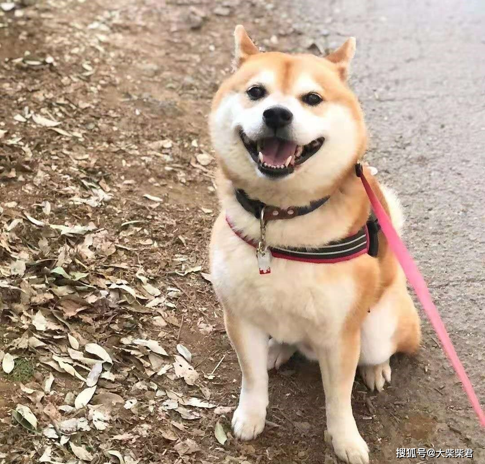
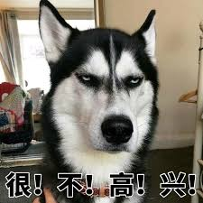
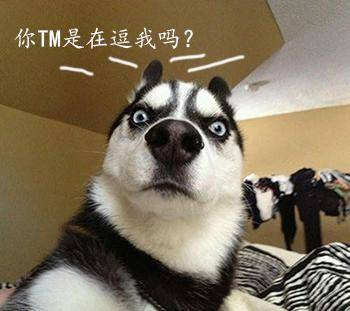
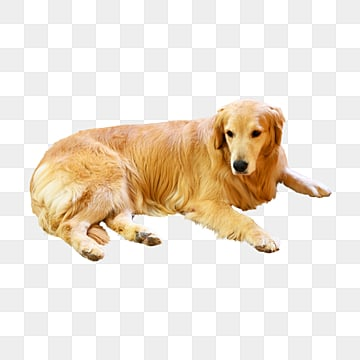
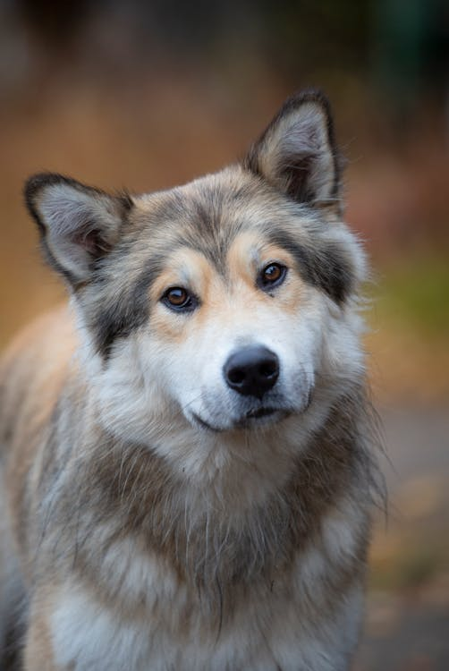

# 数据过滤清洗

数据过滤: 筛选出满足条件的数据集的子集，以便后续对数据进行清洗

数据清洗: 通过技术手段，保证数据集的质量，保留重要数据特征，排除噪声干扰等

清洗的目的有以下几点:

- **处理缺失值**：填补缺失数据或删除包含缺失值的记录。
- **去除重复数据**：检测并删除数据集中重复的记录。
- **纠正错误数据**：修正输入错误或异常值，如拼写错误或不合理的数值。
- **一致化数据格式**：确保数据格式的一致性，如日期格式、货币单位等。
- **处理异常值**：检测并处理数据中的异常值，以减少其对分析结果的影响。

## 示例

此处的例子，提及的各种参数，都可以视实际情况调整

### 1. 图像识别数据集

假设我们制作猫狗识别的数据集

数据过滤策略: 符合以下条件的样本被过滤掉

- 动物占图中面积比例低于 0.5 的样本
  
- 动物图片被截断，肢体不完整的样本
  
- 不保留哈士奇的样本
  
  

通过数据过滤我们筛选出了符合条件的数据集子集

数据清洗策略:

- 删除重复图片
- 统一图片格式
- 去掉图像中的噪声，例如把图片主体抠出来
  
- 或者对图像中的噪声做模糊处理
  
- 还能通过 OpenCV 的腐蚀膨胀操作来去掉噪点

### 2. 翻译模型数据集

假设我们做英译汉的翻译模型

数据过滤策略: 符合以下条件的样本被过滤掉

- 非英语和汉语的翻译样本
- 长度不大于 500 字的样本
- 包含人名地名等特殊词汇的样本

数据清洗策略:

- 包含方言的翻译样本，如: `what are you doing? -> 你在做爪子？`
- 包含敏感词的翻译样本，如: `sun of beach -> 日沙滩`
- 使用近义词或同义词替代生僻字，如: `persist with unwavering determination -> 用坚定的决心坚持着` 译文可以改成 `持之以恒`