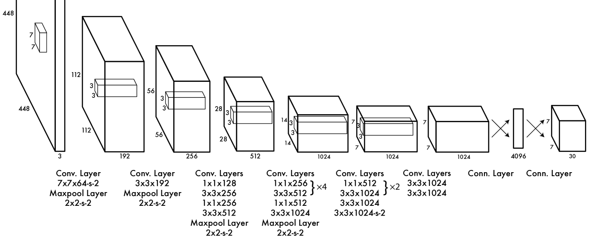

# 模型的常见优化手段

## 增加模型层数 和 增加神经元特征数量

这是最简单的增加模型学习的参数的方法，可以直接影响学习后的准确率，但往往会导致学习困难，模型效率低下等问题

## 正则化

我们可以使用 L1 或 L2 范数，并添加到训练损失值中，来提高模型的鲁棒性

也可以在模型中添加 Dropout 层，来提高模型鲁棒性

## 批量归一化(层归一化等)

归一化的目的是为了让数据规范化

用 batch normalization 来提升训练速度，稳定模型，缓解梯度消失等问题

## 残差 或 串联

我们使用残差连接或串联连接的方式，从早期层中提取特征并加入到更深的层中，以提高学习的特征，且能增加模型的深度而不会导致训练困难，梯度消失等问题

该手段多用于增加网络层数

## 神经架构搜索（Neural Architecture Search，NAS）

神经架构搜索（Neural Architecture Search，NAS）是利用神经网络自动搜索出最佳的网络结构的一种方法。

为了实现 NAS，需要训练一个寻找神经网络结构的模型，这里 Google Brain 团队，实现了一个 NASNet 神经网络，这个网络通过训练，能够自动找到一个最合适的网络结构

## 深度可分离卷积

MobileNet 网络中提出的结合了 depthwise 深度卷积 和 pointwise 逐点卷积 的方式，来降低运算量

## 1x1 和 3x3 卷积

GoogLeNet 提出了先使用 1x1 卷积，可以降低运算量

VGGNet 提出了使用多个 3x3 卷积代替 5x5 或 7x7 卷积可以减少运算量

所以我们可以结合使用，先用 1x1 降低通道数，再用 3x3 升高通道数，来达到减少运算量的效果

经典的 YOLOv1 的特征提取器就是采用了这个原理，如图:

