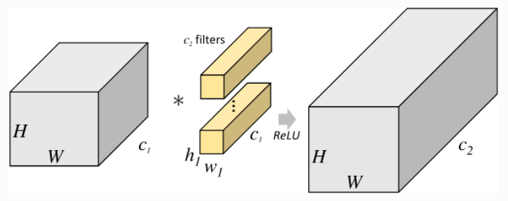
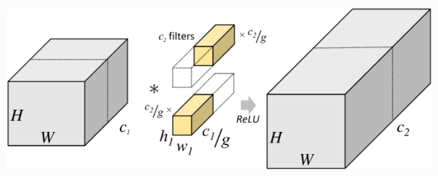

# 分组卷积

参考: <https://paddlepedia.readthedocs.io/en/latest/tutorials/CNN/convolution_operator/Group_Convolution.html>

## 常规卷积和分组卷积对比

传统卷积示意图:

- H: 输入高
- W: 输入宽
- C1: 输入通道数
- h1 w1: 卷积核高宽

中间一个黄色立方体，代表对应一个输出的应该有的卷积核体积，若输出16个特征图，则应该有16个黄色立方体

分组卷积示意图:

不同之处在于中间卷积核的计算部分，途中所示为两个分组，上下两个分组分别对应的是一半的输入和一半的输出。假设如下参数:

- 输入6个通道
- 输出16个通道
- 卷积核为3x3
- 分为2组

则每一组的权重数量(也可以理解是乘法运算次数)为: `h1*w1*(输入通道数/分组数)*(输出通道数/分组数) = 3*3*(6/2)*(16/2)`

又因为输出也被分为2组，所以最后要在一组的基础上乘以分组量

$$
总权重数 = h1*w1*(输入通道数/分组数)*(输出通道数/分组数)*分组数 \\
= h1*w1*(输入通道数/分组数)*输出通道数 \\
带入例子参数为: \\
= 3*3*(6/2)*16
$$

## 深度可分离卷积

当我们创建一个深度可分离卷积的时候，就会创建一个深度卷积层 depthwise convolution，简称 **DW卷积**，该技术在 pytorch 中实现的话其实就是使用 groups 分组就可以了，不过是一种特殊的分组方式，也就是输入多少个通道就分多少组。

深度可分离卷积被用在 MobileNetV1 经典神经网络中，用于降低模型的权重数，提升运行效率