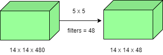
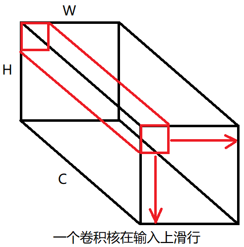

# 卷积参数数量与乘法计算次数

本篇目的是学会计算各种和卷积相关的参数数量，这样一方面有助于分析卷积过程，另一方面有助于分析神经网络的运行和训练效率

## 卷积后的图片大小

学习卷积后的图片大小如何求得，我们才能在构建神经网络时，知道每一层的输入输出，否则构建网络会报错

$$
卷积后图片大小 = \frac{输入图片大小 + 2P - 卷积核大小}{S} + 1
$$

有以下几个注意点:

- P 代表 padding 值
- S 代表步幅
- 除法运算得到小数时，向下取整

## 卷积模块权重和偏置数量

学会分析权重个数和偏置个数，我们就能了解一个网络中所依赖的参数数量，这个指标可以用来衡量网络的复杂度，训练成本，还有计算成本

当网络的功能已经达到要求时，就要尽可能的减少网络中权重和偏置的数量来提高效率

**常规卷积权重**计算公式

$$
权重数 = 卷积核宽 * 卷积核高 * 输入通道数 * 输出通道数
$$

**分组卷积权重**计算公式

$$
权重数 = 卷积核宽 * 卷积核高 * (输入通道数 / 分组数) * 输出通道数
$$

对比**全连接权重**数量

$$
权重数 = 输入数量 * 输出数量
$$

偏置数量公式

$$
偏置数 = 输出通道数
$$

对比全连接，偏置数也等于输出特征数

## 卷积乘法计算次数

在计算机进行神经网络训练和计算的过程中，浮点数运算对计算机性能影响最大，加法运算基本可以忽略，所以通常我们可以通过一个神经网络的乘法运算次数来衡量该网络的计算效率，性能

常规卷积模块的乘法计算次数的方法如下:

设如下参数:

- $SS$: 一个通道上卷积滑动时乘法运算量
- $K_w$ $K_h$: 卷积核宽高
- $W_i$ $H_i$ $C_i$: 输入宽高通道数
- $C_o$: 输出通道数
- $P$: 四边填充
- $S$: 步幅

则:

$$
卷积乘法运算量 = SS * C_i * C_o
$$

$SS$ 的求法为:

$$
SS = 卷积核面积 * 水平滑动次数 * 竖直滑动次数
$$

带入公式为:

$$
SS = (K_w*K_h)*[(W_i + 2P - K_w)/S + 1]*[(H_i + 2P - K_h)/S + 1]
$$

所以总乘法数量为:

$$
卷积乘法运算量 = (K_w*K_h)*[(W_i + 2P - K_w)/S + 1]*[(H_i + 2P - K_h)/S + 1] * C_i * C_o
$$

## 卷积加法计算次数

加法运算数量为:

$$
卷积加法运算量 = 卷积运算的加法次数 + 偏置运算的加法次数
$$

当偏置矩阵被禁用时，则不用计算偏置运算的加法次数

卷积运算的加法运算产生于合并每个通道卷积结果的过程，如下:

卷积运算的加法次数为:

$$
卷积运算的加法次数 = 一个卷积核的加法次数 * 卷积核个数
$$

带入数学符号为

$$
卷积运算的加法次数 = \{[(W_i + 2P - K_w)/S + 1]*[(H_i + 2P - K_h)/S + 1] * (C_i - 1)\} * C_o
$$

偏置矩阵的加法次数为:

$$
偏置矩阵的加法次数 = 偏置个数 * 输出图像面积
$$

因为 $偏置个数 = 输出通道数$ 所以带入公式为:

$$
偏置矩阵的加法次数 = C_o * [(W_i + 2P - K_w)/S + 1]*[(H_i + 2P - K_h)/S + 1]
$$

## 步幅为1卷积的乘法运算量

通常我门计算一个卷积的乘法运算量，最多的情况是一个步幅为1的卷积，这种卷积有个通用好记的公式，如图:

> ==上图的填充参数 **padding** 为 **same**==

对应该图的乘法运算量为: $(14*14*48) * (5*5*480)=112,896,000$

则公式为:

$$
乘法运算量 = (输出高 * 输出宽 * 输出通道数) * (卷积核高 * 卷积核宽 * 输入通道数)
$$

加法运算几乎不消耗计算机性能，所以忽略不计

> **提示:** 可以理解成卷积核的体积的柱状体，滑动了 `输出宽x输出高` 这么多次，最后乘以卷积核个数
> 

## 对比全连接的计算量

全连接的乘法计算量为:

$$
乘法计算量 = 输入个数 * 输出个数
$$

加法运算量为:

$$
加法运算量 = 输出个数
$$
