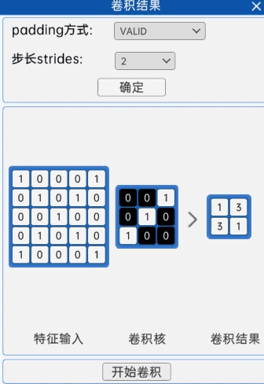
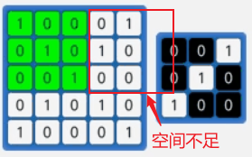
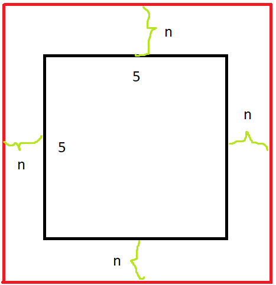

# 卷积操作参数

卷积操作过程中，还有一些有用的参数

- stride 步幅
- padding 填充
- groups 分组
- bias 偏置矩阵
- dilation 膨胀

## stride 步幅

步幅用于描述卷积核在图像上滑行的距离，默认为 1，但若步幅为 2，则效果如图:



步幅会影响最后输出特征图的大小，如上图，当输入大小为 5x5 图片，步幅为 1 时，输出特征图应该是 3x3，而步幅为 2 时，输出特征应该是 2x2

为了方便记忆，这里有一个**求卷积输出图像大小的公式:**

$$
输出大小 = (输入大小 - 卷积核大小) / 步幅  + 1
$$

若除法运算得到小数，向下取整

**注意:** 等我们学习了 padding 后还会总结包含 padding 的计算公式

## padding 填充

在 stride 步幅 的教学中，我们使用的是 5x5 的输入图像，那么当卷积核为 3，步幅也为 3 时，我们会发现卷积核无法滑动，因为空间不够了



**默认情况下输入图像不足以卷积核滑动到下一位置时，卷积核将停止滑动**

此时我们可以利用 padding 功能，扩充输入图像，然后再进行卷积

在 pytorch 中，padding 可以设置数字，也能设置字符串，我们看看两种的区别

### 设置数字

当 padding 设置数字 n 时，代表在输入图像周围填充 n 个像素，如图



还可以同时设置 stride，当空间不足步幅滑动时，不会再自动填充，例如 5x5 的图像，padding=1，stride=3，那么首先 padding 图像后，图像变为 7x7，有因为步幅为3，那么最终输出图像大小为 $(7-3+1)/3≈2$

### 设置字符串

当 padding 设置字符串时，只有两个合法值，valid 和 same

==**注意:** `padding='valid'` 与无填充相同。 `padding='same'` 填充输入，以便输出具有与输入相同的形状。但是，此模式不支持除 1 之外的任何步幅值。==

举例来说，当 `padding='same'` 时，若输入为 5x5，那么卷积后会自动填充成和输入相同形状，所以输出也是 5x5，但这种写法，不允许添加 `stride=1` 以外的步幅参数

## groups 分组

要介绍 groups 参数的作用，这里必须先介绍 [分组卷积](./分组卷积.md)

分组卷积，用于降低卷积运算中的权重数量，能够有效提升运行性能。

使用方法很简单，直接设置，分组数量即可。若想创建DW卷积，那么 groups 的值设置成和输入通道数相同即可。

==**注意:** groups 的值必须被 **输入通道数** 和 **输出通道数** 整除==

例如: 3x512x512 的彩色图片，那么我们可以分 3 组，如下

```py
conv2d = nn.Conv2d(3, 6, 3, groups=3)
```

## 偏置矩阵

默认情况下 `torch.nn.Conv2d` 及其他维度的卷积运算，都自动添加了偏置矩阵

偏执矩阵将在卷积运算后自动叠加到输出矩阵中

我们也可以手动关闭偏执矩阵，这在很多经典神经网络搭建中很有用

```py
# 关闭偏执矩阵
conv2d = nn.Conv2d(3, 3, 5, bias=False)
```

## dilation 膨胀

膨胀属性对应的是膨胀卷积，我们先了解 [膨胀卷积](./卷积类型.md#空洞卷积膨胀卷积)

膨胀卷积可以使用 dilation 来设置卷积核内的采样距离

```py
nn.Conv2d(3, 6, 3, dilation=2)
```

如上述例子，这样的话原本为 3x3 的卷积核将膨胀为 5x5
