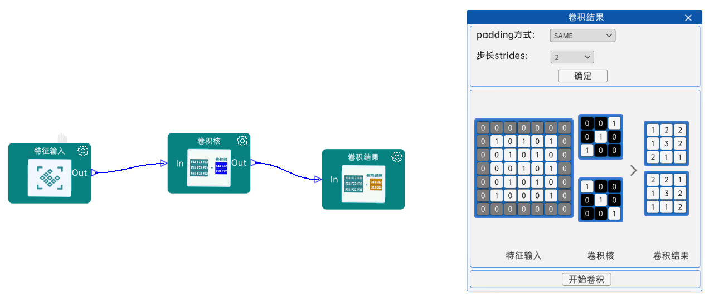

# 卷积核与卷积过程

我们已经知道了什么是卷积 Convolution，卷积由两个函数相交，求重叠部分的面积。那么在图像处理中的卷积，我们可以将图片本身看成函数 $g(t)$，我们再创建一个函数 $f(t)$，然后移动函数 $f(t)$ 和 $g(t)$ 相交，求相交处的特征，这个过程就是图像卷积的过程，函数 $f(t)$ 我们称为**卷积核**

## 卷积核

卷积核 (convolutional kernel 简称 kernel)，也称为滤波器 (filter)，在图像卷积过程中，卷积核实际上是一个矩阵，如图:


卷积核中的数字，我们称为权重 (weights)

卷积核的大小通常是宽高相等，且为奇数，例如 3x3 5x5 7x7

之所以这样设计，是为了得到一个具有对称性和唯一中心点的卷积核，方便计算。

## 卷积过程

卷积过程如下图:


卷积过程具体描述如下:

- 上图是个 5x5 图片
- 卷积核是在移动的 3x3 矩阵，如下:
  $$
  \begin{bmatrix}
  0 & 1 & 2 \\
  2 & 2 & 0 \\
  0 & 1 & 2 \\
  \end{bmatrix}
  $$
  站在编程的角度，该卷积核我们称为**掩码 (mask)**
- 使用卷积核作为掩码，和重叠的图片部分的数字进行点乘然后求和，就得到对应位置右侧区域的数字，例如第一个 3x3 的卷积结果为:
  $$
  \begin{bmatrix}
  3 & 3 & 2 \\
  0 & 0 & 1 \\
  3 & 1 & 2 \\
  \end{bmatrix} ·
  \begin{bmatrix}
  0 & 1 & 2 \\
  2 & 2 & 0 \\
  0 & 1 & 2 \\
  \end{bmatrix}=
  \begin{bmatrix}
  0 & 3 & 4 \\
  0 & 0 & 0 \\
  0 & 1 & 4 \\
  \end{bmatrix}\\
  0 + 3 + 4\\
  0 + 0 + 0\\
  0 + 1 + 4\\
  = 12
  $$
- 卷积核在图像上进行滑动，逐行扫描结果
- 卷积结束后输出的就是特征图，如下:
  $$
  \begin{bmatrix}
  12.0 & 12.0 & 17.0\\
  10.0 & 17.0 & 19.0\\
  9.0 & 6.0 & 14.0\\
  \end{bmatrix}
  $$

上述卷积过程是单通道的，对应灰度图或黑白图。

我们先求图像的[灰度图和二值化](./灰度图和二值化.py)

再做[单通道卷积示例](./单通道卷积示例.py)

## 多通道卷积

当我们对彩色图片进行卷积时，则采用多通道卷积，过程如图


卷积后进行合并，如图:


[多通道卷积示例](./多通道卷积.py)

## 卷积偏置

和全连接一样，卷积中除了权重，也有偏置，这个偏置以矩阵形式存在。上述的多通道卷积中，输出特征大小为 3x3，输出通道数为 3，则特征矩阵就有 3 个参数对应输出通道数，例如:

$$
bias = \begin{bmatrix}
2 & 1 & 3\\
\end{bmatrix}
$$

最后，输出特征与偏置矩阵相加的到最后的特征矩阵，例如:

$$
输出3通道 + 偏置矩阵 \\
\begin{bmatrix}
2 & 1 & 2 \\
0 & 0 & 1 \\
0 & 3 & 1 \\
\end{bmatrix}+2=
\begin{bmatrix}
4 & 3 & 4 \\
2 & 2 & 3 \\
2 & 5 & 3 \\
\end{bmatrix}\\
\begin{bmatrix}
0 & 1 & 1 \\
2 & 0 & 3 \\
1 & 1 & 1 \\
\end{bmatrix}+1=
\begin{bmatrix}
1 & 2 & 2 \\
3 & 1 & 4 \\
2 & 2 & 2 \\
\end{bmatrix}\\
\begin{bmatrix}
1 & 3 & 0 \\
2 & 0 & 0 \\
3 & 1 & 0 \\
\end{bmatrix}+3=
\begin{bmatrix}
4 & 6 & 3 \\
5 & 3 & 3 \\
6 & 4 & 3 \\
\end{bmatrix}
$$

偏置矩阵有如下特点

- 输出通道的数量等于偏置矩阵的长度
- 偏置将最后叠加到对应输出通道结果中

==**注意:** 不是所有的卷积神经网络中都会使用偏置矩阵。偏置矩阵相当于将结果朝着某个高维空间平移，不影响特征的形状，所以在很多的经典神经网络中，不使用偏置矩阵==

若不想设置偏置矩阵，可以添加 bias 参数，如下:

```py
nn.Conv2d(3, 6, 5, bias=False)
```

## 卷积的作用是什么?

现在我们知道卷积核中包含了权重，卷积运算在数学层面上就是描述两个函数的相对关系。

那么神经网络中，**卷积用来提取图像特征**。

假设卷积核就是一个函数，原图也是一个函数，那么卷积核在原图上滑动的过程就是卷积的过程。这个过程可以视为求原图部分区域和卷积核的相对关系，关系越强值越大。那么用不同的权重值去和原图求卷积，则能获得不同角度下原图和卷积核的关联性。那么不同的卷积核就代表一种不同的特性。卷积后得到的特征图(feature map)，就是符合不同卷积核权重的特征。

[haar特征提取过程](https://www.bilibili.com/video/BV1w442197nj/?vd_source=e3e6bb1b164806ab40cbadaa22f05b43)

## 总结

1. 图片请大家理解成立方体 w x h x input_channel(输入通道)
2. 卷积核大家理解成立方体 k x k x input_channel
3. 卷积核的通道数 = 输入图片的通道数
4. 卷积核的个数 = 输出通道数
5. 偏置数 = 输出通道数 = 卷积核个数

## 实验

