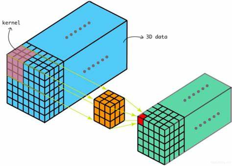
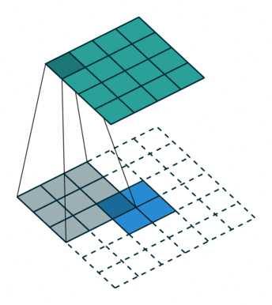
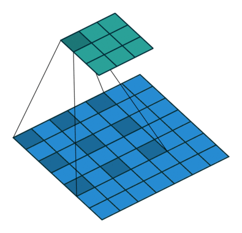
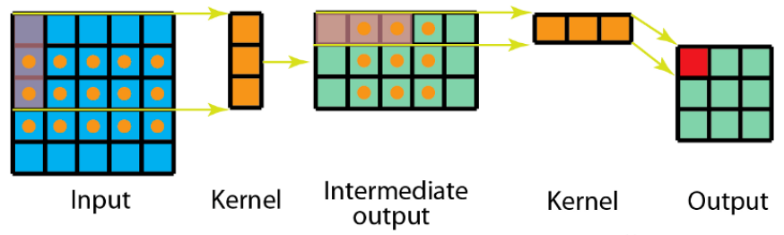
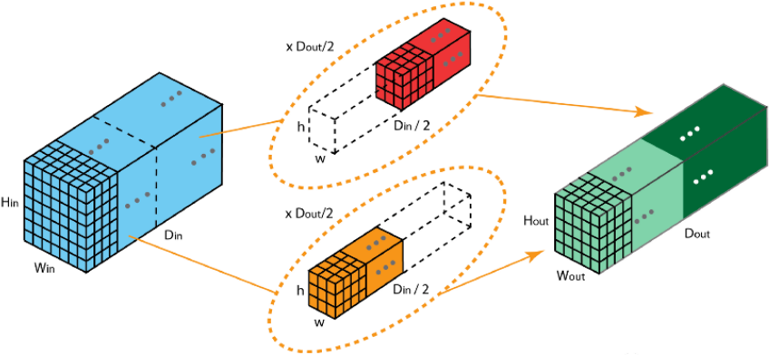
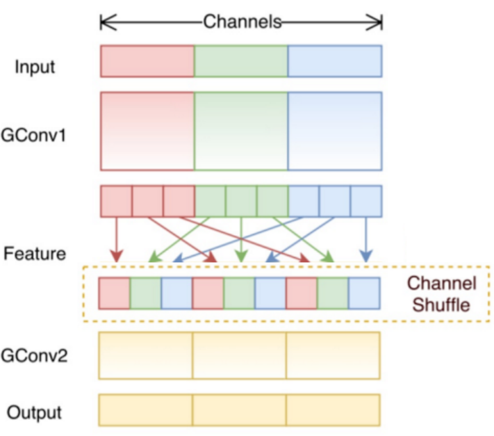

# 卷积类型

## 1. 卷积结果

一般来讲，卷积结果指的是将原本的特征输入图中的特征进行提取，这里我们分享一个数字识别卷积的可视化过程

通过上述的动画，可以发现卷积实际上将原本图像中的某一特征进行提取。

## 2. 卷积类型

### 2.1 二维卷积（单通道卷积版本）

之前所讲`卷积`相关内容其实真正意义上叫做`二维卷积（单通道卷积版本）`,即只有一个通道的卷积。

如下图，我们对于卷积核（kernel）的描述一般是大小3x3、步长（stride）为1、填充（Padding）为0（VALID）

### 2.2 二维卷积 （多通道版本）

彩色图像拥有R、G、B这三层通道，因此我们在卷积时需要分别针对这三层进行卷积

最后将三个通道的卷积结果进行合并（元素相加），得到卷积结果

### 2.3 三维卷积

二维卷积是在单通道的一帧图像上进行滑窗操作，输入是高度H宽度W的二维矩阵。

而如果涉及到视频上的连续帧或者立体图像中的不同切片，就需要引入深度通道，此时输入就变为高度H宽度W*深度C的三维矩阵。

不同于二维卷积核只在两个方向上运动，三维卷积的卷积核会在三个方向上运动，因此需要有三个自由度。

这种特性使得三维卷积能够有效地描述3D空间中的对象关系，它在一些应用中具有显著的优势，例如3D对象的分割以及医学图像的重构等。

### 2.4 反卷积（转置卷积）

卷积是对输入图像及进行特征提取，这样会导致尺寸会越变越小，而`反卷积`是进行相反操作。
只是并不会完全还原到跟输入图一样，只是保证了与输入图像尺寸一致，主要用于想象采样。
从数学上看，`反卷积`相当于是将卷积核转换为稀疏矩阵后进行转置计算。也被称为`转置卷积`。

如图，在2x2的输入图像上使用步长1，边界全0填充的3x3卷积核，进行转置卷积（反卷积）计算，
向上采样后输出的图像大小为4x4

## 空洞卷积（膨胀卷积）

为扩大感受野，在卷积核俩面的元素之间插入空格“膨胀”内核，形成“空洞卷积”（或称膨胀卷积），
并用膨胀率参数`L`表示要扩大内核的范围，即在内核元素之间插入`L-1`个空格。当`L=1`时，则
内核元素之间没有插入空格，变为标准卷积。图中未`L=2`的空洞卷积。

### 膨胀卷积有什么用?

膨胀卷积可以扩大 [感受野](./感受野.md)

### 2.5 可分离卷积

#### 2.5.1 空间可分离卷积

空间可分离卷积是将卷积核分解为两项独立的核分别进行操作。在数学中我们可以将矩阵分解：

$$
\left[
\begin{matrix}
-1 & 0 & 1 \\
-2 & 0 & 2 \\
-1 & 0 & 1
\end{matrix}
\right]=
\left[
\begin{matrix}
1 \\
2 \\
1
\end{matrix}
\right]\times
\left[
\begin{matrix}
-1 & 0 & 1 
\end{matrix}
\right]
$$

所以对3x3的卷积核，我们同样可以拆分成 3x1 和 1x3 的两个卷积核，对其进行卷积，
且采用可分离卷积的计算量比标准卷积要少

#### 2.5.2 深度可分离卷积

深度可分离卷积由两部组成：深度卷积核1x1卷积，我们可以使用`Animated AI`官网的图来演示这一过程

图1：输入图的每一个通道，我们都使用了对应的卷积核进行卷积。 通道数量 = 卷积核个数

图2：完成卷积后，对输出内容进行`1x通道数`的卷积

### 2.6 扁平卷积

扁平卷积是将标准卷积拆分成为3个`1x1`的卷积核，然后再分别对输入层进行卷积计算。

### 2.7 分组卷积

2012年，AlexNet论文中最先提出来的概念，当时主要为了解决GPU显存不足问题，将卷积分组放到两个GPU中并行执行。

在分组卷积中，卷积核被分成不同的组，每组负责对相应的输入层进行卷积计算，最后再进行合并。

下图中卷积核被分成两个组，前半部负责处理前半部的输入层，后半部负责后半部的输入层，最后将结果组合。

### 2.8 混洗分组卷积

分组卷积中最终结果会按照原先的顺序进行合并组合，阻碍了模型在训练时特征信息在通道间流动，削弱了特征表示。
混洗分组卷积，主要是讲分组卷积后的计算结果混合交叉在一起输出。

