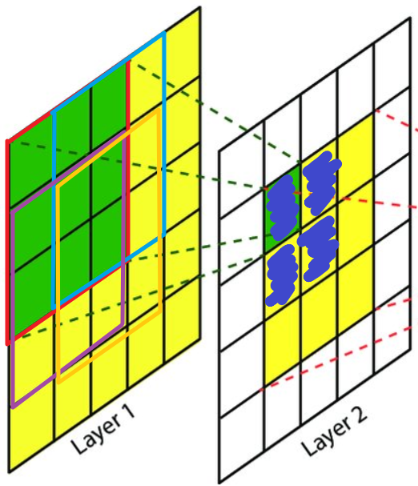
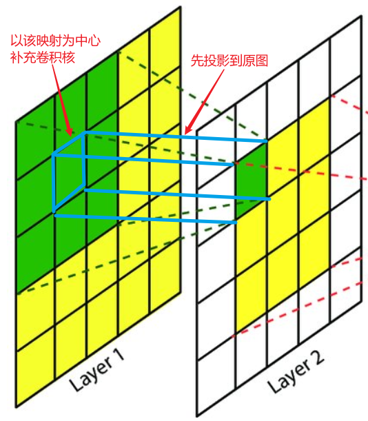

# 感受野 Receptive Field

## 什么是感受野?

感受野是描述卷积后的一个像素所能看见或代表的原图中的大小，如图:

- 绿色区域是 Layer2 上左上角像素在 Layer1 上的感受野
- 黄色区域是 Layer3 中心在 Layer2 上的感受野，也是在 Layer1 上的感受野

感受野是相对的，例如 Layer2 中若选取的不是左上角的像素，则感受野的位置就会变化

**形象的说，将卷积过程，比喻成人类眼睛看外界图像的过程，那么感受野就是视野**

## 感受野有什么用?

感受野是用来衡量卷积后的像素能看到的原图的范围，那么当我们进行图像追踪时就很有用。例如，我们要追踪原图中的一头大象，那么物体足够大，为了捕获到它，我们需要更大的感受野，也就相当于更大的视野，我才能看清大象的全貌

## 如何计算感受野?

感受野是相对的，所以要求感受野需要搞清楚出感受野的位置和大小

感受野大小很简单，一个像素的感受野大小就等于该卷积层的卷积核大小。如上图中 Layer2 左上角像素的感受野大小，就等于其卷积核大小 3x3

若非一个像素的感受野，则为多个卷积核重叠的结果，如图:

蓝色区域的感受野是 Layer1 上四个部分的重叠区域

感受野的位置，应该是像素在原图的映射，再以该映射为中心绘制一个卷积核大小，则求得感受野位置，如图:

==**注意:** 此处没有考虑复杂的填充和步幅的影响==

