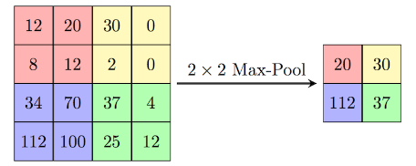
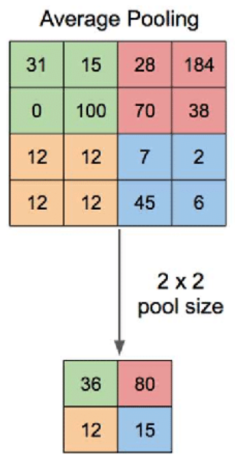

# 池化核与池化过程

## 什么是池化 Pooling

池化类似于卷积，也是有一个核，我们称为池化核 (pooling kernel)，在原图上滑动，然后提取特征。

不同之处在于池化核求解结果时，不是像卷积那样包含权重，而是直接提取原图上的特征。

常见的池化操作有 **最大池化(Max Pooling)** **平均池化(Average Pooling)**

## 池化核

在池化操作中，与卷积核类似，我们也可以使用池化核（pooling kernel）的概念。池化核定义了在池化操作中采样的窗口大小。

重点在于:

- 池化核中没有权重
- 池化核规定了采样窗口的大小

## 池化过程

### 最大池化 Max Pooling

和卷积一样使用池化核在原图上滑行，计算结果，不同之处在于，滑行的步幅默认和池化核大小相同。例如: 池化核为 3x3，则 stride 默认为 3

那么最大池化过程中，每次滑行会求出池化核采样窗口中，矩阵内最大值作为输出，如图:

上图池化核为 2x2，将 4x4 的原图分为了 4 个区域 (因为池化核的步幅为 2)

然后每个区域中去最大值作为输出，所以求得如图结果。

### 平均池化 Average Pooling

和最大池化类似，不过计算的是区域内的平均值作为输出，如图:

## 池化的作用

1. **缩小图片，提取图片特征，减小了模型计算量，加速了模型训练**
2. 池化操作可以带来特征的平移、旋转等不变性，这有助于提高模型对输入数据的鲁棒性
3. 池化层通常是非线性操作，例如最大值池化，这样可以增强网络的表达能力，进一步提升模型的性能

缺点:

1. 丢失了部分数据
