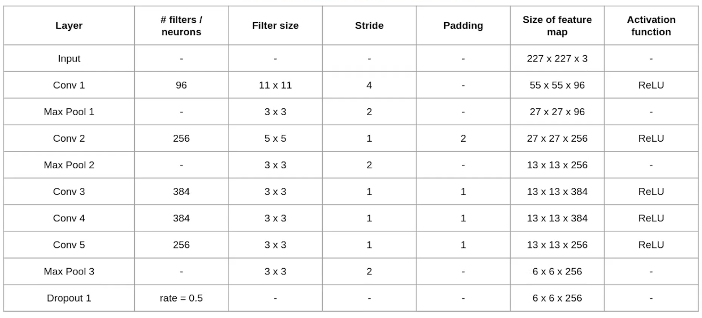
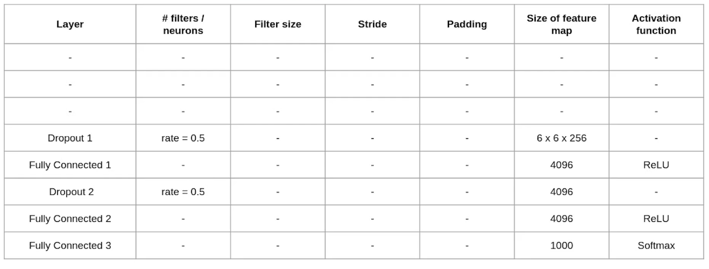
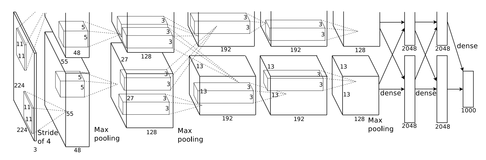

# AlexNet 介绍

[wiki](https://en.wikipedia.org/wiki/AlexNet)

[论文](https://papers.nips.cc/paper_files/paper/2012/file/c399862d3b9d6b76c8436e924a68c45b-Paper.pdf)

[AlexNet pytorch 的实现代码](https://github.com/pytorch/vision/blob/main/torchvision/models/alexnet.py)

论文中提到的 top-1 top-5 成绩是以下的意思:

top-1: 真实数据是模型预测的最高概率
top-5: 真实数据在模型预测的前 5 高的概率内

举例:

假设有1000张图片，包括以下类别: 猫 狗 马 鸟 鱼 虫 花 象

假设一张图片是猫，模型预测出来的结果中，猫的概率值最大，则 top-1 预测正确

假设猫的概率值不是最大，但是模型给出概率最高的前五名中包含猫，则 top-5 预测正确

## 背景介绍

AlexNet 是一个采用 GPU 训练的深层 CNN，本质是种 LeNet 变体。

## 取得成就

- AlexNet于2012年9月30日参加了ImageNet大规模视觉识别挑战赛，取得冠军。 该网络取得了15.3%的top-5错误率，比亚军低了10.8个百分点以上。

## 历史贡献

- 原始论文提出模型深度对推测结果的正面影响
- 采用 GPU 训练模型，解决深层网络参数多难以训练的问题

## 网络特点

- 采用 ReLU 激活函数，使训练速度提升 6 倍
- 采用 dropout 层，防止模型过拟合
- 通过平移和翻转的方式对数据进行增强
- 采用 LRN 局部响应归一化，限制数据大小，防止梯度消失和爆炸。但后续证明批量归一化 batch normalization 效果更好。

## 网络结构

结构图如下:

## 实验

