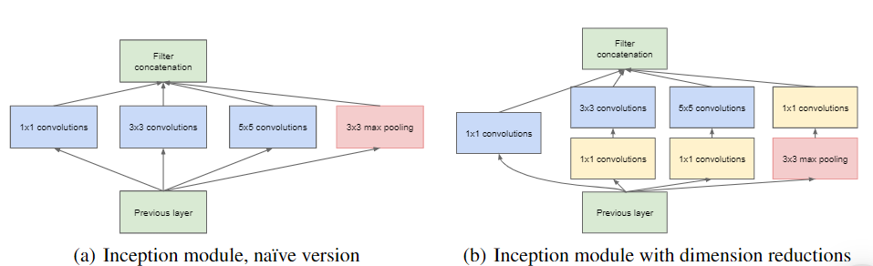
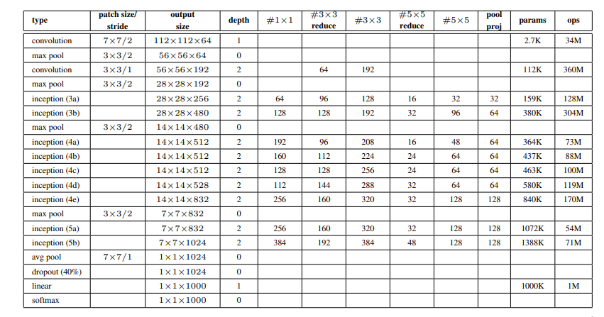
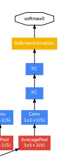

# GoogLeNet 介绍

[参考](https://www.geeksforgeeks.org/understanding-googlenet-model-cnn-architecture/)

[论文](https://arxiv.org/pdf/1409.4842.pdf)

## 背景介绍

Google Net（或 Inception V1）是 Google 研究人员（与多所大学合作）于 2014 年在题为“Going Deeper with Convolutions”的研究论文中提出的。该架构是 ILSVRC 2014 图像分类挑战赛的获胜者。与之前的获胜者 AlexNet（ILSVRC 2012 获胜者）和 ZF-Net（ILSVRC 2013 获胜者）相比，它的错误率显着降低，并且错误率显着低于 VGG（2014 年亚军）。该架构使用了架构中间的 1×1 卷积和全局平均池化等技术。

## 取得成就

- ILSVRC 2014 图像分类挑战赛的获胜者

## 历史贡献

- 使用 1x1 卷积，减少训练参数，例如:
  - 直接经过11x11卷积核: 11x11x64x16 = 123,904
  - 先经过1x1卷积层输出24个特征，再进行11x11卷积: 1x1x64x24 + 11x11x24x16 = 1,536 + 46,464 = 48,000

## 网络特点

- 复杂
- 所有卷积后都使用ReLU激活
- 使用 1x1 卷积，减少训练参数。
- 全局平均池化: 在最终使用全连接分类前，使用一个平均池化
- Inception Module，一种并行架构
  
  上图左右两边都是 inception 模块，左右区别在于，右侧使用了 1x1 卷积核减少训练参数。**请注意，并行处理的卷积必须输出相同大小的图像才能最终汇集在一起，并且是所有分支最终在通道维度上合并**，例如:
  ```py
  # 模拟三个分支的卷积结果
  branch1 = torch.randn(5, 64, 64, 64)
  branch2 = torch.randn(5, 128, 64, 64)
  branch3 = torch.randn(5, 16, 64, 64)
  # 在通道维度上进行合并
  y = torch.cat([branch1, branch2,  branch3], dim=1)
  print(y.shape)  # -> torch.Size([5, 208, 64, 64]) 通道维度被合并
  # 208 = 64 + 128 + 16
  ```
- 辅助分类器，GoogLeNet 包含两个辅助分类器，该分类器仅用于训练，解决梯度消失问题。分类器的损失值将乘以 0.3 的权重被加到最终损失中。

注意: GoogLeNet 夺冠时，VGGNet 是亚军，但是 VGGNet 比 GoogLeNet 受欢迎得多，因为简单。未来会出现解决梯度消失或爆炸的神经网络 ResNet

## 网络结构

架构表如下:



表中有如下数据需要注意:

- 每个 inception 模块都包含两层
- 3x3reduce 和 5x5reduce 指的是为了减少参数数量的 1x1 卷积的输出通道数
- 输出通道数等于 1x1 3x3 5x5 和 池化层 的输出通道和
- inception(4a) 和 inception(4d) 过后，训练时会有一个辅助分类器

架构图如下


- 图中圆括号S或V表示的是步幅，例如: 3x3+2(S) 或 5x5+3(V)
- 以下图代表辅助分类器:
  