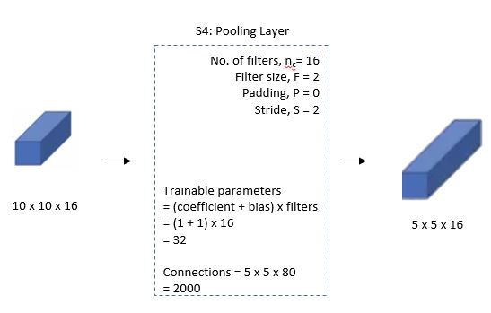

# LeNet-5 介绍

## 背景介绍

[wiki](https://en.wikipedia.org/wiki/LeNet)

LeNet 一般指 LeNet-5，是 1998 年 LeCun 等人提出的一种卷积神经网络结构。该网络结构是一个简单的卷积神经网络。正因为非常简单，LeNet-5
常被用来当作学习神经网络的基础，也是其他神经网络的灵感来源。

## 取得成就

- 美国邮政局提供的邮政编码数字数据的测试结果表明，该模型的错误率仅为1%，拒绝率约为9%
- 创建了 MNIST 数据集
- 1998 年，开发团队提供神经网络实际应用的示例，例如两个在线识别手写字符的系统和可以每天读取数百万张支票的模型

## 历史贡献

- LeNet-5是最早的卷积神经网络之一，推动了深度学习的发展
- 首先将**反向传播算法**应用于模型训练
- LeNet 的研究取得了巨大成功，引起了学者们对神经网络研究的兴趣。并成为了其他神经网络的参考。

## 网络特点

- 简单
- 使用了反向传播来训练模型
- 每个卷积层包括三部分：卷积、池化和非线性激活函数
- 利用卷积来提取空间特征（卷积本来叫感受野）
- 二次采样平均池化层
- tanh 激活函数
- 使用 MLP 作为最后一个分类器

LeNet-5 的结构做出了很好的示范，未来还会看到很多类似的结构

## 网络架构

LeNet-5 CNN 架构有七层。三个卷积层、两个子采样层和两个全链接层组成了层组合。

如上图，结构非常简单，基本流程就是 `卷积 -> 池化 -> 卷积 -> 池化 -> 全连接 -> 全连接 -> 输出`

接下来我们逐层分析:

**输入层:**

输入图片为单通道 32x32 的图像

若不符合要求，需要进行灰度化，重置大小还有图像参数归一化的操作 (从 0~255 变成 0~1)。

**第一层: 卷积层1**

这是一个卷积层，左侧是输入，输入是一个单通道 32x32 的图片

中间部分描述了卷积层的参数:

- No.of filters, n = 6: 这个是滤波器 (卷积核) 个数
- Filter size, F = 5: 这个是滤波器大小
- Padding, P = 0: 这个是填充
- Stride, S = 1: 这是步幅

图片中间，下半部分还计算了可训练参数

$$
权重数 = 卷积核大小 * 卷积核大小 * 输入通道数 * 输出通道数\\
偏置数 = 输出通道数\\
输出通道数 = 卷积核数\\
总参数量 = F * F * C_i * C_o + C_o\\
= 5*5*1*6 + 6 = 156
$$

最下方的 `Connections` 代表的是运算量，`156` 代表的是一次卷积运算的运算量，然后卷积核应该水平和竖直滑动了 28 次，所以总运算量为

$$
Connections = 156 * 28 * 28 = 122304
$$

==最终该层输出 6 个 28x28 的特征图==

**第二层: 池化层1**

这是一个平均池化层，左侧接收上一层的输入 28x28x6 的特征图

中间是参数

- n = 6: 6个池化核，输出6个通道
- F = 2: 池化核大小
- P = 0: 不填充
- S = 2: 步幅为2，核池化核大小相同

池化过程在过去，是将 2x2 区域的像素相加并乘以一个权重系数再加上一个偏置，得到最终结果，所以上图存在可训练参数

但实际上现在我们的框架的池化层是不包含训练参数的

==最终输出 6 个 14x14 特征图==

**第三层: 卷积层2**

- n = 16: 16个卷积核，输出16个通道
- F = 5: 卷积核大小
- P = 0: 不填充
- S = 1: 步幅为1

这层比较特殊，在原作者制作该层时，卷积核和输入通道是以一种分组的方式进行连接的。每个卷积核将采用部分输入通道做卷积，如图:

==最终输出 16 个 10x10 特征图==

**第四层: 池化层2**

- n = 16: 16个池化核，输出16个通道
- F = 2: 池化核大小
- P = 0: 不填充
- S = 2: 步幅为2，核池化核大小相同

==最终输出 16 个 5x5 特征图==

**第五层: 卷积层3**

图中写的虽然是全连接，但通过后面的架构图可知，此处实际是一个卷积层

输入为 5x5x16，卷积核为 5，输出为 1x1x120

**注意:** 我们在使用 pytorch 时，这里实际上可以用一个展平(Flatten) 再通过一个全连接，输出 120 个特征

**第六层: 全连接**

从上一层接收 120 个特征点，输出 84 个特征点

==最终输出 84 个特征==

**第六层: 输出层**

==最后层输出 0~9 10 个数字的分布概率==

## 完整架构表

**注意:** 每一层都有一个激活函数作为非线性激活，这里作者用的是 **tanh** 和 **softmax** 函数。

- tanh: 形状类似 sigmoid，但结果分布在 -1 ~ 1 之间
- softmax: 求概率分布的函数，输出结果和为 1

## 实验

