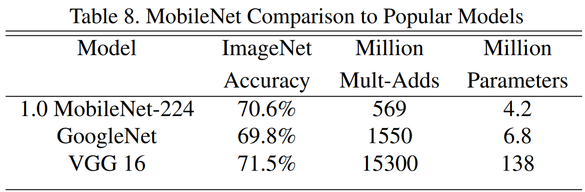
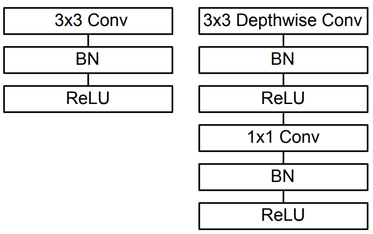
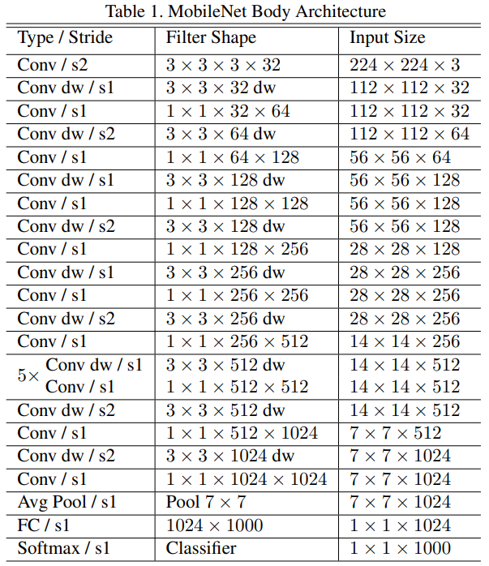

# MobileNetV1 介绍

[论文](https://arxiv.org/pdf/1704.04861.pdf)

## 背景介绍

随着技术进步，移动设备上进行实时图像识别和处理的需求日益增多，而传统的深度学习模型在移动设备上的计算资源和内存占用都非常的多。

为了解决这一问题 Google 研究院的研究人员提出了 MobileNets 模型，目的在于优化模型大小，降低参数数量，使模型能够在移动设备上有很好的表现。

MobileNets架构，专注于在计算和内存资源有限的移动设备上实现高效的图像识别，采用**深度可分离卷积** (**Depthwise Separable Convolution**)来减少参数数量和计算量，研究人员还分析了MobileNets在不同宽度乘数和分辨率乘数下的性能

## 取得成就

虽然不像它的前辈们，取得了很好的 ILSVRC 名次，但是 MNV1 以很小的准确率丢失为代价，降低了大量的运算成本，如图:

- **轻量级设计**：MobileNetV1 采用了深度可分离卷积等轻量级设计，使得模型具有较小的参数数量和计算量，从而适应了计算资源有限的移动设备。

- **高效性能**：相对于传统的深度学习模型，MobileNetV1 在移动设备上展现了更高的效率。它在一定程度上解决了传统深度学习模型在资源受限环境下的性能问题，为实时应用提供了可能性。

- **实时图像识别**：MobileNetV1 被广泛应用于实时图像识别领域，例如移动设备上的实时物体识别、人脸识别等。其轻量级和高效性能使其成为移动端深度学习应用的理想选择。

## 历史贡献

- 提出了**深度可分离卷积**(Depthwise Separable Convolution)结构，使训练参数和模型性能得到极大提升。

## 网络特点

- 结构简单
- 采用深度可分离卷积
- 缩放模型，让模型参数更少
  - 宽度乘数 $\alpha$，用于缩小dw卷积的输入输出通道数
  - 分辨率乘数 $\rho$，用于缩小输入图片大小

==注意: 分辨率乘数 $\rho$，利用了卷积神经网络的输入可以不固定的特点==，例如，MNV1 卷积网络下采样 32 倍，当输入图片不是 224 而是 128 时，也可以计算出卷积后，输出图片大小为 $128 / 32 = 4$

## 网络结构

大部分的主体架构都非常简单，不同之处在于使用了深度可分离卷积

### 深度可分离卷积

深度可分离卷积由两部分组成，一部分称为 **depthwise** 另一部分称为 **pointwise**，结构如图:

图左侧是一个常规卷积，卷积后进行批量归一化和 ReLU 操作。图右侧则是深度可分离卷积，数据将先通过 **3x3 Depthwise Conv**，然后再经过一个 **1x1 Conv**

#### depthwise 深度卷积

深层卷积是一个特殊的[分组卷积](../../卷积为什么能识别图像/分组卷积.md)，**分组个数和输入通道数相同**

示意图如下:

#### pointwise 逐点卷积

逐点卷积就是一个 1x1 的卷积

#### 深度可分离卷积整体示意图

#### 深度可分离卷积和常规卷积运算量对比

这里我们对比下常规卷积的乘法运算量和深度可分离卷积的乘法运算量

- $K_w K_h$: 卷积核宽高
- $D_w D_h$: 输入图像宽高(或输出图像宽高，因为输入输出图像大小相等)
- $C_i$: 输入通道数
- $C_o$: 输出通道数

$$
常规卷积 = (K_w * K_h * C_i) * (D_w * D_h) * C_o
$$

$$
深度可分离卷积 = 深层卷积乘法数量 + 逐点卷积乘法数量 \\
= (K_w * K_h * C_i) * (D_w * D_h) + (1 * 1 * C_i) * (D_w * D_h) * C_o \\
= (K_w * K_h * C_i) * (D_w * D_h) + (D_w * D_h) * C_o * C_i
$$

那么两者可以计算一个比例系数，如下:

$$
\frac{深度可分离卷积}{常规卷积} = \frac{(K_w * K_h * C_i) * (D_w * D_h) + (D_w * D_h) * C_o * C_i}{(K_w * K_h * C_i) * (D_w * D_h) * C_o}
$$

假设卷积核宽高相同，输出图像宽高也相同，则化简结果为:

$$
= \frac{(K^2*C_i)*D^2+D^2*C_o*C_i}{(K^2*C_i)*D^2*C_o} \\
= \frac{D^2[(K^2*C_i) + (C_o*C_i)]}{(K^2*C_i)*D^2*C_o} \\
= \frac{(K^2*C_i) + (C_o*C_i)}{(K^2*C_i)*C_o} \\
= \frac{K^2*C_i}{K^2*C_i*C_o} + \frac{C_o*C_i}{K^2*C_i*C_o} \\
= \frac{1}{C_o} + \frac{1}{K^2}
$$

那么我们卷积核大小通常是 3，带入公式则为:

$$
= \frac{1}{C_o} + \frac{1}{9}
$$

当输出通道足够多时，我们可以近似的认为，深度可分离卷积运算量是原来的九分之一

#### 宽度乘数 α

它控制网络中每一层的通道数，即每个卷积层的输出通道数相对于原始 MobileNet 结构的比例。宽度乘数的取值范围通常在`(0, 1]`之间，通过调整这个系数，可以有效地减小网络的参数数量和计算复杂度，同时降低模型的存储需求和运行时的计算量。

具体公式如下:

$$
K_w * K_h * αC_i * D_w * D_h + αC_i * αC_o * D_w * D_h
$$

也就是说，只要将输入通道和输出通道，使用一个系数 $α$ 进行缩小，则总运算量又将缩小

#### 分辨率乘数 ρ

ρ 读音类似 “row”，它控制输出图像的分辨率。通过调整分辨率乘数，可以改变输入图像的尺寸，进而影响模型的计算量。分辨率乘数的取值范围通常在(0, 1]之间，较小的分辨率乘数会导致输入图像变小，减少计算量，但也可能损失一些细节信息。

具体公式如下:

$$
K_w * K_h * αC_i * ρD_w * ρD_h + αM * αC_i * αC_o * ρD_w * ρD_h
$$

#### 不幸消息

pytorch 中并没有实现 MobileNetV1 架构，但是有 MobileNetV2 的实现，我们可以通过看 MNV2 源代码发现，pytorch 实现了宽度乘数 $α$，但并没有直接的实现 $ρ$

### 主体架构表

请注意，每次卷积后都会进行批量归一化和 ReLU 操作。padding填充多少，取决于卷积后下一层的图像大小

这里给出的是 23 层的结构，可以根据需要进行更多层的堆叠