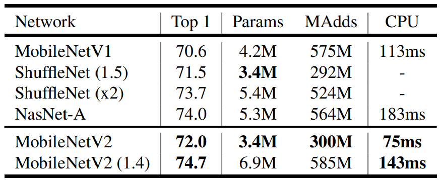
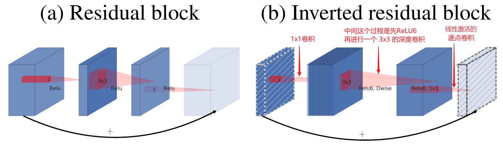
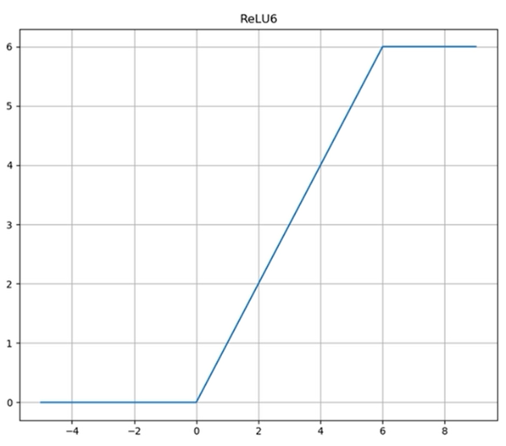
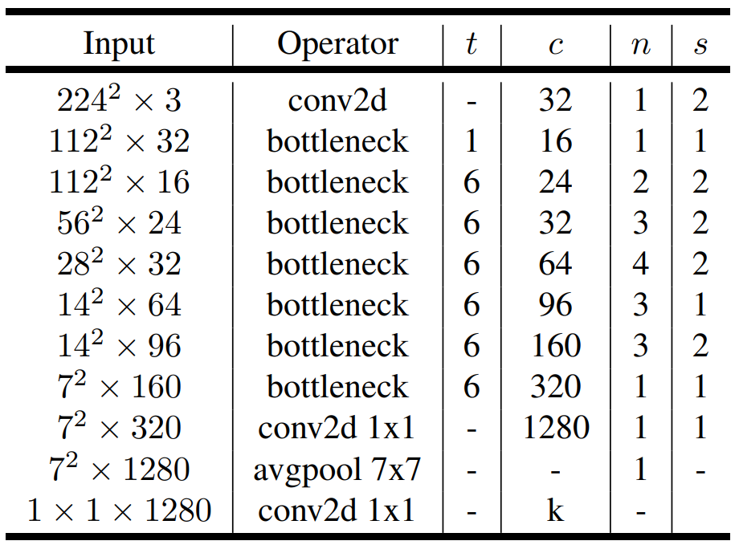

# MobileNetV2 介绍

[论文](https://arxiv.org/pdf/1801.04381.pdf)

## 背景介绍

MobileNetV1 还不够轻量和高性能，为了让移动设备有更好的体验，Google 团队提出了 MobileNetV2 架构。

他们强调了MobileNetV1的瓶颈结构（Bottleneck Structure）和深度可分离卷积的成功。并在此基础上提出了倒置残差结构。

## 取得成就

- 在 MobileNetV1 基础上再次提高模型性能。
  

## 历史贡献

- 提出了**线性瓶颈**和**倒置残差**的概念，进一步优化了模型性能

## 网络特点

- 参数少，模型小，性能高
- 使用了 ResNet 的 Bottleneck 改造而来的 **倒置残差** 结构
- 在 **倒置残差** 结构中使用了 **3x3深度卷积**，并在逐点卷积输出后采用了 **线性瓶颈**
- 使用 ReLU6 作为激活函数

## 网络结构

### 线性瓶颈

线性瓶颈 Linear Bottleneck，简单的说就是在倒置残差的最后一个1x1卷积后，不采用非线性激活，例如 ReLU，而是保留 $y = x$ 线性特征(说人话就是什么都不做)

### 倒置残差

**线性瓶颈 + 深度可分离卷积 = 倒置残差**

倒置残差结构如图:

- 左侧: 残差块，先通过 1x1 卷积，降低通道数，再经过 3x3 卷积提取特征，最后通过 1x1 卷积变回原来通道数
- 右侧: 倒置残差，先通过 1x1 卷积，增加通道数，再经过 3x3 卷积提取特征，最后通过 1x1 卷积变回原来通道数

根据上图可以看出来倒置残差结构，本质上就是 **线性瓶颈 + 深度可分离卷积**

==**注意:** 在 pytorch 的 MNV2 预训练模型中，只有当步幅为 1 且 输入输出通道数相等时，才使用跳跃连接==

### ReLU6

在 MobileNetV2 中使用了 ReLU6 而不是 ReLU，ReLU6，将在输入大于 6 时，将结果设为 0，如图:

在移动设备上由于数据精度较低的问题，使用 ReLU6 被证明能更好的激活参数，否则当输入很大的时候，ReLU结果将趋于无穷大，不利于低精度的计算

### 架构表

通用规则如下:

- 卷积层若没有明确表示，则都要进行批量归一化
- 未写卷积核大小的，默认为 3x3
- padding填充多少，取决于卷积后下一层的图像大小

表中一些符号含义如下:

- bottleneck: 倒置残差块
- t: 扩展因子，也就是倒置残差第一个 1x1 线性瓶颈，将原来通道放大几倍
- c: 输出通道数
- n: 模块重复的次数
- s: 步幅
