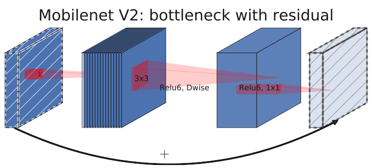
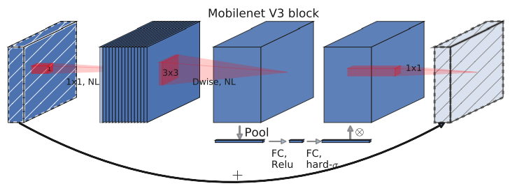
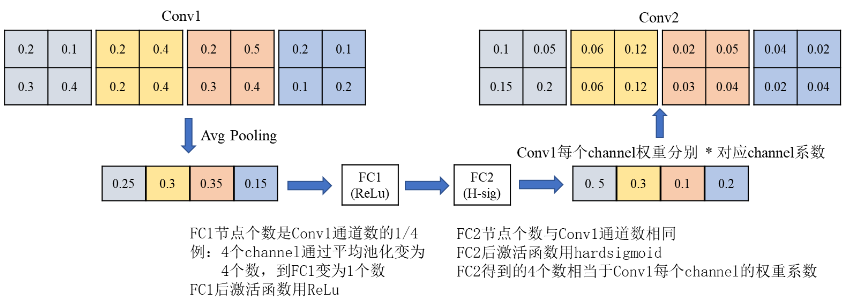
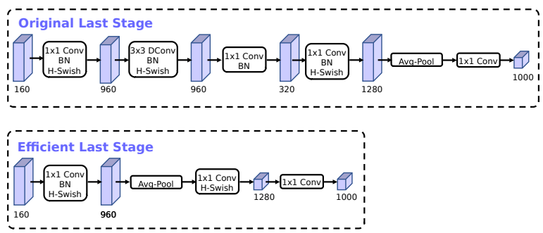
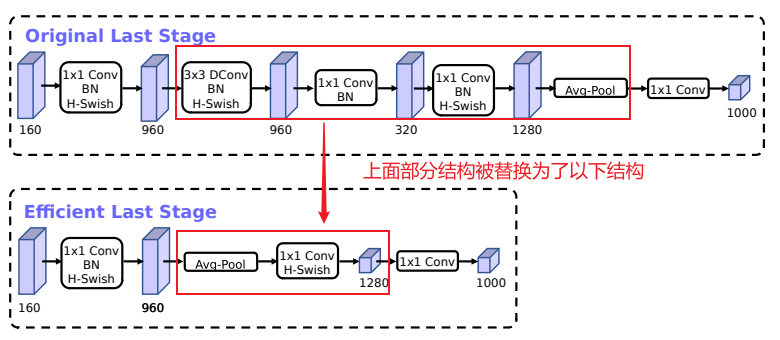
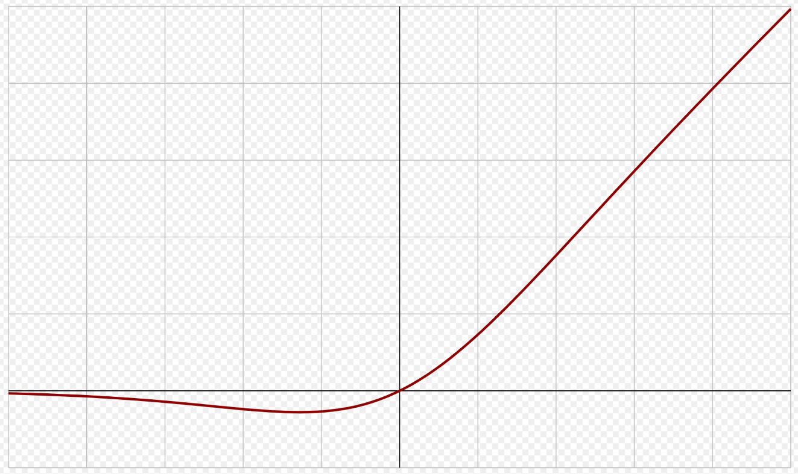
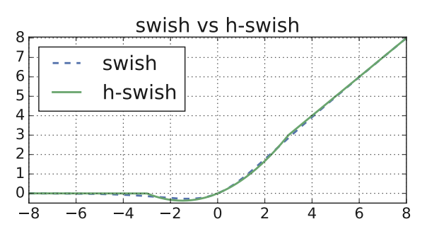
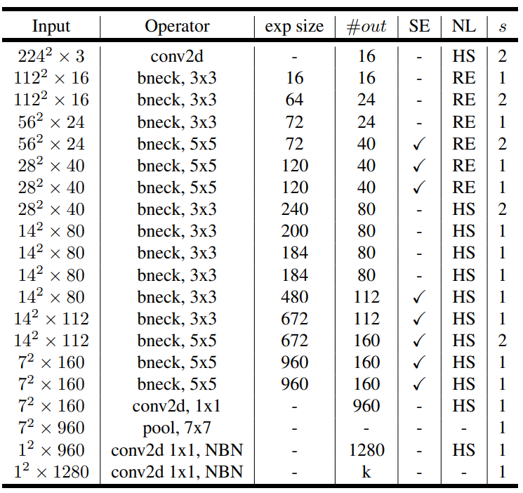
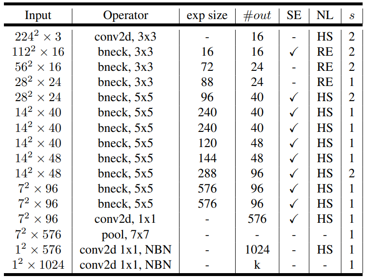

# MobileNetV3 介绍

[论文](https://arxiv.org/pdf/1905.02244.pdf)

## 背景介绍

MobileNetV3 是 2019 年 Google 研究院在韩国首尔举行的 ICCV（International Conference on Computer Vision 国际计算机视觉大会） 上发表的。MNV3 在先前的 MNV2 基础上发生了非常多的变化

## 取得成就

- 与MobileNetV2相比，MobileNetV3-Large在ImageNet分类上准确度提高了3.2%，同时减少了20%的延迟。MobileNetV3-Small与MobileNetV2模型相比，在相近的延迟下准确度提高了6.6%。在COCO检测任务上，MobileNetV3-Large的检测速度比MobileNetV2提高了25%，准确度大致相同。在Cityscapes分割任务上，MobileNetV3-Large LR-ASPP比MobileNetV2 R-ASPP在相似准确度下快了34%。

- **高效性能：** MobileNetV3 设计的目标之一是在保持模型轻量级的同时提高性能。通过采用一些新颖的设计策略，MobileNetV3 可能在移动设备上实现了更好的计算效率和准确性。

- **实时推理：** 移动设备上的实时推理对于许多应用是至关重要的，例如实时目标检测、人脸识别等。MobileNetV3 的设计可能使其能够在资源受限的环境中实现实时推理。

- **模型压缩和优化：** MobileNetV3 可能采用了一些模型压缩和优化的技术，以减小模型的大小，提高在移动设备上的部署效率。这对于存储和网络传输方面都是关键的优势。

- **通用性：** MobileNetV3 的设计可能使其更具通用性，适用于多种计算机视觉任务，包括图像分类、目标检测等。

## 历史贡献

- 增加注意力机制，让 MobileNetV3 专注于重要的信息特征，提高准确率
- 引入 NAS，搜索调优网络结构
- 引入 NetAdapt，自动搜索调优神经网络滤波器数量

## 网络特点

- 网络包含两种模型: MobileNetV3-Large 和 MobileNetV3-Small
- 注意力机制增加准确率
- 使用 NAS 和 NetAdapt 优化网络结构和参数
- 最终全局平均池化部分，使用池化层代替计算量昂贵的部分

## 网络结构

==**注意:** 在 pytorch 的 MNV3 预训练模型中，只有当步幅为 1 且 输入输出通道数相等时，才使用跳跃连接==

### 注意力机制

上图是 MNV2 和 MNV3 倒置残差瓶颈块的对比

MNV3 下方多了一个 `Pool -> FC -> FC -> Conv1x1` 的过程，这个过程就是注意力机制。

注意力机制的具体例子如下:

注意力机制的目的是为每一个通道寻找一个权重掩码，用于和原通道每个参数相乘

注意: 论文中特意提到，FC1 压缩数据时，输出通道数为原来的 $\frac{1}{4}$

#### squeeze-and-excite 序列激发

**squeeze-and-excite** **序列激发**。所谓的**序列**，指的就是池化的**压缩**过程，所谓的**激发**指的是经过一些层，用于学习通道间的关系，最后被**用来赋予权重给原始特征图中的每个通道**

上述注意力机制就是一个序列激发的过程。

==**注意:** 原论文并没有提到注意力机制，通通用的 **squeeze-and-excite** 序列激发来表达这一功能。==

#### 为什么要添加注意力机制

为了确定不同通道的重要性，以保留重要的，忽略次要的信息，提炼了数据特征的同时减小运算量。

那我怎么直到哪个通道重要呢？权重怎么来呢？

所以这里使用了 FC 进行学习

### NAS 神经网络架构搜索

全称为 **Neural Architecture Search** 神经网络架构搜索

该名称由其功能得名。

NAS 用于全局搜索整个网络的层的数量、每个层的类型、连接方式、输入输出通道数等。

说人话: 网络中每层是什么层，参数是多少，怎么激活等，都是由这个 NAS 自动优化选择出来的。

那怎么才能达到这个自动搜索网络结构的目的呢？

人们可以通过多种搜索算法，包括随机搜索、遗传算法、强化学习等找到最优的网络架构。这些算法通过在搜索空间中不断尝试不同的网络结构，评估它们在训练和验证任务上的性能，最终找到一个或一组表现最佳的网络结构。

#### 面向平台的 NAS

Google 团队这里使用了面向硬件平台的 NAS 算法 MnasNet-A1。也就是说这个算法将针对不同的硬件得到不同的架构。

MnasNet-A1: 是 NAS 的一种实现

### NetAdapt 网络适配

NetAdapt 是一个用于神经网络的滤波器数量自适应调整的算法。该算法的目标是根据目标硬件平台的资源限制，自动调整每一层的滤波器数量，以在给定的硬件资源下实现最优的性能。

NetAdapt 也是面向平台的

### NAS 和 NetAdapt 静态搜索

NAS 和 NetAdapt 都是提前运行算法找到最优解的架构，再将架构用于不同平台上，这个过程是静态的。相对应的，若程序在运行时去搜索网络架构，这个就是动态的。

### 最终全局平均池化优化

下图是原始最终阶段的结构和优化后的结构对比图:

上图区别在于:

这个优化被证明不会影响准确性，但可以提升模型性能

### 非线性激活

MNV3 采用的非线性激活函数除了 ReLU 以外，的 h-swish

**注意，这里用的是 ReLU 而非 ReLU6**

Google 团队发现，在模型的前几层中 h-swish 并不会带来优势，因为 h-swish 内部使用的 sigmoid 函数将带来大量计算开销。

而当特征图尺寸缩小后，h-swish 就可以带来更好的效果，避免 ReLU 小于 0 的部分全是 0 的情况。

#### swish

[swish wiki](https://en.wikipedia.org/wiki/Swish_function)

函数是:

$$
swish\ x=x·σ(x)
$$

$σ(x)$ 实际就是 $sigmoid(x)$

#### hard swish

h-swish 在小于 0 的部分保留了部分负数，而非全部置零。

由图可知，$x$ 在 $[-3, 0]$ 范围中是一段曲线，而非零。这也可以通过带入公式进行检验。

h-swish 公式为:

$$
\text{h-swish(x)}=x\frac{ReLU6(x+3)}{6}
$$

### 架构表

MobileNetV3-Large，如下图:

MobileNetV3-Small，如下图:

通用规则如下:

- 卷积层若没有明确表示，则都要进行批量归一化
- 未写卷积核大小的，默认为 3x3
- padding填充多少，取决于卷积后下一层的图像大小

表中一些符号含义如下:

- exp size: 1x1卷积，扩展层输出通道数
- #out: 输出通道数
- SE: 是否使用序列激活
- NL: 非线性函数
- s: 步幅
- NBN: 不使用批量归一化

==**注意:** 在 pytorch 的 MNV3 预训练模型中，只有当步幅为 1 且 输入输出通道数相等时，才使用跳跃连接==