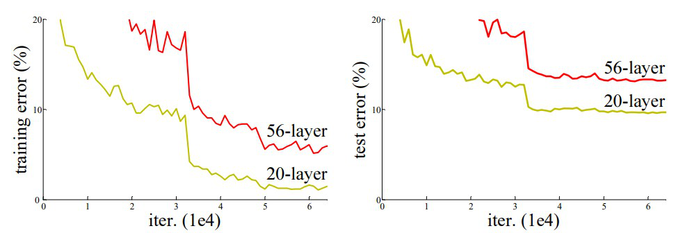
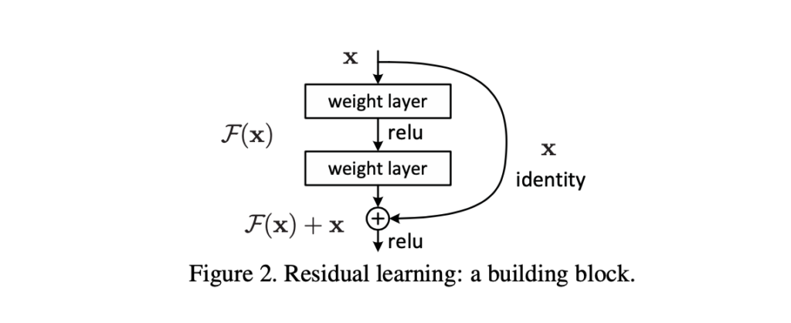
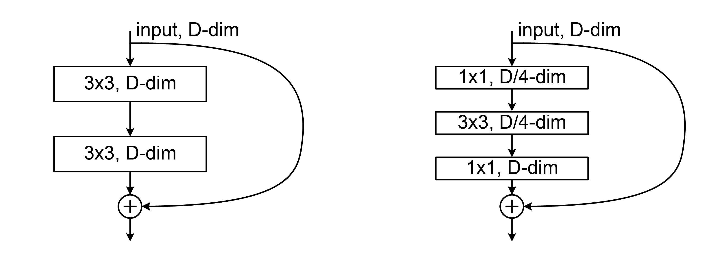
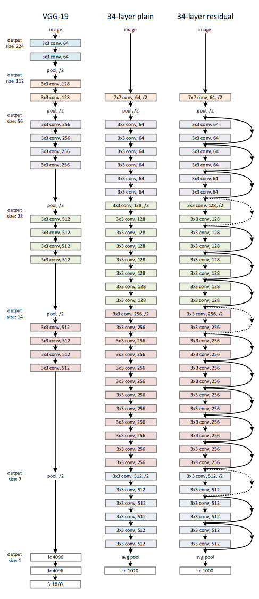
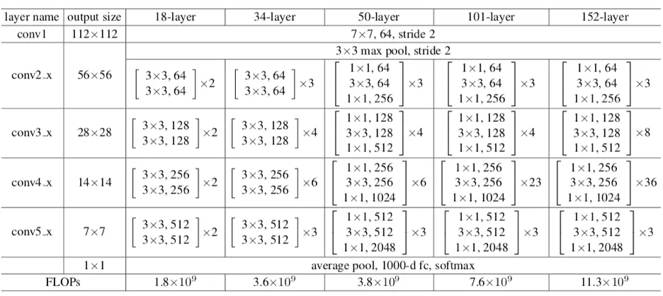

# ResNet 介绍

[论文](https://arxiv.org/pdf/1512.03385v1.pdf)

[wiki](https://en.wikipedia.org/wiki/Residual_neural_network)

[参考](https://www.geeksforgeeks.org/residual-networks-resnet-deep-learning/)

## 背景介绍

开发团队发现一个问题，并非神经网络层数越深，模型预测结果越准确，如图:

在训练集和测试集上的表现，上图 56 层的网络比 20 层的网络，错误率更高。这是因为，当网络不断加深时，会出现梯度逐渐消失或爆炸的现象。为了解决这一问题，微软研究院的研究人员于 2015 年提出了**残差网络**

**残差神经网络**（又名**残差网络**，**ResNet**）是一种深度学习模型，其中权重层参考层输入学习残差函数。**残差网络**是具有执行恒等映射的跳跃连接的网络，通过加法与层输出合并。它的行为就像一个高速公路网络，其大门通过强正偏差权重打开。这使得具有数十或数百层的深度学习模型能够轻松训练，并在更深入时达到更高的准确性。恒等跳跃连接，通常称为“**残差连接**”，也用于 1997 年的 LSTM 网络、Transformer 模型（例如 BERT、GPT 模型，如 ChatGPT）、AlphaGo Zero 系统、 AlphaStar系统和AlphaFold系统。

## 取得成就

- ILSVRC 2015 冠军。

## 历史贡献

- 发现**残差连接**，让神经网络的层数能够更深，解决了深层神经网络梯度爆炸或消失的问题。
- **残差连接**为灵感，被用到后续的 LSTM 网络、Transformer 模型。
- 使用**批量归一化**(**Batch Normalization**)来稳定数据，加速训练

## 网络特点

- 使用恒等映射来进行残差连接，恒等映射就是 $f(x) = x$，也就是用什么都不做的输入，去叠加到非恒等映射的结果上
- 使用残差连接，加深网络深度
- 为了进行残差连接，**非恒等映射部分(残差块部分)的结果，必须和输入保持相同的通道数和图像大小**
- 当恒等映射和输出的图片大小不一致时，进行下采样操作
- **每层卷积后都使用 Batch Normalization**
- 除了残差块的最后一个卷积层 和 下采样卷积外，都使用 ReLU 激活

## 网络结构

### Batch Normalization 批量归一化

归一化也成为规则化，可以让数据符合某种特征，归一化步骤如下:

1. 计算均值 $\mu$
2. 计算方差 $\sigma^2$
3. 进行归一化:
   $$
   z = \frac{x_i - \mu}{\sqrt{\sigma^2 + \epsilon}}
   $$
   - $x_i$: 输入特征中的第 i 个值
   - $\epsilon$: 为了防止分母为 0 的极小值，一般为 1e-5
   - $z$: 归一化后的值
   - 通过公式可以看出，归一化的结果: **均值为 0，方差为 1**

==批量归一化的维度通常是按照每个批次下的第一个维度进行归一化，例如一个数据形状为 (N, C, H, W)，N 为批次数，C 为通道数，那么批量归一化，将采用批次数 N 的下一个维度进行归一化，也就是在 C 这个维度上计算均值和方差==

### 归一化的好处

- 稳定模型每层输出的数据
  - 归一化也可以理解成规则化，让数据符合某些特征，这样模型训练时更容易掌握规律
- 加速训练

### 什么是残差块

在原有输入基础上，增加的一部分称为**残差块**，如图:

函数 $F(x)$ 代表的就是残差块

ResNet 架构中，每次进行卷积后，都会进行批量归一化和 ReLU 激活，但有个例外。

**例外: 在残差块的最后一个卷积层后，只进行批量归一化，不进行激活，在叠加了恒等映射后，再进行 ReLU**

注意: 残差连接部分，也可能不是恒等映射，而是一个下采样，缩小图片大小，这个取决于残差块输出图片大小是否和输入一致。

### BasicBlock 和 Bottleneck

BasicBlock 和 Bottleneck 是两种不同类型的残差块，如图:

左侧是 BasicBlock，经过两层 3x3 卷积，输出相同尺寸图片，且卷积的输出通道数量和输入相同，最后残差块的结果和输入部分相加。

右侧是 Bottleneck，经过了 3 个卷积层，分别是 1x1 卷积，输出 4 通道，然后是 3x3 卷积输出 4 通道，最后是 1x1 卷积，输出和输入相同的通道数。总结就是: 先 1x1 卷积降低通道数，再 3x3 卷积提取图像特征，最后 1x1 卷积提升通道数到和原来一样

==**注意:** BasicBlock 部分实际上受到 VGGNet 启发，通过堆叠两个 3x3 卷积层，来实现更大的感受野==

==**注意:** Bottleneck 利用了 GoogLeNet 中的发现，即使用 1x1 卷积来降低计算成本。Bottleneck 未来还会被其他网络用到，例如 MobileNets 系列，用来降低参数量，提升模型性能==

### 为什么残差连接能解决梯度消失问题

因为残差连接加法运算，多了一个保底的梯度

$$
F(x) + x
$$

在上述公式计算梯度时，使用加法原则，分别计算两条路径 $F(x)$ 上的梯度和 $x$ 上的梯度，再相加。**加法运算不会像乘法运算哪样缩放数据**。

### 架构图

该图是 VGG-19、未使用残差连接的 34 层卷积网络 和 使用残差连接的 34 层网络对比图

其中 残差网络 部分，有虚线和实线的残差连接。

- 实线: 代表直接将恒等映射的结果加到残差块上
- 虚线: 残差块输出结果出现了图片缩小的情况，此时为了能够残差链接相加，则残差连接，也就是虚线部分需要进行**下采样(downsampling)**，所谓**下采样，也就是通过卷积，缩小图片**。这样以来，下采样结果和残差块结果的图像大小就能保持一致，进行相加。

### 架构表

该表记述了不同层的 ResNet 结构
