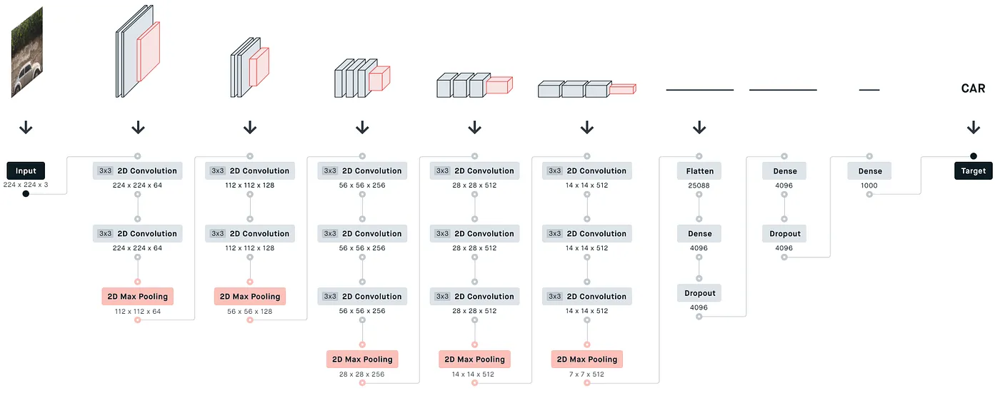
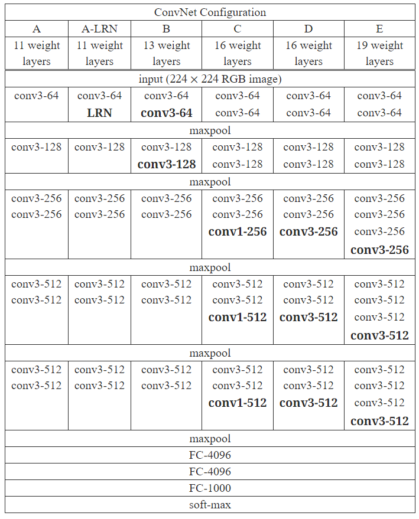

# VGGNet 介绍

## 背景介绍

VGGNet是牛津大学的Karen Simonyan和Andrew Zisserman于2014年提出的一种卷积神经网络架构。本文主要关注卷积神经网络深度对其准确性的影响。你可以找到 VGGNet 的原始论文，标题为 [Very Deep Convolutional Networks for Large Scale Image Recognition](https://arxiv.org/abs/1409.1556)。

VGG代表视觉几何组；它是一个标准的多层深度卷积神经网络（CNN）架构。 “深度”是指VGG-16或VGG-19由16和19个卷积层组成的层数。

### 什么是VGG

VGG指的是视觉几何小组，牛津大学专注于计算机视觉的学术小组。该学术小组的缩写名为 VGG。他们创造的神经网络以其小组名命名，所以该神经网络叫 VGGNet

### 什么是VGG-16

具有 16 层深度的 VGG 神经网络，称为 VGG-16

### 什么是VGG-19

具有 19 层深度的 VGG 神经网络，称为 VGG-19

## 取得成就

- VGG-16 模型在 ImageNet 中实现了近 92.7% 的 top-5 测试准确率。
- 使用了较深的模型层数，来提高模型预测准确率。
- VGGNet首次在2014年的ImageNet Large Scale Visual Recognition Challenge（ILSVRC）上获得了第二名，仅次于GoogLeNet。

## 历史贡献

- 它用多个 3×3 卷积核的卷积层取代了更大卷积核的卷积层，从而减少了训练参数，比 AlexNet 有了显着的改进。例如: 一个 7x7 的卷积核可以用 3个 3x3 的卷积核代替(假设输入为7x7图片，卷积核为7x7则输出1个值，若经过3个3x3，则第一个3x3输出5x5，第二个3x3输出3x3，第三个3x3输出1个值)，权重数量为:
  - 1个7x7的权重数量 = 7x7x输入通道数x输出通道数 = 49x输入通道数x输出通道数
  - 3个3x3的权重数量 = 3个x3x3x输入通道数x输出通道数 = 27x输入通道数x输出通道数
- VGGNet的出色性能表现证明了**深度**卷积神经网络在图像分类任务中的有效性。(证明了**深度**对模型的影响)
- 发现局部响应归一化（LRN）没有带来提升，而是导致内存消耗和计算时间增加。

## 网络特点

- 简单
- 通过多个 3x3 卷积核代替更大的卷积核
- 未使用局部响应归一化（LRN）
- 隐藏层后都使用了 ReLU

## 缺点

- 网络架构大，性能低。在移动设备或个人电脑运行非常慢
- 由于模型太深，可能会导致梯度消失或爆炸的问题

## 网络结构

VGG-16架构图如下:

多个卷积层堆叠是为了替代更大的卷积核

每层隐藏层后都使用了 ReLU

可以在全连接层后添加 Dropout 防止过拟合