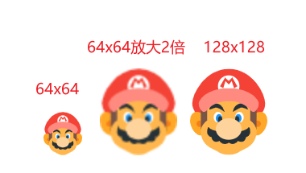
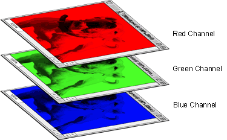
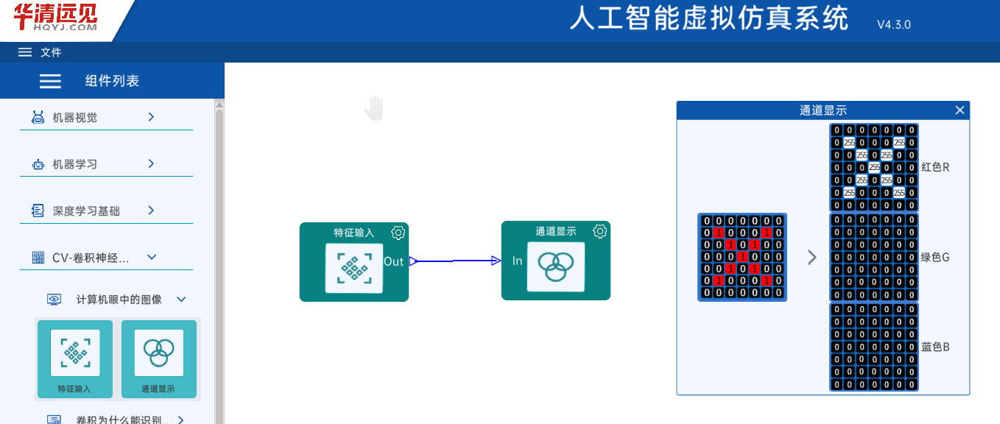

# 计算机眼中的图像

计算机眼中的图像实际上是由数字组成的矩阵集合。了解图像构成，我们需要了解以下几个概念

- 像素
- 颜色值
- 通道

## 像素

以显示器为例，假如一个显示器的最大分辨率为 1920x1080，则代表该显示器由 1080 行 1920 列发光小点组成，每个发光小点我们称为一个**像素**

显示器上最大的像素大小是**物理像素大小**，也就是该显示器实际由多少个发光小点组成。但是计算机中图像绘制是可以缩放的，缩放后图片占用显示器的像素大小就不是原始图像大小了。

通常一张图片大小为 100x100，则意味着他的**物理像素大小**为 100x100

## 颜色值

和生活中的三原色 `红黄蓝` 不同，计算机中的三原色是 **红绿蓝**，简称 RGB(Red Green Blue)

电脑会通过数字来表达这些颜色，例如，表达红色则数字组合应该是 (255, 0, 0)，绿色 (0, 255, 0)，蓝色 (0, 0, 255)

RGB 3色分别由3个数字来代表，其值为 0~255 之间，有时为了更好的训练模型，我们可以归一化，将颜色值表达为 0~1 之间的数字

RGB 以外的颜色，可以进行调和，例如黄色 (255, 255, 0) 紫色 (255, 0, 255)

## 通道

上述的 RGB 表示颜色值时，图片将其分为了 RGB 3个图层，将 3 个像素图层叠加在一起就形成了一个彩色图片

每个通道中记录的是该颜色的值，如图:

## 实验

