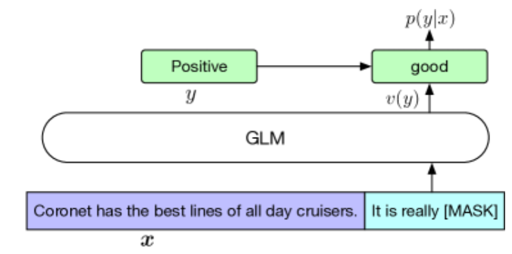

# GLM

[论文: GLM: General Language Model Pretraining with Autoregressive Blank Infilling](https://arxiv.org/abs/2103.10360)

[ChatGLM3 开源项目地址](https://github.com/THUDM/ChatGLM3)

## 简介

GLM (General Language Model) 通用语言模型，他的主要设计思路是，输入一个被掩码屏蔽部分文本的破碎文本，然后让模型自回归 (autoregressive，也就是预测一个结果后，自动根据已预测的结果继续预测后续内容)，完成对屏蔽部分的预测，也就是完形填空。如图:

- 绿色部分将作为屏蔽部分
- 模型将自回归预测屏蔽部分的内容

## 模型架构

GLM 使用单个 Transformer，并对架构进行了一些修改：（1）重新安排了层归一化和残差连接的顺序，这已被证明对于大规模语言模型避免数值错误至关重要。(2) 使用单个线性层进行输出标记预测。(3) 将 ReLU 激活函数替换为 GeLU。

### 示意图

- (a): 在原始文本中随机部分内容被屏蔽掉，论文中经过实验证明，15%的内容被屏蔽掉，能有效训练模型；上图屏蔽的部分有两段，分别是绿色的 $x_3$ 和黄色的 $x_5 \ x_6$
- (b): 模型输入由两部分组成， A部分为原始文本，并使用屏蔽特殊符 [Mask]，来屏蔽部分内容；B部分为被屏蔽的内容
- (c): 模型输入的左侧蓝色区域为被屏蔽后的文本；然后将被屏蔽部分的文本打乱顺序拼接到右侧；被屏蔽的文本需要用 [S] 标记作为开头，并且预测结果已 [E] 标记结尾；
- (c): 输入参数进行了二维位置编码，给每个输入添加了两个位置id，第一个位置id代表每个输入在原始文本中的顺序id；第二个位置id代表被屏蔽的跨度内的顺序，而原文本的第二个位置id全为 0
- (d): 模型内，A部分能关注自己，但不能关注B部分的内容；B部分能关注A部分，也能关注B部分的前因，但不能关注后出现的 token

## 微调 Finetuning GLM

### 感情色彩分类

语句感情色彩分类，如图:

在原始语句的末尾添加一个需要预测的频闭内容，如图中的 `It is really [MASK]`

那么模型就会预测 [MASK] 部分的内容，例如结果为 `good`

然后通过制作一个映射关系，让 `good` 映射为 “积极” 情绪等，来对语句的感情色彩进行分类

最后算出预测不同感情色彩结果的概率

### 文本生成

对于文本生成任务，给定的上下文构成输入的 A 部分，并在末尾附加一个掩码标记。该模型以自回归方式生成 B 部分的文本。我们可以直接应用预训练的 GLM 进行零样本，或有条件样本的文本生成任务

例如: 输入 `i love this red car, it's so [MASK]`，然后让 GLM 自回归，直到输出 [E] 标记为止