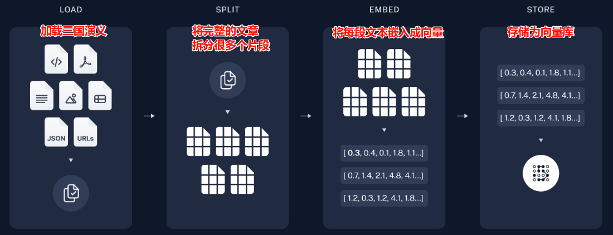
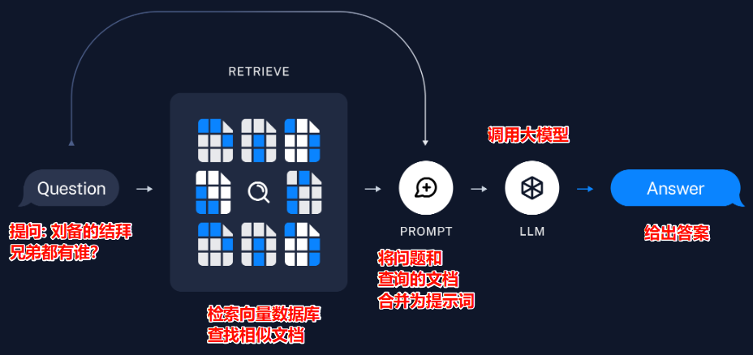
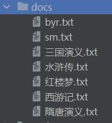

[toc]

# RAG检索增强生成

RAG (Retrieval Augmented Generation) 检索增强生成

该技术常用于创建问答平台时，为 AI 扩充知识库

例如: 问 AI，刘备的结拜兄弟都有谁？那么我们需要提供 《三国演义》 作为知识库，AI 会从知识库中搜索相关词条，最后综合考虑后输出结果。

我们用下图来带入场景解释这个过程

## 图解重要概念

RAG 过程中有如下几个重要概念

- 加载文档
- 切分文档
- 词嵌入
- 向量库
- 检索和生成

过程图解如下

### 创建知识库

这个过程会经历 `加载文档 -> 切分文档 -> 词嵌入 -> 向量库`



### 检索和生成

过程如下: `用户提问 -> 检索和问题相关的文档 -> 将问题和检索结果提供给大模型 -> 模型推测结果`



## 代码实现

我们先从网上下载对应文章作为我们的文档，可以在[这里下载](https://github.com/naosense/Yiya/tree/master/book)

### 创建知识库

首先下载文本文档，准备资料



#### **加载文档**

```python
docs = TextLoader('./docs/三国演义.txt', encoding='gbk').load()
```

#### **切分文档**

```python
# separators: 断句符号
# chunk_size: 每个分块的大小
# chunk_overlap: 上下分块中有多少个字会重叠
text_splitter = RecursiveCharacterTextSplitter(
    separators=[
        "\n\n",  # 段落换行
        "\n",  # 单换行
        ".",  # 英文句号
        "?",  # 英文问号
        "!",  # 英文感叹号
        "。",  # 中文句号
        "？",  # 中文问号
        "！",  # 中文感叹号
        # "；",  # 中文分号
        # ";",  # 英文分号
        # "：",  # 中文冒号
        # ":",  # 英文冒号
    ],
    chunk_size=300,
    chunk_overlap=100)
# splits 是 Document 列表
splits = text_splitter.split_documents(docs)
```

#### **创建词嵌入模型**

因为向量库需要把文本转向量，这里需要用到词嵌入技术，我们可以从 huggingface 上下载开源的模型

[embedding 模型下载](https://github.com/FlagOpen/FlagEmbedding/blob/master/README_zh.md)

这里为了方便学习下载最小的 `bge-small-zh`

```python
from sentence_transformers import SentenceTransformer

# 创建自己的词嵌入模型
class BGE_Embed(Embeddings):
    def __init__(self):
        # 加载模型
        self.model = SentenceTransformer(r'D:\projects\bge-small-zh')

    # embed_documents 和 embed_query 是必须实现的两个方法

    def embed_documents(self, texts: List[str]) -> List[List[float]]:
        return [self.model.encode(t).tolist() for t in texts]

    def embed_query(self, text: str) -> list[float]:
        return self.model.encode(text).tolist()
```

#### **创建向量库**

```python
# 保存向量库
vectorstore = Chroma.from_documents(
    documents=splits,
    embedding=BGE_Embed(),
    persist_directory="./chroma_db"
)

# 加载向量库
vectorstore = Chroma(
    embedding_function=BGE_Embed(),
    persist_directory="./chroma_db"
)
```

至此知识库创建完成

### 检索和生成

#### 创建检索器

```python
retriever = vectorstore.as_retriever()
```

#### 创建提示词模板

用于将检索到的资料和用户的问题合并输入 LLM

```python
system_prompt = (
    "你是一个负责问答任务的助手。"
    "使用以下检索到的上下文来回答问题。"
    "如果你不知道答案，就说你不知道。"
    "最多使用三句话，并保持回答简洁。"
    "\n\n"
    "{context}"
)

prompt = ChatPromptTemplate.from_messages(
    [
        ("system", system_prompt),
        ("human", "{input}"),
    ]
)
```

#### 格式化检索结果

```python
# docs: 检索出的结果文档
def format_docs(docs):
    # 这里用两个换行符进行拼接
    return "\n\n".join(doc.page_content for doc in docs)
```

#### 创建 RAG 链

```python
rag_chain = (
        {"context": retriever | format_docs, "input": RunnablePassthrough()}
        | prompt
        | model
        | StrOutputParser()
)
```

这里的 `model` 是 `ChatOpenAI` 实例

`RunnablePassthrough()` 代表用户调用 `rag_chain` 时的输入

#### 生成回答

调用 RAG 链即可

```python
print(rag_chain.invoke("刘备的结拜兄弟都有谁？"))
```