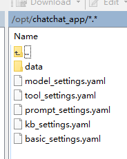

# 安装与使用

## 安装依赖

创建一个 conda 环境

```shell
conda create -n chatchat python=3.10
```

安装 chatchat

```shell
pip install langchain-chatchat -U
# 若使用的 xinference 部署的模型则继续安装:
pip install "langchain-chatchat[xinference]" -U
```

为了使用知识库，需要安装 nltk 对应工具，我们可以在 [nltk_data](https://github.com/nltk/nltk_data) 上下载工具

- [punkt](https://github.com/nltk/nltk_data/blob/gh-pages/packages/tokenizers/punkt.zip)
- [averaged_perceptron_tagger](https://github.com/nltk/nltk_data/blob/gh-pages/packages/taggers/averaged_perceptron_tagger.zip)

然后放到用户目录下，例如:

```
/home
    ↳master
        ↳nltk_data
            ↳taggers
                ↳averaged_perceptron_tagger
            ↳tokenizers
                ↳punkt
```

## 初始化项目

创建一个目录来存放服务所产生的文件，例如: `/opt/chatchat_app`

然后在目录下运行初始化命令:

```shell
chatchat init
```

此时会自动生成文件



修改 `model_settings.yaml` 和 `tool_settings.yaml`，其余配置文件可以根据需要修改

```
# model_settings.yaml
# 模型配置项
# 修改默认模型的名称为 xinference 上运行的模型名称

# 默认选用的 LLM 名称
DEFAULT_LLM_MODEL: llama3-3b
# 默认选用的 Embedding 名称
DEFAULT_EMBEDDING_MODEL: my-bge-large

...

# 其他配置掠过
...

# 修改平台的对应配置
MODEL_PLATFORMS:
  - platform_name: xinference
    platform_type: xinference
    api_base_url: http://127.0.0.1:9997/v1
    api_key: EMPTY
    api_proxy: ''
    api_concurrencies: 5
    auto_detect_model: true
    llm_models: ['llama3-3b']
    embed_models: ['my-bge-large']
    text2image_models: []
    image2text_models: []
    rerank_models: []
    speech2text_models: []
    text2speech_models: []
```


```
# tool_settings.yaml
# Agent 工具配置项
# 根据需要修改内容
...

# 心知天气（https://www.seniverse.com/）工具配置项
weather_check:
  # 要使用的工具就把 use 设为 true
  use: true
  api_key: '这里填自己的 api key'

...

# numexpr 数学计算工具配置项
calculate:
  use: true

...

# 高德地图、天气相关工具配置项。
amap:
  use: true
  api_key: '这里填自己的 api key'

```

若希望工具能被调用，则还需要配置对应模型工具调用的提示词，就需要修改 `prompt_settings.yaml`

## 启动服务

```shell
chatchat start -a
```

- `http://server_host:7861`: api 服务器地址，用来开发时接收请求
- `http://server_host:8501`: web ui 地址，这个地址用来管理模型和知识库等，也可以用来在线测试模型。

## 接口调用

[api 接口文档](https://github.com/chatchat-space/Langchain-Chatchat/blob/master/docs/contributing/api.md)

```python
import requests

base_url = 'http://192.168.128.129:7861'


def chat(prompt: str):
    def generate_response(_response):
        for line in _response.iter_content(None, decode_unicode=True):
            yield line

    def fail():
        yield '请求失败'

    response = requests.post(base_url + '/chat/chat/completions', json={
        'model': 'llama3-3b',
        'messages': [
            {'role': 'system', 'content': '你是人工智能助手，名叫张三。'},
            {'role': 'user', 'content': prompt}
        ],
        'temperature': 0.7,
        'max_tokens': 2048,
        'stream': True
    }, stream=True)

    if response.status_code != 200:
        return fail()
    else:
        return generate_response(response)


if __name__ == '__main__':
    for chunk in chat('你叫什么名字'):
        print(chunk)

```