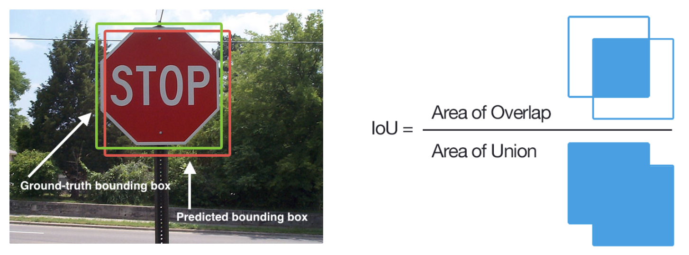
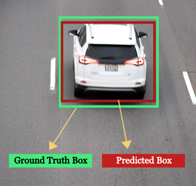
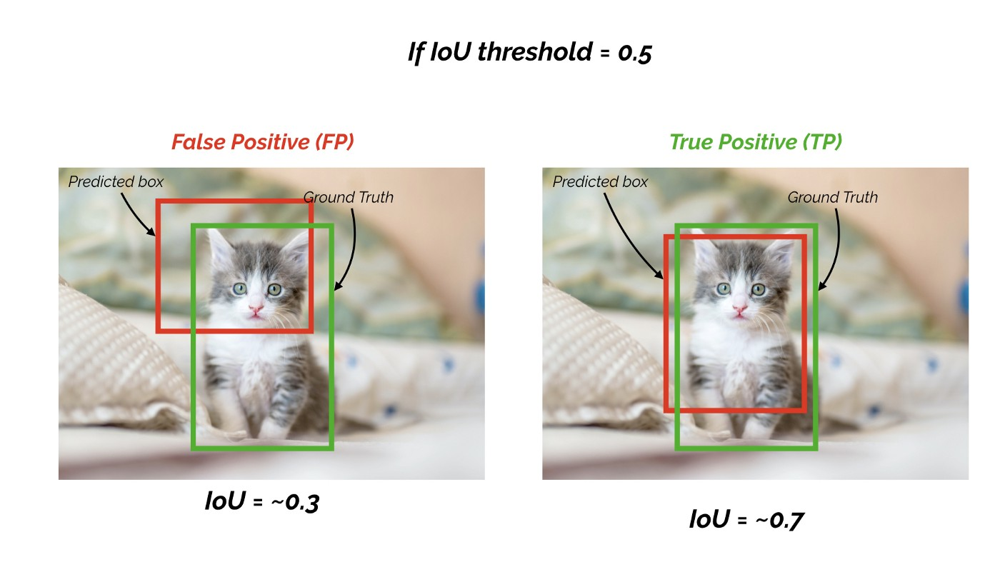
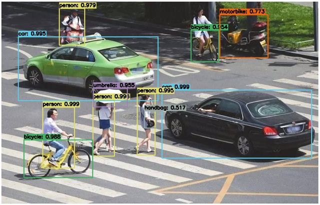
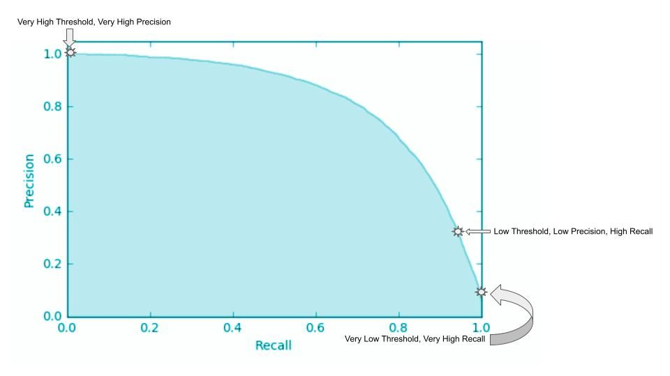
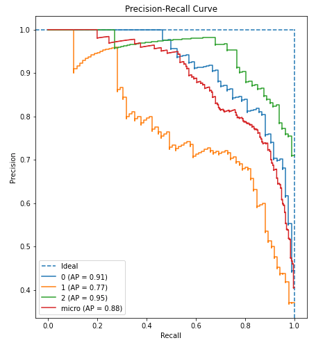
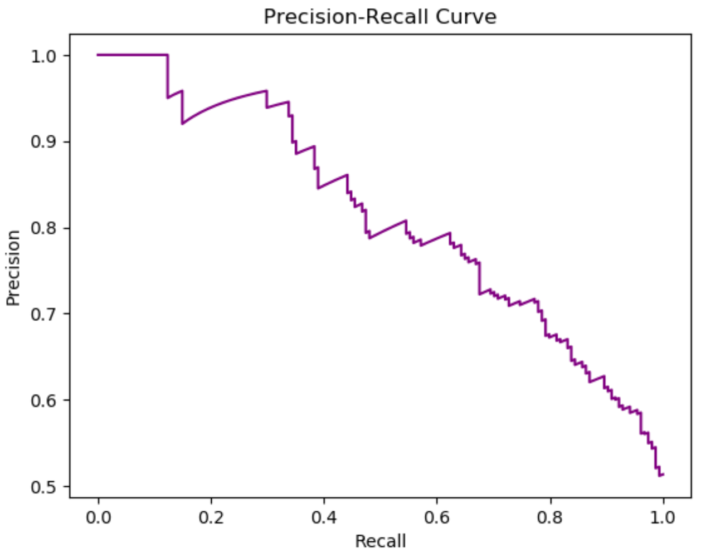
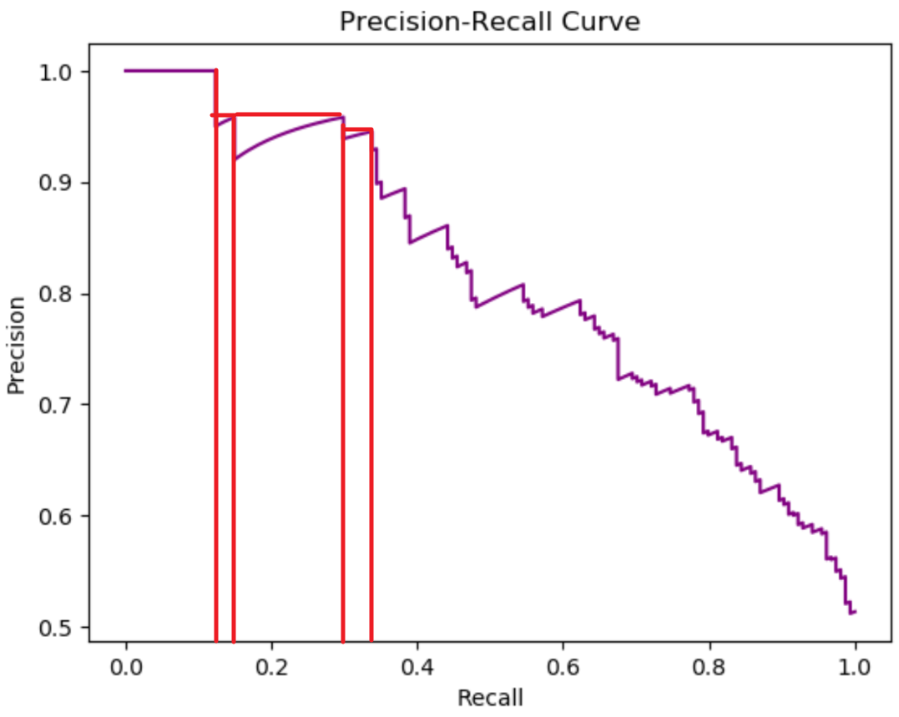

## IOU 交并集比

上图蓝色区域是标注区域，红色区域是预测区域。

那么两区域相交的交集比上两区域的并集，就是 IOU (Intersection over Union)

IOU 值越大，说明预测结果和真实结果越重合。所以 IOU 用来衡量预测结果是否准确。

# Mean Average Precision (mAP) 平均精度

平均精度 (mAP) 是用于评估 Fast R-CNN、YOLO、Mask R-CNN 等对象检测模型的指标。平均精度 (AP) 值的平均值是根据 0 到 1 的召回值计算得出的。

mAP 的计算由 5 个部分组成

- 混淆矩阵 Confusion Matrix
- 交集并集比 Intersection over Union (IoU)
- 精度 Precision
- 召回率 Recall
- 置信度 confidence score

## 1.混淆矩阵 Confusion Matrix

要创建混淆矩阵，我们需要四个属性：

- True Positives (TP): **真阳性**，模型预测标签并根据基本事实正确匹配。
- True Negatives (TN): **真阴性**，模型不会预测标签，也不是真实情况的一部分。
- False Positives (FP): **误报**，模型预测了标签，但它不是基本事实的一部分（I 类错误）
- False Negatives (FN): **假阴性**，模型不预测标签，但它是基本事实的一部分。 （第二类错误）

矩阵如图:

- Actual: 实际的
- Predicted: 预测到的
- Positive: 正例、阳性样本
- Negative: 负例、阴性样本

举例来说

- 假如 10 个人中有 7 个男生 3 个女生。
- 假设让AI从所有人中选择所有的女生
- 则 7 个男生是负例，3 个女生是正例
- 结果AI预测了 2 男 2 女 4 个学生

以此我们可以得到如下参数:

- TP: AI正确找到女生的数量 2
- FP: AI错误判断为女生的数量(误报) 2，因为它把 2 个男生当作女生了
- TN: AI正确判断出男生的数量 5，7 个男生中有2个被错误的当作女生了
- FN: AI错误的将女生判断成了男生(假阴性)，数量为 1

### TP、FN、FP、TN 的关系

1. TP + FN = 所有正样本
2. FP + TN = 所有负样本
3. TP + FP = 所有被模型判断为正样本的数量
4. TN + FN = 所有被模型判断为负样本的数量

## 2.交并比 Intersection over Union (IoU)

并集交集表示**预测框**坐标与**真实标注**的重叠。 IoU 较高表示**预测框**坐标与**真实标注**坐标非常相似。如图:

- Ground Truth: 真实标注，上图，绿色框
- Predicted: 预测框，上图，红色框

那么两区域相交的交集比上两区域的并集，就是交并比 IoU (Intersection over Union)

IoU 值越大，说明预测结果和真实结果越重合。所以 **IoU 用来衡量预测框和真实标注的相似度**。

IoU 常被作为一种相似度算法，类似余弦相似度算法，这个**相似度被用作目标检测的阈值，称为IoU阈值**

**IoU阈值被用来计算混淆矩阵的TP和FP**，如图:

- 该图顶部 IoU 阈值为 0.5
- 左图，IoU 计算结果约等于 0.3，小于 0.5，所以被判断为了 FP
- 右图，IoU 计算结果约等于 0.7，大于 0.5，所以被判断为 TP

## 3.精度 Precision

$$
Precision = \frac{TP}{TP+FP}
$$

- 分母: 所有被判断成正例的样本
- 分子: 正确的判断成正例的样本

所以精度描述的是，判断结果中正确的比例

**精度越高，正确率越高，但可能有遗漏**

## 4.召回率 Recall

召回率 也叫 查全率

$$
Recall = \frac{TP}{TP+FN}
$$

- 分母: TP 是预测正确的正例，FN 是预测错误的负例，也可以认为是没有预测到的正例。例如: 明明不是背景，却被当作背景预测了，这种就是 FN。所以整个分母指的是**所有的正例**，包括预测到的和未预测到的
- 分子: 正确的判断成正例的样本

所以召回率描述的是，所有正例样本中，判断正确的比例

**召回率越低，说明检测漏的样本越多，漏检越多**

### 精度-召回率不能单独衡量模型能力

精度和召回率不能独立使用，因为:

当召回率高但准确率低时，您的模型会产生许多误报（负样本被分类为正样本），即使它对正样本进行了正确分类。相反，如果准确率高但召回率低，则您的模型仅在将样本分类为正样本时才是准确的；但它可能只对一些正样本这样做(也就是会漏检)。

所以，要用整个 精度-召回率曲线图 来衡量模型的好坏，而不能独立使用一个标准

## 5.置信度

### 什么是置信度？

在检测目标，产生边界框的同时，模型会给出一个置信度。该置信度表示的是目标对象是否在边界框中的概率。

图中检测框上就有个数字，代表的就是置信度。

### 置信度怎么计算出来的？

置信度是通过模型，训练后，预测出来的。

在深度学习中，常见的目标检测模型（如Faster R-CNN、SSD、YOLO等）通常以卷积神经网络（Convolutional Neural Network, CNN）为基础。这些模型的最后一层或者一些附加的全连接层（fully connected layer）输出了目标检测任务所需的信息，包括边界框坐标和对应的置信度分数。

## 精度召回率曲线 Precision-Recall Curve, PRC

上图是一个横坐标为召回率，纵坐标为精度的曲线，这就是 PRC

在计算 PRC 图的时候，会用不同的置信度阈值来计算，例如: 置信度阈值为 0.5，0.7，0.9 时，可以计算出对应的精度和召回率

PRC 其实并没有上图那么平滑，如图:

## 计算 mAP 步骤

计算步骤如下:

- 生成预测框: 由模型生成目标检测的预测框和置信度
- 排序: 对每个类别的预测框按照其置信度分数进行降序排序。这样，高置信度的预测框会排在前面。
- 计算精度和召回率: 计算不同类别的精度和召回率，并使用 IoU 阈值判断 TP 和 FP
- 绘制PRC并计算AP: 计算每个分类的平均精度，这个后面细讲
- 计算mAP: 将上一步中的所有AP相加，并除以分类数量

### 绘制PRC并计算AP

这里假设已经计算了某一类别的精度和召回率，绘制 PRC 如图:

然后我们计算上图曲线下的面积，也就是 PRC 的积分，我们可以近似的将图中的离散点，当作矩形求面积，如图:

AP 就是该积分，积分公式如下

$$
AP = Σ_{r_i}ΔR_i·P_i
$$

### 计算mAP

假设我们要识别图像中的 3 种目标，人、狗、车，那么 mAP 指的就是，人、狗、车，3 个类别的 AP 的平均值，公式如下:

$$
mAP=\frac{1}{N}Σ^N_{i=1}AP_i
$$

- N: 分类数量，上述例子人、狗、车，则 N=3
- $AP_i$: 第 i 组分类的平均精度

所以 mAP 的计算，通俗点理解，就是把每个类别的 AP 加起来然后除以类别数量