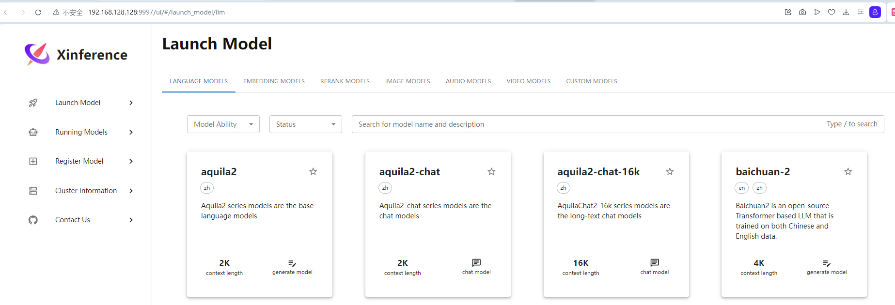

# 命令行工具

安装好后，我们可以使用 `xinference` 的命令行工具来控制它

## xinference 服务器命令

我们使用 `xinference-local` 命令来启动一个服务器，**之后所有操作都要依赖这个服务器**

我们可以使用以下命令查看该命令该如何使用

```shell
xinference-local --help

# 返回结果如下
## 使用方法
Usage: xinference-local [OPTIONS]
  ## 命令描述
  Starts an Xinference local cluster.
## 命令选项
Options:
  --log-level TEXT                Set the logger level. Options listed from
                                  most log to least log are: DEBUG > INFO >
                                  WARNING > ERROR > CRITICAL (Default level is
                                  INFO)
  -H, --host TEXT                 Specify the host address for the Xinference
                                  server.
  -p, --port INTEGER              Specify the port number for the Xinference
                                  server.
  -MH, --metrics-exporter-host TEXT
                                  Specify the host address for the Xinference
                                  metrics exporter server, default is the same
                                  as --host.
  -mp, --metrics-exporter-port INTEGER
                                  Specify the port number for the Xinference
                                  metrics exporter server.
  --auth-config TEXT              Specify the auth config json file.
  --help                          Show this message and exit.
```

通过上面的介绍，我们使用如下命令启动服务器

```shell
xinference-local -H 0.0.0.0 -p 9997
```

然后我们通过自己的网址和端口号打开网页，如下:

```
# ip 地址可以根据情况替换
http://127.0.0.1:9997
```



## 其他 xinference 客户端命令

在不使用网页的情况下，我们依然可以使用 `xinference` 的命令来完成操作任务

我们可以使用 `xinference --help` 查看命令用法

```shell
xinference --help

# 返回结果如下
## 使用方法
### [OPTIONS]: 选项
### COMMAND: 命令名
### [ARGS]: 命令参数
Usage: xinference [OPTIONS] COMMAND [ARGS]...
  ## 描述
  Xinference command-line interface for serving and deploying models.
## 选项
Options:
  -v, --version       Show the current version of the Xinference tool.
  --log-level TEXT    Set the logger level. Options listed from most log to
                      least log are: DEBUG > INFO > WARNING > ERROR > CRITICAL
                      (Default level is INFO)
  # 要连接的主机地址
  -H, --host TEXT     Specify the host address for the Xinference server.
  # 要连接的端口号
  -p, --port INTEGER  Specify the port number for the Xinference server.
  --help              Show this message and exit.
## 命令
Commands:
  ## 缓存
  cached         List all cached models in Xinference.
  ## 计算评估模型内存消耗
  cal-model-mem  calculate gpu mem usage with specified model size and...
  ## 聊天
  chat           Chat with a running LLM.
  ## 查询当前 xinference 引擎对模型的支持
  engine         Query the applicable inference engine by model name.
  ## 生成文本
  generate       Generate text using a running LLM.
  ## 启动模型
  launch         Launch a model with the Xinference framework with the...
  ## 罗列运行的模型
  list           List all running models in Xinference.
  login          Login when the cluster is authenticated.
  ## 注册模型
  register       Register a new model with Xinference for deployment.
  ## 罗列所有已注册的模型
  registrations  List all registered models in Xinference.
  ## 删除缓存
  remove-cache   Remove selected cached models in Xinference.
  ## 停止一个集群
  stop-cluster   Stop a cluster using the Xinference framework with the...
  ## 终止一个运行的模型
  terminate      Terminate a deployed model through unique identifier...
  ## 注销模型
  unregister     Unregister a model from Xinference, removing it from...
  ## 查询并显示与 vLLM 兼容的模型
  vllm-models    Query and display models compatible with vLLM.
```