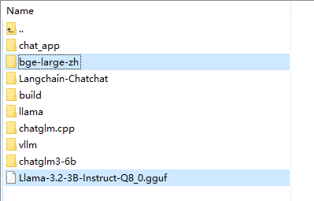
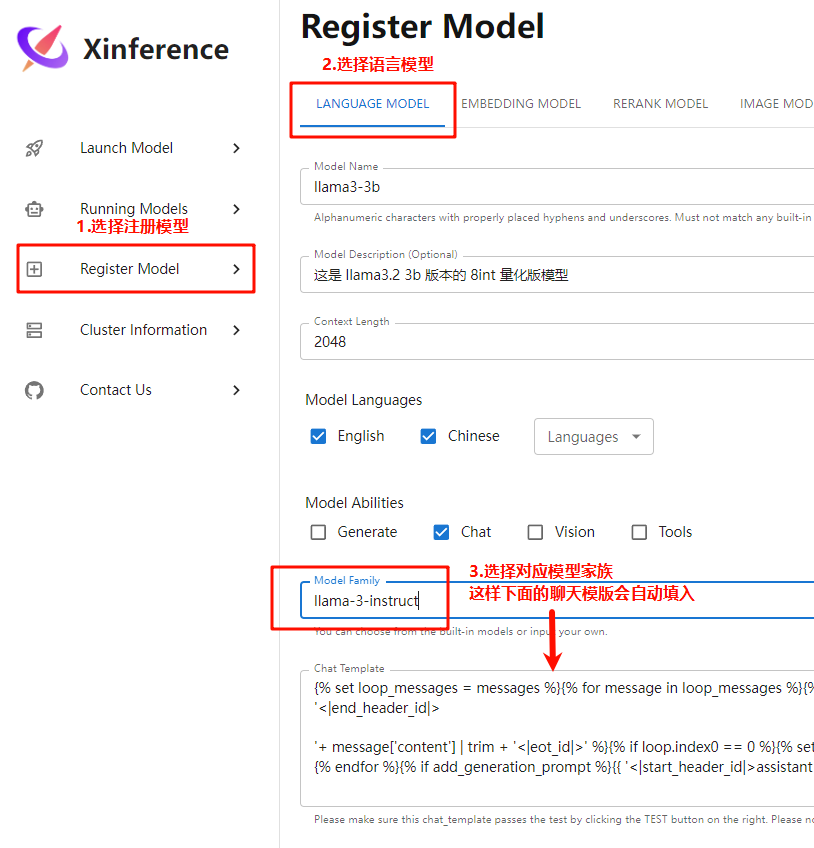
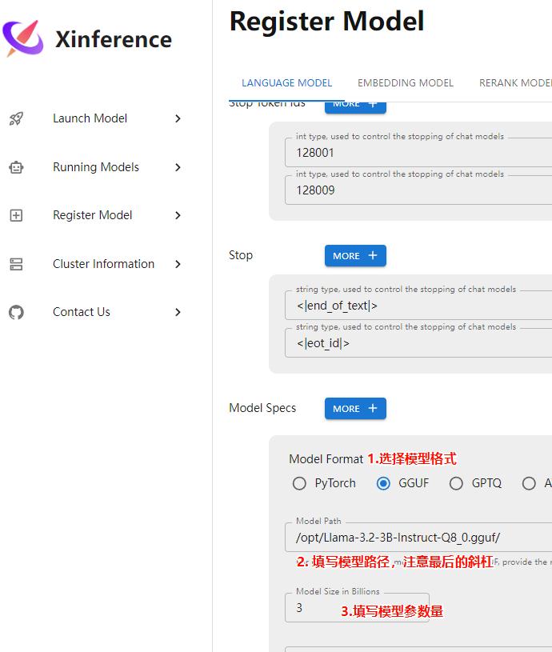
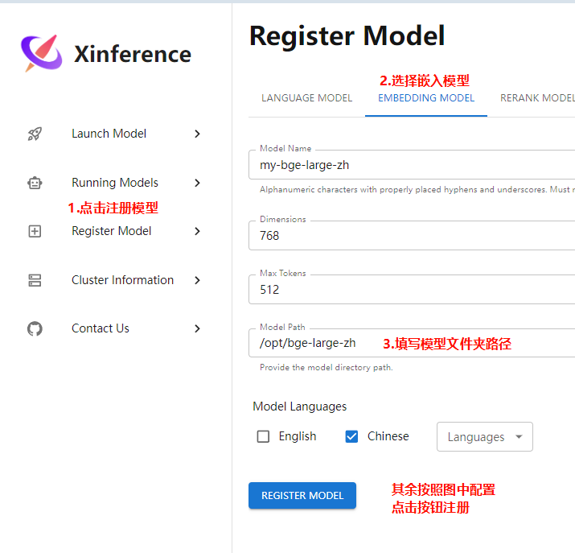
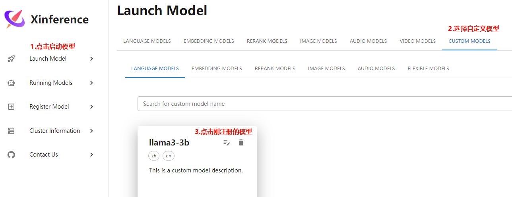
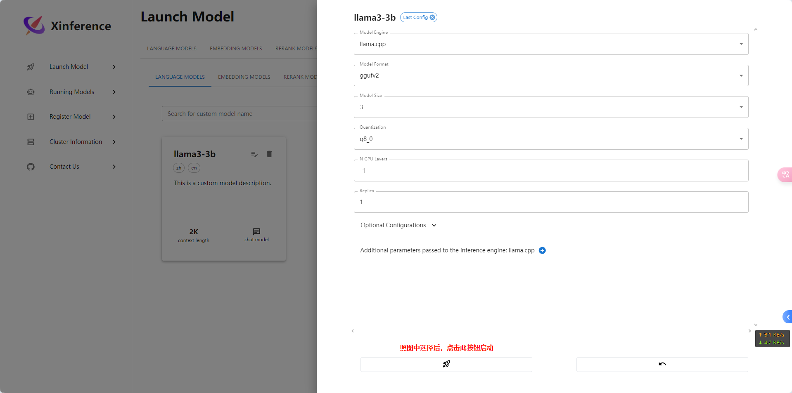
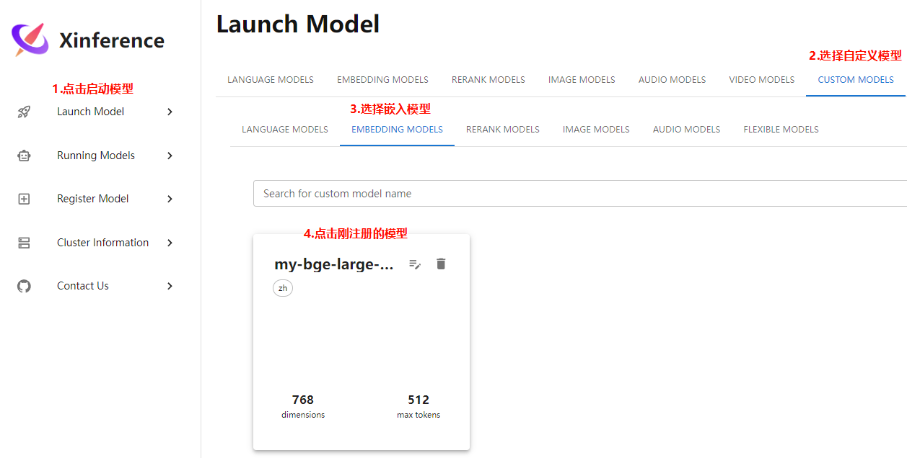
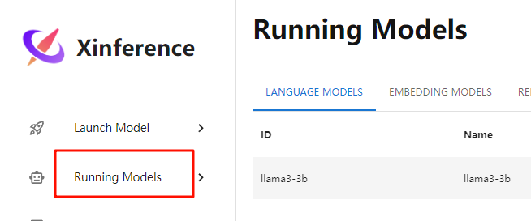

# 模型部署

我们需要部署两种模型

- LLM: 大语言模型，用于对话
- Embedding: 用于知识库的词嵌入

## 下载模型

上传图中高亮的以下好的 `LLM` 模型和 `Embedding` 模型，下载地址如下:

- LLM: `llama3` （[modelscope](https://www.modelscope.cn/models/QuantFactory/Llama-3.2-3B-GGUF) | [huggingface](https://huggingface.co/bartowski/Llama-3.2-3B-Instruct-GGUF)）
- Embedding: `bge-large-zh`（[modelscope](https://www.modelscope.cn/models/AI-ModelScope/bge-large-zh) | [huggingface](https://huggingface.co/BAAI/bge-large-zh)）



## 启动服务

```shell
xinference-local -H 0.0.0.0 -p 9997
```

## 注册模型

### 注册 LLM





上述配置好后点击最下方的注册按钮


### 注册 Embedding



## 启动模型

### 启动 LLM





### 启动 Embedding



点开后直接启动不用修改参数


## 检查模型是否启动成功

先在 Running Models 下查看是否存在已启动的模型



然后可以写脚本用 `langchain` 或 `openai` 的 `api` 访问服务，例如:

```python
from langchain_openai import ChatOpenAI

model = ChatOpenAI(
    model="llama3-3b",
    base_url='http://192.168.128.128:9997/v1',
    api_key='EMPTY',
    temperature=0.7,  # 控制生成文本的随机性
    top_p=1.  # 核采样策略
)

chunks = None
for chunk in model.stream('你好'):
    # chunk 的类型是 AIMessageChunk
    print(chunk.content, end='')
    if chunks is None:
        chunks = type(chunk)('')
    # BaseMessageChunk 可以使用加法操作
    # 最后拼接成一个完整句子
    chunks += chunk
print()
print(chunks)
```

运行上述脚本，若成功则会返回模型的响应结果，例如:

```
你好！我是你的AI助手，什么可以帮你做？
content='你好！我是你的AI助手，什么可以帮你做？' additional_kwargs={} response_metadata={'finish_reason': 'stop', 'model_name': 'llama3-3b'}
```
