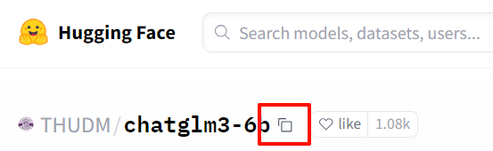

# transformers

## Hugging Face Transformers 简介

Hugging Face Transformers 是一个开源库，旨在简化使用和训练各种自然语言处理（NLP）模型。以下是该库的一些关键特点：

1. **预训练模型**：提供了多种预训练模型，包括 BERT、GPT、T5、BART 等，这些模型可以用于多种任务，如文本分类、命名实体识别、文本生成等。

2. **易于使用**：通过简单的 API，用户可以轻松加载预训练模型、进行微调、生成文本和进行推理。

3. **跨框架支持**：支持 PyTorch 和 TensorFlow，使得用户可以根据自己的需求选择框架。

4. **社区驱动**：Hugging Face 拥有一个活跃的社区，用户可以分享自己的模型和数据集，也可以从其他用户那里获取灵感和帮助。

5. **支持多语言**：提供了多种语言的模型，使得 NLP 研究可以覆盖更多的语言和文化。

6. **集成工具**：配合使用 Transformers，Hugging Face 还提供了 Datasets 和 Tokenizers 库，帮助用户处理数据和文本。

7. **文档和教程**：提供丰富的文档和示例，帮助用户快速上手和深入理解模型的使用。

总的来说，Hugging Face Transformers 是一个强大且灵活的工具，适合研究人员和开发者在自然语言处理领域的各种应用。

之前运行的 ChatGLM3 就是基于 transformers 运行的。

## 安装环境

```shell
# 安装 transformers
pip install transformers
# 仅安装 cpu 支持
pip install transformers[torch]
# 通过 conda 安装
conda install conda-forge::transformers
```

## 加载开源模型

加载模型可以是在线的也可以是离线加载，区别仅在于加载时的路径

### 在线下载

我们使用以下代码加载模型和分词器

```python
tokenizer = AutoTokenizer.from_pretrained("THUDM/chatglm3-6b")
model = AutoModelForSeq2SeqLM.from_pretrained("THUDM/chatglm3-6b")
```

参数为要加载的模型名，这些模型均能在 [huggingface.co](https://huggingface.co/) 上找到，例如搜索 `chatglm3-6b`




点击上图按钮可以复制名称，再把名称作为上面代码的参数填入

这样 `transformers` 默认会从 `huggingface` 上下载对应名称的模型到默认目录下

### 离线加载

我们可以先下载模型，如图:


这将完整下载模型，下载后就能直接使用

然后加载模型，此时使用模型存放的目录作为参数

```python
tokenizer = AutoTokenizer.from_pretrained("D:/chatglm3-6b", trust_remote_code=True)
model = AutoModelForSeq2SeqLM.from_pretrained("D:/chatglm3-6b", trust_remote_code=True)
```

> ==`trust_remote_code=True` 作用是信任本地模型的一个确认操作，不添加此参数则不能加载本地模型==

## 调用模型

参考 [部署原生ChatGLM3](../../部署原生ChatGLM3.md)

这里还可以参考官方教学，[使用 `pipeline` 的内部流程](https://huggingface.co/docs/transformers/conversations#what-happens-inside-the-pipeline)

```python
from transformers import AutoModel, AutoTokenizer
import torch

# 准备输入数据
# Prepare the input as before
chat = [
    {"role": "system", "content": "你是人工智能助手，你需要帮助用户解答疑问"},
    {"role": "user", "content": "请问 1 + 1 等于几？"}
]

# 加载模型和分词器
# 1: Load the model and tokenizer
model = AutoModel.from_pretrained('D:/projects/chatglm3-6b', trust_remote_code=True)
tokenizer = AutoTokenizer.from_pretrained('D:/projects/chatglm3-6b', trust_remote_code=True)

# 应用聊天模板，生成新的提示词序列
# 2: Apply the chat template
formatted_chat = tokenizer.apply_chat_template(chat, tokenize=False, add_generation_prompt=True)
print("Formatted chat:\n", formatted_chat)

# 分词
# 3: Tokenize the chat (This can be combined with the previous step using tokenize=True)
inputs = tokenizer(formatted_chat, return_tensors="pt", add_special_tokens=False)
# 将张量迁移到设备上
# Move the tokenized inputs to the same device the model is on (GPU/CPU)
inputs = {key: tensor.to(model.device) for key, tensor in inputs.items()}
print("Tokenized inputs:\n", inputs)

# 注意:
# inputs 作为输入必须是字典类型，inputs 中必须包含以下 key: input_ids、attention_mask

# 生成文本
# 4: Generate text from the model
outputs = model.generate(**inputs, max_new_tokens=512, temperature=0.1, do_sample=True, top_k=3, top_p=0.8)
print("Generated tokens:\n", outputs)

# 解码输出
# 5: Decode the output back to a string
decoded_output = tokenizer.decode(outputs[0][inputs['input_ids'].size(1):], skip_special_tokens=True)
print("Decoded output:\n", decoded_output)
```

大致流程都是一样，但有些模型自己封装了这个流程，例如 `chatglm`

并且 `chatglm3` 对 `transformers` 的版本要求是 `transformers>=4.39.3`，建议就安装 `transformers==4.39.3` 的版本，高版本反而可能报错

以下是逐行输出的聊天 api

```python
from transformers import AutoTokenizer, AutoModel

# 加载模型
model = AutoModel.from_pretrained('D:/projects/chatglm3-6b', trust_remote_code=True)
tokenizer = AutoTokenizer.from_pretrained('D:/projects/chatglm3-6b', trust_remote_code=True)

history = []
past_key_values = None
query = '你好！'

# 发起第一次会话
result = model.chat(tokenizer, query, history=history, top_p=1, temperature=0.01)
print(result)

# response: 回复的文本
# history: 历史会话
response, history = result

query = '请问 1 + 1 等于几？'

# 继续对话
result = model.chat(tokenizer, query, history=history, top_p=1, temperature=0.01)

print(result)
```

以下是流式输出的聊天 api

```python
from transformers import AutoTokenizer, AutoModel

# 加载模型
model = AutoModel.from_pretrained('D:/projects/chatglm3-6b', trust_remote_code=True)
tokenizer = AutoTokenizer.from_pretrained('D:/projects/chatglm3-6b', trust_remote_code=True)

history = [
    {'role': 'system', 'content': '你是人工智能助手chatglm，你需要帮助用户解决他们的问题。'},
    {'role': 'system', 'content': '你好！'}
]
past_key_values = None

query = '请问 1 + 1 等于几？'

# response: 返回的文本，每次循环返回的内容会有所增加
# history: 历史会话
# past_key_values: 注意力 kv 值，此处是以出现的 response 对应的 key value 值，用于后续注意力计算，所以这里要传入到下一次预测
for response, history, past_key_values in model.stream_chat(tokenizer, query, history=history, top_p=1,
                                                            temperature=0.01,
                                                            past_key_values=past_key_values,
                                                            return_past_key_values=True):
    print(history)
    print(past_key_values)
    print(response)
```

## 微调（训练）

微调指的是在预训练模型的基础上调整参数，本质上微调就是通过训练完成的，不过有非常多的微调方案，这里暂时只介绍简单的训练过程，具体内容可参考[官方教学](https://huggingface.co/docs/transformers/training)


