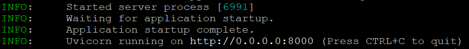

# api服务器

`OpenAI` 提供了完善的 API 服务器接服务

现在虽然我们没有购买 `OpenAI` 的 API 服务，但是我们可以搭建一个服务器，用来模拟伪装成 `OpenAI` 的服务器

这就是 `vllm` 提供的 API 服务器功能

## 启动服务

运行如下命令可以启动服务

```shell
# /opt/chatglm3-6b: 模型的本地路径
# --trust-remote-code: 新人远程代码，不添加就不允许使用本地模型
# --dtype auto: 数据类型，根据不同的 huggingface 上的模型，会自动设置数据类型
# --api-key: 访问服务器时的 key，现在的 key 为 token-abc123
# --device: 运行的设备
vllm serve /opt/chatglm3-6b \
            --trust-remote-code \
            --dtype auto \
            --api-key token-abc123 \
            --device cpu
```

运行成功会看到如下内容



## 访问服务

服务器启动了，相当于我们自己伪装了一个 `OpenAI` 的服务器，然后可以当作 `OpenAI` 的服务器来访问

编写如下代码访问服务器

```python
# 导入 openai 包
from openai import OpenAI

# 创建客户端
client = OpenAI(
    base_url="http://localhost:8000/v1",
    # 此处的 key 是启动服务时的 key
    api_key="token-abc123",
)

completion = client.chat.completions.create(
    # 指定要访问的模型
    model="/opt/chatglm3-6b",
    messages=[
        # 传给模型的消息
        {"role": "user", "content": "hello"}
    ]
)

print(completion.choices[0].message)
```
