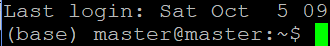
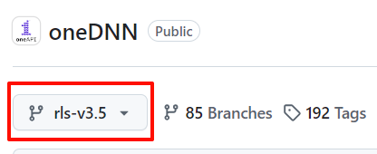
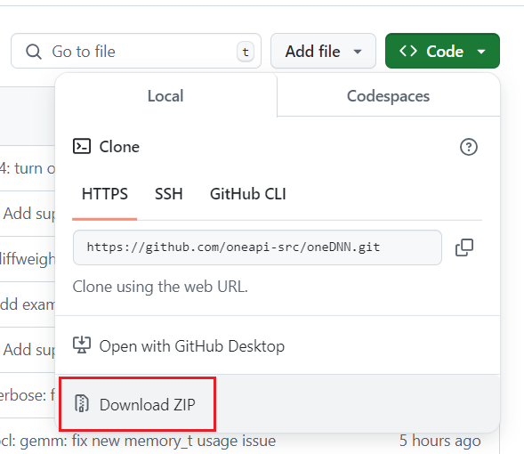
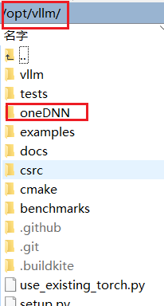

# vllm

[官网](https://docs.vllm.ai/en/latest/)

[github](https://github.com/vllm-project/vllm)

vLLM is a fast and easy-to-use library for LLM inference and serving.

vLLM 是一个快速且易于使用的库，用于 LLM 推理和服务。

## 环境搭建

此处安装 cpu 环境，[官方教程](https://docs.vllm.ai/en/latest/getting_started/cpu-installation.html)

环境需要 Linux 系统

> 若想运行 `llama.cpp`，则需要使用 `ubuntu 23.10` 及以上版本的系统

### 步骤

#### 1. 安装 C 和 C++ 编译器

```shell
sudo apt-get update  -y
sudo apt-get install -y gcc-12 g++-12 libnuma-dev
sudo update-alternatives --install /usr/bin/gcc gcc /usr/bin/gcc-12 10 --slave /usr/bin/g++ g++ /usr/bin/g++-12
```

> 若想运行 llama.cpp，则需要使用以下命令安装依赖 `sudo apt-get install -y gcc-13 g++-13`

#### 2. 安装 cmake

下载 [cmake](https://cmake.org/files/v3.26/cmake-3.26.4-linux-x86_64.tar.gz)

然后执行以下操作

```shell
# 解压
tar -zxvf cmake-3.26.4-linux-x86_64.tar.gz
# 移动到合适的目录
sudo mv cmake-3.26.4-linux-x86_64 /usr/local/cmake
# 添加环境变量
echo 'export PATH=/usr/local/cmake/bin:$PATH' >> ~/.bashrc
source ~/.bashrc
```

```shell
# 测试
cmake --version
```

#### 2. 安装 cmake（已弃用）

> 因为版本问题弃用了

```shell
sudo apt update
sudo apt upgrade
sudo apt install cmake
# 验证
cmake --version
```

#### 3. 安装 conda 环境

下载 [Miniconda3-latest-Linux-x86_64.sh](https://repo.anaconda.com/miniconda/Miniconda3-latest-Linux-x86_64.sh)

修改执行权限并运行

```shell
sudo chmod +x Miniconda3-latest-Linux-x86_64.sh
./Miniconda3-latest-Linux-x86_64.sh
```

根据提示，阅读证数并确定，确定安装路径

接下来添加环境变量，在 `~/.bashrc` 中添加如下代码

```
export PATH="$HOME/miniconda3/bin:$PATH"
```

然后应用生效

```shell
source ~/.bashrc
```

最后使用 `conda init` 命令初始化

初始化完成后再次运行 `bash` 或重新开启一个新终端，此时终端路径前会显示当前环境，如图:



接下来创建一个 `conda` 环境，并激活使用就可以了

**设置 `pip` 代理（非必要操作）**

```shell
# 先创建配置文件
mkdir -p ~/.pip
nano ~/.pip/pip.conf
# 添加以下内容并保存
[global]
proxy = http://your.proxy.server:port
# 设置镜像源
index-url = https://pypi.tuna.tsinghua.edu.cn/simple
```

#### 3. 安装 python 和 pip（已弃用）

> 因为环境问题，改用 conda 了

安装 pip 会收到一个警告

```
WARNING: Error parsing dependencies of distro-info: Invalid version: '1.1build1'
WARNING: Error parsing dependencies of python-debian: Invalid version: '0.1.43ubuntu1'
```

为了避免安装时的警告，我们可以执行以下操作来更新软件

```shell
# 更新系统软件包
sudo apt update
sudo apt upgrade
# 重装有问题的软件包
sudo apt remove --purge python3-distro-info python3-debian
sudo apt install python3-distro-info python3-debian
# 检查包的版本
dpkg -s python3-distro-info python3-debian
# 修复损坏的依赖关系
sudo apt --fix-broken install
```

再安装 python 和 pip

```shell
# 安装 python
sudo apt update
sudo apt install python3.10
# 安装 pip
sudo apt install python3.10-distutils
curl https://bootstrap.pypa.io/get-pip.py -o get-pip.py
python3.10 get-pip.py
```

安装后添加环境变量

在 `~/.bashrc` 中添加环境变量

```
# ~/.bashrc
export PATH=$HOME/.local/bin:$PATH
export PYTHONPATH=$HOME/.local/lib/python3.10/site-packages:$PYTHONPATH
```

重新加载环境变量

```shell
source ~/.bashrc
```

还可以设置以下内容（非必要操作）

```shell
# 设置 Python 3.10 为默认版本
sudo update-alternatives --install /usr/bin/python3 python3 /usr/bin/python3.10 1
# 按照提示选择 python3.10
sudo update-alternatives --config python3
```

设置 `pip` 代理（非必要操作）

```shell
# 先创建配置文件
mkdir -p ~/.pip
nano ~/.pip/pip.conf
# 添加以下内容并保存
[global]
proxy = http://your.proxy.server:port
```

安装完后，获取系统 `python` 的权限

```shell
sudo chown -R master:master /usr/lib/python3.10
```

#### 4. 克隆 vLLM 仓库

vLLM 仓库地址: https://github.com/vllm-project/vllm

```shell
git clone https://github.com/vllm-project/vllm.git
```

#### 5. 安装 vLLM cpu 后端

跳转目录到 vllm 项目下，然后执行以下代码

```shell
pip install --upgrade pip
pip install cmake>=3.26 wheel packaging ninja "setuptools-scm>=8" numpy
pip install -v -r requirements-cpu.txt --extra-index-url https://download.pytorch.org/whl/cpu
```

> 网速慢，可以添加代理 `--proxy http://<host>:<port>`

#### 6. 下载 oneDNN

oneDNN 仓库地址: https://github.com/oneapi-src/oneDNN

选择分支 `rls-v3.5`





==注意: 若使用 `git clone` 因为网络原因无法下载，可以直接下载 zip 包==

下载完后解压到 vllm 目录下，如图:



#### 7. 构建 oneDNN

构建前需要先获取部分目录的权限，如下:

```shell
# 此处的 master:master 代表 用户:用户组
# 根据自身情况可以修改
sudo chown master:master /usr/local/lib
sudo chown master:master /usr/local/include
sudo chown master:master /usr/local/share
```

构建项目

```shell
cmake -B ./oneDNN/build -S ./oneDNN -G Ninja -DONEDNN_LIBRARY_TYPE=STATIC \
    -DONEDNN_BUILD_DOC=OFF \
    -DONEDNN_BUILD_EXAMPLES=OFF \
    -DONEDNN_BUILD_TESTS=OFF \
    -DONEDNN_BUILD_GRAPH=OFF \
    -DONEDNN_ENABLE_WORKLOAD=INFERENCE \
    -DONEDNN_ENABLE_PRIMITIVE=MATMUL
cmake --build ./oneDNN/build --target install --config Release
```

#### 8. 构建 vLLM

```shell
VLLM_TARGET_DEVICE=cpu python setup.py install
```

将输出目录 `/opt/vllm/build/lib.linux-x86_64-cpython-312/vllm` 中的 `_core_C.abi3.so` 和 `_C.abi3.so` 文件复制到 `/opt/vllm/vllm` 中