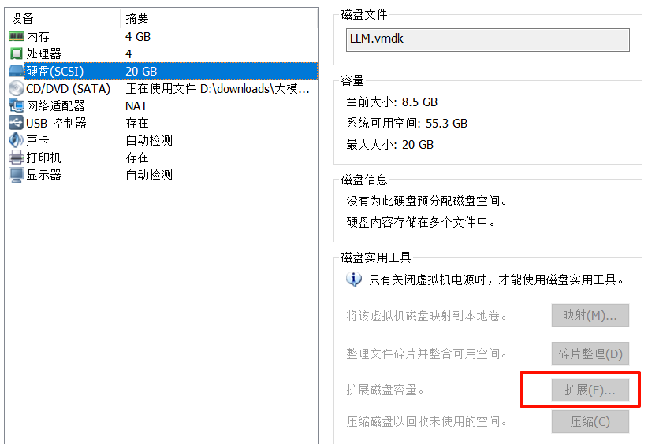

# 关于虚拟机磁盘扩容

## 在以存在的物理磁盘上扩展逻辑分区

虚拟机安装时，即使我们分配了 100g 磁盘，他也不会马上使用，会有部分磁盘处于`未分配`状态

我们按照以下步骤进行磁盘分区

1. 检查当前磁盘空间

```shell
df -h
```

2. 显示所有磁盘卷检查是否可以分配磁盘

```shell
# 查看分区
lsblk
# 显示可用卷
sudo vgdisplay
```

3. 扩展逻辑卷

```shell
sudo lvextend -l +100%FREE /dev/ubuntu-vg/ubuntu-lv
```

4. 调整文件系统大小

```shell
sudo resize2fs /dev/ubuntu-vg/ubuntu-lv
```

5. 最后验证

```shell
df -h
```

## 扩展物理磁盘

扩展物理分区时，需要先**删除之前的快照**，然后选择扩容



输入新的大小并确定

物理磁盘扩容后，保险起见可以先**重新拍摄快照**，以免格式化命令失败

