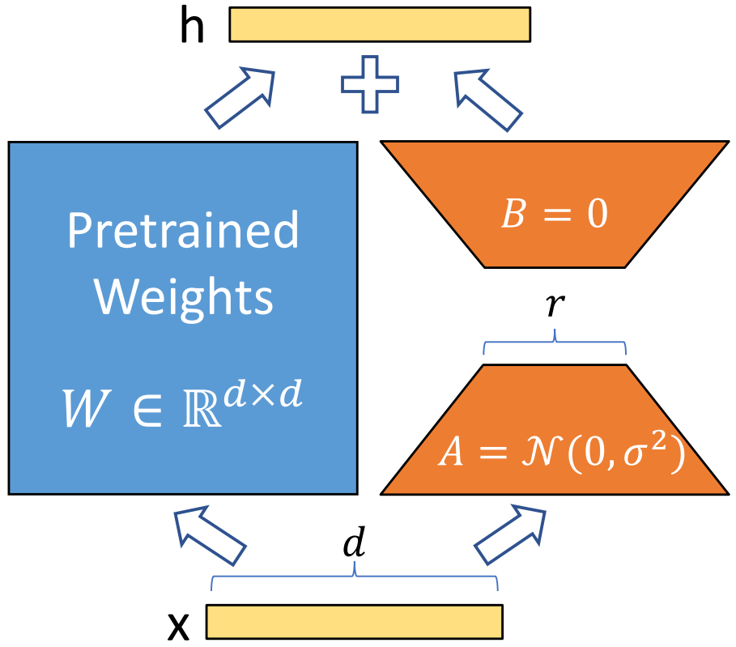
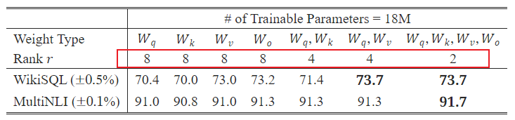
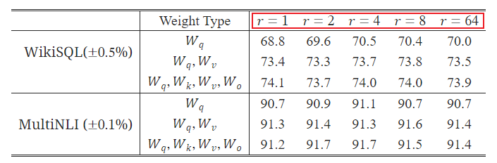
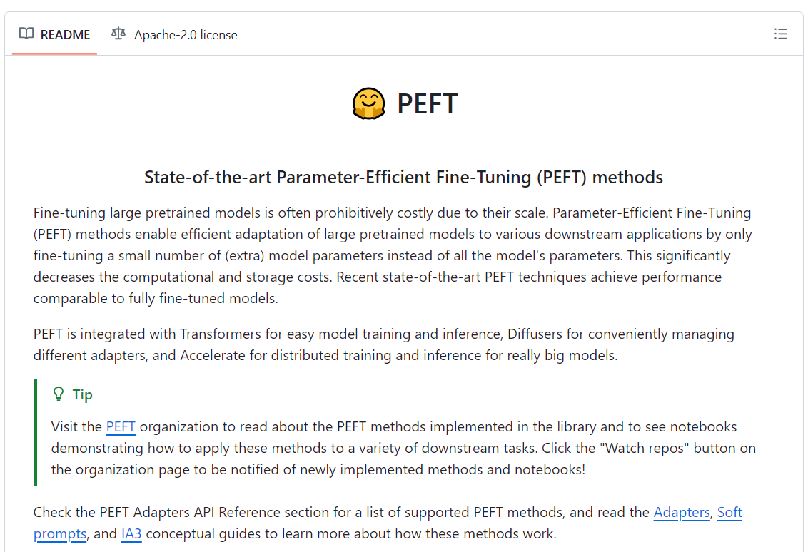
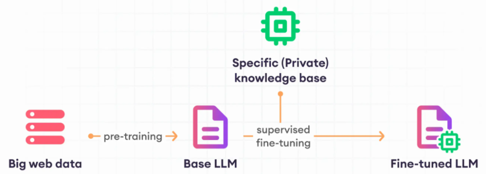
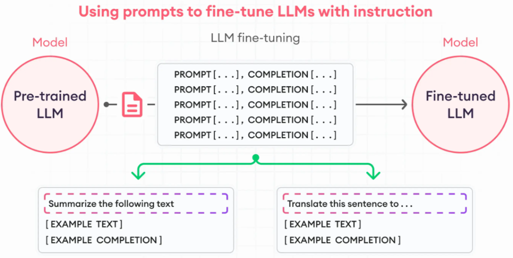
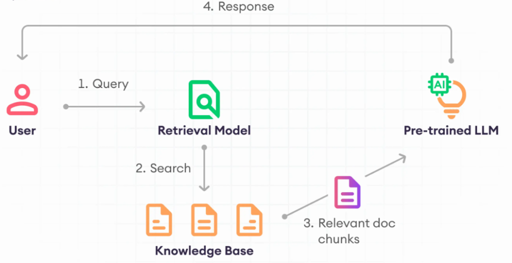

# 大模型微调方案

参考:

https://zhuanlan.zhihu.com/p/623543497

https://www.zhihu.com/tardis/zm/art/627642632?source_id=1003

https://zhipu-ai.feishu.cn/wiki/AqvXwAwf5ilHqmkdk56cQlX2niR

https://github.com/THUDM/ChatGLM3/tree/main/finetune_demo

[LLM 大语言模型的微调方案](https://cloud.tencent.com/developer/article/2390413)

## 为什么要微调

这些大公司或者研究机构，都是有足够资源的来开发大模型，但是对于一般的小公司或者个人来说，要想开发自己的大模型几乎不可能，要知道像 ChatGPT 这样的大模型，一次训练的成本就在上千亿美元。

小企业为了让大模型适应自身企业需要，不可能重新训练整个模型，所以就需要在原有模型的基础上做微调

微调的目的:

- 让模型适应企业需要
- 降低模型训练成本

例如想要让大模型充当客服，那么就需要针对性的训练。

主流的微调方案有很多，其中又以参数高效微调 peft 为重要的手段，例如以下的一些:

- 2019年 Houlsby N 等人提出的 [Adapter Tuning](https://arxiv.org/abs/1902.00751)
- 2021年微软提出的 [LoRA](https://arxiv.org/abs/2106.09685)
- 2021斯坦福提出的 [Prefix-Tuning](https://arxiv.org/abs/2101.00190)
- 2021谷歌提出的 [Prompt Tuning](https://arxiv.org/abs/2104.08691)
- 2022年清华提出的 [P-tuning v2](https://arxiv.org/abs/2110.07602)

其中 LoRA 是一个成本低效果好的微调方案，这里着重介绍 LoRA

## LoRA

LoRA: Low-Rank Adaptation of Large Language Models

大型语言模型的低秩适应

LoRA 的思想就是用两个矩阵相乘来降低原始矩阵的参数数量

### 示意图

我们假设一个线性回归的例子，假设我们已经训练好了我们的权重 $W$，且矩阵为 $d$ 行 $d$ 列，数学表示为: $W \in \mathbb{R}^{d \times d}$，那么 LoRA，将在模型正常推理结果的过程中，增加一个旁支，如图:

- 输入 $X$ 假设为 $X \in \mathbb{R}^{1 \times d}$，行数不一定是 1，这里假设为 1
- 左侧为预训练权重，$W \in \mathbb{R}^{d \times d}$
- $X$ 经过左路矩阵相乘输出结果大小应该为 $XW = h_0 \in \mathbb{R}^{1 \times d}$
- 右侧 A 是一个 $A \in \mathbb{R}^{r \times 1}$，则 $AX = h_t \in \mathbb{R}^{r \times d}$ $h_t$ 是个中间变量，图中没有给出
- 然后使用 $h_t$ 再和 $B \in \mathbb{R}^{1 \times r}$ 相乘，$Bh_t = BAX = h_1 \in \mathbb{R}^{1 \times d}$
- 最后将左右两路的计算结果相加，$h = h_0 + h_1$

### 训练

从上图可知，训练的时候，我们在原有预训练权重基础上增加了一个右侧的旁支。左侧权重保持不变，右侧旁支分为 A B 两部分。其中

- A: 通过高斯分布(正态分布)初始化
- B: 初始化为 0

之前示意图中假设的输入行数为 1，这里我们假设输入 X 的形状为 $X \in \mathbb{R}^{k \times d}$

则:

- A: $A \in \mathbb{R}^{r \times k}$
- B: $B \in \mathbb{R}^{d \times r}$

那么训练 LoRA 时的前向过程则是:

$$
h = WX + \Delta{W}X = WX + BAX
$$

### 微调参数

在训练好后，右侧旁支的 A B 参数也就固定了，我们再将这个权重矩阵叠加到原来的预训练权重上

$$
W + \Delta{W}
$$

而

$$
\Delta{W} = BA, B \in \mathbb{R}^{d \times r}, A \in \mathbb{R}^{r \times k}
$$

### 关于 r

r 在论文中称为**秩**

秩应远小于预训练权重形状 d k 中的最小值，$r \ll \min(d, k)$

论文中 r 通常较小，例如:

经过矩阵运算，r 这个维度会被消除掉，所以最后结果还是变回了预训练权重的形状

根据上图也可以看到，微调大语言模型时，主要是微调其中的注意力 QKV 部分的权重

## LoRA 开源实现

目前 LORA 已经被 HuggingFace 集成在了 PEFT（Parameter-Efficient Fine-Tuning） 代码库里。

项目地址为: https://github.com/huggingface/peft

官方文档: https://huggingface.co/docs/peft/index

## 其他大语言模型微调方案

LLM微调是一个有监督学习过程，主要使用标注数据集来更新LLM的权重，并使模型提高其特定任务的能力。大致过程如图:

预训练模型通常是通过无监督的方式通过网络上的数据训练得到的。

然后在基础预训练模型的基础上，通过特定的知识库来训练微调模型。

之前讲到的 LoRA 就是在微调训练时解决资源受限问题的方法。

除了 LoRA，还有一些大语言模型的微调方案，如下:

### 指令微调

指令微调是通过给模型提供明确的指令或任务描述来进行微调的方法。这种方法旨在让模型更好地理解和执行复杂的任务。其核心思想是通过自然语言指令引导模型执行特定任务，而不是依赖于具体的提示词。

上图中，左右两个输入样本，分别是总结概括任务和翻译任务。

指令微调明确给出了任务指令，并给出了示例文本和示例结果。例如:

- Summarize the following text: 这是任务指令
- [EXAMPLE TEXT]\: 这是示例输入
- [EXAMPLE COMPLETION]\: 这是示例输出

### 全微调 FFT

即更新模型所有权重的过程，被称为全微调。

### 参数高效微调 PEFT

通过微调部分参数达到调整模型的目的

### 迁移学习

迁移学习是将已在通用、大规模数据集上训练过的模型，应用于特定任务的数据集上。

### 任务特定微调

任务特定微调是在特定任务或领域上，使用为该领域设计的数据集对预训练模型进行微调。例如: 内容概括任务，翻译任务等

### 顺序微调

顺序微调是将预训练模型按顺序适应多个相关任务。在初步迁移到一般领域后，LLM可能针对更具体的子集进行微调，例如从通用语言到医学语言，再到儿科心脏病学。

### RAG

Retrieval-Augmented Generation 检索增强生成

这个方案是不需要训练大语言模型的一种微调替代方案。他的思想是给大模型扩展一个知识库，让大模型能通过知识库检索出更合理的输出。

过程如图:

1. 用户传递查询关键字给检索模型 Retrieval Model
2. 检索模型检索知识库。检索模型 Retrieval Model 是一个经过训练的模型，用于从知识库中检索出和 Query 相关联的内容
3. 检索出相关联的文档块 Relevant doc chunks，并传递给预训练大预言模型
4. 大预言模型通过检索资料生成回复信息

总结: RAG 主要分为 **检索** 和 **生成** 两阶段；**检索**用于搜集知识库中的关联数据；**生成**主要通过输入检索结果，然后让模型生成相关联的回复
