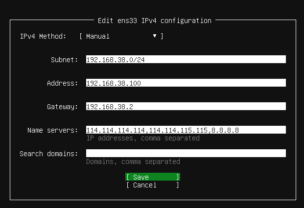

# 安装ubuntu

## 下载

- VMware-Workstation-Pro-12.5.6-5528349-精简绿色中文版_by_wxdjs.7z
- ubuntu-22.04.2-live-server-amd64.iso

## 安装 VMware

1. 解压 `VMware-Workstation-Pro-12.5.6-5528349-精简绿色中文版_by_wxdjs.7z` 到任意目录
2. 使用管理员权限运行 `VMware` 目录下的安装脚本 `!)安装VMware.cmd`
   
3. 输入 `1` 选择网络功能，然后回车
   
4. 输入 `1` 选择桥接，然后回车
   
5. 输入 `2` 启用服务，然后回车
   
6. 重启电脑

安装完成

## 安装 Ubuntu

流程中没有提及的部分直接点击 `下一步`

1. 点击新建虚拟机
   
2. 选择文件 `ubuntu-22.04.2-live-server-amd64.iso`
   
3. 点击自定义硬件
   
4. 分配内存、cpu、并将网卡设置成桥接
   

启动虚拟机后继续安装

> 注意，选择网络设置时，可以参考手动配置:
> 

1. 选择第一个开始安装
   
2. 选择挂载硬盘，此步需要手动选择 `done`
   
3. 安装前的确认，选择 `continue`
   
4. 设置计算机基本信息，包括创建账号
   
5. 勾选安装 `openssh-server`
   
6. 手动选择 `done`
   
7. 安装好后选择 `reboot` 重启
   

安装好后，建议制作快照


## 配置网络

若先前安装 ubuntu 时已经配置过网络了，此处可以跳过

```shell
sudo nano /etc/netplan/00-installer-config.yaml
```

```yaml
# 参考
network:
  ethernets:
    ens33:
      # ip 地址
      addresses:
      - 192.168.38.100/24
      nameservers:
      # dns 地址
        addresses:
        - 114.114.114.114
        - 114.114.115.115
        - 8.8.8.8
        search: []
      # 网关
      routes:
      - to: default
        via: 192.168.38.2
  version: 2
```

修改完配置后，需要应用配置

```shell
sudo netplan apply
```


## 更新系统

```shell
# 更新注册表
sudo apt-get update
# 更新软件
sudo apt-get upgrade
```

## 配置hosts

```shell
sudo vim /etc/hosts
```

将自己主机和未来的两台节点机的 ip 都设置好，例如:

```
192.168.38.100 master
192.168.38.101 slave1
192.168.38.102 slave2
```