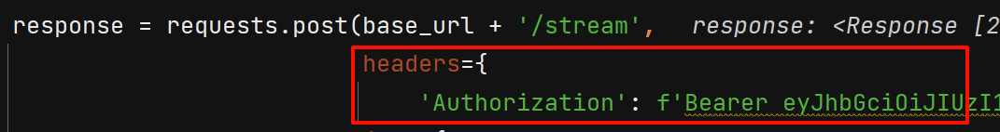

# 发起网络请求调用模型

不管什么大模型，我们都是通过网络调用的，那么考虑以下问题:

- 调用的网址
- 调用时的参数
- 返回值的含义
- 接口的异常代码

以上所有内容，通常在 api 文档中都有介绍

[智谱的 api 文档](https://zhipu-ai.feishu.cn/wiki/X8ykw4IXpieCOxkYxbrcxT9vn5f)

## 基础路径

基础路径是用于调用网络接口的一个前缀路径，所有接口的前缀都是该路径，通常称为 `base_url`

智谱AI的 `base_url: https://chatglm.cn/chatglm/assistant-api/v1/`

## get_token

[接口文档](https://zhipu-ai.feishu.cn/wiki/X8ykw4IXpieCOxkYxbrcxT9vn5f)

作用: 该接口用于申请一个 token，该 token 用于证明你的身份，用来获取调用 AI 的权利

路径: `/get_token`

参数:

- api_key: 代表开发者id
- api_secret: 代表开发者密钥

上述参数从你申请的 api_key 页面中查找

使用对应接口的请求方式来发起请求，例如：

接口响应数据中有以下几个有用的值

- access_token: 访问 AI 时的令牌，用来表明身份
- expires_in: 多长时间后 token 过期
- token_expires: token 过期的截至时间

## stream

以流式输出的形式访问接口

地址: /stream

参数:

- assistant_id: AI 助手的 id，从对应 AI 助手的 url 连接上获取
  
- conversation_id: 会话 id
- prompt: 提示词文本

调用接口时，请把 token 通过 headers 传给服务器，例如:

